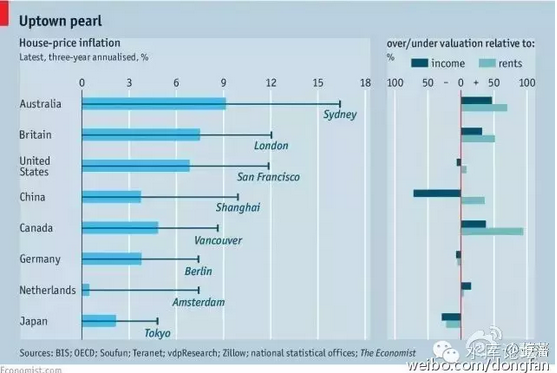

# 上海楼市的真实走势（一） \#990

原创： yevon\_ou [水库论坛](/) 2016-04-15

上海楼市的真实走势（一） ~\#990~

真相淹没在历史的尘埃中。

 

 

一）官史不可信

 

官史不可信。

上图是《Economist》贴的各大城市房价涨幅。数据来自于"政府公报"。

 

如果你是在欧美的屌丝，看见这张报表一定要破口大骂了。

你说这温村美帝的政府也实在太腐败了。温村一年涨了5%，伦敦一年涨了7%，老百姓还有活路么。

 

你看看人家上海，社会主义的先进优越性就是好。经济GDP增长那么快，可房价仅仅微涨了3%。老百姓表示买房毫无压力。

 

 

我们相信，100年以后，当今日2016发生的一切都成为往事，归入尘埃，无论任何后裔的记忆都不会记起。

对"21世纪00\~10年代"房价生活指数的考证，将会仅限于这些"官方文档"。具体来说，就是政府公报，大型财经机构杂志，联合国蓝皮书。

 

 

而我们知道，他们说的并不是事实！

谎言！！

上海楼市仅涨了3%，您开什么玩笑。地球人不带这样玩的。何止3%，何止6%，连30%都不止。

不仅仅秒杀掉温村多村，伦敦悉尼统统不在话下。按这个上涨趋势，再过几年，北京/上海/深圳就会成为"全球房价第一昂贵"的城市。

若按照3%速度，那是无论如何涨不到今天这个价格的。

 

问题出在哪里呢。"官史不可信"，官史是经过重重利益捆绑的。统计局的同志哭晕在厮所里。这里面的花俏和噱头很深。出于喝咖啡的原因，我们不进一步讨论下去。

 

 

而另一方面，媒体也不可信。

媒体的问题，一方面媒体是受"监管"的。媒体不可能离官方口径太远。

另一方面，媒体是邪恶的，媒体足够腐败小利益阴谋团体。

你在官方媒体听见的"主流看法"，75%以上是不符合事实的。

 

 

前几年，CCAV2做了一篇专题报告"星巴克为何暴利"。天底下二桶油，中移动，中电信，中国邮政EMS，远远更为暴利。你为何揪住一家外资企业不放。

网民们考证的结果，CCAV大裤衩楼下有一家星巴克。媒体小编每天都要去买一杯咖啡25元。

相对于小编们数千元的工资，星巴克25元的IB费用未免显得肉疼。所以星巴克"暴利"成了CCAV小编眼中钉。甚至不惜做一期专题报导来批评。

 

 

在房地产市场上，原理同理。

我们必须深刻地意识到，媒体小编的主体，90%是"外地无房文科生"。北漂沪漂来大城市奋斗，心比天高，自诩为社会良心精英。

所以媒体小编95%是傻空。95%是买不起房子但又痛骂"KFS暴利"的粪青人士。

 

在过去的十六年中，媒体小编们做了二件事：

1）定期地报导房价现状，走势，分析

2）不定期地插一些专题报导。

我们必需指出的是，这二件事都是充满了"**恶意**的谎言"。都是无耻的欺骗和诈骗。都是昧着良心臭不要脸的狗屎。

 

 

二）长期统计数字

 

在过去的十六年中，上海楼市大致涨了16倍。

或者说，每4年翻200%

或者说，每年19%

或者说，2000\~2004，2005\~2008，2009\~2012，2013\~2016每四年都要翻倍。

 

 

你如果看官史统计局数字的话，中国的通胀CPI，每年都是非常低的。一般都在1\~2%左右。几乎没有一年超过5%的。

但是1980\~2016，一共是36年累计起来，这个涨幅就非常惊人。

 

 

通常的估计，可以认为36年的物价总涨幅，大概在64倍左右。

或者说每12年翻4倍。

每6年翻200%

每一年12%

 

为什么会发生这样的情况呢。因为一年二年的数据，统计局可以做假。

我们看官方公报，常常会发现"翘尾因素""统计误差""一次性调整"等等专业术语。

 

什么叫"翘尾因素"，那就是安慰老百姓的。意思是偶尔跳一跳，待会还会落回来的。

但事实的真相呢，涨了就不跌了。

"翘尾因素"，他每一个月都是翘尾。这脸皮就如大象般的厚了。

 

而就长期而言，"翘尾""临时""误差"等等借口都没法用了。

一个统计数字从长期看，是非常冰冷而现实的。长期数字没法做假。

 

 

回到房地产市场，我们官媒目前对房地产历史的所有描述，基本都是谎言！

而长期的统计数字，是没法做假的。

在长期数字"16年16倍"面前，一切谎言都被揭穿得干干净净。

 

 

三）傻空版房价走势

 

按照傻空的说法，或者你常常泡篱笆网的话，有一个"政治正确"的官方说法：

"06年房价是下跌的"。

 

 

不仅仅有"06下跌"，而且还有"08下跌"，还有"10下跌"。甚至还有人说："好险好险，辛亏我2010年抛掉了。眼睁睁地看着楼市崩盘大跌-30%"

 

按照傻空的说法，楼市走势大致如此的：

-   2000年：这一届的傻空已全部阵亡，有事烧纸

-   2001年：这一届的傻空已全部阵亡，没有回忆。

-   2002年：傻空已全部阵亡

-   2003年：傻空已全部阵亡

-   2004年：上涨

-   2005年：随着调控，先涨后跌

-   2006年：下跌

-   2007年：小涨

-   2008年：下跌

-   2009年：四万亿，大涨

-   2010年：限购下跌

-   2011年：平

-   2012年：平

-   2013年：小涨

-   2014年：小涨略平

-   2015年：涨

 

每一年的"舆论正确"大致如此。小有出入，但基调基本是这样的"06下跌，08下跌"。

你如果和傻空辩论的话，每一年他们都振振有词。甚至可以举出身边观察到的现象，或者法拍房，或者实际有一二套的笋盘成交，来证明："看吧，这一年房价的确没怎么涨。还有这么便宜的房子"。

 

 

但是，谎言是针对一年的。如果你把16年串联起来看呢。

串联起来看，就会产生非常大的问题。

 

譬如你赋予以下权重：

-   大跌：-30%

-   小跌：-10%

-   微跌：-5%

-   平:0%

-   微涨：+5%

-   小涨：+10%

-   大涨：+30%

-   疯张：+50%

 

如果你将这列权重套入"2000\~2015傻空版房价走势"的话。则十五年的涨幅，一共才200%不到。而不是今天的1600%

 

那么，肯定是有什么地方出差次了。而且这个误差还不小。必须积累起足以8倍的差异。这简直是锈铁和黄金的区别了。

事实的真相是什么呢，事实的真相是：因为宏观调控，所以房价飞涨。

 

因为宏观调控，所以房价飞涨。

因为宏观调控，所以房价飞涨。

因为宏观调控，所以房价飞涨。

重要的事情说三遍。

 

 

我们看回"[傻空版]房价走势"，凡是有秀相"宏观调控"的年份。傻空基本都标注为"跌，大跌"。

在傻空低贱的脑容量里，他们总是中二病傻根的想法："政府调控了，那房价要跌了"。

 

所以他们写了很多个"下跌"的年份。

但是，短期的东西你可以狡辩。放在十六年累乘，问题就很明显了。

 

 

朋友们，上海楼市在过去的十六年内涨了16倍。或者说，每4年翻一倍。

-   2000-2004

-   2005-2008

-   2009-2012

-   2013-2016

你把楼市划为四年一个阶段，则其中的每一个阶段，他都涨了200%。

 

 

200%是个什么样的概念呢。稍微有点数学常识的人，都可以写出如下表格：

           情况一   情况二   情况三   情况四
  -------- -------- -------- -------- --------
  第一年   19%      10%      0%       -10%
  第二年   19%      30%      40%      0%
  第三年   19%      10%      0%       10%
  第四年   19%      30%      40%      100%
  总计：   200%     200%     200%     200%

 

我们看到，当四年翻翻的情况下，哪怕是"平"，在数学上都是不可以接受的。

因为你只要出现了一个0%，你的涨幅就需要平摊到剩余的年份。就意味着会出现一个"暴涨年"。

 

而"跌"更加是数学上绝对绝对不可接受的。

如果按照傻空们设想的"06跌，07涨，08跌"，三年分别是"-10%，+10%，0"

则剩下一年要涨多少。

一年翻翻涨200%么。

显然这不符合常识，也不符合现实。

 

 

那么，事实的真相是什么呢。真相是：因为宏观调控，所以房价飞涨。

不是傻空意淫的"06大跌"，"08大跌"，"10大跌"；

真相是[2006年，2008年，2010年，房价都是涨的]。而且涨幅还不小。至少都有10%以上。

 

 

四）为什么要写这篇

 

为什么我们要写《上海楼市的真实走势》，为什么要把过去十几年真实发生的事情再梳理一遍。

 

 

因为目前的官方媒体，全是充斥着谎言。

中国的文科生小编，可能是全世界最不要脸的渣滓小编。北京上海如此长期、宏大、巨大的一个"暴涨走势"。在文科生小编的嘴里，居然是"摇摇欲坠，下跌，下跌中继，继续下跌"。

 

如果你搜集整理过去十六年的报纸记录，几乎每一年每一个月，每一个月房价都是"下跌"的。都是"即将崩盘"。报纸上"下跌"和"上涨"的报导，至少是90%:10%

能将如此波澜壮阔的一轮大牛市写成"月月下跌"，真TMD十八代没PY.

 

 

另一方面，社会媒体舆论则为"宏观调控"张目。

目前的媒体妓录，基本是把"宏观调控"和"房价下跌"划等号的。至少划箭头号的。

每一次秀相发动"调控"，媒体立即跟随抛出"房价大跌"的报导。深圳炒房客纷纷跳楼。深圳湾都填满好几回了。

 

 

我们知道这些并不是事实。因为宏观调控，所以房价飞涨。

06，08，10，12，都是大涨年。

你只要扯出一个谎言，你就再需要一百个谎言来圆谎。

["宏观调控"是促涨的。你非要说成下跌]，那你就再需要一百个谎言来调整数学数字。

 

 

"历史"这事，宛如风中尘埃。随着时间的推移，一层一层被吹散。最后只剩下一点遗迹。

当一百年，二百年，若干年以后[后人]回过头来考察"21世纪初"的史实，他们会不会说"宏调调控取得了有效的效果""房价被成功遏制"。

会不会成为政府干预经济的"成功经验"，会不会被学术人渣翻出来证明计划经济的优越性。

 

我们不能允许这样的事情发生；

不能允许这样指鹿为马的事情发生；

不能允许历史的真相，被掩埋在官媒和篡改之中。

不能允许事实被扭曲，正义被淹没，错误被继续。

 

 

历史的真相，并不是那样的。并不如"官方文件"上写的3%涨幅。也不是无耻小编嘴中的盛世。

历史根本不是那样子的。只有"野史"，只有我们这些曾经奋斗在第一线的生死搏斗人员，我们才知道真正发生了些什么事。

 

我已经老了，记忆力大不如从前。老年痴呆日益严重。

这些往事随着时日耗散，日渐淡薄。十几年前的风云宛如水印，渐渐地失去色彩。再也不复记起。

所以我决定先把他们先写出来，趁着还有最后一丝印象，把历史的真相刻在纸上。

 

真正的真相。

 

 

 

（yevon\_ou\@163.com,2016年4月15日暮）
