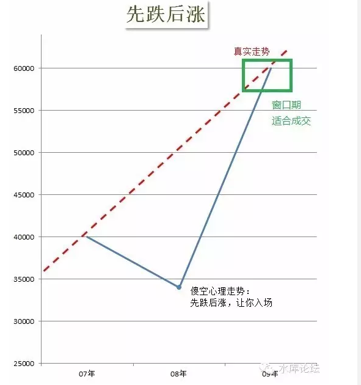

# 逼空式上涨 \#1040

原创： yevon\_ou [水库论坛](/) 2016-04-25

逼空式上涨 ~\#1040~

 

假如你是一个2050年穿越回来的人。

你深刻明确地知道，2050年房价是￥5000000元/平米。

今天你卖什么价？

 

 

一）游戏规则

 

房价=大盘指数+板块强弱+自身优良

 

 

房价赢利，大致有二种模式：

1）高抛低吸。通过对价值的深度挖掘，在各阶段分辨强弱。

2）跟随大势上涨

 

之前我们用了巨量的篇幅，试图解释房价是怎么一会事；

-   我们写了Marketing的基本原理。

-   我们用"外国人/外地人/本地人"，三分法来看待楼市。

-   我们分析三类客户的强弱兴衰，和购房口味。

-   我们解释了流派和侧重点。

-   三重顶。

 

对于这种模式，炒房是一类类似于"绣花"的精细活。你需要非常小心翼翼地，精微地分辨每一寸溢价。

如同手工艺人一般，捏寿司也能捏出"寿司之神"。切三文鱼也有刀艺。

 

 

可是秀相的"宏观调控"，把这一切都毁了。

"评估优劣"是一项非常精细的活。人口，偏好，新潮，等等因素加在一起，也不过五六个百分点。

可是秀相一开口，就是"11%的显性交易税收"。

 

在这么高的税务成本之下，你是没有"绣花式炒楼"的。或者说，你看见旁边一套房子被低估了-10%，九折笋。

九折笋你是眼皮都不会抬一下的，市场不均衡就不均衡吧。垃圾卖黄金价，黄金卖垃圾价。

这些事关我鬼事。这是秀相搞出来的事，就让民众去挨痛吧。

 

 

随着"宏观调控"及随之而来的高交易成本。

目前存活下来的，主要是第二条路：跟随大市上涨。

 

 

二）300W事件

 

一旦市场进入"观望期"，房东就开始跳价。

 

 

乍一看，这是一件非常没有道理的事。完全违反了直觉。

譬如说，不久之前，多军群里发生了"300W事件"。

 

某多军大神，在20160325"新政"出台之后，突然把自己的房子降价300W元，重新挂牌。

此言一出，多军群里哗然。

 

"你是不是看空房价，准备跑路了"。

"不是呀"。

"那降300W干什么"。

"0325之后，完全没有看房的客户。你说我小心翼翼空置，保洁，软饰，把房屋调整到最佳的状态。如果完全没有客户来看，我岂不是太亏了"。

"所以我降价300W，先让他们来看"

"等客户看中了，大可以再跳价300W么"。

 

 

卖房子这种事，大致要经过一个"1000/100/10/1"的过程。

也就是你现在58同城，赶集，豆瓣之类的网站挂牌。

然后你要接到1000个电话，询问你房屋信息的细节。

100批预约来看房子的中介。[\[1\]]

10批真来现场的，但却是拍照的。

1个诚意客户。

 

某大神"直降300W"之后，效果是有的。当天联洋的中介们就疯了，一圈圈电话打出去。

"先生，联洋xx苑刚出来一套超性价比的房子，只要xxx万。您要不过来看看"。

"谢谢，这套是我表弟的"。

 

而事情的结果呢，结果就是1000/100/10/1，喧嚣了一阵子，联洋中介打鸡血扑腾了几十下翅膀。最后渐渐没消息了。

卖掉了没有，没有。

有看楼，没成交。

在"观望期"，降价是无效的。你哪怕降300W，也不能促成成交。

 

 

三）逼空式上涨

 

一旦市场进入"观望期"，房东就开始跳价。

 

譬如你1000W的房子，一旦进入了"观望期"。哪怕你降价到700W，你接1000个中介电话。诚意客户还是没有的。

（炒家呢？哥哥看不起联洋，谢谢）

 

 

在这种情况下，房东一般采取的策略，是加价到1020W。

什么，加价？没搞错吧，1000W都卖不掉，你还加价。

对的，就是加价。

 

因为市场上没有诚意买家。（以下信息来自于网络，不负责甄别真假）

屌丝们想问题，惯于"一阶经济学"。老是只想自己要怎样怎样，而丝毫不顾及对方的感受，不顾及博弈的感受。

 

市场上没有诚意买家，屌丝不诚意；双刃剑的另一个方面，"这阶段也没有诚意卖家"。
房东也逗你玩。

 

反正没交易会跳楼的只有中介。

因为降价无效，那我干脆把价格挂高。

 

 

价格挂高，有几个好处；

1）在市场上形成："2年前就卖50000/m"的印象，美化K线图。"xx楼盘一直比隔壁贵"。

2）在市场上制造New news

3）告诉对方房东的乐观心态

 

 

中国的大学里，不教商业。"毒教育"

这让中国的学生，非常地"淳朴"，非常地拿衣服。简单说就是蠢。

 

譬如说，中国学生看待"价格"。是幼稚到极点的。他们以为价格就是价格。

好比一件衣服卖3000元，他们就认为该衣服值3000元。如果明天标5000，他们就认为衣服涨价了。

可能那衣服就一件，竖在门口建立高档形象的。

 

 

其实价格是个超级复杂的事情，有多种含义。多种玩法，无数陷阱。原价/现价/促销/套餐/标杆/返奖，Marketing的事，说也说不完。

 

如果你粗懂Bridge桥牌的话，刚开始大家是喊牌。

你喊3黑桃，他喊4方块，对家喊4红心。

喊牌之间，有固定的套路。透过喊牌向队友传递了大量的信息。

喊牌不仅仅是争夺坐庄权，另一方面也是沟通与回复。里面信息量极大。

 

 

同样道理，你如果看见业主之前挂1000W，第二天挂1020W，接着挂1025W。

这并不意味着业主就是认为，这房子一定要1025W才能卖。

业主也是在传递一些信息。这始终仅仅是口头报价。

 

 

四）Make new news

 

当市场一旦进入"观望期"，多空僵持。至少有12个月交易清淡。

这段时间内，房东最容易采取的策略。是小幅提价到1100W。但不是直接提上去，而是分好几次提。1020，1040，1060，1080，1100

 

为什么要这样呢。

哪怕1000W你也卖不掉。"诚意"买家都等候在650W以下呢。

而你要调价到1020，接着1040，这样做的用意何在。

 

 

因为你在"人工置顶"。

Marketing中有一科叫做"Make new
news",指的是你没事要在市场上制造点新闻，刷存在感，刷个脸熟。

哪怕你的产品完全没有任何改良，没有新的配方。你换个包装，搞个抽奖活动，搞个"百事红罐节日装"，也是必要的。

 

 

在房地产市场，这相当于"人工置顶"，顶贴，顶。

因为你的讯息，在中介数据库里会[沉底]的。一套房源，放了二三个月，就会沉到小本本最后一页。从此中介很少关注，有客户也不再推介，基本属于打入冷宫的状态。

 

那你就需要"顶"。一般在市场中，刚出来7天之内的房源，是中介花力气推得最多的。

中介也知道房子不好卖。所以"新"房源就意味着希望，"新"状态就意味着希望。(譬如你和中介说[全新]翻修，其实就新买了个洗衣机)。

 

我们是诚心想卖，所以我们会小幅加价。加价的幅度不多，象征性的1000到1020，而绝对不会是1000到1300.

但我们会小幅加很多次。

 

一方面，增加"顶贴"的次数。增加被售出的几率。

一方面，显示房东非常有信心。大力看好。还不停地在加价。

一方面，给傻空增加心理压力。"二个月不见，又涨了20W"。

 

 

 

五）逼空之路

 

楼市呈现非常明显的"季节性现象"。

 

一般而言，是几个步骤：

1）单数年春节后开涨，三四个月内+50%涨幅

2）政府出调控政策。

3）因为宏观调控，所以房价飞涨。宏观调控[托实]涨幅，使下跌不可能。

4）市场因为"心理原因"，而不是实际原因进入观望期。

5）冰冻6\~12个月。

6）双数年一般是补涨，落后洼地追平。

7）休息足够，买力积蓄，迎接下一轮暴涨

 

 

中国的房地产市场，已经*扭曲扭曲扭曲*到了骇人听闻的境地。

以至于他清楚地划分为"观望期"和"窗口期"。时间大致是20个月+4个月。

在正常交易的资本主义国家，是没有这回事的。

 

学院派的分析研究报告，是永远不会和你说这些事的。

只有第一线的炒家，才能教你。

 

 

 

在漫长的"观望期"中，你几乎是不可能按照"市场价"成交的。或者在图形中，不可能按照蓝线成交。

他只有非常短暂的几个点，蓝线和红线是相交的。也就是傻空洗面革新，终于肯承认接受多军是估值正确的。

 

这几段"窗口期"非常之短。一般也就3\~4个月左右。因为政府闲不住，看得见的手总喜欢乱摸。

一调控，实质内容不重要。关键是傻空"心理"又变成了再坚持一下。然后又是漫漫观望。

宏观调控搞了十年，上海楼市涨了十年。但其实它是在"没有充分换手"的基础上上涨的。任何一个价位都没有夯实。

 

 

 

房东在"清淡期"加价。在"窗口期"反而不怎么加价。因为房东对价格的估计是准确的，已经基本到位。傻空的心理才大起大落。

只不过，以前傻空看见1150W的价位，会破口大骂，"神经病，800W我也嫌多"。

而在窗口期，傻空的心理会发生"[一夜之间]暴涨+50%"，瞬间睡醒并承认你这个1250W是合理的。

在窗口期，你一定要：坚持卖房。

风来了，猪都可以飞起来。但风不是每天都有的。在漫长的观望期，成交十分稀少。而且很可能面临压价效应。

错过了这一波风口，下一波可能就要等二年了。

真心厌恶调控。

 

 

（yevon\_ou\@163.com，2016年4月24日晚）

\* ps."窗口期"和"三重顶"。

 

 

 

 

 

 

 

 

 

 

 

 

\[1\] 现在的中介非常恶心，因为他们无法判断５８上面挂牌的是房东，还是另一个中介。

所以中介会和你说，"今天晚上20:30过来看房子"。然后你守了一夜。

然后中介纯粹是放你鸽子的。他就是为了确认你是自然人房东。
