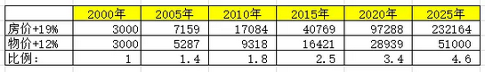

# 京沪楼市何时见顶（下） \#1060

原创： yevon\_ou [水库论坛](/) 2016-05-02

京沪楼市何时见顶（下） ~\#1060~

250000

 

 

一）廿五万

 

上一篇《[京沪楼市何时见顶（上）](http://mp.weixin.qq.com/s?__biz=MzAxNTMxMTc0MA==&mid=2651014590&idx=1&sn=12d7ef022601085754a8a3abb95847f2&scene=21#wechat_redirect)》写完之后，立刻有人列出了如下表格：

\
 

楼价和物价不可能无限偏离。按照目前的速度，2026年（十年后)上海楼市将涨到约25W/平米。

同时物价比2000年翻了17倍。如果以当年一碗牛肉面8元计算，则一碗面的价格在130元左右。

 

 

按比例，2025年的平均工资是2015年的三倍。则普通蓝领在15000元/月左右。

普通的白领夫妻，今天是25000+15000 \* 15薪=60万家庭/年。

2025年是十五万每月。

 

一套普通的房子，假设80平米，按250000元/平米，总价2000万元。

-   首付600W

-   按揭1400W，月供74300元。

 

 

按照当时月薪，600W积蓄大约是五年税后工资。看似夸张，其实还是拿得出来的。哪怕今天你让许多家庭，600W也是拿得出来的。

 

一般首付会略超三成。月供则相应不到74300。再扣除公积金和父母补贴，月供五六万勉勉强强也是能活下来的。

毕竟生活品涨得不多。

 

 

这个模型要能活下来。它至少要符合二点；

1）主流户型变小

2）购房年龄变晚

 

我们仔细想一想，房价/物价"泡沫率"，从今天的2.5倍升到2026年的5倍。

看似房子贵了200%

但其实你也可以反过来说，如果户型"缩小"50%，则也没有压力了。

 

 

当2000\~2001年上海楼市刚开局时，主流的户型大约是"二房120"平米。在北京这个指标更大，甚至要140，乃至180平米。帝都大气。

 

而你仔细观察近年的市场，一个显著趋势就是"户型越做越小"。120二房早就踢出市场。想也不用想。

目前的"畅销"户型是75平米二房，或者90平米三房。

 

 

俗话说，香港房地产，分为四种房型：

1）卧床一面靠墙的

2）卧床二面靠墙的

3）卧床三面靠墙的

4）卧床四面靠墙的

 

上海目前还没有到"三面靠墙"爬行进屋的地步。但是如果你深入想一想，假设"调控加深"；

则"千尺豪宅"，"55平米精致三房"，也并不是不可能的事情。

 

如果主流户型能缩小到40\~50平米三房。即相当于房价"总价减半"，房地产商也是不愁卖的。

 

 

另一个方向，则是"首次购房年龄"变晚。

发达国家基本没有35岁之前购房的，40岁购房都很勉强。

 

我们看回模型，250000单价 \* 80平米，首付需要600W。

即使按照男性65000+女性45000的期望月薪。六百万也是整整五年税后收入。

扣除生活日常消费，至少翻倍，需要十年时间。

首次购房年龄，将由现在的28岁，普遍延迟到35岁左右。

 

 

这二个故事告诉我们的是什么呢。告诉我们"这个模型是可行的"。

在北京上海这样的城市，250000/平米单价的房价，是完全可行的。最多就是惨一点，熬一点，苦一点。"一辈子图一套房子"。

 

 

理论可行到这个高度，那么实际呢。

实际也是可行的。因为这就是香港的模型。

 

香港"体面"的房子，就是25000HKD/英尺。"千尺"就算好房子。

夫妻俩50000HKD+35000HKD只能算中人之姿，年薪百万的双职家庭在HK比比皆是。

香港人的痛苦，由上海人继承下去。

 

 

当然，京沪楼市会不会香港化，那要看"宏观调控"会不会深入下去。若实行彻底的市场经济，民生断不会疾苦到这种地步。

因为宏观调控，所以房价飞涨

因为宏观调控，所以房价飞涨

因为宏观调控，所以房价飞涨

 

 

 

二）轨迹

 

我们再"虚构"幻想一下，楼市崩盘的轨迹。

 

从中国人的国民性上看，中国人可以长期承受500%的泡沫。极限时冲到1000%的泡沫。

上海楼市的基本面，我觉得价值就是5/3/2，或许还不到一点4/3/2 [\[1\]]

 

 

如果翻500%的话，则上海楼市类似于香港1995年的阶段点，应该是250000/平米。

然后猛冲到500000/㎡，这个价位站不住，跌下来。发生楼市风暴。

 

 

具体的下跌步骤，按照"三个70%"的秩序下跌。最终跌穿250000，底谷在170000\~180000/平米左右。

然后在下跌过程中，"房东们"作为一个巨型的政治势力登场。负资产获得绝对的"政治正确"性。

房东们会要求政府干预，要求政府救市，要求政府成立平准基金。要求国家队进场，要求政府加价回购。房东就是政治怪兽。

 

在整个过程中，会发生"孙九招"长期不供地。收紧土地口子。会发生房产土地和工作挂钩。没有房子就不许上学，没有房子就不许上班，没固定住所就不许创业。参见法国以前"游民证"。

 

再进一步，有了限购，自然还可以有"限售"。

只有在京缴税记录满五年，才可以抛售一套房子。三八红旗手，先进劳动模范，才可以获得一张"售房票"。

若遇"恶意抛售"，可以让公安部的同志查一查嘛。咖啡。

手法千奇百怪，再大的幻想力，也想不出政府可以出哪些牌。唯一值得确信的，张张都是王牌。

 

 

"房价会从200000元的平台起攻，最高冲到500000平米。

下跌回落至200000以下，最终维持在250000元/平米站稳"。

如果我们照抄《[香港楼市崩盘始末
\#970](http://mp.weixin.qq.com/s?__biz=MzAxNTMxMTc0MA==&mid=2651014541&idx=1&sn=76e1d17adbd1cb341828faccbdb23a20&scene=21#wechat_redirect)》的话，大致就是这样一个流程。日光之下，并无新事。

 

房地产市场，大概每4\~5年换一轮辈份。

也就是说今天入场的新人，还能看到徒弟的徒弟。然后在有生之年，经历一次血雨腥风的"暴跌"。

 

 

三）细节

 

预测未来，是最危险的事。

 

绝大多数的专家，不喜欢把话说死。砖家们喜欢用的词是"大概，可能，或许"。

"有70%的几率"下跌。真是见鬼了，鬼知道这个概率怎么算。只能掷一次骰子。

 

 

水库论坛，不喜欢装神弄鬼。

所以我们冒了一个很大的风险，说了一个确切的数字：250000.

这个数字是要冒巨大风险的。一不小心就是身败名裂。

 

 

数字仅仅是野望。毕竟这是一场豪赌。

在实际操作中，我们也是"走一步，看一步"的。

 

随着房价涨得比物价快，风险是不断积聚的。但哪一天真的爆了，这也是谁都说不清的事。

我们只能说，在"爆炸"之前，会有一些战术上明显的迹象。

 

 

1）急跌必须要急升

 

纸币永远在贬值。哪怕是庞大的泡沫，过了二三年，也会缩小一圈。

所以一个没爆炸的炸弹，Maybe就永远不炸了。

 

急跌必须要急升。只有在急升的基础上，半年（甚至单季）涨幅超过+50%，这才埋下了急跌的种子。

大跌之前，必须要有暴涨。如走势平稳的2016夏\~2017，我们认为暴跌的可能微乎其微。

 

 

2）暴跌之日，肯定是宇宙中心

 

许多人问我，日本房价崩溃和香港房价崩溃的共同点。

这还用问么，他们暴跌之日，都是全球第一高价 [\[2\]]

 

京沪房价暴跌之日，他们一定是全球第一高价。

什么东京银座，纽约曼哈顿，伦敦海德公园，统统不放在脚下。一套老破小换一套海德。

 

当京沪房价比这些世界一流城市还有不少距离时。不用妄谈大跌。

 

 

3）新手入场

 

美国1929年股市崩盘，主要是因为经济好，有大量的"新手菜鸟"入场。

 

这些新手们，不愿意遵守老手们约定俗成的行规和价格体系。

他们喜欢在咖啡馆交5%的意向金，就锁定一笔交易。然后转手几天一周就赚短差抛出。

 

新手们什么价格都敢接。什么规矩都不守。还嘲笑老手们因循守旧。

价格因此升得非常快。而5%保证金跌的时候也跌得十分吓人。

 

 

一个市场要"急升崩溃"，新手的大量入市，几乎是一场充分必要条件。

而新手们的"不遵守规则，不遵守体系"，也是充分必要条件。

 

因为"新手"是一个比较难以量化的指标。

可参考另一个指标，"合伙买房"。

 

 

4）政治动荡

 

但凡市场出现崩溃，有很大的几率是因为"政治变化"。

譬如上了一个铁腕的总理，又或者是剧烈的房地产政策变化。

 

 

有人说，"好呀，好呀，美国要加息了，楼市马上要崩盘了"。

这话纯粹是胡说八道。货币经济学没学好。

"利率"是不重要的。重要的是货币供应量。M2增加20%，远远比加息2.5%重要重要多。

 

另一方面，根据我们的理解，"利空不能击溃市场，利好才能击溃市场"。

无论什么样的利空，都能熬过去的。中国人的忍耐能力是无限的。完全可以从牙齿缝里挤出来加息月供。

 

真正能令市场崩溃的，是"利好"，是狂热，尤其是新手的狂热。

再多的利好，也架不住价格跳空+50%。最怕的是无限的贪婪。欲壑难填。

 

具体的事件触发，谁也说不清将来。有可能是军事胜利。

 

 

四）结语

 

2002年Andy Xie预言上海房地产崩溃，他给出的理由是：

"随着国力的增长，国内会消费更多的蛋白质。但中国人显然是不配吃蛋白质的，这一定会耗尽国力，导致财尽崩溃"。

 

我们对此嗤之以鼻。谢国忠为什么被人看不起，不是因为他的立场和断言。而是因为丫根本就没有逻辑！

中国人吃不吃得起肉呢，我看只有香蕉人不配吃肉。

 

 

我个人预言上海楼市还有十年牛市，顶峰可能发生在2025年左右，价格大约在250000元/平米。

冲高之后会有反复。套牢者会失去十二年的时间。但最终也是可以解套的。

 

很多人会对250000元/平米这个价格感到困惑。我需要提醒各位的是:

2015年上海房价还低于1995年香港楼价。还低于廿年前的香港价格。

 

瞎嘀咕个啥。全世界的货币锚基，在过去廿年中贬了多少倍呢。

京沪注定会成为伟大的城市，远超香港。而"黄皮白心"只配作为城市垃圾。

 

 

 

接着又有人问我，"yevon\_ou老师不再看多了，开始预警京沪房价有泡沫了。开始看跌了"。

"我手里的房子，要不要抛掉一点啊"。

"房价跌了，我该干什么去呀"。

"移民美国好不好"。

 

 

我就问问这群低智商儿童，"看顶峰到哪个位置"。

"250000"。

"今天什么价"。

"8/5/3"。

 

那你还问我该怎么办！

那你还问我该怎么办！

那你还问我该怎么办！

（yevon\_ou\@163.com，2016年5月2日晚）

 

 

 

 

 

 

 

[\[1\]] 4/3/2理由何在，另外开一篇说。

[\[2\]] Monaco这种变态的小城市不算。
