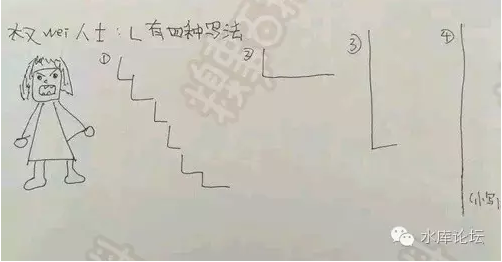

# 帝国的砒霜\-\--房产税 \#1110

原创： yevon\_ou [水库论坛](/) 2016-05-27

帝国的砒霜\-\--房产税 ~\#1110~

房产税这种东西，一开始是智商税。

到最后却变成了寿命税。

 

 

一）砒霜

 

本文是《宏观调控卷》的最后一篇。在此之前，我们用了45篇的篇幅，详细分析了宏观调控的起源，方法，危害，恶果，及取消之后。

 

粗略来说，我们一共划分出了九轮宏观调控：

+--------------------------+--------+
| 营业税，所得税和土增税， | 房产税 |
|                          |        |
| 针对KFS的土地和信贷收紧  |        |
|                          |        |
| 7090及差异化信贷         |        |
|                          |        |
| 经济适用房和保障房       |        |
|                          |        |
| 加息加准，限贷，限购     |        |
+--------------------------+--------+

 

细心地读者已经发现，我们详细分析了八轮调控的危害。以及因为宏观调控，所以房价飞涨。

可是我们始终没有提第九轮调控：房产税的政策。

 

为什么呢，因为房产税的危害，比前八轮调控[加在一起]还要大!

我宁可哪怕你把"营业税"的税率加到50%，也不愿意看见房产税。

我宁可银行把利率加到10%，第二套房房贷30%，也不愿意看见房产税。

 

使吾主失尽人心者，皆此獠也。

 

二）房产税是什么

 

政府卖地，4S店卖汽车，二手房卖房子。

 

 

"卖土地"他有三种会计方法：

1）一次性收取"土地出让金"。

2）每个月收租金

3）以上二种方法混合。先收一笔出让金，再每个月交租。

 

 

你去4S店买辆车，你既可以大方地"刷卡"提车走。你也可以参加"汽车贷款金融计划"，先付一笔首期，然后每个月3000\~5000慢慢供。

 

这三种方法哪个好。或者说4S店哪一种方法赚得多。

答案是一样的。

这无非是一种"朝三暮四"。早上三个桃子，晚上四个桃子的把戏。

 

-   你收了月租，地价就拍不到那么高。

-   你要求附属医院学校，地价就拍不到那么高。

-   你要求搭建廉租房经济适用房，地价就拍不到那么高。

看似多了一个名目搞钱，但其实总蛋糕是一定的。，

 

 

大约从2003年开始，房地产市场就有呼声。要进行"物业税改革"。

物业税的本意是什么呢。就是地方政府觉得，土地卖便宜了。

 

政府出让一块土地，2003年时不过150W/亩。折合楼板价1000元/平米。

KFS造好了以后，按照5000元/平米售房。

老百姓买下，过二年升值到了20000元/平米。

 

 

对于上海市民，你可能觉得好事呀。藏富于民，老百姓穷苦太久了。

可是地方政府不这么想。2016年，周浦拍地可是要5000万元/亩的!

地价三十倍。

 

 

地方政府们认为，按照方式1，一次性卖地的方式。他们太亏了。土地可是好东西，溢价落到了老百姓的手里。

 

接着你问，方式2呢。

方式2也行不通。因为方式2就相当于"永久租赁权"。

这是mao从1949年开始搞了几十年，完蛋了。搞不下去。

 

因为在"永久租赁权"下，老百姓没有动力改善房屋质量。也没有人造房建房。

因为你反正是租的，随时会被赶走。

全世界的国家都是这样。凡是公租房，廉租房，"租金管制"房屋。他们的维修保养都一塌糊涂。

 

你看到有人在楼梯厅里撒尿。任何一个住宅小区，都肯定有业主跳出来制止的。

可在英国，他就是满楼道尿渍。

因为"公租房"你不过是一个租客。没有产权，业主就没有动力去保护公有财产。

 

 

那怎么办呢，那还有一条路3。

也就是我卖你一部分的产权，再保留一部分的业权。"分享"土地升值的收益。

好比100W的土地，我现在收你70W，再规定每年10000租费。这个万元随着通胀不断上涨。

 

相当于"政府/民间"做了一个70/30的产权划分。

业主仍有非常大的动力，去维护自己的不动产整洁美观。而政府也可以"捞"回一点升值收益。岂不美哉。[\[1\]]

 

 

以上，就是"物业税"改革出台的大框架。

我们仔细梳理这个框架，他有一定的合理之处。也可以试运行。

方案1和方案3，哪一个更好。本身是一件很学术的事，并没有政治治理上的分歧。

 

 

三）第四种方案

 

现在好了，在TG手里，他搞出了第四种方案:

1）一次性收取"土地出让金"。

2）每个月固定收取租金

3）以上二种方法混合。先收一笔出让金，再每个月交租。

4）先按照1拍卖。再背信弃义，要求付月租。

 

这样做的效果。相当于100W+1W。先拍卖了100W的价格，再让你每年付1W。

民情哗然！

 

 

我们知道，方案123是等价的。一鸭三吃，但政府到手都是100W元。

你不可能BMW卖出Ferrari的价钱。

 

 

但是方案4呢，方案4是不一样的。他是让你吃饭买单之后，再掏一次服务费。

说好的青岛大虾，吃完饭再告诉你按米粒算的。

 

 

操你妈的十八代祖宗!

 

如果你说好了，每月要交1W的"房产税"。那你这块地根本拍不到100W，拍到70W最多了。

你先卖地，再要说收税，你不是诈骗是什么。

 

 

诈骗的东西，能作为稳定财源么？

你骗了第一次，还能骗第二次么。

诈骗的负作用你知道么。

 

 

 

四）寿命税

 

"物业税"这种东西。一开始是智商税，到最后却变成了"寿命税"。

 

 

2003年最初提出了"物业税改革"。对于方式1转为3，我们是支持的。

毕竟有一定的合理之处。可以尝试，可以看看运转效果。

 

但是，接着以讹传讹。到了文科生小编的嘴里，就变成"已买入的房子，也要交房产税"。

对于这件事，我们就笑笑。因为有稍许法学常识的人，就知道"不可能"！

 

 

一鸭不能三吃。

已经掏钱买下的东西，你不可以让他掏第二遍钱。

无论《合同法》《民法通则》，你想违背，你就得把这些大法统统都踩在脚下。

对于太平年份，完全得不偿失。

 

 

 

当2003年刚开始讨论"物业税"时，我们是当"智商税"来看的。

此事完全不可行。纯粹是因为傻空相信了，他们不敢买了。于是把机会让出留给了多军。

 

物业税完全没有一丝一毫的可能性。最大的概率，是以后房产证增加"红色，蓝色，绿色证"。

-   绿色证就是[现在的]交过"完全"土地出让金的。不需要交物业税。

-   蓝色证是付了"六七成"土地出让金。以后每年要交地价的1%

-   红色证"不付"土地出让金。每年要交地价的3%

这样才符合法律法制的做法。

 

 

傻空天天在盼"物业税"。因为物业税预期，03，05，07，09都没有买进房子。

我们视之为"智商税"。

我们不信，我们每年都在买进。

 

2008年时开人大，首次出现"研究物业税"之类字样。

傻空欢呼雀跃，认为立法靠谱。

我们继续冷眼，法盲一个，"智商税"。

 

 

此后的事，各位都知道了。

2011年，上海重庆"房产税"正式出台。

知道这个新闻时，哥哥从床上跌了下来。再三无法确认，CCAV是不是假频道。

我料中了过去十六年的十六把大，唯一没料到的，就是"房产税"居然真的能出台。

 

卧槽

这下真的连舌头也吞掉了。原本智珠在握的"智商税"。一下子变成了"寿命"税。

谁的寿命？敏感词敏感词敏感词。

 

 

五）L型下跌

 

2011年上海重庆开征房产税。

房产税的意义，全国大概只有0.1%的人口明白。

0.1%的人口愤怒，99.9%的屌丝欢呼。

 

不幸的是，就是这0.1%的人口，创造了中国约51%的GDP。

你没看错，就是51%。

极少数企业家创造了中国51%的财富，如果不是91%的话。

 

 

从2011年开始，中国经济陷入L型的直线下跌之中。

为什么，因为企业家要逃命。

你这个国家的"法律风险"已经高到了无法无法忍受。再也没有人搞生产。

虽然只有0.1%的人口看懂。但正是这0.1%的企业家创造了绝大多数财富。

 

 

"存量""增量"是一道红线。一道底线，一道生死线。

中国的环境，政策多变。经商已属不易。但大家默守的一个潜规则，政府调控的是"增量"。

 

你可以加营业税，加所得税。做生意吃拿卡要。

但这些都是"增量"。最多[赚多赚少]的问题。

可是你不能搞"公私合营"。这是[要我命]的事，哪怕0.01元企业家都赶紧逃。

 

 

"房产税"为什么特殊。因为他动的是"存量"。

所以房产税的金额并不大，对房地产市场的影响也很轻微。

但是他对中国经济的震动，却是致命的。

 

你今天可以征"房产税"；

明天可不可以征"工厂税""企业税""股票税"。

我毕生心血打造的工厂，你政府是不是可以每年没收1%的股份呢？

 

 

对于"公私合营"的恐惧，那就没底了。

2011年发生了很多事，"房产税出台"是其中一环。但总而言之其他的事，所有的人都发现；

==\> 在秀相面前：

撒油娜拉，再见拜拜。

房产税搜刮不过一二亿；

 

用最少的收入，得罪了最广大的人民群众

 

 

（yevon\_ou\@163.com，2016年5月26日晚）[\[2\]]

 

[\[1\]]我们要指出的是，按照方案3，他仍然是搞不下去的。因为收税涉及到一个非常庞大的"行政成本"。包括评估，收缴，催缴，减免，抗税等等手尾。从行政"成本"上看，远远不如方案1，一次性拍卖。这也是"房产税改革"最终失败的内在原因。可参见《十问物业税》http://bbs.tianya.cn/post-develop-39761-1.shtml

[\[2\]]非常抱歉各位，篇幅无法整理。所以还要抽出来再列一篇《不征房产税，凭什么为什么》
