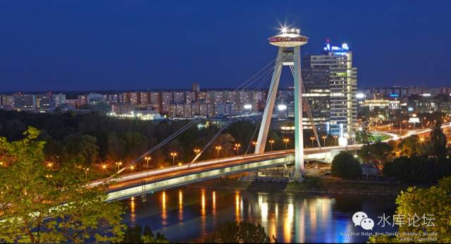
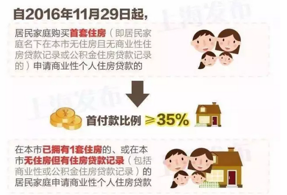

# 2016.11.28上海调控政策分析 \#1135 
----------------------------------

原创： yevon\_ou [[水库论坛]](/)
2016-11-29

 2016.11.28上海调控政策分析 ~\#1135~
================================================================================================================================================================================================================================================================================

（突发事件，水库加刊一期）

 

【新闻】自2016年11月29日起，居民家庭购买首套住房（即居民家庭名下在本市无住房且无商业性住房贷款记录或公积金住房贷款记录的）申请商业性个人住房贷款的，首付款比例不低于35%。在本市已拥有1套住房的、或在本市无住房但有住房贷款记录（包括商业性或公积金住房贷款记录）的居民家庭申请商业性个人住房贷款，购买普通自住房的，首付款比例不低于50%；购买非普通自住房的，首付款比例不低于70%。

 

一）突发政策

 

各位，因上海突发重大调控政策。今日临时加更一篇，予以分析。

 

 

首先，我们来看本次政策的重点。本次政策，最主要是二个精神；

1）认房又认贷

2）提高首付至35%

 

对于政策，读者们最容易问的问题是：房价会不会跌。

我们先直接放结论，然后再逐步分析；

1）对市场整体影响轻微

2）不利于二手豪宅市场

3）阶级固化明显

 

 

 

二）市场整体影响轻微

 

首先，我们来看一个总体的结论，也是老百姓最关心的话题：房价会跌么。

答案是：不会。对市场总体影响[轻微]。

 

因为上海，是一个对"信贷依赖度"非常低的城市。总体而言，无论你"限贷"怎样调整。都是隔山打牛，隔靴搔痒。

 

 

目前，全上海市的住宅，大约在5亿平米左右。如果取均价50000估算。则总市值在25万亿左右。

 

另一方面，全上海的"房贷余额"。包括按揭和抵押消费等等，总额约9300亿人民币。

也就是说，在上海的全部房地产价值中，只有0.9/25=4%，只有4%的市值是抵押给银行的。

 

这个数值是非常非常低的。远远低于美国"次贷危机"爆破前的数据。

也低于日本，香港，房地产崩盘前的数值。

美国"次贷危机"前，抵押比例约为10%

 

 

从另一个角度讲，2015年上海的一二手房交易金额，总值大约在14000亿元左右。

可是上海的"房贷余额"仅仅从6500亿，增加到9300亿左右。净增2800亿。

2800/14000=20%

 

哪怕考虑到这6500亿中包含一部分"还款"金额。其总比例，也不会超过25%。

 

 

这意味着什么，意味着上海人买房子，平均的首付成数是七成半。

KFS卖掉100亿的房子，银行摆张凳子在售楼处签一条龙。则银行最终只能做25亿生意。

 

 

上海人的生活态度，从来小市民小日子，算盘打打清楚。

上海人买房子，不喜欢借银行的钱，不喜欢被银行赚利息。恨不得一家一档全部都扑进去，再问亲朋好友借一点。

首付能有多高凑多高。最多贷点公积金。

 

"江浙沪民"生活本来就殷实富足。而且民风善良保守。

"提高首付5%"这种事，在冒险家的乐园深圳，有可能引起市场波澜。而在上海，是完全被消化化解掉的。

首付都付到75%了，法定30%和35%又有什么区别呢。

 

 

我们研究房地产市场，一定要清晰地认识到，"上海是一座对信贷依赖极其小的城市"。这种使得他和日本香港纽约迈阿密的房地产市场运行规律完全不同。

 

因此，我们纵观历史。凡是在历史上通过"调信贷"来[试图影响]房地产市场的。

最终都[没有什么效果]。

无论是加息，加准备金率，调整二套利率，调整首付。对市场影响都很轻微。

 

 

2400万上海市民，人均房贷仅仅4万元。洗洗睡吧。

 

 

 

三）不利于二手豪宅

 

2016.11.28"调控新政"对于全上海总体市场影响甚是轻微。

但是，如果我们拿着一个"显微镜"放大了看，放大了看，仔细地细分看每一个板块。

有没有哪个板块，受影响特别严重呢。

 

答案是有的。有一个板块，受到了别人的十倍打击，十倍伤害。

这就是"改善型二手豪宅"市场。

 

 

在整个"调控新政"中，受影响最大的是"改善型"需求。

按照目前文件精神，文件可以简称为"认房又认贷"。

对于改善型客户。卖掉自己的唯一住房，更换大房。则原本他被要求"首付三成"。现在却是"首付七成"。这就差了四成。

 

（一般我们默认"改善"为非普通住房。普通住房那档次您就不用改善了.........）

 

 

通常"改善型"客户的特征，他们有一套小房子，可以先卖了，换取一笔资产。所以他们和"刚需"不同。他们不是从零开始的，而是从半途开始的。

此后，通过把"名下"的房产卖完。他们可以达成"无房"的状态，并申请首付三成。

 

举个例子，目前市面上很常见的把自己原有的"老破小"卖了。卖大约300\~400W。

然后拿了这笔钱，自己再贴一点，再问银行借一点。

给孩子结婚购买一套婚房。目标价在700\~800W。

"小房子/大房子"的价值比例，一般在50\~60%之间。

 

 

目前在"11.28"房产新政规定下，这一类的客户会遭遇比较大的麻烦。

甚至有可能会延后他们的购房计划。并导致"改善型二手豪宅"的滞销。

 

 

 

但是，滞销会不会导致降价，会不会导致笋盘，会不会导致急跌。

答案是，会降一点点。但不要高估。

市场已经有了足够的耐药性。不信你回顾2011年的故事。

 

 

细分来看，我们要看到，有以下类别物业。基本是不受影响的。

1）远郊一手盘

 

目前一手房的游戏规则十分清晰。市区基本没地，拍地都在远郊。而且地价超贵超贵，典型就如"周浦8W"。

曾经有人问，这些"地王"项目该怎么卖呀，怎么可能卖得动。

答案十分简单："超高单价+更小面积+新房癌"

 

新房癌是一个新名词。

和直男癌一样，主要患者多数集中于青年男屌丝。而这群人不受"二套"影响。

 

 

2）小夫妻住房

 

如上文所说，如果你的房产定位于"小夫妻婚房"。父母卖了老房子凑钱给小年轻结婚。

则小年轻本身是第一次贷款，不受限制。

 

 

 

因此综上所述，真正受影响的物业类别只有一种。

3）35岁成功人士所选，提高生活品味，踏上人生巅峰。

 

因此这一类针对的客户群，类似于世茂滨江，财富海景，白金府邸，国际丽都............

当你有钱了以后，你想换一套2000W的房子。

 

但是价格又不能太高。太高了4000W以后，都是土豪一次性付款的。

定位也不能太低。受限制的是"35岁人第二次置业"，小年轻结婚就不受限了。

 

对于"35岁"人群二次置业[目标物业]，可以关注一下。

或许价格会有波动。

 

 

 

四）社会阶层固化

 

本次"11.28"调控新政会带来的第三个效果。是"社会阶层固化"。

 

 

我们做"经济学分析"，一定要严谨记住"[[二阶经济学]](http://mp.weixin.qq.com/s?__biz=MzAxNTMxMTc0MA==&mid=402005023&idx=1&sn=c5a8d5da21b15881c46de2e57cfad6f1&scene=21#wechat_redirect)"。

不仅仅要想到我会怎么做，还要想"对手的反击"。

对手不是木头人，任何一项改变都会引发反制。

对于目前"非可逆"的行为。导致一个结果，就是"抛售房源"大大减少。

 

 

好比限购，限购基本是一种"不可逆"的行为。

目前的上海限购，他并不是发你一张"购房券"。

若我有5套房子，卖了1套。政府应发我一张券。12个月内，凭此券有资格买一套。

 

目前的上海限购，"卖了就是卖了"。

假如我有5套房子，卖了一套。我就是永久性地损失了一套。这辈子最多只能买4套了。

 

 

在这样情况下，如果全社会依然存在"纸币通胀"预期。

那我何必要卖呢。我卖了就再也买不回来。

因此一旦"限购"开始，抛盘就大大减少。反而导致了房价的上升。

 

 

对于"限贷"，他也是一样的道理。

如果"认房又认贷"的话，等于我的贷款额度，变成了一种稀缺产品。

一旦我卖掉了，我就再也不可能拥有七成贷款了。

那我何必要卖呢。不如苦苦长持。

 

 

我们看到，历数过去十年"宏观调控"的惨痛教训。

宏观调控之后，往往是"市场急冻，价格不动"。

 

历年宏观调控，基本集中于"增加交易成本"。

每一次宏观调控政策出台，都使得市场"抛盘"大大减少。整个交易流程更不流畅。

 

 

而价格呢。老百姓其实不在乎交易量的多寡，在乎的是交易价格。关键看房价能否降下来。

短暂的空头狂欢庆祝之后，价格一分也没有降下来。过了几年还要猛烈大升。

 

 

 

"11.28"调控的一个间接结论，使得有多余房产的人，更加不愿意将房产抛出。

一旦卖出，就再也不可能买进。

 

因此整个社会将逐逐渐固化。"有房子"和"没房子"的人，会逐渐成为泾渭分明的二个人群。

 

 

 

（yevon\_ou\@163.com，2016年11月28日夜）

 

\* 原定《人文经济学会》演讲稿之"会后问答"部分，将延迟至明日推送。
