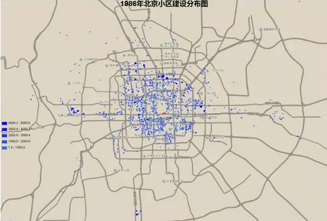
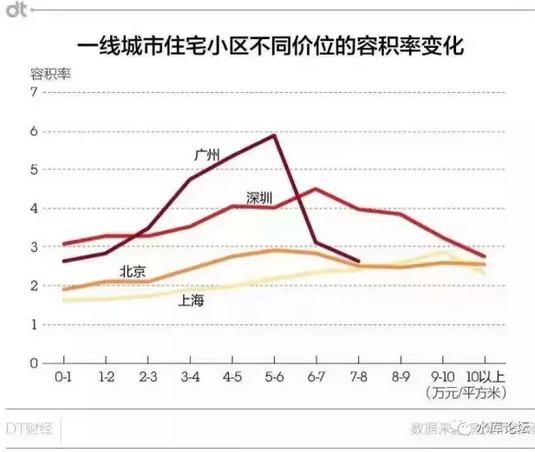

# 上海楼市往事（2）\#1150 
------------------------

原创： yevon\_ou [[水库论坛]](/)
2017-01-20

上海楼市往事（2）~\#1150~

副标题：1998年的楼市

时间：1998\~2001

 

 

我是九八年去的广东。之后几年的上海楼市，说实话我并不了解。略有疏误。

1998\~2001年的上海楼市，它主要做了几件事；

 

一）    减税

 

这件事在今天看来，或许觉得不可思议。但的确是高宗朝的德政之一。

 

按照改开前的税法，不动产的转让，需要交5.55%的营业税和20%的个人所得税。

在90年代末，最重要的就是把这二项税收给免了。而使得不动产交易，只需要交契税。

 

杂费方面，98年上海买房子，还要强行办"律师费""公证费"二笔收费。金额大概是房款的2%左右。

在德政下也被取消。

 

其后，上海市政府还二次减税。契税先是减半到1.5%，然后再度减半到0.75%

这使得二手房的全部交易成本，仅仅就0.75%！

 

 

轻徭薄赋，在任何一个朝代，都是德政之本。

凡认为"交易"会导致房价涨高的，那是彻底的谎言，污蔑，一派胡言！

 

 

 

二）    确权

 

所谓的"可售公房不可售，不可售公房可售"。相信肯定绕弯了一堆的人。

90年代末做的一件非常重要的事，是"确权"。

 

 

原本，上海有多种，大量，不同的物业。

有公租房，房改房，可售公房，不可售公房，企业分房，商品房，外销房，土地划拨房，经济适用房，廉租房，使用权房，小产权房............

 

 

90年代末做的一件重要的事，是"确权"。

不管什么类型的产权，尽量格式化成"商品房"。统一发放房产证。

 

而"商品房"，顾名思义是以市场经济挂帅，以价格为导向。

它就是一种商品，自由地在市场上买卖。

 

 

商品房就是商品。交易的唯一媒介是"货币"。

"确权"的过程，其实也就是一种"去特权""去管制"的过程。

 

叹息的是，十几年后的今天。

唉，喝咖啡。

 

 

 

三）    内外销房并轨

 

"金融危机"对上海的经济并没有太大的影响，除了口头上。

唯一动荡的，或许是古北社区。

 

99年时，上海的房产分为"商品房"和"外销房"。

普通人可以买商品房，外国人只能够买外销房。

 

 

"金融危机"风暴袭来，土著商品房市场基本没受影响。

而"外销房"跌得七零八落。

 

当时外销房有二个致命缺点；

1）贵

2）[[小众市场]](http://mp.weixin.qq.com/s?__biz=MzAxNTMxMTc0MA==&mid=400180733&idx=1&sn=6f6d43444fdadaf55a8265641e4e9114&scene=21#wechat_redirect)

 

 

其中"贵"是致命的。2000年时，卢湾的一手新盘，不过卖4500\~6000.

而古北的"外销房"普遍都是2000美金/m。

 

除了"贵"之外，它还是"小众市场"。

因为古北在上海地图上，是靠近机场，一个非常遥远的地方。远离市中心。

 

古北的房子，在土著眼里，是一文不值的。

别说2000美金。你打个卢湾的四折，或许我们考虑考虑。

 

 

因此当"金融危机"袭来时，香港人台湾人抛售房产。

这个时候，下面是没有"承接"的。

他的价格是断崖式下跌。一口气跌到1200美金/m。

 

 

在这个时候，又出现了一批人。

因为古北的租金还可以。有一些财团大肆收购"名都城"，然后全职做出租。

租金回报可以到10\~12%，成为上海滩一段传奇。

 

然并卵。房地产这一行，决战在买卖。租赁是小钱。

终究赚不了多少。

 

 

 

90年代末随着"商品化"，将所有物业类型统一到商品房的市场经济。

"内外销并轨"，没区别了。这重重的一击终于导致了外销房的末日。

 

从此之后，哪怕是老外港澳台买房。

他们更倾向于浦江二岸的"世茂滨江花园"，而不是古北仙霞。

 

\* 外销房落幕的一个副作用，是蝶式塔楼的香港设计师，终于被淘汰出了市场。板楼统治新房。

 

 

 

四）    房改房

 

"商品化"是一个大思路。除了内外销并轨，另一件大事是："房改房"。

 

改开之前，名义上所有的房产。其产权都是国家的。

至少也是集体的。

 

个人虽然拥有住房，而且实质占有。

但名义上如果你犯了重大事故，单位也可以收回来，再分配给别的职工的。

 

 

"房改房"的改革要点，在于办房产证。

名义上付一二万元，但其实国家并不是想赚你这个钱。

而是想理清产权，把不动产都"商品房"化。

 

 

这些房改房的"老公房"，几年后都升值到了几十万元，甚至几百万元。

有一些不明渊源的"新上海人"，在[编故事吹牛]时会说，"当年房改房一二万元，唉，当时贪便宜没买下来"。

 

 

其实并不是那么回事。房改房你"能且仅能"买一套，就是你当时住的那套。

所以不存在"一二万换几十万"，投资或者错过的说法。

其实就是你几十年的变相工资。

 

 

 

五）    吸引人口

 

"蓝印户口"和"买房退税"，被誉为2001年上海楼市爆发的引爆器。

我本人从来不同意此类说法。

 

但是，90年代末，上海市政府对于"吸引人口"的态度，是真诚的。

想要落户上海，也从来没有如此容易过。

 

 

而这扇门，从2005年之后，一直是越关越紧。

一直到今天，想要获取上海户籍，已经是一场"不可完成的任务"。

市场上一般估计，在买房，买车，高考，医疗等方面的差异。仅仅一张上海户籍，已价值150W元以上。

 

\* 一条万金秘籍是，如果你交社保是上海市平均的300%以上。则打分120分必过。

 

 

 

六）    低密度城市

 

从1949一直到1999年末期。上海的"核心区域"，也就是黄浦，卢湾，静安三个区，一直保持着约80000人/平米公里的人口密度。

 

从全世界范围看，这个数字都是惊人的。

全世界能超过一公里十万人的寥寥可数。或许仅巴西，印度的贫民窟有得一比。

 

 

上海从90年代末开始，一直坚持不懈地在做的一件事。是把"市中心"的人口密度降下来。

最终降到约20000人/平方公里。和东京的核心区差不多。

 

 

很多人都关注到"淮海路"商业街的没落。

淮海路为什么没人了。因为人口都被拆光了！

 

你关注淮海路的话，它的北面是延中绿地。大型的绿地。

南面则是翠湖。大量的贫民窟被拆迁，然后人口又不回填。

你观察市中心。大片大片的空地就在那里晾晒着。目前全上海哪里最不堵车，答案是核心环。

 

淮海路前后2KM之内，几乎没剩多少居民小区了。

 

 

 

大约从2000年左右，"限容积率2.5"就被写入了政府公报。一直执行至今。

相比之下，成都的容积率是4，广深的容积率是6.

 
如图。广州的每亩地价，几乎和上海是一样的。

但是广州的房子"容积率"惊人的高。因此广州房子不值钱。

 

"低密度城市"路线，对于上海楼市格局，造成了决定性的影响。

 

 

 

七）    田林的开发

 

1998年时，上海市区还很小。

 

传统意义上的市区，以"外滩\-\--人民广场"为核心。

西不过徐家汇。

东不过浦东南路。

 

一般老上海认为，徐家汇就已经是"城乡结合部"的边缘了。

往外一步，就有农田。

 

 

上海市政府在90年代后半期做的一件事，是"田林新村"的开发。

当时，从田林一村一直造到了田林十八村。

清一色的现代工艺，整体开发。电梯塔楼。

 

从地段上讲，田林应该算是市区的一块"飞地"。

从徐家汇延伸出去，交通也不是很方便。好在是"整体开发"。

 

 

奇怪的是，在田林那群中产阶级的心目中，却形成了一种"田林情结"。

动辄就是老子天下第一，田林新村是全上海最最最高档的社区。

你们再赤脚二十年也追赶不上田林。

 

 

这么奇怪的社区文化，在十年之后，又复制了一次。

就是浦东的"联洋"。

因此联洋也有"东田林，西田林"的称谓。

明明是一个低档社区，偏偏肚子朝天小资情结严重。

 

 

二十年后，"田林新村"的人口结构严重老化。

收入偏低，地段也没有吸引力。

或许预示着联洋社区的未来。

 

 

 

八）    多层电梯规范

 

上海最初的规定，是9层及以上必须安装电梯。

因此市内造了一批8层高的老公房。

 

此后，市政府改规范，8层必须安装电梯。

大量的九零年代7层住宅，由此而来。

 

最后，经过市民大量投诉和诉苦。政府改为7层必须安装电梯。

结果就是今天所有的6层高老公房。

 

 

对于98年的上海楼市，有一个很明显的分界线。就是莘庄沿线。

外环以内，哗啦啦全是电梯高层。

到了莘庄，一下子开始出现了大量1998年新建6层老公房。

 

这里面的诀窍，在于地价。

当时的地价，大约100W元/亩。

在这个物价水平上，正好是造多层划算。

如果地价更贵，则应该造电梯高层。因为地价超过了土建成本。

 

这些算计，在今天听来都是天方夜谭。

 

 

 

九）    收入和购买力

 

1998年我刚毕业时，有人在复旦发传单。

是那种用钢笔写在练习本上的手抄纸，连复印机都没有。

 

标题是：《关于大学生年薪1万元的倡议》。

里面说，近期物价飞涨，人心沸腾。大学生毫无工作经验，动辄拿一二千工资，极为不道德。

我们倡议，发起"大学生年薪10000元活动倡议"，月薪800，共同净化社会的风气。

落款是山西某企业。

 

 

这事固然是一个笑料。但总体而言，毕业工资的确不高。

去外贸的几个，月薪1000.

华润集团，月薪900

最惨有几个去了青岛海尔，当时海尔还如日中天。月薪真800。过了几周，从青岛逃回上海了。

 

 

值得注意的是，收入增长的速度非常快。

一般估计，大概每年+25%以上。

 

等到2000年招聘，普遍的"大学生起薪"都要在2000以上。

而到了2001年招聘，复旦学生已经是5000/4000/2500了。

今天的码农起薪廿万。唉，不提了，不提了。

 

 

和收入的沸腾增长相比。1998\~2001年的上海楼市，其实涨得不多。

虽然一般共识中，这三年都是"涨"的。但涨幅真心乏善可陈。半汤不水，进二退一点五。

 

房价收入比的急剧拉近。

暴风雨就要来了。

 

 

（未完待续）

 

（yevon\_ou\@163.com，2017年1月18日晚）

 

 

 

【1986-2015北京新增小区动态地图】

 

