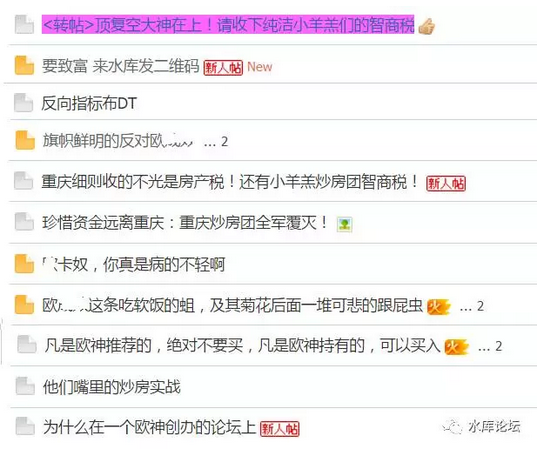

# 我们的仇家遍天下 \#1170

原创： yevon\_ou [水库论坛](/) 2017-01-25

 我们的仇家遍天下 ~\#1170~
====================================================================================================================

水库周边

 

 

一）反对派

 

水库主要有二个站点；

-   Shuiku.net，这是一个BBS

-   水库微信号

 

其中，Shuiku.net注册需要邀请码。每天放出25个。

水库平均每天新增500粉丝，按这个比例算，邀请码还挺难抢的。

 

 

话说，某年轻人真抢到了"邀请码"，他登录BBS一看，接触的画风是这样的；

年轻人一脸懵逼，左看右看，哎哟妈呀。

你说我是不是进了一个假网站了。

在这一刻，我感觉我是一个假中文人。

 

 

小白们怀着"崇敬，学习"的心态上来。蛮以为在"楼市"的大本营中，会是一篇歌功颂德祥和之气。

可没想到，大神们已经被骂出翔。傻空们纷纷判断，"大神"们智慧不足一提，他们才是真正的牛人。

 

甚至有人提出了"多军怎样操作，你反着操作就行了"。

朋友，过去十六年中，是多军几千万，半亿地在赚。

反向操作，意味着亏几千万。

你亏得起吗。你妈的棺材本有钱么。

 

这一通极其混乱的局面，完全颠覆"一派祥和"BBS三观。

最后让无所适从的年轻人，发出了"为什么在一个欧神创办的论坛上，这么多人反倒是在讽刺或者骂欧神？真的很奇怪"。[\[1\]]

 

 

二）仇家

 

是的，我们有仇家。

 

盘古开天地。清气上升，浊气下降。浑浊人世间自有卑劣邪恶之人。

这些人，平时你看不见，不代表他们不存在。

只不过你生活的圈子，离他们很远。远到了干净的手，看不见社会底层的污秽与宫斗。

 

 

水库的规矩，和其他网站不同。

在其他网站，如果你胆敢辱骂版主。甚至仅仅是发出不同意见。

轻则移除微信群。重辄封id，销号。

全中国网站这么多，你见过几个大尺度骂猴子的。

 

水库的规矩，和其他网站不同。

如我们在《[美国的大脑生病了](http://mp.weixin.qq.com/s?__biz=MzAxNTMxMTc0MA==&mid=2651014783&idx=2&sn=e65063240bcf30c7cfa3b75e4611747b&scene=21#wechat_redirect)》一文中所说的，真正的言论自由，是否包含"反言论自由"，是否包含xx主义，侮辱，诽谤。

 

 

答案是：可以的。

真正的言论自由，你完全可以在演讲台上赤裸裸地宣扬"反自由"。

 

真正的言论自由，唯一不包容的是"反逻辑"的话语。

我们坚信我们代表真正的真理。所以我们不怕"演讲台上的搏斗"。你若是反对派，放马来辩论啊。我保证在辩论场上，把你斩于马下。

 

 

这里的道理，对于"水库论坛"也是适用的。

水库论坛尺度极大，完全容得下极大的反对派。

因为我们坚信我们是真正的逻辑。而真理，是不怕挑战的。

 

 

好了，写了那么多，究竟想表达什么呢。

我们想说的是，水库论坛，可能是全国唯一一个，可以推荐"反水库"的精选。

 

以下文章，其基调都是反水库的。

我们把它们都列出来，贴在下面。各位可以跟踪深入。

只不过他们既然是反水库的，其立场必然有错误。逻辑肯定有犯错的地方。各位可批判学习。

 

 

 

三）微信公众号

 

1）包租婆二小姐

 

"二小姐"秉承着激进的"反水库"立场。基本上认为炒楼客全部都要跳楼破产。六个月不涨，债主就全部都要逼债上门。

 

今天一篇《顶复空大神在上！请收下纯洁小羔羊们的智商税》，直接就把我看乐了。

文笔很好。才看了一半，就忍不住点赞。

 

还有前天的《我念念不忘17年的情人啊......》也写得很好。

 

 

2）二环十三套

 

潜伏在微信群里的小妹妹。据分答说语音很嫩。

她持有激进的"反重庆"态度。炒房团全军覆没。

 

推荐的文章是：

《当我们谈论重庆时我们在谈论什么》

《炒房客的悲与歌：2016年买了14套，2017年何去何从》

《那些卖房炒股的人们，今夜在哪儿过年》

《一年买2300平米的房子是怎样一种体验》

 

 

想比之下，"二环十三套"不象二小姐的铁空，敌意也没有那么明显。

她的特点是，文章篇篇精品。

每一篇都是五星，值得推荐。

 

 

如果说"水库论坛"的主号，是介绍了一系列房地产的手法。成体系地介绍了整课"炒楼学"理论。

则"二环十三套"篇篇都是八卦。

 

她就是潜伏在"水库微信群"里的。我们的社圈那么大，生态位那么古怪。天天都有奇怪的故事。

而"二环十三套"就是写"花边周边"。每一天都是水库TV小道。她这号我都爱看。

 

 

最后解释一下，"顶复空"其实是富二代。

家里在南京开"小杂货铺"的。整间商场。

 

丫最喜欢做的事，就是装穷书生。

他的第一，第二任ex，都是因为钱和他分的手。

当时女方说，"我要找一个更高薪的男士，例如年薪50W的"。

 

我想这家伙隐藏这么久，等的就是这一刻肆虐的快感吧............

（俺其实也挺8G的）

 

 

 

3）魔都12套

 

《内环十三套》的姐妹号。其真实的运行者是鸦书记。

 

书记可是传奇人物。也是yevon\_ou的偶像。

啥，您也有偶像。那是何等传奇人物。

 

 

书记的语录，炒房者都是庸庸碌碌。浑身沾满了铜臭味道。

人生就是陪伴美丽的女子，在爱情中渡过一生。这才是最高境界升华啊。

 

所以鸦书记通常不理俗事。专心致志他的娃2N。

膝盖已碎，跪倒崇拜得一地。

 

 

4）亿客舒沪牌

 

要说这个号，可真心NB得一塌糊涂。

你打开的"亿客舒"的微信号。你会惊讶地发现，水库的所有文章，那里也有一份。而且连编号也一样。

BBS他也有山寨版的，是Shuikuluntan.com.cn

 

然后"亿客舒"就打着水库的名头去招摇撞骗。说这里是正宗的。

其阵地包括微信群"一品堂"，"A8群"，"A8.5群"等等。

 

每个群400人，收群费300元/人/年。

亲，这个是李鬼的。您看清楚啦。

 

自由主义者不负责辟谣。

见《自由主义的诈骗观》\#F300

 

 

5）魔都房房房

 

也算是一个大号。经常引用水库的资料。

 

6）汉唐房视

 

傻空集结号。阅读量很小。

 

 

 

四）盟友们

 

除此之外，我们还有一些盟友们。

不过一般人对"盟友"的兴趣度远远不如敌人有趣。所以也就草草介绍罢了。

 

+-----------------------+-----------------------+-----------------------+
| [陈兜兜很厌世] | [上海楼市dittojeff]{.unde | [罗尼] |
|                       | rline}                |                       |
|                       |                       | 90后月入20W           |
| 文笔极好，友谊的小船说翻就翻 | 地图的心法     |                       |
+=======================+=======================+=======================+
| [融融咨讯] | [知梦小龟] | [一亩瓜田]{.underline} |
|                       |                       |                       |
|                       |                       |                       |
| 信用卡-信用贷特种兵   | 重庆管家公司          | 瓜神新号              |
+-----------------------+-----------------------+-----------------------+
| [上海房地产观察] | [楼市与上海] | [重庆房地产观察]{.underline} |
|                       |                       |                       |
|                       |                       |                       |
| 绝对的大号，25W粉丝   | ←← 的马甲             | 水库中人写的重庆，很用心 |
+-----------------------+-----------------------+-----------------------+

 

 

其中，值得一提的是SPI（Shanghai Property Insight 上海房地产观察）.

SPI是绝对的大号。有可能是上海最大的房地产公众号。

粉丝数在25W左右。

 

 

在巴西，有二个电视台，24小时只放广告。

它没有任何"节目制作"部门。没有连续剧和爱情剧。

它只放广告，24小时滚动各种制作精美的商家广告。

 

这样的电视台，居然也活得下来！

而且还活得不错。

在这个世界上，的确有人看，而且看得津津有味。

 

 

SPI有其著名的"番茄炒蛋体"。每次都把字号标到最大。黄底红字。

每次都是"惊爆，突发"！

他专职干二件事。一是报道哪里又拍了地王，预期保本售价多少。

二是推荐地王附近，有什么"惊爆"一手楼盘。KFS的广告费拿到手软。

 

我们十分羡慕SPI的收入。纯以收入论，他这个模式是变现得最好的。

大家的路径不同。

 

 

SPI的创始人，也是水库元老。

最早的几位会员之一。

 

 

 

五）春节期间的安排

 

我每天接到大约50个"加好友"微信申请。

Email七八封邮件。

水库后台留言"俺有这个情况，blablabla如何投资"若干。

 

对于这些来信，哥哥惯例是不回的。

因为实在太多。管不过来。选择性地回复也会得罪人。不如干脆一律不回。

如果你真的有急事，可以上分答找我。收费666元/个问题。

 

 

奥派向来信奉："如果你不肯出钱。那就是你这问题不值666元"。

毫不重要，那也不必答了。

 

 

关于春节期间的更新安排；

近期网络风声极度不好。

根据布老师的建议，更新要缓慢。宁可缓更少更，也不要咖啡。

加那么多的周边号，也是为了防止失联。

 

所以，哥哥安心打游戏去了。

"部落冲突"最好成绩中国区第2500名。虽然俺水平不行，可是俺用功啊。

 

 

 

如果各位实在闲的无聊。

那我偷偷告诉你，《上海楼市往事》（4）（5）（6）网上是找得到的。

哥哥的微信是不用想了。

你拉另几个衍生号，找到组织，进微信群就看得到了。

 

 

 

酱紫，新年吉祥。

人民币，听我号令。1，2，3发年终奖！钞票雨！落！

鸡年大吉！小鸡蹦蹦蹦！

福从天降！

 

 

（yevon\_ou\@163.com，2017年1月25日晚）

 

 

 

 

[\[1\]]《为什么在一个欧神创办的论坛上》http://www.shuiku.net/forum.php?mod=viewthread&tid=55277
