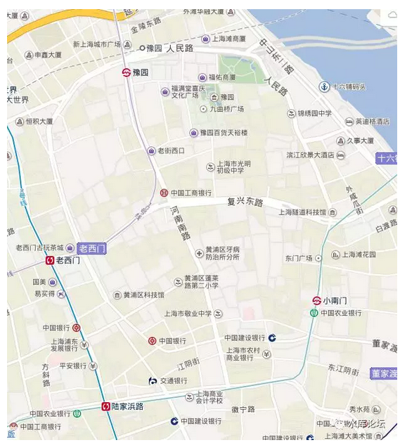
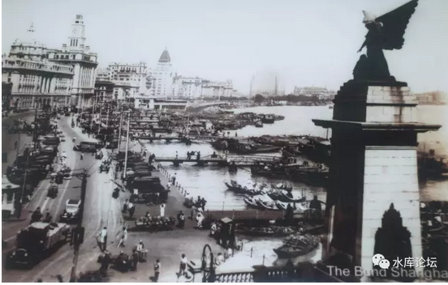
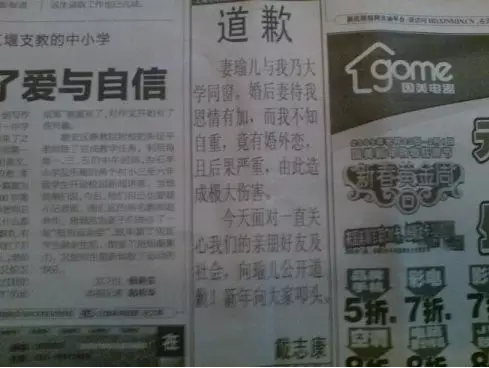
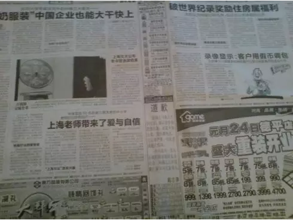

# 上海楼市往事（3）\#1160

原创： yevon\_ou [水库论坛](/) 2017-01-21

上海楼市往事（3）~\#1160~

 

副标题：上海地段历史

时间：2001年

 

无形的手操纵一切

 

 

一）历史

 

中国历史上，传统叫做"苏扬杭松"。这是指清代江南的四个商镇。

 

其中，东南第一商镇，毫无争议是苏州。

其次是扬州，杭州，松江织造府。

松江府在清代估计有30W人口，绝对不是什么小城。

 

 

上海在1840年，是一个县。松江下属一个县，府治在松江。

上海县很小。整个县城，就是现在的人民路（环形）。

以前上海县有城墙。因此有大东门，小东门，大南门，小南门，崇文门（小西门），老西门，小北门，老北门，八个地名的说法。

县府衙门，在豫园。

 

迄今上海还存有最后一段城墙。大镜阁。

"鸦片战争"开埠之后，英国商人要求上海县给他们一块地方居住。

上海县爷，反正也看外国人不顺眼，就把江边的一块滩涂给了他们。这是外滩。

在县爷的眼中，华洋杂处，多生事端。最好你们住得远远的。

而滩涂不能种植，农业价值基本为零。荒地正好仍给英国人。

（其实也不远，直线距离500米）

 

 

而对于英国人来说，外滩是最好的位置。

因为现代人都懂了。最好的位置是哪里，二条铁路交界处。二条河流交界处。

外滩的优势，在于它一头接苏州河。英国人眼光向来毒辣。

 

刚到上海时，英国人对于这个大海边的小城并不感兴趣。

他们的目标是"东南第一大都市"苏州。

 

当时有市井传言，说苏州河可以沿水路直通苏州。英国人大为兴奋。

因此学名松陵江，口语称为"苏州河"。

 

 

1867年，英国政府突然对"流动资产"征收重税。在华的英国洋行们大惊失色，纷纷大力把英镑换成了"固定资产"。

因此在外滩沿线，竖立起大量宫殿式石制建筑。这就是外滩万国建筑群的启始。

 

 

英国人由东向西，拉出了七条严整意义上的马路，三大四细。三条主要的是：

大马路：南京路

四马路：福州路（红灯区）

七马路：延安路

 

 

其中，最重要的是"南京路"的开发。

1901年，白手起家的犹太人哈同，偷偷透支买下了南京路沿线44%的物业。

然后他独立出资，以44%的受益干了100%的事。

他独自一个人，将整条南京路铺上铁藜木。也是现代意义的"道路硬化"。[\[1\]]

 

南京路筑路成功之后，一跃成为上海最顶级的马路。南京路沿线二岸物业暴涨。

哈同赚得盆满钵满。

 

 

 

南京路的距离，从上海外滩，一直到静安寺。一共是5KM的距离。成年人一小时可以走完。

因为南京路长5KM，所以上海也被称之为"十里洋场"。整个城市的重心，就在南京路。

 

当城市成长之后，也有一些有钱人住在郊区。尤其法国人喜欢住郊区别墅。

这些法国人，主要聚集在"湖南路/天平路"。

因此，从静安寺修了一条弯弯的长路，一直连到徐家汇。就是"华山路"。

也是徐家汇飞地的由来。

 

 

可以说，1949年之前，上海高大上的地方。

就是"十里洋场"加一段小尾巴。

 

 

 

二）地段固化

 

上海在1949年之前，是一个"急剧成长"的城市。短短二三十年，成长成为远东第一大都市。

而在1949\~1999年，户籍逐渐凝固。城市逐渐封闭。沪漂几乎不可能。

在对移民的研究中，有一个现象，长期被人忽略："地段的固化"。

 

什么是好地段，什么是坏地段。

这似乎是天经地义的事情。而我们却从未深入想过其中的道理。

 

 

对于上海人来说，"地段"的档次是不言而喻的。

上海本来就是一个"国际性大都市"。1949年就有五百万人口。超过第二名三倍。

 

上海之大，使得上海已经能够清楚地辨别出"市中心"和"下只角"。

有繁华的百货商厦，也有闸北贫民窟，浦东荒芜人烟的农田。

 

 

而几十年的人口不流动，造成了另外一个巨大影响，"地段固化"。

从你生下来那一天，你就知道"南京路"是好地方，外滩是好地方，静安寺是好地方。[\[2\]]

终你一生，一直到你40\~50岁。这些观念都没有改变过。

 

不仅仅是你，甚至是你的祖孙三代，爸爸孙子，他们的人生也在"好地段""差地段"的甄别中渡过。万年不变。

当一件事持续太久，我们就会以为是真理。

 

 

好比欧洲一些城市，他们彻底几乎完全没有基建。

因为严格的环保审批条例，以及恶劣恐怖的工人休假，造一条地铁都要十几年。

 

这些城市，也实现了"地段固化"。好地段永远是好地段，坏地段永远是坏地段。

人们对于地段好坏，价格尊卑，已经形成了共识。

 

 

最典型的，莫如全球房价第一高的Monaco。在当地，一线的楼宇8W欧元/平米。

可是你只要横移500米，或许便一半价格4W欧元/平米。

 

你问他为什么。对方大惊小怪地说，"难道不是这么么，地段差异啊"。

500米的地段差异。

在国内就是一个路口。

 

 

 

而我们知道，2000年后，中国的楼市（京沪深，省会）其实经历了一场"地段风暴"。

2000年后的中国楼市，是以"造新区，建新城，开新盘"驱动的。

 

因为人口的大量涌入。廿年内各大城市的总人口数基本都翻了一翻。

新建的城区面积，和老城区一样大。

 

 

 

学Marketing的人，喜欢切碎了"分类"看。

按板块看的话，上海楼市的现状让人大吃一惊。楼市并不是同步上涨的。

板块分化差异极大。

 

"古老的，传统的，经典的"地段观，在"新城风暴"中已经被撕得粉碎。

土著的审美观，土著信奉了几十年的地段；

"新新人类"不吃这一套。

 

 

不管你多远，多偏的地段。只要新新人类敢买，只要新新人类愿意砸钱。

大不了亏了。

当一个外地人存了"大不了亏了"的心态，他简直就是无敌的。

 

所以我们看见浦东被卖了天价，徐泾被卖了天价，顾村被卖了天价，嘉定被卖了天价。

外环线比内环线贵，这已经不是新闻了。鸟不拉屎。

 

 

 

太多的冲击，使我们开始反思，"地段"是不是毒教育。

万事皆可质疑。"地段"是不是一个大坑。

在1840年上海县令的眼里，豫园是否最好的地段。而外滩滩涂一文不值。

 

如果外滩是一次颠覆，如果南京路是一次颠覆。

那么"再颠覆"一次，又有何不可。

地产的真正价值，在哪里。

 

颠覆的颠覆，又在哪里。

老牌的浦东名片碧云，其房价已经被徐泾反超。

新秀既然可以反对老派，那么新新秀更加可以反你。

 

 

太多的思考，折磨得我们头疼。

城市逐渐凝固，则"地段"会固化。

城市日新月异，则"地段"会被颠覆。

里面的量和度又如何计算。

 

"地段固化"和"地段风暴"是一个巨大的话题。

我们今天无意展开。暂且不提。

 

 

 

三）空心化

 

2003年我曾写过一篇《用板块的眼光看楼市》，是我第一篇被广泛转播的地产类文章。

在我看来，世纪初的政府，牌路是极其清晰的。

 

 

第一个阳谋是"空心化"。

 

当时，上海的"市中心"人口密度十分之高。最高的是黄浦区，高达80000人/平方公里。

1979年改革开放，香港的大佬们初次来南京路考察。路人丢了一块手帕，弯腰是捡不起来的。

因为人太多。

 

而中央的要求十分明确，把人口降下来。目标据说是20000人/平方公里。

人太多会有传染病的问题。而且掉一颗导弹，岂不是一死一片。

 

 

因此，我们看见了又一件和"菜场经济学"完全不兼容的事情。

始自于2000年的上海房地产开发，其实和"内环线"无缘的。

 

真正的"核心圈"，无限接近于零。满打满算，不到10个楼盘。

（老）黄浦区：新昌城，壹街区

（北）卢湾：翠湖一，二，三，四

（南）静安：中凯，丽都，静安四季

 

当时的房地产开发，主要是一些（伪）内环。譬如

普陀内环：长寿路沿岸。

老南市区：黄浦新苑，丽苑，国际，逸苑

虹口:

闸北：

 

最迟到了2005年，连这些伪内环，上海人传统意义上觉得二线的地段，开发都停止了。

而到了2017年，别说核心环，别说内环，就连"外环内"的楼盘开发都不多了。

全部都是"郊环外"。

他其实就是把人口往外围赶。

 

 

据有数据说，上海2000年之后，内环线内新建的住宅，一共只有50000套。

这其中，还要扣掉至少一半，注水的"浦东内环"。

上海人传统意义上，不把浦东内环叫内环。

就好像开口提"北美"的，必然是加拿大人。 

 

现在对于一个上海"体面"的家庭，要为子女置备一套"内环内"的婚房。难度可不是一般的高。

如果是"核心环"那就不谈了。

 

而另一方面，上海的"核心环"并不是没地。并不是因为没有"土地储备"，而不进行房地产开发。

你如果用航拍，或者仅仅开车走走的话，上海内环线最大的腹地，在(原)南市区。

 

南市区的土地，已经拆光。原住民都被迁走，人口却不回填。

大片大片的空地，晾在那里晒太阳。未来都是豪宅。

 

另二块有巨大空地的，是虹口东大名路沿线。

浦东陆家嘴，北滨江沿线。

 

 

这种行政意义造成的"人口外迁"，会不会持续，能否持续。

值得怀疑。

反正印尼政府将人口迁出爪洼岛的努力，是彻底失败的。

 

 

 

四）板块轮动

 

第二个套路，是板块轮动。

 

 

你如果回看2001年"楼市交易量"的话，则无论一手二手，前三名一定是：浦东，闵行，普陀。

 

其中浦东，因为地盘大，也就罢了。

而闵行，普陀，是绝对的房地产大户。什么数量级呢，大约相当于剩下17个区的交易量总和。

 

按照当年的中原地产数据，浦东+闵行+普陀，差不多占去了全市80%的交易量。

划分大区经理，划到"黄卢静"那个，是哭着去的。

为啥呢，因为没有交易量。

 

 

 

这也是违反常识的。如果说"房地产开发"，那应该是各个区平均的。没理由集中在西边这二个区。

一直到后来，我们慢慢想通了这个道理。

 

因为这属于"板块轮动"。

什么样的板块涨得最快。政府拥有最多土地储备的板块。

为了自身的利益，政府会大力开发。把各种利好堆积进去，直到掠夺剽脂结束。

 

 

这样的玩法，就注定了政府必然采取"炒作一个板块""轮炒一个板块"的做法。

为了吸引眼球，火力不可分散。

它必然爆炒一个板块。一直到高位散货结束。

 

例如普陀的长寿路板块，闵行的莘庄板块。在2003年炒到巅峰。

此后，则是长期的冷静期。

 

 

而这段时间，政府又把炒作热力转移到了闸北，大宁，顾村。

玩法都是一样的。

具体可见《[城市规划导论](http://mp.weixin.qq.com/s?__biz=MzAxNTMxMTc0MA==&mid=400973708&idx=1&sn=17039156089da3bcf9ed81170b9c6103&scene=21#wechat_redirect)》系列诸卷。

 

 

五）闵行三杰

 

叶立培2002年被胡润财富榜列中国富豪第6名，上海首富。

他是仲盛集团的老板。

 

话说叶老板2003年轻装出行，穿行于香港湾仔的小巷。

不知道为什么，突然冲上来一个人。迎面一记板砖。

把叶老板砸成了植物人，在医院里躺了大半年。

 

 

等叶老板醒来的时候，他的老婆情人秘书小舅子，手下二三条线，各个派系早已斗得不可开交。

大伙齐心协力，有一件事是共同的："吃里扒外"。

 

于是，卖了十几亿的房子，货款不知去向。

公司宝贵的土地储备，被人以廉价划到自己公司。

 

虽说是"百亿富豪"，可是躺了半年没醒，公司已经快被人蛀空了。眼看百亿就成了一个空架子。

叶老板大吼一声，"我还没死呢"。

 

之后仲盛渡过了几年的低潮期。

不过目前看似乎又恢复了元气，慢慢缓过来了。

 

 

 

新梅，新梅的老板是一个奇人。

他本来是电力局屌丝，50岁毅然下海，承包了一个小工程队。

 

1994年政府大力开发闵行。闵行区土地管理局出让"新梅公寓"380亩土地。

当时上海楼市有一点热，但还没有暴热。

 

土地的拍卖地价100万元/亩。大伙们议论纷纷，这次估计要涨价调价。估计得加个10\~20W上去，才能抢到手。

 

 

张兴标一个人，衣着单薄，跑过去找了土地局的领导。

"我要了，+50W"

领导们大吃一惊。

"但是你付款方式要宽松点，配合我们"。

 

从100到150W，这可是不得了的涨幅。

领导们都惊呆了。

最后，因为价格实在太过于优惠。他拿到了这块土地。

兴盛集团的启动资金，不会超过500W元人民币。

 

此后新梅造了一期二期三期，闵行房价如愿大涨。

他在这块地上，赚到了盆满钵满。一跃成为大富翁级别。

 

 

张兴标一生中，对他帮助最大的，是一个红颜知己。

集团的CFO，专门负责银行和融资。

1995年，兴盛集团遭遇极大的资金困难。孔红梅在银行嚎啕大哭，zxb因此而得救。因此那一期造出来的房子，叫做新梅花苑。

 

"新梅"二字，本就和京东一样的。

但是另一方面，新梅也有很多缺点。

新梅公寓有一桩楼，是建造在河流上的。

 

这个位置，本来是一条小河。才刚刚断流了还不到十年。

新梅公寓，就造在了河床上面。而且还没有打桩基。

这导致后来非常严重的沉降。整个河底淤泥是软的。2003年的大新闻。

 

 

随之，2005年又爆出了一个新闻。

大宁的"新梅共和城"，因为建筑质量不过关。爆出了巨大的裂缝。

最宽阔处，可以塞进去一个婴儿的拳头。

站在马路人行道上，肉眼都可以看见。

 

为了这事，我还特意跑了一次大宁学习房价。

然并卵，丝毫不能阻挡房价的上涨。

房价纹丝不动，爱买不买，买不起滚。

 

 

 

王政安：阳明国际的老板

水清路上的阳明1\~5期，在莘庄也算是一线楼盘。品质和档次绝对不逊色任何一家。

王最初在义务当老师，挖得第一桶金。1992年带着一千万，来到上海开发房地产。

 

做KFS有多赚钱。阳明这块土地，前前后后也卖了上千套房子。

答案是：净资产不到A10.

 

真不到A10，哪怕算上此后卖世纪大道物业的收益。

他是促使我写下"KFS不赚钱"的重要原因。

 

 

 

戴志康：

戴老板就不说了。我这就只有一张图。其他我什么都不知道。

 

（2009.1.24 新民晚报）

（未完待续）

 

 

（yevon\_ou\@163.com，2017年2月17日晚）

 

 

 

 

[\[1\]]耗资60万两白银

[\[2\]]北蔡（世纪公园）是差地方，碧云是差地方，张江是差地方。
