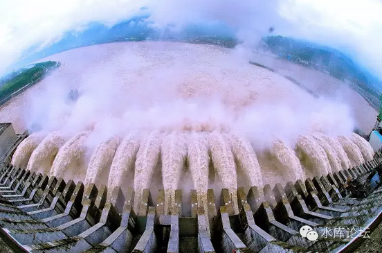

# 副标题：白左上台

时间：2002\~2003年

 

通往奴役之路，如此清晰。

 

 

一）新政换届

 

2002年高宗如约换届，将权力转交给和帝。期间经历一年多的时间，大致平稳过度。

"政府换届"这种事，是一等一的核心大事。

 

底层的年轻人，往往"政治冷漠"。他们觉得南中海是极其遥远的事，影响不到他们的吃喝。

你不关心政治，政治会来关心你。

未来房价暴涨十倍，在这一天就已经埋下了伏笔。

 

 

 

秀相上台后，干了几件事。我们摘取讨论。

 

1）新《道路交通安全法》第七十六条

 

　　(二)机动车与非机动车驾驶人、行人之间发生交通事故，**非机动车驾驶人、行人没有过错的，由机动车一方承担赔偿责任;有证据证明非机动车驾驶人、行人有过错的，根据过错程度适当减轻机动车一方的赔偿责任;机动车一方没过错的，承担不超过百分之十的赔偿责任**。交通事故的损失是由非机动车驾驶人、行人故意碰撞机动车造成的，机动车一方不承担赔偿责任。

 

秀相上台伊始，就急不可待地抛出了《新交法76条》，美其名曰"保护弱势群体"。

这条法规，最核心部分，通俗一点说：

 

机动车和行人碰撞，无论有错没错，都是机动车赔

 

 

秀相推出这一条时，涎着脸说，是为了保护"弱势群体"。

走路的，肯定比开车的要穷，你弱你有理。

弱势群体不是特权群体！

这条法规的恶心之处，堪比奥巴马让男人进入女厮所。

 

 

我们知道，"公平"是一个社会运行的基石。

"交易双方缔约平等"是《民法通则》的基石。

奥派可以容忍"起点"的不同。认为拼爹是公平的。可奥派绝不能容忍交易双方不平等。

51：49%的麻将，没有人陪你玩。

 

 

《新交法76条》出来，俺第一个想法，是找30个叫花子，砸了那个"人大专家"的车。

你不是说，"机动车和行人冲突，行人永远"有理么。我找20个叫花子把你车砸了，看看你还是否笃行有理。[\[1\]] 

 

 

秀相推行"新76条"，可显而知，这个人脑子里是极其混乱的。

a.  他是个小人，只知道取媚暴民，而没有整体规则概念。

b.  他是个暴君。"宪法""民法"，在他眼里都可以随手践踏

c.  他是个蠢货。会把社会弄得乱糟糟。

 

 

问题：如果你开车正常行驶在马路上。见一80岁老爷爷颤巍巍骑自行车逆向向你车头撞来。你应该如何处理？

 

答1.立刻刹车，停住

（评语，选本选项的人简直是法盲，对于伟大的道路安全法的严重后果一无所知，即使停住，人撞死在你车头，你一样要赔19.5万）

 

答2.停车并下车锁上门

（评语，选本选项的人简直是法盲，而且不看新闻，即使停车人下来发动机熄火，你没有停在白色停车框内，人撞死在你车头，你一样要赔
19.5万）

 

答3.马上倒车，躲避骑车人

（评语，选择本选项的人简直没有脑子，倒车时人撞死在你车头，按照安全法你将负全部责任，赔款19.5\*2万）

 

答4.立刻刹车，停住，将钥匙拔下来交给一个路人说："此时此地此分此秒，我把这辆车赠给你了"

（评语，丢车保帅型，除非你开辆好车，一般来说车本身不值19.5万，忍痛损失一辆车可以避免更大的损失，壮士断腕！）

 

答5.立刻刹车，停住，下车，向骑车人扑去，扑通一声跪倒在地，用身体挡住自行车，哭道：

"英雄！我上有八十岁老母下有蹒跚学步的儿子，英雄你就饶过我吧"

 

 

2）铁本冤案

 

2003年，秀相一手拆解"江苏铁本"。

当时，铁本的成本，要比国营竞争对手低30%左右。而秀相一口咬定"铁本肯定亏损，铁钢供大于求"。

 

使用行政命令强制拆解铁本，人心不服。

更讽刺的事，此后中国钢铁业产量一路飙升。狂窜至7.5亿吨的天文数字。"铁本"放到今天，绝对是个赚钱的支柱产业。

 

"铁本冤案"之后，江苏的民营经济转入低谷。

民营企业家普遍不愿意扩张产能。中国民营经济开始走下坡路。

 

 

3）山西煤矿

 

煤价高涨之际，山西官僚开始大肆倾吞温州人煤矿主。

 

当时，秀相牵头，"温州炒房团"屎盆子扣在温州人头上。

进而，推论出"温州炒煤团"大规模的污名化。

借着污名和打倒，山西官僚大肆倾吞温州人合法的承包权。

 

 

4）刘金宝，周正毅冤案

 

秀相大肆清洗朱相骨干，中国金融业技术人才，几乎荡然一空。

剩下的，都是"政工"人才。

在金融战中一败再败。

 

周正毅被"托管"后，名下产业被大肆瓜分。

因为不透明的"拍卖"，大福证券只卖了1500万人民币。

大量不动产，只卖了一折，二折价钱。

托管会计行"德勤"扮演了极不光彩的角色。

 

 

5）SARS

 

关于SARS，我和所有"主流观点"的看法都不同。

我根本就不认为那些"隔离，喷醋，板蓝根"举措有任何作用。

 

对于SARS，人类迄今对这类病毒一无所知。

对于SARS的病元理，疫苗，运行途径一无所知。

 

 

而在SARS期间，大张旗鼓搞的"喷醋"，"板蓝根"，"开冷空调"，"口罩"，"进京交通隔离"。我认为毫无意义。

SARS也绝不是靠这些手段击退的。

背后一定另有隐情。

 

 

相反的，"SARS应急措施"这样一弄，使得"中央集权"急剧增加。

HW杀鸡儆猴，干掉几个不听话的官员。竖立最高领袖权威。

 

SARS大约使得中国的GDP损失了0.5%，主要是各种"停工""停运"。

对此，我感到极度反感。

为了抓权，而丝毫不体恤国力。

 

 

6）外汇储备

 

2003年，秀相动用外汇储备，填充四大国有银行。

相应有《我们是怎样陷入贫穷的》一文。[\[2\]]

 

外汇储备，直接对应着货币发行量。

动用外汇储备 = 滥发纸币 = 滥发纸币救银行。

 

 

当新闻媒体，誓誓旦旦高呼"伟人拯救银行"时，我们对秀相的观察，达到了顶峰。

所有的事件，完美地合成了一个闭环。

 

 

 

二）白左政府

 

秀相是什么，秀相就是希拉里！

除了性别不一样，二人完全100%

 
秀相是彻底的"黄皮白心"。嘴上喊着反美，心里比任何人都狂热地亲美，崇美。

"逆向民族主义"，80年代初垮掉的一代，跪舔的一代。

 

 

我们写过《无可匹敌的力量》~\#F640~，作为最高领导人，他可以选择的"框架"其实是很少的。

无非是计划经济，市场经济，共和制，民主制，儒教，列宁主义等等。

 

"思想家"创造政体。

"政治家"选择政体，而政体候选名单，无非五六种。

 

 

在《我们会信奉邪魔么》~\#F900~一文中，现代的台湾，香港青年们，正在疯狂地"学习"着美国的制度。

凡事均以美国为样板，恨不得比美国做得更纯粹，恨不得比美国更民主。

 

对于2000年初的秀相，道理也是一样。

2000年初，虽然大家嘴里喊着向右转。但其实却是一个"集体左倾"的年代。是白左兴起的黑金年代。

 

 

随着Bill
Clinton的得势，民主党大行其道。而"人权，平等，关爱"等等也获得了最新潮的名分。

秀相是一个"白左教"的重度患者。

他此后种种施政纲领，本质就是照抄Hillary/Clinton。

 

-   新交法76条，仅仅是第一步。

-   此后又搞出《劳动合同法》

-   祸国殃民，灭种亡国的"养老金体系"，注定拖垮TG的赤字

-   参加环保协议CO2下降25%

 

 

对于白左，我们现在已经十分了解这种动物。概括而言八个大字：

 

祸国殃民，灭种亡国

 

 

只要是白左当政，他们肯定是:

-   一手大发福利，鼓吹懒汉寄生 [\[3\]]

-   一手敌视商业，破坏生产

-   国力急剧下滑，国家下坡路

 

我们可以看到，《劳动合同法》《养老金系统》对于中华人民共和国的危害是极其极其巨大的。

可是它们都是秀相"主要功绩"。在其任期内，竭尽所能推出的。

 

 

 

三）楼市大格局

 

基本2003年初，我们已经确定下了"未来十年"楼市大格局。

因为W这个人，已经被看透了。

 

 

这个十年，中国注定从一个"朝气蓬勃"的国家，逐步萎靡成"疾病丛生"的点滴国家。

实业萧条，民营经济崩溃。资金涌入"虚拟经济"避险。

 

这个十年，中央财政一定不能"盈亏平衡"。

福利是个无底洞，一旦开口，支出肯定呈指数增长。

"白左"政府敌视商业，敌视创新和冒险。"财税"收入一定下降，止步不前。

 

==\> 政府只能滥发纸币

 
庙堂之上，肉食者鄙。你既然不是紫绶的人，国家大策，自然轮不到你发言。

 

不过冷眼旁观，洞穿了整个印钞机的真相。

为自己捞点小钱，还是做得到的。

 

 

 

（yevon\_ou\@163.com，2017年3月12日午）

 

 

 

 

[\[1\]]利益披露：本人无车，纯步行族。但我也不支持新交法。我的第一辆车购于2010年。

[\[2\]]《我们是怎样陷入贫穷的》http://www.360doc.com/content/12/0330/11/284801\_199237086.shtml

[\[3\]]"二少一宽"，HYB夫人昨天去世，W亲密送行。
