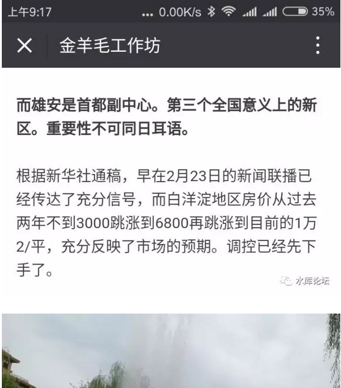
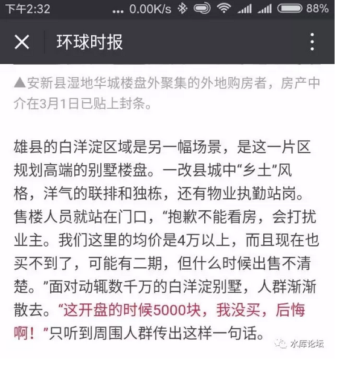
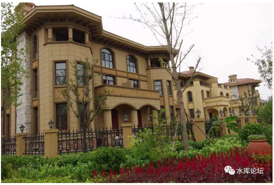

# 999年358天 \#1300

原创： yevon\_ou [水库论坛](/) 2017-04-03

999年358天 ~\#1300~
===================

我们用一周时间走完行情。

剩下的999年358天仰望星空。

 

 

 

一）前言

 

昨天写完了《职业炒家会杀向雄安么》\#1290，大家可以注意到这篇文章没有推送。[\[1\]]

研究了半天，雀巢香浓还是麦斯威尔，都太苦。

最后决定，只发了下朋友圈。于是；

 

 

搞不好会是水库第二篇"朋友圈100000+"的文章。

我也很无奈啊。

 

 

再次重审一下，水库爱国爱党，紧密团结在老大周围。

不叫外卖，不查水表，谢绝送温暖行动。

气候不对，凡是批评的文章，俺们一律不推送。

成功，肯定成功，从一个成功走向另一个成功！

 

因此我们今天就不看淡了。我们批评一个另可以批评的群体："愚蠢的老百姓"应该问题不大。

阿弥陀佛。

 

 

二）抢房子

 

"雄安新区"的新闻一公布，北京通往西南的高速，立刻被堵塞得水泄不通。

 

在这二天二夜的"雄安"事件刷屏之中，最令人印象深刻的，可能就是"炒房团"的报道了。

 

-   雄安可有铁路，航运通过

-   最近的机场在哪里

-   附近可有大型矿藏

-   大学院校，人才储备如何

-   免税政策怎样

 

这些，都是发展"实业"，让一个城市崛起必不可少的要素。

一个港口，一条铁路。昔日让二个城市争得不可开交的，或许仅仅是铁路区局的划分。

 

 

可是奇葩"雄安"呢。

对不起，不知道。

不关心，没人关心，为什么要关心。

 

 

对于雄安的全部报导，媒体的全部眼球，几乎全集中在"雄县限购""一二手不许开盘"

"约谈KFS和中介开会"

"疯抢白沟"

"雄县县委书记落马，华夏幸福集团宣布无条件退还土地"

 

《雄安抢房记:7200万拿下8层楼》[\[2\]]

 

 

 

三）愚蠢的老百姓

 

看到这里，如果你以为水库也象泯泯媒体一样，断然批判"炒房客"，断然批判财迷的无耻和贪婪，断然批判浮世绘和众生相。

那你就大错特错了。

 

 

事实上，水库对于"连夜驱车赶到"，是一点意见都没有。

我们反而认为，这就是中华民族的伟大之处。是中华民族优秀血脉的证明。

神之眷恋，注定成为人上之人的优等选民。

 

 

想当年，加利福尼亚发现金矿。

结果引起了全世界疯狂的人流"淘金潮"。

原本太平洋东部是没有人的，因为"淘金潮"，奠定了美洲西海岸几个大城市。

旧金山，西雅图，温哥华，都是淘金潮的产物。

 

目前环太平洋的GDP，已经超过了环大西洋的GDP。

世界重心转移，亚太超过欧洲。

（AP+日本+美国西海岸 \> 美国东海岸+欧洲）

 

 

 

当一个商机，一个金矿，一个淘金热潮涌现时，你开车几天几夜冲过去，这是再正常不过的了。

想当年硅谷多热，无数人开着大篷车汇聚。Amazon就是在敞篷车上构思的。

 

 

水库真正反对的，不是人民追逐金钱的心，而是人民追逐金钱的技巧。

很少有人注意到这样几段话：

 

[\[3\]] 

 

（十一小时，3000涨到18000！刷新人类历史光速）

 

 

我稍微梳理一下：

-   白洋淀正常的房价是2300

-   目前的房价是17000

-   别墅的价格是40000

 

 

我的意思非常地明确。

买贵了

 

 

雄安不值这个价，目前被严重高估。处于重度泡沫期。

那么，"您觉得雄安值多少钱"。

"呃.........4000/m吧？"

 

"不是啦，我是说别墅4000/m"

"也就是打一折的样子"。

 

 

 

四）估值

 

你这个4000/m的估值，是怎样出来的？

 

首先，可以一定肯定确定的："雄安新区"核心，一定不在雄县、安新、容城，不在任何一个县县城内。

 

也就是说，你目前买的一切物业，全部都是无效的！

 

 

 

我们要知道，CBD开发的一个要点是什么。绝不和老城区混杂。

尤其是京城干部带来的"国家级"雄安新区，级别这么高，绝不会把你几个县丞放在眼里。

拿来当"民工宿舍"，人家都觉得脏。

 

 

"雄安"新区未来的核心位置，一定是远离"雄安容"三大县城的。

人家才不要和土著住在一起呢。

恨不得把你们全都拆迁了，赶得远远的才好。

 

"雄安"未来的核心，地标性建筑在哪里。我不知道。

但有一点确定的，现在的市场上所有物业，全部都是土著区。全部都是一文不值的。

 

 

 

其次，是雄安的高度。

雄安最终能达到怎样的高度。我指15\~20年以后，经过了极度漫长的净亏损和忍耐之后。雄安最终能有多棒。

 

我对这件事，感到极度的悲观。

雄安本身的地理位置就不行。它既不是港口城市，也没有二条大河交汇，空港，特殊矿藏。甚至连旅游资源都不多。

 

 

雄安的"人文"也不行。

天底下的事情，要发展起来，最注重一个"德"。

你要让别人发财，你才可以自己发财。

利益要分给别人，生意才可以越做越大。

 

象雄安这种县一级的"农民"心态。馕字都没有一撇，先赶紧藏着掖着，生怕"不明真相"的房产商把房子低价卖给了外地客。

一个不想让别人赚钱的地方，一个看见别人赚钱就眼红的地方，怎么说来着；

"投资环境极差"

 

 

当你投资环境极差，你做事就会事倍功半。而不是事半功倍。

你最终会成为一个烧钱的玩意，而不是产出的奶牛。

烧钱的肿瘤，又可以养多大呢。

这二天刷屏的《鬼影曹妃甸的凋敝之影》[\[4\]]，难道不是民心的反映么。

 

 

对于雄安的未来发展潜力，我感到极度悲观。产经和人文都不支持。它有四种结局：

-   浦东

-   天津

-   保定

-   曹妃甸

 

关于第一第二种，我觉得概率几乎为零。

介于第三种之下，没沦为第四种就不错了。

 

归根到底，基于"大战略"。

我认为雄安的本质还是[分散北京人口，不惜一切降低北京人口]。

不要追问。

 

 

 

第三个原因，是"风险贴现"。

大伙都知道，yevon\_ou不喜欢买新区，一向看淡新区。

在浦东帮和浦西帮的争执中，我是坚定的浦西帮。

 

其实并不是我对新区有成见。

当浦东帮振振有词"十大投资项目"都在浦东，大型巨型基建都在浦东。发展潜力更大，发展速度更快。

这些我是承认的。

 

 

我对新区的全部反对，唯一只有一点"起价太贵"。

这不仅仅是上海的问题，你换作深圳，天津，南京，成都，郑州，道理都是一样的。

 

新区太贵，一开盘就太贵。太贵太贵。

在离市中心二十公里的地方，你造一个新城。鸟都不见一个，一切都是地图画饼。

然后你说"十大基建"，未来会如何如何磅礴。

价钱卖得比市区还贵 :@ :@

 

 

这种事情，我真心没有兴趣。真心没有胃口。

当年和浦东帮争执时，讲的最多的一句话，"我知道你这一切都很好"。

"浦东建设到了顶峰，就成了浦西"。

 

当你把地铁，商场，步行街，人均300的西餐厅，这些东西全部都建成以后。可能耗时十几年。

等你全部建成后，你的舒适度也仅和内内环差不多。

你现在一片荒地，已经卖80000/m了。鬼都懒得理你。

 

 

2000年美国"科网股"泡沫时，科技股的卖点也是"未来+成长"。

每个人都说IT公司将颠覆世界。

可是你成立六个月的公司，直接已经"千亿美元"市值了，超过很多老牌公司。你还要怎么炒。

你已经把未来一切的利好都兑现了。

 

 

后来，果然科技泡沫"破裂"。大量贩卖美好前景的公司，跌得一文不值。

其实，目前在国内"独角兽"公司的风险一样存在。滴滴，摩拜单车，严格地说都不赢利。

"新美大"奄奄一息。

有兴趣可参阅这篇《客人您好，Uber股票要不？》[\[5\]]

 

 

 

如果你要我买入一项"未来"很好，或者"开发区"概念的资产。

则我要求一定的"风险溢价"是必须的。

谁知道领导会不会换走，最终能不能建成。搞成曹妃甸怎么办。

 

在香港市场，这个溢价一般是+10\~13%，每一年。

对于一项"十年建设"，高度不确定的资产。要求四倍溢价是正常的。

 

 

综上所述，我对"雄安"资产的估值不会太高。估计也就4000元/平米。

一套如图250m的别墅，售价100W。那么勉勉强强囤一套扔在那里。

离雄安CBD 15KM。猜未必赚钱啊\~\~

（以上建立在可贷款的前提下）

 

 

 

 

五）炮灰炒家

 

好了，你有理，你聪明，你说得都对。您伟大论证了"雄安房产只值4000元/m"。

那么现在冲到雄安的几万人算什么，他们都是傻瓜么。市场难道不就是靠"成交价"堆起来的么。

 

 

嗯嗯，这帮人其实不能算"炒房"的。

他们只能叫"炮灰炒家"。

 

职业炒家全中国不会超过1000人。

市场上90%的房源是不能买的，你必须克勤克俭，极少数情况才能有获利机会。

 

\-\-\-\-\--
《[职业炒家（一）](http://mp.weixin.qq.com/s?__biz=MzAxNTMxMTc0MA==&mid=207954111&idx=1&sn=3aaa3c5acc718aa78dfdef9a7f2e678a&scene=21#wechat_redirect)》\#130

 

 

世人对炒房业的误解，主要来自于媒体小编的误导。

无知群众，误以为买房就是炒房。

他们只要看见有人大手笔买房，就拼命地喊"炒房团来了"。

 

这是极端错误的。

跑过去"买买买买买"的，这些不是炒房团。不能贷款的资产没有价值。

她们是阔太贵妇团。

 

 

 

真正的"职业炒家"，是极为严谨科学的一门学科。

体系庞大，知识博杂，几乎每一个职业炒家，都是高知识高素质人群。

 

"职业炒家"的职责，是"衡量价值"的高低。

房价偏低就买进，房价偏高就抛出。职业炒家是楼市的温度计。

 

你学习"黑色金属冶炼"业，拿了一个工业温度计。在炼钢炉旁边看了又算。

而"炒家"其实也是温度计。

这和生物化学，石油化工，精密药品调配。原理都是一样的。超出临界点了就加一点微量元素，炼钢炼到特种钢材需要极其精微的细调。

 

 

 

今天跑到"雄安"的那群人，无论是带了满厢现金的东北财主，还是山西山东的扫墓群众，还是北京的小资白领。

他们都不是职业炒家。

他们的命运和下场，也都是极其悲惨的。

以后媒体小编写他们的墓志铭，请不要写"炒房赔钱"。

 

 

 

我们有一句话送给炮灰炒家们；

 

"你们用一周时间，跑完了全部涨幅"

"剩下的999年358天，抬头仰望救星"。

 

 

 

（yevon\_ou\@163.com，2017年4月3日午）

 

 

 

 

 

[\[1\]]可在水库微信号，回复\#1290获取。

[\[2\]]《雄安抢房记:7200万拿下8层楼》https://finance.sina.cn/china/gncj/2017-04-03/detail-ifycwymx3488026.d.html?HTTPS=1

[\[3\]]《保定雄县、白洋淀周末重大事项调查纪要》http://note.youdao.com/share/index.html?id=860f86fc7af563565f3dbc34483ca5fb&type=note&from=timeline&isappinstalled=0\#/

[\[4\]]《鬼影曹妃甸的凋敝之影》https://www.ishuo.cn/doc/umdiinqf.html

[\[5\]]《客人您好，Uber股票要不？》https://zhuanlan.zhihu.com/p/20549998?from=timeline&amp%3Bisappinstalled=0&columnSlug=sparkspread
