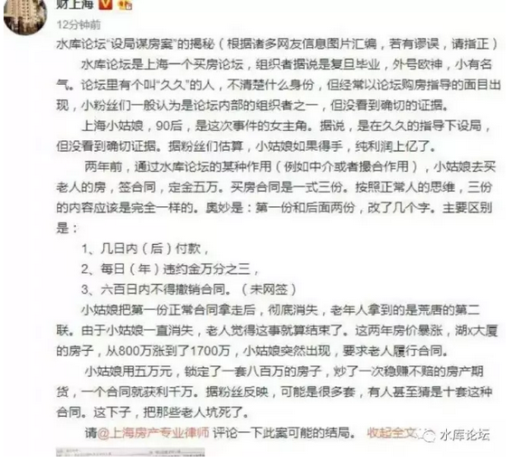

# 没有合同不公平 \#1350

原创： yevon\_ou [水库论坛](/) 2017-04-26

没有合同不公平 ~\#1350~

（见近期热点问题）

 

 

一）窝轮

 

经甲乙双方自由平等友好协商，现达成以下决议；

 

1）甲方违约，赔偿100元。乙方违约，赔偿10000000元。

2）甲方有90天"犹豫期"，90天之内可以随时撕毁合约。乙方有1天犹豫期。

3）如果价格上涨，甲方获得全部涨价利润。

如果价格下跌，乙方承担全部跌价损失。

 

好了，现在"毁三观"考题来了。

请问以上合同，是公平的，还是不公平的。

 

 

对于99%的智商欠费，脑子煤渣，人品贱格的"圣母白左婊"，他们已经忍不住要跳起来了。挥舞着小旗帜；

-   "不公平，不公平，太不公平了"。

-   "这是绝对的欺诈和压迫，政府应该管一管。限制这种合同无效"。

-   "打倒奸商，打倒犹太人，让世界充满爱"。

 

 

好了，我们再加一条，也是最至关重要的一条；

4）甲方支付乙方50000元。

 

尚有一寸智商，理智暂存的人，若有所悟的坐下来了。

他们似乎想到了什么。

因为这个合同格式很熟悉。熟悉到几乎每天都能看到。

没错，这就是标准[期权]合约文本。

 

 

期权，也称之为"认购权"。

指甲方有权以500元/吨的价格，向乙方购买100吨煤炭。

如果煤炭价格上涨，甲方发大财。

如果煤炭价格下跌，甲方可以"放弃"购买权。

 

 

期权，英文称之为Option。港澳地区也翻译为"窝轮"。

中国上交所在2005年进行"股权分置"改革时，也曾经发行过"期权"。

当时，作为股改附送的"期权"，以T+0的交易特征，风靡了无数人。

 

 

"期权"最主要的特征，在于它的"输赢"是不对称的。

理论上，如果"煤炭"的价格，象房价一样飙涨。则"期权"的赢利，是可以涨上天的。

 

而另一方面，"期权"输钱可能性。是**有下限**的。

下限就是煤炭价格跌破500，譬如499元/吨。

那你这份合约的价格就为零。也只能是零，不买。不可能是负数。

无论如何，不可能倾家荡产的。

 

 

"赢面无限，输面有限"，Warrant是不是一种很好的金融产品呢。

香港市场上，铺天盖地的"窝轮"，大伙是不是赶紧去买，赶紧发财呢。

 

 

答案也不是的。

因为"认购证"本身是要卖钱的。煤炭厂家又不是傻瓜。他要卖你一个"溢价"。通常是10%。

 

例如煤炭价格500元时，厂商卖你一个月内"500元认购权"

这份认购书，价格是50元。

你要煤价涨破550元，你才有赢利。

 

 

具体的"窝轮"价值计算，十分复杂。有一个拿诺奖的Black-Scholes公式。

但总体而言，这是一门生意。

买方卖方，都是平等的。买卖窝轮，绝不存在什么暴利机会。

 

从香港市场经验看，窝轮是"散户\-\--机构"博弈。

散户还有博彩暴富的心态，容易出高价。

从长远统计看，基本上是散户（认购证买方）输得多。

 

 

 

二）卖国条约

 

回到我们最初的"房屋买卖"合同中。

 

1）违约的话，甲方赔偿100元。乙方赔偿10000000元。

2）价格上涨的话，甲方享受全部利润。价格下跌的话，乙方承受全部亏损。

请问，以上合约是"公平"的。还是"不公平"的。

 

答案是：公平的！

 

因为无论付款方式，赔偿金额，权力义务，权力义务并不需要对等。

一切都可以折算成价格。

 

 

你正常卖一套房子，譬如是100W元。但是你愿意承受杂七杂八各种"卖国条款"，你就可以卖105W元。

 

同样一班飞机，都是把旅客从北京搬运到上海。"运输服务"都是一样的，甚至连餐食都是一样的。

但是航空公司把座位等级分为了F，A，C，D，Y，S，B，H，K，L，M，N，Q ......

彼此之间的价格就是不一样。

 

 

为什么，因为"合同条款"不一样。

有些头等舱机票，[是可以改签的，可以退票的]。而且退票不收任何手续费。这就是F舱。

 

而苦瘪的，连泪满面的，自掏腰包躺枪群众，最喜欢买R舱（3折）和O舱（25折）。这样的票子，航空公司往往会注明："不接受改签和退票，只退燃油"。

 

为什么，为什么飞行距离都是一样的。

同样票价有399，499，699元的差异。

这里面就是"退改签"条款的不同。

 

 

当我们谈论房地产买卖合同时：

不讲价格的公平，就是耍流氓！

 

你可以拿出一份合同哭诉。哭诉说甲方乙方的"权力义务"如何地不对等。合同是非平衡合同。

你可以哭诉，乙方提出的条款，如何苛刻，如何暴利，偏袒一方。

这些都没有问题。

 

可是有一点你要承认，没有这些条款，就不是这个价格！

 

 

你付了399的机票价格。可是你坚持要按照F舱的待遇。

随时随地可以免费退票，改签。

这种要求就是特权，就是无理，你就是流氓。

你丫才是人渣。

 

 

 

三）显失公平

 

法律界是计划经济的重灾区。

我们一定要提醒各位，美国的堕落，是从法律界开始的。

 

因为美国国父很多都是律师。因此美国政坛，长期被法学院和检察院的学生霸踞。

这些人，不知民间疾苦。没有一丝一毫衣织耕作的经验。

但却是怀着"拯救世人"的伟大理想。文青白左得一塌糊涂。

 

"政治正确"就是USA法律界搞出来的事情。因为法律界想要世界充满爱，那帮棒子又不食草根烟火。

才会搞得白左圣母心泛滥。

 

"法律界"的义务是司法。

"立法"不归你管。这个世界应该怎么运转，从属于立法机构，由政治家管。

司法界的捞过界，才是美国衰弱的原因。

 

 

言归正传，中国的法律，"向强者学习"，有大量向美国学回来的经验。

同时，因为中国的历史和国情。在法律延续中，也不可避免掺杂了大量"计划经济"的基因。

法律界从来不是正义的。法官越是想维护正义，法官离正义越远。因为法官根本不懂什么才是正义。

 

 

在天津滨海新区判例中，刚竖了一个非常不好的先例。

天津法官，以"存在转卖条款"伤害卖方利益为由。判定合同无效。

但其实"不转卖"的合同。他就**卖不到这个价格**。

天津法官以为他捍卫了"卖方"的利益。其实他正损伤了产权人的利益。

 

同样道理，当"显失公平"含义无限扩大时。欧洲的政治正确，搞到"解雇"都变成了一个"非公平词意"。

法国企业迫切需要的劳动力市场自由。在法国，解雇一个员工几乎是不可能的。而在中国，演化为了《劳动合同法》。

这一类法官捍卫正义的行为，最终伤害到了法国。窒息死了法国。

 

 

在中国的《合同法》中，有一个非常显要的bug，即"显失公平法案"。

什么叫显失公平。甲方赔偿乙方100元，乙方赔偿10000000元，这叫"显失公平"么。

呸，不是。

 

"甲方可违约600天，乙方仅可违约1天"，这叫显失公平么。

呸，不是。

 

"甲方逾期罚息0.00003%，乙方逾期罚息3000%"，这叫显失公平么。

呸，还不是。

 

 

 

这些"显失公平"的法案，其实和"期权"的原理是一样的。

任何合同上的特权，都会转化为价格的上升。

京东延保还要另收费呢。 

什么叫"公平"，对于奥派来说，公平有且仅有一条，即"签约时的自由"。

在你签约时，你是自由人么。

有没有人用枪指着你，有没有人用拳头压迫你。

如果"没有暴力"的话，那么这份合同就是公平的。我们不需要看详细条文。

 

象法国或者《劳动合同法》一样，签约是不自由的。

签约有各种条条框框不可逾越。行政暴力压制。

那么这份合同，才是不公平的。

才是邪恶的。

 

 

 

有时候我们回想历史。真心觉得庆幸。18世纪的工业革命发生地在英国，"大航海时代"发生在荷兰。

只有"海商法"以及无比自由的海上马车夫，才能想出"期货""期权"这种叹为精密的契约结构。

 

我们值得庆幸的是，18世纪"工业革命"，并不是发生在满清帝国。

按照这帮"计划经济"老头子的脾气。"法律"必须伪公平，必须"对等"。

甲方乙方必须每一条违约义务，都完全对称。

那么哪怕再过几百年攀科技树，在"中华文明"的土壤上，也不可能长出"期权"窝轮这个万亿级的大市场。

 

 

我们的态度至关明确：彻底废除"显失公平"条款。彻底把这句话从中国法律中删除。

只要是自由的，成年人，那就是公平的。

不需要你法官来发圣母心。

 

 

在美国，有一句笑话，如果你是"黑人女性艾滋病患者残疾人穆斯林同性恋"，那你简直就是"无敌铁金刚"。

谁也不敢惹你。

 

而在中国，"孤寡老头穷人没受过教育"，似乎也有这个意思。

不是老人变坏了，而是坏人变老了。

老坏人不是特权群体！

水库坚定不移地和坏人做着斗争。我们绝不允许圣母婊也毁了我们这个美丽的国家。

 

 

 

四）声明

 

1）微信公众号：魔都房房房

宽带山名人：蓝总

微博大V：财上海

正在对水库论坛及普通网友进行着不负责任的诬蔑。水库保留申述的权力。

 

2）外界一切传言，皆为谣言。

> 一切以法院判决为准。
>
> 迄今为止，久久丫和黄女士是：一审胜诉有理方。

 

3）久久丫和黄女士，均为水库论坛普通注册用户。

> 和水库产权人，水库团队，无任何联系。
>
> 水库BBS注册网友，超过37000人。

 

4）站在水库的态度，我们认为合同完美无瑕，没有任何瑕疵。

> 对于人渣老头的无耻勒索，应该坚决打击。
>
> 当然，最终以法院判决为准。

 

转）另：久久丫近期发出声明。已对：宽带山蓝总，发出追责律师函。

 

 

好了，以上就是哥哥对本事件的全部看法。哥哥关门打游戏去了。

 
 

(yevon\_ou\@163.com，2017年4月25日暮)
