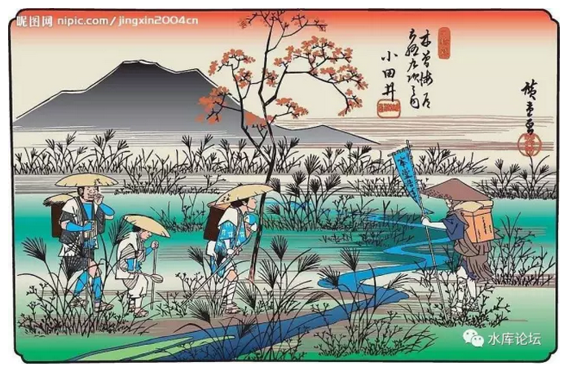
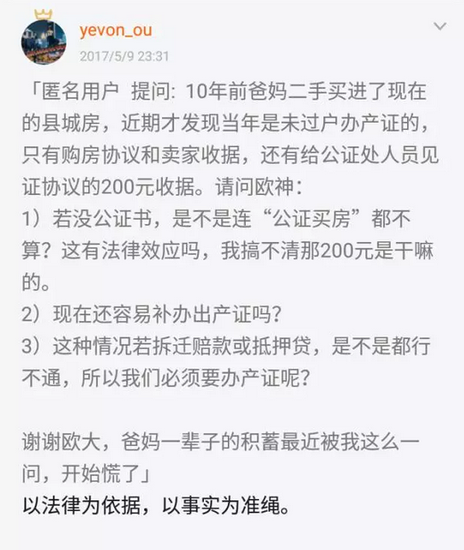
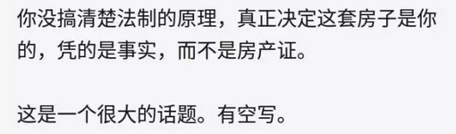

# 你的产证，不是你的房子 \#1390
-----------------------------

原创： yevon\_ou [[水库论坛]](/) 2017-05-22

 你的产证，不是你的房子 ~\#1390~
===========================================================================================================================

 

按惯例，每年5月是我们这一行休年假的月份。偷了好几天懒，睡到自然醒。

接下来更新会快点，可能连更好几天。

 

 

今天我们讲一篇很基础，极端重要"体"的问题。

但"体"这件事，对你买房赚钱，却是一点帮助都没有的。

因此放在闲散的编号。

 

 

一）       谁的房子

 

我们先从几个小故事开始。

 

在2008年时，上海电视台的《案件聚焦》播出一个故事。

说是有一个上海的老阿姨，找了一个梳小分头的男人。

 

男人吃软饭，底层流氓。拆白党照例没什么好事情。

小分头男人混得熟了，就偷偷把老阿姨的房产证偷出来。

再伪造了全套的身份证，委托书，于是去到交易中心。把这套房子"婚内更名"转到了自己名下。新的房产证也办出来了。

 

过了大约半年，上海老阿姨发现了这件事情。便跑到交易中心去闹。并起诉法院，要求将房子改回自己的名字。

-   请问，这套房子，是老阿姨的。

-   还是"房产证"户主，小分头男人的。

 

答案不言而喻。肯定是老阿姨的。

上海的法院，也是这样判的。

这件事告诉我们的是，"房产证"并不是终极依据。"事实"才是终极依据。

 

 

二）       日本地券制

 

1886年，日本政府经过大量长期的准备，终于推出了"地券"制度。

所谓地券，是指全日本地区，统一换发中央政府印制，统一格式的"房产证"。

请问，这是一件小事，还是大事。

 

绝大多数的人会说，不就是印个证么。小事。

错。

在日本历史上，这是大事。甚至是大如天的大事。几千年未有之大事。

当时日本报纸的报导是："一举将全国土地收为国有"！

 

 

这倒是奇怪哉了。此话从何说起。

中国人民想破脑袋，也想不清楚。

因为你从小到大，受的所有房地产教育，全部都是错的。

中国媒体上教育的所有房地产知识，买房要看"五证齐全"，全部都是错误的！

 

 

你翻开任何一本廉价地摊货"理财"杂志，动辄教导你《五证齐全》。

《商品房销售(预售)许可证》+《国有土地使用证》，证书齐全的房子，买了才放心。

错，全错，大错特错。

这是彻头彻尾的毒教育（奴化教育）。

 

 

 

三）       事实为准绳

 

关于这件事，从头说起。说来话长。

首先我们要澄清第一个概念，"怎样才能说，这套是你的房子"。

中国人一般的回答，"看房产证"。

错，全错，大错特错。

 

 

法制的精神，叫做"以事实为依据，以法律为准绳"。

这套房子到底是不是你的资产，[并不是看房产证的名字]，而是看"事实"。

 

譬如说，你到荒郊野岭，大兴安岭。自己烧砖，烧泥胚，建了一所茅草房子。那么这所房子就是你的。

跑到全世界任何一个国家，都是这个规矩。

 

如果这房子是你爸，你爷爷，你爷爷的爷爷建造的。

一路上传下来。

那么这房子就是你的，谁也不能否认。

 

如果这房子是隔壁张三的爷爷的爷爷建的。但是你花500000大洋买下来。

那么这房子就是你的。

谁也不可以否认。

 

产权是以事实为依据，而不是以证书为依据的。

 

譬如说，如果房地产交易中心工作人员，手贱输错一个名字。

难道这房子就不是你的了，就是隔壁李四么。绝对没有这个道理！

 

 

那么"房产证"，或者说日本的"地券登记制度"。是怎么回事呢。

其缘由是，民间的不动产交易合同，往往十分的复杂。

 

这套房子，你可以卖给李四。但同时又卖给了王五。

一方二卖，纠纷非常多。

 

又譬如说，你已经卖给了王五。但是王五外出打工去了。

后人不知道。

家里人住了几十年，突然冒出一个人，说这房子是他王家的。有合同为凭。

 

这一系列的纠纷，最终演化出了"不动产登记制度"。

"房产证"在中国《物权法》上的实践就是说；

-   如果一房N卖。则持有房产证的人，获得房子。

-   其他N-1个人，索赔金钱。

房产证严格地说，有且仅有这一个功能。

 

 

回到我们最初贴图那个小密圈问题。

提问的是一个受"中国教育"的大学生。而他父亲是一个受"习惯法"熏陶的中国农民。

请问，谁的做法才是正确的。

 

真正的答案：他父亲才是正确的。

习惯法好于成文法。正如冬川豆所说，民间才有活力在。

 

 

"房产证"在中国是稀罕货。若论绝对数量，全国90%的房子是没有产证的。

对于很多内地县城，产证的唯一意义是国家要另外抽走约4%的契税。

全国的四五线城市，99%的物业都是"不办证"的。

 

因为没有必要。

政府提供的这"防止一房N卖"功能，抵不上4%税的诱惑力。

农村也不会有人谋夺你的房子，都是村亲。

 

 

 

四）       地券的国有化

 

好了，那么为什么中国的"房产证"，日本的"地券制"。

这薄薄的一页纸，实行了之后，居然使各地方大名哆若寒蝉。如履薄冰。

纷纷喊道"国有化"呢。

 

各位，肉食者鄙。

真正的谋略，是远远超出你的想象的。

上层社会的算计，对于底层民众来说就如神仙般的掐指。

 

 

日本的"地券"制度，中国的"房产证"。

最初的时候，都是在田垦农间。竖一张桌子"免费办理房产证"。

 

乡工所的工作人员，费尽口舌。劝说你们办"房产证"是一项德政。

是为了老百姓好。防止一房多卖。是政府提供的一项惠民服务。

 

 

而另一方面，所有的小学生，都要进村公所。都要接受"义务教育"。

朋友，你读一年级的场景。你还记得么。

 

当我刚读一年级时。俺老师就教导俺们"办证"。

"结婚要领结婚证"。那些乡野村妇粗鄙没有文化，以为摆二桌酒就算结婚了。我们都是文明人，今天上学了，[是小学生了。不能再有文盲的样子。]

 

"买房要办房产证"，房产证才是保护你产权的唯一办法。那些没教育的文盲不懂房产证。现在你们都是小学生了，文盲要被小学生笑话。

 

俺摸着胸前的红领巾，心头热乎乎的，对呀。俺也受过义务教育了，俺是开化人了。

 

 

这是一个巨大的大坑，大坑，大坑！！！

一直到很多很多年以后，又遇上哥哥这样一个*无可救药重度怀疑论着不可知论独立思考打破传统无框架无底线人士*。

许许多多年以后我回想，才知道[洗脑教育从一年级开始]。从一开始就挖个坑把你埋了。

 

 

为什么，因为这里面偷换了一个巨大的概念。

产权的基础，在于事实。而不是产证。

-   基于事实，则是民权。

-   基于产证，相当于收归国有。

 

 

你拥有这套房子，是因为这房子是你爷爷的爷爷，一路传下来的。事实正确无可撼动。

而不是因为房产证上写着，你是户主。

 

如果你笃信"产证决定产权"，事实上你把产权的判断，交给了国家。

财产的所有权，由国家说了算。等同于国有化。

 

 

"日本地券制"是一个埋线将近百年，深谋远虑的政治策略。

-   在最初的时候，仅仅是田垦农间竖立一个登记处。

-   渐渐地所有人都熟悉"房产证"。

-   老一辈的人逐渐死去。

-   年轻人从小经受"产证教育"。

-   100年以后，潜移默化"产权以产证为准"。

 

深谋远虑啊，深谋远虑。

 

 

五）       限购

 

顺便说一下限购的解释。

 

限购的全称是："符合以上情况的............房产登记机构不予登记"。

请注意其中的措辞。

 

也就是说，哪怕在"限购"的城市，北京上海。

我签合同买上20套房子。我的合同依然是合法的。这20套都是我的房子。

 

因为在《宪法》《民法通则》中，都没有"限购"的位置。

事实上，中国没有任何一部法律，有"限购"的位置。

 

 

产权交易，你情我愿。政府都无权干涉。

政府唯一可以做的，是不给你办登记。换言之，买卖可以做，不可以出产证。

 

因为房产证从本质上来说，并不是产权的代表。

而仅仅是"辅助服务"的一项非必须文书。

你的产证，不是你的房子，在这里就显示出了底层逻辑区别。

 

 

 

六）       办证的大灾难

 

骆驼伸进一个鼻子，它就会整个身子钻进帐篷

\-\-\-\-\-\-\-\-\-\-\-\-\-- 阿拉伯谚语

 

 

在英国电影《勇敢的心》里面。

爱德华一世为了征服苏格兰，他向苏格兰贵族颁布了"初夜权"法令。

苏格兰的女性，如果想要登记结婚。都必须把她们的"初夜"交给当地的封建领主。

 

于是男主带着女朋友躲进了密林。他把十字架插入在土中。

"在上帝的面前，你我誓言。我愿和你结为夫妻"。

 

关于这个情节，水库还特意写了一篇《[[我为什么支持同猪结婚]](http://mp.weixin.qq.com/s?__biz=MzAxNTMxMTc0MA==&mid=209657179&idx=1&sn=c629d1db0e512747b9d0f444a5ca3138&scene=21#wechat_redirect)》~\#F75~

在上帝面前你我见证，人生而自由，做任何契约都无需受到盘剥。

 

 

《勇敢的心》这个例子说明的是，当政府的手伸进"办证"，能把事情搞得有多糟。

-   结婚证

-   房产证

都是同样的道理。

 

 

目前在北京上海交易一套房子，堪称是"全宇宙最难"的事。比登月还难。

你不仅要63个月有60个月社保，外地人还必须结婚。单身还不能购买。

还限购一套。还限贷。

部分城市还限卖。

而且政府还要抽5.65%的营业税，3%的契税，2%的所得税，以及杂费杂税。

拜托，我只是想换一本红本本。工本费不到20元。

 

 

产权来自于天赋，而非人赋。

如果你信奉"政府认证"，那就是走上了奴役之路。

任何一件事，都不能委托给政府。他卡住你一根血管，就会抽走你全部血液。

哪怕最初仅仅是便民办证。

突发奇想，写下此篇。

其实我只是害怕政府哪天会征收"初夜税"罢了。

 

 

 

（yevon\_ou\@163.com，2017年5月22日子夜）
