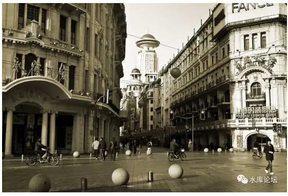
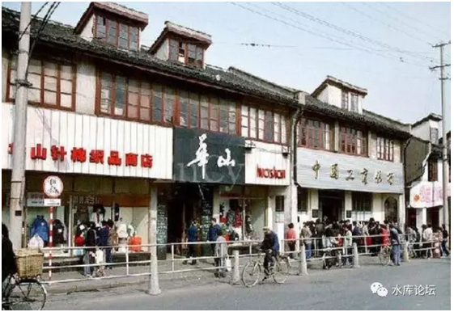
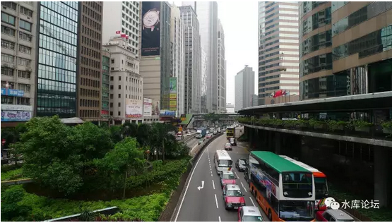
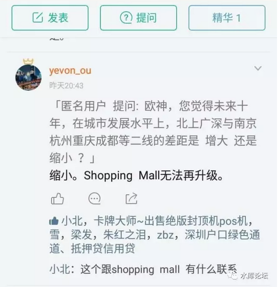
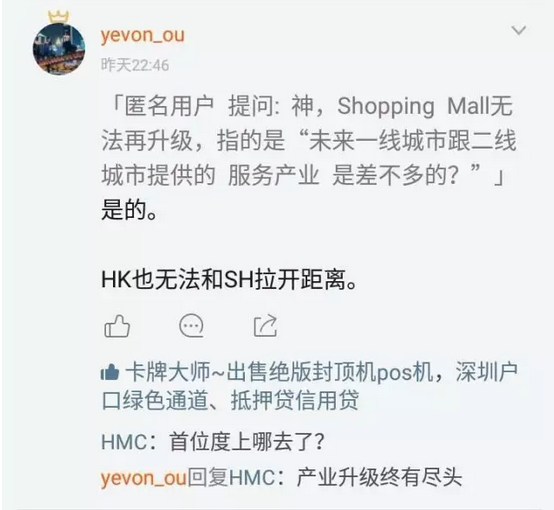
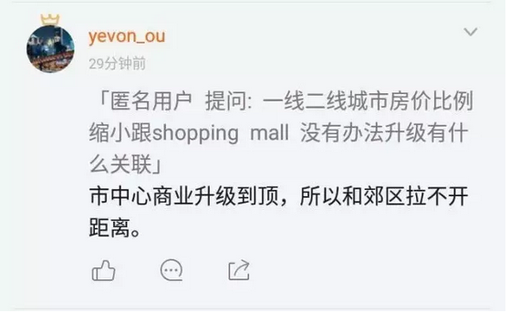

# 当商业升到满级 \#1430

原创： yevon\_ou [水库论坛](/)

**水库论坛**

微信号 Shuiku-net

功能介绍 科学尚未普及

2017-06-06

 当商业升到满级 ~\#1430~
======================================================================================================================================================================================================================================================================

 

 

后发优势

 

 

一）淮海路

 

很久很久以前，全中国只有上海还有供销社。

当时，因为"割资本主义尾巴"，全国所有的物资，实行统一调配。货币形同废纸。

 

全中国唯一还存在"零售业"的，是上海。

上海太大，太重要。还是财赋重地。贸易留了一条小口子。

 

所以外地的同胞要买衬衫，肥皂，热水瓶，都要跑到上海来。

大包小包，满满采购再拎回去。

 

 

南京路上，有民国时期传下来的"四大百货"。石材殿堂式建筑，每一幢都耗资数百万两银元。\[1\]

从商厦的角度，上海远远领先全国。再没有这么气派的"已建成"区域。

 

好了，后来改革开放了。

1979年，深圳特区冒出来了，地王大厦冒出来了，"三天一层楼"成为深圳的地标。

全国各地，沿海城市，省会开发区，都发展起来了。

 

 

 

大约在1984年的时候，又发生了一件印象深刻的大事。

小半个上海都被轰动了。

 

"永安百货"装空调了。

 

对，就是现在商场里屡见不鲜。开到15度冷得你发抖的中央空调。

80年代在永安百货，开始免费向市民提供。

当天，整个商厦就被挤瘫痪了。

 

上海的夏天，十分的炎热，动辄36度以上。

民生疾苦，几乎无法生活。

80年代的老百姓，谁有空调呀。谁见过空调，连电网都不稳定。

全城轰动。

 

 

当时，有一句很流行的话，叫做"孵空调"。

很多家庭，甚至不惜坐二三站路的公交车。专程跑到南京路。

为的不是购物，而是蹭商场里的空调。一直孵到21:00关场。

一身热汗，暑气全消。

 

 

巨大的人流，把整个南京路商厦挤得水泄不通。

哪怕连商场的出口，清一色都摆着几十张躺椅。赤膊的市民。

随着门缝的开闭，偶尔有商场里的冷气泄露出来。能闻到已是甘霖。

 

 

永安公司，仅凭借一部空调。

就笼络了巨大的人流和美誉流，维护了南京路的地位。

这在争夺眼球的今天，几乎无法想象。

 

这是第一轮商业升级。

 

 

 

再下一轮的升级，就要到90年代中期了。

当时，黄浦区的区长是C，卢湾区的区长是H。惯例这二个区是上海No.1，No.2

 

那一年的圣诞节，当你步行在淮海路时。顿时被"铁树银花"惊呆了。

不知从几时起，淮海路的大树上，都插铺了银白色的灯管。

 
灯光如雪花般一闪一闪飘落。有蓝色，有银色。

再加上淮海中路高档商厦的大理石铺面。

香格里拉特有的入门熏香。

"宝贝对不起"太平洋百货千年不变的背景音乐。

整颗心都溶化掉了。

 

 

从那一瞬间起，你突然发现自己，不知不觉从一个石库门里弄的第三世界国家。一转眼间开到了[繁荣富裕]的资本主义国家。

手里提着购物袋，在商场里如飞般旋转。

国际名牌，潮流时尚，美容护肤，灯光展台，应有尽有。

一夜之间跨入中产。

 

淮海路商业开发，是一次重大的升级。

官升高位，是名至实归。

 

 

 

再下一轮的商业升级，又要再等十年了。

终于，财富的增长，从小康迈向了A7。

 
坐在101层的空中酒吧，遥望远方云海，七米高的咖啡厅。

喝着龙舌兰，优雅地谈着几百万的生意。

 

"温饱"都已不再成为问题。你可以静下心来追求一点品味。

追求闹中取静，至臻稀缺。

追求米其林餐厅食材口味的细微差异。

 

五星级酒店，专车接送，私家会所，主厨料理，订制名牌。

这些你都已经足够熟悉，再也掀不起任何激动的涟漪。

 

有时候你在想，物质生活，已经极大的满足。

生活在魔都，就能买到你想要的一切。

 

 

 

好了，再过了十年，到了2017年代。甚至放眼展望2020年。

我们的新一轮商业升级是：

是

是

没有

 

 

没有

什么，什么叫没有。没有啥没有。

没有的意思，就是没有任何升级。

 

金茂大厦，始建于1999年。

SWFC，始建于2008年。

上海中心，始建于2017年。

 

可是上海中心的"生活理念"，几乎和前二幢楼一模一样的。

仅仅是多了几家餐厅，写字楼。

没有任何本质性的改变。

 

 

从1980，1990，2000年代，上海的商业"氛围"经过了三次大的升级。

每一次升级，都和落后者拉开的距离。

市中心魔都的建设，都和郊区拉开了距离。

88层摩天大楼的建设，都和外省拉开了距离。

 

 

可是，最后这十年。

魔都的核心区，顶尖最高档商业区段的升级是，没有

以上全错。

再没有任何升级。

 

 

 

二）升满级

 

很久以前，我就去了香港。当时上海的市容市貌，大致是这个样子的。

 

（徐家汇）

站在香港中环的街头，你的确是承认。

"哎哟妈呀，差距是存在的"。

 

 

香港中环，有著名的"长廊"连接。纵跨四五条横街，连贯整个上环\~中环。

不避风雨，干净舒适。

穿越于太子大厦，遮打大厦，怡和洋行，来往都是ArtDeco，都是欧美国际大牌专卖店，心旷神怡。

 

然后你再回头看看"徐家汇"，差距真心是存在的。

可是二十年以后，你再回去看香港呢。

中环还是中环，上环还是上环，德辅道还是德辅道。

 

和今天的徐家汇相比，中环也没什么了不起嘛。

某些软件细节服务，更用心精致。

但总差距不大。

中环还显旧了。

（2017.05.18香港中环廿二年来第一次新出让土地）\[2\]

 

 

 

那么问题来了，中环为什么不"升级"。

当徐家汇"奋起敢追"时，中环为什么"停滞的二十年"。HK中环为什么不新建改建更美好呢。

我也想啊。

你告诉我怎么做。

 

 

假设现在一个超级大的地产商，李嘉诚或者李兆基。

我给你一块白纸般的地皮，位于中环，或者坚尼地域。

我让你开发，你能造成什么样。

 

答案是[就这样]。

因为摩天大楼，玻璃幕墙。超高大堂，中央空调。几乎已经是现有科技的顶了。

你没法再升级。

没法再造更高档的业态。

 

 

好比玩"大富翁"。一开始是茅棚简屋，每途经过一次，加盖一层。

但是任何游戏，"升级"总有顶峰。

当你造完"豪华商场"，你也升到顶了。

有再多的金钱，也无法Lv up.

 

 

在很多年以前，我就思索一个问题：*纽约，伦敦，香港这样的城市。我们可以追赶得上么。*

北京，上海，最终可以比纽约，伦敦，东京更加繁华么。

 

答案是肯定的。

问题的症结，不在于我们起步有多弱。

而在于强者"停滞"，他没法再"升级"了。

 

 

 

升级这种事，最开始的瓶颈是资金。

譬如80年代，永安百货装一部空调。其他商场不是不想装，是真心装不起。

 

到了淮海路升级，再到了"厨房三件套"升级。此时的瓶颈是：资金+整合能力。

把整条淮海路打造成童话中的乐园，不仅仅需要资金，而且需要品味，设计和整合能力。

 

 

而今时今日，Shopping
Mall简直和钢铁厂一样，成了一种[烂大街]的科技树。

根本不是"大炼钢铁"，死拼钢产量的年代。

而是要多少有多少。随便哪个新城Mall拔地而起的年代。

 

 

（图片摄于徐泾龙湖天街，硬件丝毫不逊色于iapm，妥妥一出手就是100000+/㎡的板块）

当Shopping
Mall如雨后春笋一般，随随便便建几十个。

留给 "一流"商业中心继续升级的空间，已经十分有限。

差距已很小。

很难拉开。

 

 

或许新加坡"立体城市"等概念，是一种发展方向。

超大型的，超过百万人口的立体商业，占地可以超过五十平方公里。

 
但是，按照中国目前的工程建设能力。

哪怕你创新了，再要被赶超，也就是几年的时间。

 

 

 

三）商业顶级后的影响

 

商业升级有"顶"。升级到一定Lv就升不上去了。

这造成了一系列的影响。

 

 

各位，我们知道，在原"升级"过程中，整个城市是一直保持着"尊卑"关系的。

改革开放的最初20年，南京东路，南京西路，淮海路，一直保持着"升级"的排头兵。

他们升级最早，业态最高档。

始终保持着对郊区的领先态势。

因此你有足够的理由，不在莘庄买衣服。赶很远的路来到淮海路。

 

 

 

但是，一旦"升级"停止了呢。

七宝生活广场的人流，已经超过了老牌的浦东八佰伴。

 

"升级"停止，对于地段的碾轧性优势，就是极大的隐患。

虽然郊区品味，购买力，大娘水饺，和市区银座还有相当大的距离。

但硬件已经追上来了。

 

上海接近香港，莘庄接近上海，南昌接近莘庄。

 

 

 

"升级"停止，最终将会使得整个城市扁平化。

地段扁平化。

溢价扁平化。

宏观趋势，无可阻挡。

 

 

 

另一方面，从更大的角度来讲。

"人类文明"既然到现在没有进一步的突破。类似于"飞行汽车""反重力城堡"一个都没有实现。

 

那么你一个城市的发展，就终究是有上限的。

伦敦纽约，迟早被北京上海赶上。

 
北京上海，又会逐渐被"成都重庆"赶上。

 

这无疑会对房地产市场，楼价升伏，造成重大的影响。

 

（yevon\_ou\@163.com，2017年6月6日午）

 

 

 

 

[\[1\]]先施百货耗资200W鹰洋，一般认为1银元=300 RMB

\[2\]《楼面价54万港元史上最贵恒基地产232.8亿港元拿下香港双料"地王"》http://www.ce.cn/cysc/fdc/fc/201705/18/t20170518\_22950924.shtml
