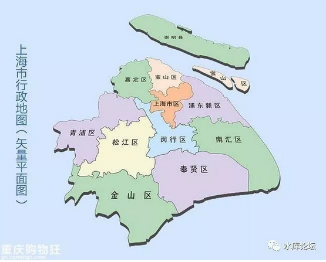

# 把商铺干掉吧 \#1550

原创： yevon\_ou [水库论坛](/)

**水库论坛**

微信号 Shuiku-net

功能介绍 科学尚未普及

2017-10-16

 把商铺干掉吧 ~\#1550~
===============================================================================================================

商铺的本质是什么？

 

 

 

一）导购

 

昨晚上吃饭的时候，又演化成了吐槽大会。

当一个江浙人，剥着超级难剥的厄瓜多尔虾，实在难以想象北京人都生活在水深火热之中。

这虾这么难吃，奄奄地壳都黏在肉上。肉质完全没有Q弹，更没有清香。

放在江浙，当死虾都卖不出去。

 

 

业内心知肚明，最近的"新零售"革命，基本都发生在包邮区。

例如无人超市，盒马生鲜，外卖机器人，海鲜活送......

整个华北平原，北京还剩一家掌鱼生鲜（美团搞的未来体验店）。其他就是一片荒芜。落后了整整半代。

 

 

话说前二天，"x府井"百货搞出乌龙。

你去"x府井"百货买东西，店员会告诉你，本件商品在天猫旗舰店也有同款。建议你在天猫下单。

走上门的生意，反而还要推出去。宁死不做。

 

其背后的原因，x府井的收费模式，是"销售分成"。

在x府井百货卖的任何东西，要集中到收银台付款。商场抽走20%。这也是传统百货公司的标准做法。

但是商家不乐意了。客户进门，您点天猫链接吧。

直接送到您家里。飞单跳掉。

 

x府井的对策，是派出大量的"探子"。伪装成顾客前去购物，一旦发现有"飞单"到Alipay的做法，就扣款，罚钱。

罚销售额的100倍。

 

 

X府井的做法，本来无可厚非。因为"百货公司"的店面租金，有二种收法；

1）固定租金。所有的万达广场，都是固定租金。

2）销售分成。这样的好处，随商户共成长。初期商户易存活，后期多分利润。

 

 

今天我想讲的，并不是"百货公司"落后形态的争执，孰是孰非。

毕竟，"罚款100倍"肯定是岔路。

靠固步自封的手法，否认新时代，是无法挽救x府井的。

 

我想问，商铺该如何改？

 

 

 

二）商铺

 

很久很久以前，俺思考一个问题。

 

我们做地产的，总不可回避房屋的"品质"。

这房子，地桩打多少米，钢筋密度，水泥标号，绿化树龄，车位比，有没有裂缝，漏不漏雨，是不是海沙楼。

"质量"是房价重要一环。

 

 

可是，你把这眼光，转移到"商铺"上时，就完全不适用了。

俺常年来思考一个问题，

 

为什么南京路上的商铺，要比崇明岛贵那么多

 

上海有记录的商铺交易，2003年南京东路置地广场220000/m

那还是03年，钱比现在值钱得多。

崇明的铺，呵呵，220000/套。 

同样都是"铺子"，他们的价值差异在哪里。

你要说"品质"，我完全可以做到"品质"一模一样的。

 

四壁都用高等级的钢筋水泥建造。一进门全套大理石铺地，盖上厚厚的天鹅绒地毯。层高5米，气派的落地窗，镶金的。空调和灯光永远打到最合适的温度。还有一个特漂亮的气质小姐，"MayI
Help You"。

https://v.qq.com/x/page/f0354nbbm9e.html

然并卵，哪怕你做到了这一切。"品质"方面超一流。

崇明铺依然不值钱。

 

很多人条件反射地回答，铺子的区别，关键是"地段"。

南京路的地段，和崇明岛自然不能比。

 

那么，我继续问，"商铺地段"的本质是什么。

你仔细想，本质是"流量"。

真正的区别是，走入店铺的人数。

 

 

在南京路上，可能每分钟都有十几个客户。改革开放初期，曾经创下摩肩擦踵，手帕掉地上，捡不起来的故事。

而在崇明，老板娘哈欠连天。拿机关枪都扫不到人。

 

除了数量，"质量"也很重要。

南京西路的铺位，要比南京东路更值钱一点。是因为南西的人口购买力更高。

 

 

现代电商的竞争，电商做的其实也是"流量生意"。

电商的存在。相当于在南京路的隔壁，又多了一条"南海路"。

客户可以逛南京路，也能逛南海路。

 

2000年初，有人曾经提出，"电商可以极大地降低商品价格，因为没有昂贵的店铺租金"。

激进分子，有鼓吹降低三成的。

 

可是后来的事情发展，我们知道，并不是这么一回事。

电商一开始的发展，亏得很厉害。等电商们最终站稳脚跟，价格也没比实体店便宜多少。

 

 

为什么，为什么，我问你一句至关重要的话：

"电商的价格再低，能比崇明的商铺更便宜么"！

 

崇明的商铺，[价格已经接近于零]。在成本结构中，占比微乎其微。

可是崇明的商铺，[为什么没有击败南京东路的旺铺。人们为什么不涌到崇明去买东西。 ]

 

"电商致胜论"的一代人，犯了一个错误。

  他们以为的成本：   产品+店面陈列=崇明铺
  ------------------ -----------------------------
  真实的成本：       产品+店面成列+流量=南京路铺
  电商后的成本：     产品+网站+流量

 

 

其中"流量"这一块成本，是省不下来的。

 

淘宝上有几百万卖家。凭什么买你，凭什么买你。

这是靠流量买路钱"封推"，推上去的。

 

互联网上有几亿个网址。凭什么点JD.com，凭什么用美团旅游，阿里飞猪。

那是靠电梯里的广告，狠狠砸出来的。

 

 

因此，我们回答了一个业界长期困扰的问题："电商可以降低成本么，电商能大降价么"。

 

答："电商可以降低的，是崇明铺的造价"。

 

 

 

三）变革

 

 

财富增加得很缓慢，财富转移得却很快。

\-\-\-\-\--yevon\_ou

 

 

人类的财富，增长十分缓慢。例如欧美等国家，每年GDP +1%

但是，财富的"转移"，却是非常非常迅速的。

 

好比数码相机出现以后，淘汰了传统胶卷。

从消费者"体验"来说，是进了一小步。

 

可是对于佳能，尼康，柯达等公司来说。

就是柯达的几百亿市值烟消云散。转移到了佳能，尼康，莱卡等公司身上。

 

iPhone取代诺基亚。对于消费者来说，也只是智能机10%的效益提升。

可是对于Nokia来说，就是数百亿美元的市值耗散。转移给了Apple。

 

 

 

电商的出现，使得"流量"聚焦发生了转移。

以前人们要去到步行街，黄金地段，才能找到最新，最潮，最in的科技产品。

而现在，入口是移动互联网。

 

消费者购买一台冰箱的价格，可能仅仅下降了3%。相当于在远郊区兴建一个Shopping
Mall的价格。而且.com本身也有程序员成本。

 

但是冰箱的3%，对于"步行街商铺"来说，就是千亿百亿市值不见。

相应的股价，加到了马云爸爸的头上。

 

流量没有了，"南京路"旺铺就不再值钱。

如果完全没有人，南京路就会沦落到和崇明铺一样的价格。

 

在第三节，我想说一说，"未来的商铺"。商铺，商业，x府井百货，如果要变革，应该如何构思。

 

 

 

首先，我们要吐槽槽点。

任何商业的改善，任何百亿级的机会，都是从"槽点"开始的。

消费者有不满，哪里才有商机。

 

我的槽点是，"陪女人逛街"，太累了。

作为一个上海男人，垂头丧气，大包小包。左手二袋衣服，右手二袋鞋子，胳膊肘下面一袋面包，脖子上还挂着女士手提包。

我的腰都快要断了！

 

 

长久以来，作为一名男性，我不得不对"女性逛街"具备巨大的吐槽。

为什么，为什么，鞋子要拎在手上呢。

为什么不能在店里看好。封包，装箱。你叫一个美团，京东，或者闪送。直接送我家里呢。

2000元的衣服都买了，商家出20元快递费没啥大不了。纸板箱很重呀。

 

我的支付宝上面，默认捆绑了地址。

为什么商家不能出示一个二维码，扫一扫，递送默认地址呢。

 

更进一步，为什么这款，店里面一定要有备货呢。

我买哪个型号的PS4，DJI，果多美，不需要看实物的。你直接送我家就行。

轻装逛街，多买几件。

 

 

 

如果我们往深处想，一座商场，他其实提供了四种功能：流量，展示，销售，提货。

 

流量：链家不惜成本，租下各个街角的双边铺。让一群呆子坐在里面看电脑。其实链家买的是"Walk
In"客户。

 

展示：在VR出现之前，商场无可取代。餐饮永不可取代。

 

销售：电商可做到

提货：仅限于部分产品。

 

 

在远古时代，没有电脑，百货公司代表着"最先进"的商业形态。

因为它把四大功能集中在一身。实现"我来了，我看见，我买了"的一站式购物。

 

可是时代变了。

百货公司的经营者，还停留在"蒸汽机"时代，亘古不变。

 

 

四大功能：流量，展示，销售，提货。

其中至少有三个，技术已经革命，可被电商取代。

 

唯一不可或缺的，电商的唯一短板，是"展示"。

 

 

 

四）未来的商铺

 

未来的商铺，最重要可能是"展示"功能。

 

 

因为不再需要"流量"。黄金地段步行街的百货大厦，渐渐得会变得没有意义。

口耳相传，"网红店"会窜起更快。

 

当不再需要"Walk
in"步行流量，未来的"商铺"，完全可以置身于摩天大厦的写字楼中。100层楼，凌云高空，购物体验更佳。

 

现在很多牙科诊所，美丽田园，按摩SPA，甚至珠宝展卖，都已经搬到高档写字楼和酒店。

只要他们可以从"网络"中汲取客源，而不再依赖街边行人。

 

 

另一方面，现存的商场，其内部结构，必需进行全面的改装。

人类实在已经厌倦了4.5米的标准层高，三楼女装，四楼男装。格成了一件件格子铺，象豆腐块一样的商场。

 

为什么，就不可以把商场设计得象迷宫一样呢。

为什么不能有6米层高，9米层高，12米层高呢。

 

人类对未来，有许多的幻想。

例如，我们都很希望象印第安纳·琼斯一样，穿过茂密的热带雨林，来到神奇的玛雅宫殿，喝下一瓶圣水，然后坐电梯飞跃80层楼。到云端是太空和神界。

 

 

我们从来没有这样的商业业态，是因为我们需要"卖货"。

需要一件件衣服密密麻麻挂起来，后台一半都是库房。

 

但是，如果你把整个逻辑链倒过来。商铺就是给你"体验"的，所有的卖货，都在扫码端实现。

商铺就是一个Cost Center。

 

则我们的商铺，可以变得非常非常之有趣。商家想尽一切办法，就是为了有趣。你体验得好，你才会购买。

 

在法老蒙特祖玛的权杖上，有一个二维码。

那个野性豹女的服装，把你看呆了。想不想买一件回去，教训你男朋友。

圣水的味道怎么样，其实山间泉水也可以接的哦，流淌着可乐味。

对"祖玛冒险"这个系列感兴趣了，相关的IP也可以大卖。

 

 

*在这个剧烈变革的大时代，为什么我们对商铺交易，还征收60%的重税呀！*

 

 

 

（yevon\_ou\@163.com，2017年10月16日暮）

 

 

 

 

和大家说二件小事：

 

1）分答付费社群，从10.24开始，将进行降价，至199元。

因分答是固定期限，到12.26结束。有效期只剩二个月了。

 

降价到199，使你仍然可以问几个急需的问题。

但时间就比较短了。 

2）我为季老湿写了一篇序。他的书，封面大致是这样的（还没出版）。

有一篇介绍季老湿的业务，我放在了次文。
