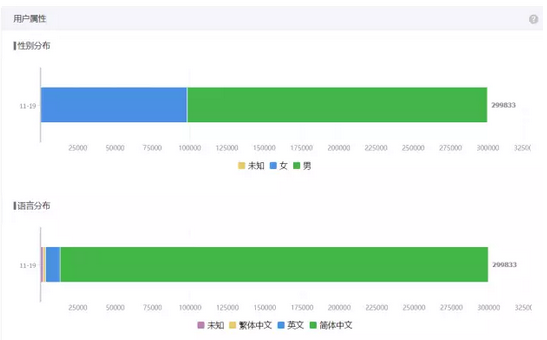
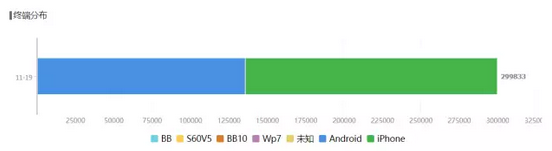
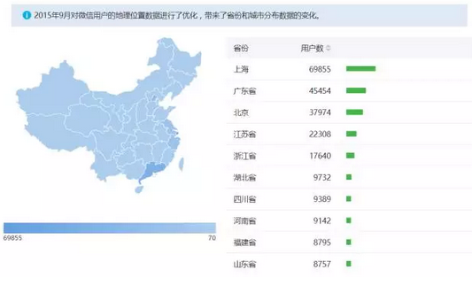
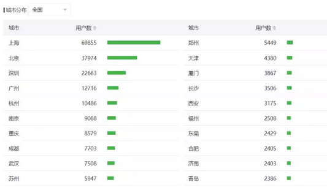

# 水库微信号分析2017版 \#1590

原创： yevon\_ou [水库论坛](/) 2017-11-20

水库微信号分析2017版 ~\#1590~

 

2017年11月20日，"水库论坛"微信订阅者超过300000人。

对于这个里程碑的事件，插播一篇。

 

本篇和楼市无关。但如果你是立志写"公众号"的，或者广告商，有参考价值。

欢迎投放广告。

 

之前也有一篇《[水库微信号分析](http://mp.weixin.qq.com/s?__biz=MzAxNTMxMTc0MA==&mid=2651015030&idx=1&sn=a89316a47b4c1db49ab7e126629417f8&scene=21#wechat_redirect)》，写于2016-09-07.

 

 

 

一）入行

 

我对于"媒体"的力量，一开始并没有了解。

象哥哥这样的低频用户，能让我拍案叫好的"文章"很少。我也很少打赏。更不会去买文章末页的广告。

 

"微信"兴起了二年多，到2013年12月，哥哥才注册微信账号。

微信最早的一波流量"红利"。号称随便开个公众号，都能百万粉丝。这一波风口，俺并没有赶上。

 

哥哥当年，虽然是Marketing科班背景，可是并不了解"媒体"的力量。

 

美国信用卡业，有一句著名的谚语，"我们比你更了解你自己"。

譬如你步行经过"多乐之日"。信用卡公司，可以精确地计算出，你会进去买二个面包的概率是1.23%

如果发你一张优惠券的话，概率是2.46%

 

可是我自己不知道。我一直以为概率是0%的。

 

 

这就是一个巨大的bug，我一直以为"微信公众号"毫无用途。

文末的贴片广告，对我来说，价值为0

可是我没有想到，它的真实价值是1.23%

 

1.23%乘以一个几十万的基数。

就是一笔巨大的金钱。

我对力量一无所知。

俺真正知道"公众号"，因为一个好友，shinehigh。

shinehigh开了一个公众号，就是著名的"上海房地产观察"，简称SPI。

 

有一次我和shinehigh聊天，shinehigh愤愤不平地说，他现在有24W粉丝，其中17W分布在上海。

很多号称"百万级"的大号，因为是全国性的，平均分到每一个城市也不多。上海市场的渗透率，或还没有他高。凭什么广告赚那么多钱。

 

我随口问了句，"你一个月赚多少钱"。

他说，"20几万吧"。

哥哥一口水喷了出来。

 

 

 

SPI的特点，是著名的"番茄炒蛋"体。

用最最最大的字体，

"惊爆，周浦地王8W保本"

"突发，虹口凉城拍出15W保本低价"

 

他的每篇文章，都是"惊爆，突发"。可是并没有太多的"深度干货"。

总体来说，就是一个广告号。

 

 

据说在Brazil，有二家电视台。24小时滚动地只放广告。

没有任何电视剧，没有任何采访，没有任何工作人员。

它就是放广告。

 

这样的电视台，居然也能活得下来。

也有人看，也是一种商业模式。

因为有人就是需要看广告，需要从广告中获得第一手信息。有人看，就有流量。

 

 

在房地产这个圈子，shinehigh经验应该是不如我的。

俺很早就是大神，从2004年写《人民币面临巨大的贬值压力》，大排面迟早30元一碗，便已奠立江湖地位。

 

只不过，一开始我是在10000人中，有很高知名度。

后来是100000人中，有很高知名度。

再后来是300000人，都知道水库。

水平始终很NB。

 

 

我真心不知道"公众号"这么赚钱。

看SPI赚这么多，俺都眼红了。

 

20几万虽然不算什么大数字，一年也就200多万。

可是哥哥极度缺乏现金。

 

我的房产操作，属于"大面积，低单价"。

彻底放弃一切流动性，死捂死多头的流派。

这个流派，极度缺乏现金。手里大把资产，可是大户型很难变现。

 

哥哥每个月被房贷逼得死去活来。反正男人当牲口使，我也开个号吧。

 

 

 

二）水库

 

"水库论坛"的微信公众号，是2015.02.18首发的。SPI取经后的不到一周。

日期记得很清楚，2015年的除夕夜，围炉夜话翻禁树。

 

 

"微信公众号"赚钱的金光大道，走得怎么样。

当然是：惨败

 
如图，蓝色这条，是"最近一年"的。

绿色这条，是"第一年"的。

 

水库花了整整一年的时间，一直到2015.11.28，才攒满了"一万粉"。

实现了0到1，

业内所谓的"冷启动"。

 

在这段时间内，我大概写了90篇文章。把第一卷"楼市分析"写完。开写第二部分"宏观调控"。

 

然并卵，有人看么。没有。

 

今天我们看到很多朋友，后台天天有人留言说，"早认识水库就好了"

"少赚了几千万"。

 

事实也的确如此。从2012年Shuiku.net的BBS开业。

最早的一批老网友，普遍赚到了A8以上。

最传奇几位，例如xingu，已经创立了自己的公司。

问导师借钱十五万元开始，逼近A8.5

 

 

然并卵，水库第一年的数据，是惨不忍睹的。

再好的内容，没人看，就是没人看。

这充分证明了互联网上，品质并不是主要的。分销才是主要的。

 

 

水库攒第一个10000用户，用了283天。

攒第二个10000用户，用了137天。

 

我看了一下，这一天的编号是《[香港楼市崩盘始末](http://mp.weixin.qq.com/s?__biz=MzAxNTMxMTc0MA==&mid=2651014541&idx=1&sn=76e1d17adbd1cb341828faccbdb23a20&scene=21#wechat_redirect)》\#980

差不多第130篇文章。

40万字的输出。

 

 

但是，接下来就快了。

从表格中可以看到，从20000起步，一直到3万，4万，5万，8万。

只用了半年的时间。

 

2016.11.27，也就是一年前，受《人文经济学会》邀请。我在清华科技园作《[中产阶级如何保护自己的财富](http://mp.weixin.qq.com/s?__biz=MzAxNTMxMTc0MA==&mid=2651015300&idx=1&sn=b33d804f1c0495327b3e899e83574930&chksm=80721e97b70597819a2451d5eefffa736cb7a0c4929e067e9b239df0c6edd1883315ab658744&scene=21#wechat_redirect)》讲座。

记得非常清楚。讲座开场前一分钟，粉丝量97000人。

 

讲座当天和次日，净增了6000粉。

唯一一次，9天涨一万粉。

感谢茅于轼老师，感谢周克成。

 
2017.01.01元旦之时，我犯了一个错误。当时水库的粉丝数，大约在125000人。

是上一年元旦的十倍。

 

因此我提出了2017全年，水库再增长十倍，达到100W粉丝左右。

后来出了纰漏。目前看2017.12.31目标度，应该是在330000粉左右。

 

 

写这一节的意思，是为了告诉读者，"风雨过后总是彩虹"。

 

我写公众号，自以为文笔还算可以。

有噱有料，起承转合。可是当我写了一年半以后，我都快"绝望"了。

 

当我写了近130篇文章，篇篇精华。

可是依然只有20000读者时。我是快接近绝望了。

 

只不过心中不愤，为了想把"炒菜学"完完整整地写出来。

并驳斥"宏观调控"的经济学谬误。

才努力坚持了下来。

 
三）微信大船

 

前文写道，2017.01.01元旦时，俺雄心勃勃，一心想按指数增长。

可是2017年并没有达到目标。125000---\>330000，大概也就增长了三倍粉。

 

这里面，是业外人士不明所以。

业内人士大祸临头。

 

微信大船要沉

 

嗯嗯，就是微信大船要沉。微信要完蛋。

曾经一度，我们以为Wechat是不可击败的。我们每天泡6个小时在微信上面。聊天是高频应用，各种微信群建立了人际关系，黏性极大。

 

 

我们看回之前那个"粉丝"增长表，大约从2017年5\~6月开始，数据出现了反弹。

由16天增长10000人，放缓到24天。

 

 

水库卖的是"品质"。

在纷纷扰扰千千万万天底下的公众号中，水库一没有背景，二没有烧钱。当99.9%公众号无以为继惨淡收场之际，水库越活越好，日渐强大。

 

这背后，水库卖的是"品质"。

任何一个人，只要他接触到水库。打开三五篇一看，顿时眼前一亮。

打开十篇八篇之后，猛地一拍大腿，今天晚上估计要通宵了。然后就是废寝忘食地看下去。

 

 

水库的模式，和灌水平庸的公众号不同。

有些公众号，能有百万订阅，纯粹靠"地推"。在平面媒体上，砸大量的钱和广告做推广。圈来大量粉丝。

但是打开量和阅读量都很低，更不可能有粉丝向身边好友，亲朋推荐。

 

而水库卖的是品质。

我们默认，"传播速度"是和"粉丝数"成正比的。

水库应该以二次方速度在增长的。

 

 

我们看回5月6日，那一期，增加10000粉丝，用了足足24天的时间。

换算下来，哥哥每一天偷懒睡醒，只增加400粉左右。

 

而之前的2016年12月，哪怕水库只有八九万粉的基础上，每天自然增长却可以达到1000人。

为何粉丝基数越大，增长却反而放缓了？

 

这是一个非常非常明显的信号。"微信不行了"。

 

 

原理，其实和五六月份的"整枫运栋"是分不开的。

五六月，微信封掉了大批的账号，诸如"毒舌八卦"都封了。剩下的，也人人自危。

相对应的，*给人民传递了一个信号*，则是"老大哥在关注你"。

 

之前，大家转发朋友圈，是很随意的。

朋友圈是一件很私密的事，想说什么就说什么，甚至象一个树洞。

 

之后，人们飞快地立即意识到，"领导在看朋友圈"。

如果你公司领导，企业领导，风气建设部门，在关注你的朋友圈，那你应该干什么。

 

 

Bingo，朋友圈迅速地沦为"心灵鸡汤"，晒娃狂魔，美食旅游，以及一切[政治正确]的东西。

这件事情，是在"潜移默化"中完成的。虽然没有任何人，明着讨论这事。

但几乎所有的人，都默默地"收紧"了朋友圈尺度。

 

更糟糕的是，随之，微信又发布了"只看三天""只看半年"的朋友圈新功能。

于是进一步的"面具化"。

朋友圈，再也不是敞开心扉的交流之所了。

 

 

随着微信的"政治正确"化，微信对个人的吸引力，也急剧降低。

我们可以忍着恶心，每天只贴心灵鸡汤。

可是谁愿意天天刷朋友圈，看鸡汤晒娃美食呢。

 

微信的黏性急剧降低。随之，则是各个平台的兴起。

 

 

 

四）多平台策略

 

水库在2017年6月，开始和"分答"合作，并开设了一个"分答付费社群"。

这其实是笔亏本生意。

 

给屌丝理财和咨询问题，往往会把你气死。

才收299元的社区，动辄写篇1500字的"家庭财务报告"。我有xx房产，xx收入，xx目标，"请问老师这种情况应该如何理财"。

 

我恨不得把报告卷起来，扔过去，砸你脸上。

这么长的报告，就该支付专业的咨询报告。通常收费在5000元以上。我才收你299，屌丝真的要榨干每一寸剩余价值啊。

 

 

当年，分答说服水库的最主要一个理由是，"分答有1200W用户，而且80%分布在三四线城市"。

 

为此，我们先看一下水库的统计报告。

我们时常说"北上广深"。

你看这个统计报告，上海+北京+广东省=50%，已占了一半以上。

 

如果算城市的话，前10大城市，共有192500人，占比64%

前20大城市，占了75%

 

"只有大城市，才有房地产"并不是一句虚言。

从水库粉丝数的多少，大致可以看出一个地区房地产市场的强弱。

 

其中值得重点一提的，是"天津"。

天津只有4380粉，排名第12位，比郑州还低。和他"哏都"地位很不相衬。

间接代表了天津经济不行。

 

 

当年我们和"分答"谈合作。分答一个富有吸引力的建议就是：

"微信大船要沉，仅仅靠微信吸取流量，已经无法进一步成长"。

 

水库在"北上广深"四个城市，合计有143000读者。

上海的陆家嘴，金融业从业人士，大概在50W人左右。

全市的"白领"估计在200W人数量级。

北上广深，白领总计，约800W人。

 

143000，就是2%的"渗透率"。

这个比例其实已经非常非常高了。如果你能有10%的渗透率，就可以说，办公室一定有人讨论水库。

 

 

我们有知识的人，一定知道"边际效益递减"。

前二天水库发篇文章，微信统计1200人"转发朋友圈"。

可是增长了多少粉丝呢，600人不到。

 

为什么，因为这1200次转发，往往是"近亲繁殖"。

你看手机，觉得泪崩已经刷屏了。满屏满屏都是"[亲爹给你的教育](http://mp.weixin.qq.com/s?__biz=MzAxNTMxMTc0MA==&mid=2651016275&idx=1&sn=3d522dc65e73870da2d13fe19c3c9931&chksm=80721a40b705935646c84c6950e7f35507118d06aca8b4d2d0e02e8f27999664eceed2a7cb43&scene=21#wechat_redirect)"。

 

但其实，你们都属于同一个圈子。

"圈外人"感知并不多。

感动至深，刷屏严重的文章，不一定涨粉。

 

（[大城市的生生死死](http://mp.weixin.qq.com/s?__biz=MzAxNTMxMTc0MA==&mid=2651016294&idx=1&sn=88ce816361e870250a585bef0346436b&chksm=80721a75b70593636c44f51b4006ae267274fa2406bc7dde49eed6a84be7634f3fe19ff01d59&scene=21#wechat_redirect)，被陈经一转发，就吸来2000证券粉）

 

 

要增加销售额，就一定要开拓新的市场

 

分答给出的价码，你不是75%在"前20大城市"么。

分答1200W用户，而80%在三四线城市。地级市和农村。生态疏远，互补。

 

你想要扩大粉丝基数，收费就只能固定在299元。

在三四线粉中，再"转化"人口，购买你更高定价的产品。

 

 

顺便说一句，象"咪蒙"这样的账号，号称有1000W粉丝。

"吴晓波频道"有350W粉。

"罗辑思维"有800W粉。

 

在中国，一旦你一个号，粉丝数超过了100W。

你就一定要"渗透"三四线市场。广袤十亿人口的内陆，才提供了巨额粉丝基数。

 

 

"北上广深"一共才8000W人口，月薪高于一万的"白领"，满打满算不会超过800W。

在800W白领中，你要穿刺到5%的渗透率。可谓千难万难。

象"水库论坛"目前有143000"一线城市"粉，渗透率2%，已经非常非常厉害了。

 

 

另外一方面，账号还有一个"含金量"的问题。

三四线的粉丝，人数再多，支付能力和支付意愿都上不去。这样的"粉"，估值很低。

某些千万级的大号，收入比水库多有限。

 

 

 

五）进一步的合作

 

2017年下半年，水库陆续和分答，功夫财经，磨铁展开了合作。

 

《功夫财经》由王牧笛创办，时寒冰，王福重等大咖坐镇。

虽然同为财经媒体，但是《功夫财经》的用户基础，和"水库"大不相同，几乎毫无交集。

 

前二天我在功夫财经发了[\#D01](http://mp.weixin.qq.com/s?__biz=MzAxNTMxMTc0MA==&mid=2651016404&idx=1&sn=b7d7ed581f908756b89a8af82798baad&chksm=80721ac7b70593d1697232d5eeab37cffa44f4cf3bb7fd3fb5229d859ae25344ffebbb5797a5&scene=21#wechat_redirect)，\#D03二篇原创。轻松突破了100000+

这样的十万加文章，在水库波澜不兴，几乎没有人知道。让人不由不感叹，互联网的世界广袤无垠。

 

希望和《功夫财经》的合作，能够更快地拓展水库粉丝基础，达到"读者多样化"。远亲繁殖，互导增长。

 

 

同样道理，很多朋友知道我在五月出了本书：《[中产阶级如何保护自己的财富](http://mp.weixin.qq.com/s?__biz=MzAxNTMxMTc0MA==&mid=2651015799&idx=1&sn=e8078b24a04e9bf1a526a2f7f838618c&chksm=80721c64b70595728c720106f1f7fc508fd5f704412fdc1bb98be42ed39db439104f5e172b72&scene=21#wechat_redirect)》。财经类书籍，销量冲十万册。在当今的纸媒世道，遥遥领先。

 

下半年预排了第二本《[什么才是真正的财富](http://mp.weixin.qq.com/s?__biz=MzAxNTMxMTc0MA==&mid=2651016446&idx=1&sn=9fd0d6e59c7493553733e13ade3a2eef&chksm=80721aedb70593fba9fd6c4a777397863701da107f5fa36d7671e2e0e2d4d6886c32e7834365&scene=21#wechat_redirect)》，其实就是2017年的所有文章集合。磨铁拉着我的手，苦苦哀求，要增加四篇"独家原创"。增加卖点。

请多多买书哦。

 

 

和磨铁的合作，看中的是另一点。磨铁走的是"新华出版"的渠道。

我们目前无论微信，分答，功夫财经，都是"移动手机端"，都是互联网的渠道。

 

移动互联当然是未来，时代颠覆无可阻挡。

但你有没有想过，中国还有大量的人口是"不移动"的。

 

中国还有大量的内陆省份，人们依然习惯于传统的"书籍"。传统仍是主流。

这样一个渠道，要靠"新华出版社"来触及。毛细血管。

 

我本身并无意于"书籍"的收入。版税和稿费都是小头。

但是十万册深入内地（约75%），就是新增了75000用户。这些人，可能之前从未接触过水库。

却能转化为水库用户。\[1\]

 

 

但粉丝数停止增长时，你必需很主动。

你必需主动出击，跳离"舒适区"。去野外觅食。去蛮荒异大陆圈粉。

成功就象怀孕，每个人都恭喜你。没人知道背后你有多努力。

 

{附图}

 

 

 

六）寡头时代

 

最近俺手贱，统计了一下近半年来，所有"点赞"过的微信文章。

俺惊讶地发现，这些文章，都有一个共同点。

几乎每篇文章的阅读，都超过了60000+

 

这意味着什么，意味着群众逐鹿时代的终结。

曾经在"野蛮生长"年代，随便个人都可以开公众号。什么文章都有人读，有人转。2015年我看过的小众文章，阅读量平均15000左右。

 

 

而今天，整个"微信公众号"生态，流量急剧向头部集中。

和所有的行业一样，只有职业的才能活下去。

滴滴司机都淘汰光了，剩下的都是五星。

 

 

整个"自媒体"生态，在急剧洗牌。就象淘宝升级到Tmall一样，未来只有第一流的账号，才能活下来。

你必需跑得非常快，跑到行业No 1，No 2，你才能活下来。

 

幸运的是，目前在"房地产"分析领域，水库是绝对的No
1，遥遥领先其他大V。\[2\]

引用《朱雀记》的一句话，"除了网监，我们谁也不怕"。

 
目前你看《新榜500强》的话，第一名是《人民日报》，其次是央视新闻，央视财经。

在前500名中，大约有250名是"中"字头的。

经过了几次封号，民营账号，已经所剩无几。

 

剩下的，只有"咪蒙""吴晓波频道""金融八卦女"，也如风中之烛。

唉，世事艰辛。不谈了。

 

 

（剩下还有半篇，"水库变现之道"讲流量如何赚钱的。不准备贴了，准备发在磨铁的新书里）。

 

 

 

（yevon\_ou\@163.com，2017年11月20日晚）

 

 

[\[1\]]出书的另一个好处，以后开家长会，"职业"一栏终于可以填"作家"了。

\[2\]中国广告法规定，只能写"遥遥领先"。
