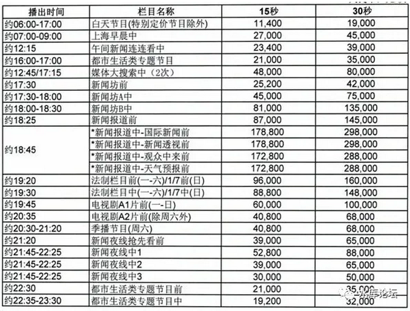
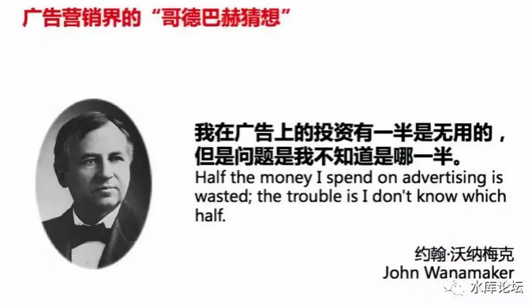

# 广告学入门（上） \#1640

yevon\_ou [水库论坛](/) 2018-09-06

广告学入门（一） ~\#1640~

 一）前言

 

前二天"磨铁出版社"向我索要稿子。他们说，

"欧大，您去年出版的《[中产阶级如何保护自己的财富](http://mp.weixin.qq.com/s?__biz=MzAxNTMxMTc0MA==&mid=2651015300&idx=1&sn=b33d804f1c0495327b3e899e83574930&chksm=80721e97b70597819a2451d5eefffa736cb7a0c4929e067e9b239df0c6edd1883315ab658744&scene=21#wechat_redirect)》，在财经类榜遥遥领先。可只甩开了第二名2倍不到"。

 

太丢脸，太Shame了。

因此，您今年出版《[什么才是真正的财富](http://mp.weixin.qq.com/s?__biz=MzAxNTMxMTc0MA==&mid=2651016446&idx=1&sn=9fd0d6e59c7493553733e13ade3a2eef&chksm=80721aedb70593fba9fd6c4a777397863701da107f5fa36d7671e2e0e2d4d6886c32e7834365&scene=21#wechat_redirect)》，您必须给我们出版社，免费，独家，特供，写三篇文章。

 

 

我想了半天，要不我再给你们写点Marketing吧。

Marketing的精要，属于五百强的不传之谜。

 

中国企业，在1980年代，历来以老实巴交出名。

中国吉林省的老山参，出口到韩国，论箱算的。封箱前，往往还要再塞二条进去。生怕鼓得不够饱满。

 

可是人参到了韩国之后呢，韩国人把每一支人参单独称重，检测重金属含量，分门别类甄别等级，附上一张倍有范的证书。

价格加个零，论支卖，再出口回中国。

 

 

"经销和营销"是高附加值活动。我们常常叹息，中国企业操白粉的心，赚白菜的钱，几亿条裤子换不回一架飞机。这其中，"品牌和营销"占了很大一块。

国货想要崛起，固然要靠科技和质量，但是"营销"同样重要。

 

遗憾的是，因为商业文明的长期缺失。资本主义手艺的断层，在1980年代，中国国内关于"Marketing"的知识并不多。

乡镇企业家，还停留在"点子大师"，骗子狂人的年代。

 

 

1990年代，外资500强开始进入中国。P&G，Unilever，Cola-Cola，Danone等一系列世界一流的品牌，落地生根。

虽然中国籍的员工，始终存在"玻璃天花板"现象，升职慢薪水低，饱受歧视。但是Marketing的心法，外资企业怎样经营品牌和诀窍，却也渐渐地流传开来。

 

当90年代初，MNC刚刚进入中国时。他们面对本土品牌，几乎是"横扫"的态势。

外资品牌不断侵蚀市场份额，国有品牌一败涂地。

 

每一年开会，一个市场份额2%的公司，面对另一个3%的外资公司。高层指示，"这是我们的主要竞争对手"。

另外95%的Local公司，华丽丽地被无视的。

 

 

这样的一个局面，一直要到2005年之后，才开始有所转机。

第一轮，在外资席卷狂潮下的"原国营"企业，是一败涂地。割地三尺。

 

第二轮，击败外企的，却并不是另一批国企。

而是当年如小虾米一样，蝼蚁一般弱小的民营品牌。

真功夫，味千拉面，永和大王，黄焖鸡米饭，面对肯德基麦当劳，已经毫不逊色。

 

这些"民营"民族品牌的兴起，恰恰很多都是当年外企的"弃徒"。

他们从外资企业离开，就带走了全套手艺。

 

 

哥哥在外企待的年份不长，最大的遗憾，只接触到了"经理"级的套路和手法。

而对于"总裁"级的企业秘籍，一无所知。

 

今天我写一点Marketing"秘术"出来，贻笑大方。

在真正的高手眼里，实在丢人。板砖务必轻饶。

 

 

只不过，"新华出版"的毛细网络，深及内地三四线城市。

对于很多内地"地级市"的年轻人来说，他们一辈子也接触不到这些知识。

不传之秘，你无法在任何现有的刊物上找到。

 

我不算高手，讲得很浅。只能讲一个框架。

但是"框架"就足够了。框架才是最宝贵的财富。指明了方向，细节你可以自己填充。

 

 

 

二）广告

 

广告学第一定律是什么："购买尽可能少的广告"！

 

 

现代商业的发展，"广告"逐渐成了必不可少的一项成本。

虽然会计上扔有争议，财务部门，有说法把广告列为"成本"，也有人列为"投资"。

但广告是必须的。这点几乎没有异议。不投广告，任何商品都卖不多。

 

但是，如果你是一个三四线地级市出来的年轻人，雄心勃勃，想要出人头地。

你老爸花了半辈子的工资，供你上大学。

可是你的"大学"，并没有教育你如何做生意。完全没教。

 

 

譬如说，你准备创业。第一年的目标，希望做6000万销售。

非常非常高的目标了，你爸爸的腿都要发抖。

如果税后净毛利能有10%的话，一年可以赚600W。

这种创业书，绝大多数学生要笑醒。

 

然后你手贱，想打广告。你也别说CCAV了，上海电视台，柏万青阿姨节目《新老娘舅》。

吃完晚饭19:30，十五秒的广告。你妈可能在洗碗，15秒只够洗一个碗。

 

 

你投一个星期，七次，15秒\*7次，合计七个碗的时间。

你猜猜多少钱。

你猜猜多少钱。\[1\]

 

华丽丽的人民币88800元

 

88800一次，15秒爆光。

你播一个星期，就是60万。

 

 

然后你想一想，天底下有几家公司，能有6000W的销售额。

能有600W的利润。

播放一轮（一周），就烧掉了1/10的净利润。

 

十分之一啊！你忙一年600W，你舍得拿60W出来烧么。

只有七次，15秒的广告。砸在水里，都听不见水花响。

 

 

"圈外人"对广告最大的误解，就是他们并不知道"广告"如此之贵。

广告之贵，超乎想象。

广告的售价，是以"集团总利润"为数量级的。

 

基本是一个15秒：1%

第二个15秒：2%

第三天15秒：3%

每多播一次15秒，集团老总心如刀割。

 

广告多投1.5个月，就能烧光集团的全年全部利润。

 

 

 

三）节约广告

 

广告学第一定律是什么："购买尽可能少的广告"！

 

 

广告实在太贵了。因此现代"广告学"的全部精髓，就围绕在如何购买"最少"的广告。

 

广告是必须的，但是是最少的必须。

在达到广告目的的前提下，尽量最少买。

 

 

公司每一年都要采购很多原料，例如铁矿石对于钢厂，煤炭对于发电厂。

铁矿石是如此地重要，以至于钢铁厂的CEO，全年最主要的工作，就是把控好矿石的采购价。

 

同样道理，一家大型的商业企业。矗立在陆家嘴CBD。

你以为他最大的成本，最大的开支，最大的单项采购是什么。

 

是原料么，是配方么，是珍稀材料么。

不，是广告。

 

广告甚至可以比"日用品公司\~整个原材料总成本"还要高。

Media
Manager媒体经理，是唯一一个中层经理，跳过二层总监，直接汇报给CEO的。

因为媒体太重要，媒体才是最大的"采购腐败大坑"。。

 

一家年销售额10亿的公司，拿2亿预算出来买广告，是非常非常常见的。

因为金额实在太过于庞大，所以需要精打细算。

 

公司削减成本，一定要从广告做起。

因此现代广告学是非常矛盾的。

又要马儿快快跑，又要马儿不吃草。

 

"**精算**"是现代"广告业"的核心。

 

 

 

四）广告学入门

 

广告营销界的圣经，是"约翰·沃纳梅克"

他提出了一条非常著名的定理，"精准营销"。也就是说；

 

有一系列的手法，可以将广告支出，削减到原先30%左右的水平。

并依然维持近90%的效果。     

 

在我们之后的章节，我们将逐条展开这些方法：

一）     镂空法

二）     整体驱动

三）     广告制作

四）     预算骗局

五）     精准投放

六）     数字化

七）     小V拼凑

 

 

(未完待续)

（yevon\_ou\@163.com，2018年1月22日暮）
