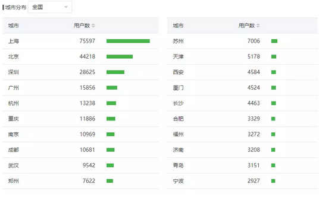

# 管家的公司架构 \#1730

原创： yevon\_ou [水库论坛](/) 2018-04-04

 管家的公司架构 ~\#1730~
==================================================================================================================

 

决定一家公司胜败，最核心的因素，到底是什么

 

 

一）       咨询

 

"[管家公司](http://mp.weixin.qq.com/s?__biz=MzAxNTMxMTc0MA==&mid=2651017111&idx=1&sn=7b5db4b60c1991d8d316b48f19c4a48e&chksm=80721984b70590922a882301b983bf880ccf1073327505f26c60e92da05c09adfbf6c34acded&scene=21#wechat_redirect)"是恰空最早原创的。带有浓浓的四大烙印。

"[代购](http://mp.weixin.qq.com/s?__biz=MzAxNTMxMTc0MA==&mid=2651017143&idx=1&sn=82f8956cb72a80b4cd0f77e3688a6dca&chksm=807219a4b70590b2d1a3579dfb99454909a7421b9de2ad555ec131d75c37e63073915882778d&scene=21#wechat_redirect)"这项服务，最早的时候，收费是3.5%

 

What，你说什么。房子还没买到，"空气税"就收了3.5%

对，就是3.5%

这里面的收费，是2%链x+1.5%管家公司。

 

在最早的时候，整个"管家公司"的生态，就是要问客户收3.5%。

因为管家公司人手十分稀少，作为一家初创公司，你显然是没有实力"覆盖"全市的诸多房源的。

 

最早的时候，\@恰空的管家公司，是和链x合作的。"房源"是问链x拿的。

而链x是很"吊"的。一口价咬定，和链x打交道，就是2%完全省不了。

 

在这个基础上，"管家"公司还要吃饭，还要养活自己。

于是搞得客户怨声载道，重复收费，生意也做不大。

 

 

一直到某一天，恰空和我吃饭。又请哥哥喜欢的水晶虾仁。

吃到一半的时候，我惊讶地说，"你找链x垃圾干什么"。

恰空不解，"不找链x，那么找谁，找中原么"。

"有哪一家中介公司，可以提供最优质的服务？"

 

哥哥取了一勺醋，耐心地拌匀了。静静问："你知道链x收2.7%的服务费，但是入不敷支，每个月亏1亿多。你知道他亏在哪里么"。

"链x提供的服务，你知道他的服务，价值在哪里么"。

 

 

在链x的成本结构中，"商铺租金"占了大头。他不惜在最优质的黄金街区，租最好的位置，而且常常是"双边铺"。二边临街。

但是你看，在这么黄金的商铺中，干的是什么。一群月薪3000元，最高学历高中的"西装民工"。每天装模做样地刷电脑。

 

论单位尺租，这些街铺可能比顶级写字楼"上海中心"还要贵。

论办公产出，这些"西装民工"没扫雷就算客气了。

真需要这么多中介，坐在"街铺"里办公么。

 

你每一天从马路口路过，

难道你就从没有想过，怀疑过，这是多大的浪费，何苦要如此？

 

 

那么，"链x"到底打的什么算盘呢。

我就问你，全世界最贵的商铺边上，盛产什么。

一座城市，地段有好有坏。商铺的价值判断，最贵的商铺，是什么地段，旁边盛产什么。

 

盛产傻瓜呀！！

 

链x做的是"普罗大众"市场。他们极度依赖Walk-in的客源。

也就是说，凡是去链x问的，都是什么也不懂的菜鸟。最普通的你我身边人；

象你爸、你妈这样的老实人。

简称"韭菜"

 

链家搞那么多的商铺，其实不是商铺。黄金铺位的店租，其实是"网兜"。

链家搞那么多的员工，其实不是员工。电脑给路人看的，其实是"广告"。

租商铺是为了客源。

 

有些企业，在CCAV做广告，在电视媒体做广告。他们没有"实体店"。最典型的，例如茅台，秦池。

 

链家不做电视广告，但是链家租了一堆的商铺，统一涂成绿色。

手法虽然不同，本质却是一样的。

本质都是广告费。

 

都是为"流量"支付的费用。

 

 

然后我再指指你："管家公司"为什么赚钱。

一家黄金旺铺，一个月房租十几万。每月成交，最多二单买卖，二单租赁。

对于一个"虹口区"，十几家门店加起来。也不过十几单。

 

你一个管家公司，找一间CBD写字楼。办公还是在二十几层的，根本没有Walk-in客户。

为什么会有源源不断的客户上门，你只要坐在那里对接就可以了。

 

"管家"公司一个月也可以做十几单。抵得上人家半个区，N间黄金旺铺的威力。

你们每个月100W元的营业额，几个人私下分钱，分得不亦乐乎。

你们有没有想过，凭什么你就赚钱忒容易呢。

 

流量最贵，而你们省了流量费

 

"管家公司"，流量基本都是从"水库"来的。

而水库的"流量"，基本都是线上来的。

 

客户们看了"水库"的文章，觉得很有道理，也信奉了"构建以房贷为核心的资产组合包"理论。\
在此基础上，客户们问"哪里有管家公司啊"。

而俺"牧童遥指杏花村"。

 

 

流量最贵，你不知道这流量有多值钱啊。

凡是寻觅而来的，都是高度有"意向"的。根据管家公司事后数据，大约每5单上门咨询，就可以成交一单。

这些人，是按图索骥，找到二十几楼来的！

 

而你现在和链x合作，还花钱购买他们的"全套服务"。你这是买椟还珠，买椟还珠啊！

 

 

最值钱的一块，"客源"流量我已经帮你找来了。

链x提供的，是"房源"端的信息。这一块信息，也有成本，但不值钱，一小半都没有。

 

 

 

二）       流程重组

 

目前改组之后的"管家公司"，基本已经完全跳过了链x，x房，x原，完全采用"短链"形式。

 

一方面，"水库系"和其他中介最大不同，我们是自带客源的。

另一方面，"官家公司"自己构建房源和信息节点。跳过中介抽佣。

 

 

"管家公司"都很弱小，因此"深耕"某一个区域。象彭蛋蛋，就专注做宝中，南山。

在这个区域内，也不是所有的盘，都具有"投资"价值的。例如万科，仁恒，融创的盘，新盘五年之内，都只跌不涨的。

部分太老，太怪的盘，也不需要考虑。

 

因此筛下来，"目标盘"就那么二十几个。

在这些盘中，你和附近的中介，都保持着良好的关系。物业经理，塞二条烟，只要知道门牌号或户型，业主的电话你总挖得出来。

 

给"信息费"0.5%，管家抽1%，中介费0%，合计1.5%

这样的轻装，才是具有竞争力的。

 

 

 

三）       水库流量

 

立刻有聪明的读者问，"水库流量"也不是免费的。

坐在20层楼的CBD办公室里，客户源源不断上门，这样的好事，也是不符合逻辑的。

 

-   知识星球

-   微信群

-   意向

-   代购

-   成交

 

我们以某些竖立了业内"流程标杆"的企业为例，他们的玩法，大致是这样一个五层结构。

前二层揽客，后三层变现。

 

 

首先，他们到"水库"微信号（Shuiku-net）打广告。广告有二种模式：

-   私人二维码。微信限流，大概每次+400人左右。因此需要二到三个码。

-   知识星球，无上限，而且可以收费。

 

顺便说一下，上次沈阳团购，乐墨搞了一个"楼市观澜"知识星球。全免费，当天进了4200人，火爆！

我曾经建议他收费9.9元。这样光圈费，就赚回了广告成本。

 

 

无论"知识星球"还是"微信群"都是需要经营的。

在管家公司，100W营业额，20个人手中，专门有几个小妹，只负责维护"粉丝关系"的。

 

粉丝维护是Cost Center

 

知识星球需要答疑。

微信群需要气氛，网友热烈讨论。必要时得发红包。

部分做得大的"管家公司"，450人/群，已经一群二群三群四群......几十个群。

 

必要时，你甚至需要开一个"微信公众号"。在微信群里提供持续的干货。

例如武汉楼市分析，山东楼市分析，沈阳楼市分析。

 

管家公司都精得很，几乎每一家管家公司，都想摆脱对"水库"的依赖。

 

"知识小星球"和微信群，这个就叫自建流量。

虽然第一批客户是从水库来的，但几乎每一家管家公司，都在默默地自建流量。都在尽可能地，将这数千个客户黏住。

 

 

你黏住了客户。他天天在你的微信群里灌水。

和你建立了深刻的友谊，间隙也阅读了你对于"武汉楼市分析"的文章，觉得很有道理，心服口服。

下一次他想要购房时，就会来找你。  

  意向：100人   亲，我想买xx的房子，你帮我参谋一下
  ------------- ------------------------------------
  代购：15人    答：你好，有这几套房源，你参考一下
  成交：4人     4%成交率

 

 

 

四）       结语

 

台上三分钟，台下十年功。

员工为什么永远学不成老板，因为他根本不知道，真正的厮杀在哪里。

 

-   你以为这是地产的竞争，其实这是流量的竞争。

-   你以为这是服务业专业知识的竞争，其实这是流量客源口碑的竞争。

 

学我者生，似我者死。

看清楚问题的实质，才知道哪些城市的"管家公司"可以活下去。

（未完待续）

 

 

（yevon\_ou\@163.com，2018年4月3日晚）
