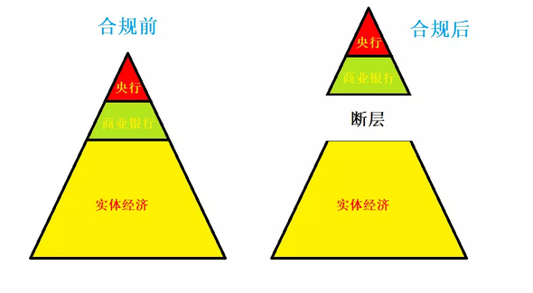

# 金融政策为什么失效 \#1750
-------------------------

yevon\_ou [[水库论坛]](/) 2018-04-23

金融政策为什么失效 ~\#1750~
======================================================================================================================

 

象牙塔里的书呆子

 

 

一）       海狸房和家

 

4.18去参加了一个商业活动，感谢"[[海狸房和家]](https://mp.weixin.qq.com/s?__biz=MzUzMTY4ODMzMg==&mid=2247487820&idx=1&sn=e05bb17362d74af07112806eb5185342&chksm=fabfefafcdc866b9efd635d950cba63cfed92a3abbbc445bb3b85ef9c0a07d87ce8c2abafe7f&scene=21&pass_ticket=ld0ED1iPieKh9kNzttn4HaWE0eRbtg8xDrBjB%20XssPQ/eSspUtrB6KJp3POZxPrf#wechat_redirect)"的邀请。

特邀嘉宾是杨红旭和我。多空对决。

 

杨老师先讲，一讲就花了一个多小时。用了三十几页的ppt。

俺在楼下记着笔记，写了满满二大页纸。

 

杨老师的水平，那自然是极高的。从宏观经济，讲到央行货币政策，讲到金融市场10年期国债利率，讲到"数量型"和价格型调控。

讲到70城平均地产走势。论做ppt的水平，大概强我20倍。

 

 

等到我上场，俺清清嗓子，"呃，我一张图表也没做"。

"因为你所有的图表，全部都是错误的"。

 

对不起啊，老板。既然拿了你出场费，总要负责讲一点真话、干货。

 

 

二）       次贷危机

 

2008年，也就是十年前，美国爆发了"次贷危机"。

次贷危机的来源，由于一些不符合资格的低收入人士，银行错误估算了他们的"风险---利率"，违约概率算得太低，于是爆发了"次贷"。

 

次贷爆棚之后，美国政府紧急援助。FED大手笔，一口气把美联储的规模扩大了四倍。搞出了QE1，QE2，QE3，QE4.

美联储花了多少钱呢，如果从资产负债表角度，大约是2.7万亿美金。

 

 

在中国国内，关于"次贷危机"的书汗牛充栋，抄作业，出版业，狠狠赚了一笔。

这些书大部分都是垃圾，天下文章一大抄。原创思想罕见难觅。

 

因为从来没有人问过一个问题，美国的"次贷"市场，有多大？

有多大呢。全美的"房贷"余量，大约在4万亿美金左右。而其中归入"次级"贷款，仅仅只有2000亿USD。

 

2000亿贷款，一年5%的利息。如果你全部由美国政府出钱。

那就是每年100亿元利息。

 

 

你发现问题了么？？

如果美国政府掏100亿，代那些穷人还房贷。则你可以"假装"问题不存在。供款正常，天下太平。

 

如果美国政府想"一劳永逸"，你就掏2000亿出来，把这些"毒贷款"全部都买下。刮刀干干净净。

而民珠党花了多少钱呢，2.7万亿。金融市场波动，更是数十万亿。

 

 

奥巴马政府，当然也不是书呆子。

因为担忧房地产市场崩溃式下滑，奥巴马也推出了高达800亿美元的"房屋补贴退税"计划。

只要符合一定的要求，就可以获得利息减免，利息优惠，税收优惠政策。

 

有用么，一点也没有。

如果实体有用，就不用金融入手。

如果能实体振兴，那也不用FED放水27000亿。

那么，哪里出了毛病？

 

 

问题在于，传统的金融模型，已经穷途末路。

传统的金融模型怎么说的，"利息降低，有利于企业融资，企业扩张产能"。

"利息升高，企业成本上升，抑制通胀"。 

 

真实的金融模型是什么呢，真实的金融模型是：

没有任何人符合贷款资格!

 

 

 

三）       合规

 

美国人，事实上从1980年代，就开始有这个问题了。所谓"金融市场和实体不一致"。

 

 

在以前，"货币政策"是高度有效的。中央银行只要降低利率。过几个月，就可以看见煤炭烟囱轰隆隆闹起来了，到处都充满了大兴土木的建设。

 

可是1980年以后，"金融和实体"逐渐切断了联系。

美联储"降息"的效力越来越小。"加息"被誉为核武器，渐渐也只对金融市场有效果，实体僵尸般麻木。

 

这里面的秘密何在，二个字："合规"。

 

 

美联储对于"贷款用途"管制越来越苛刻。

在最初的时候，"借贷"关系是如此地简单。只要一个人肯借，一个人肯贷，二者即可自由形成契约。

 

渐渐地，借贷关系被要求是"正义"的。

1907年美国爆发金融危机，议员们围攻"J.P.摩根"，议员们要求每一笔贷款都必须是"正义"的。

换言之，所有的贷款，只能发放给"做多的"，不能发放给"恶意做空"的。

 

J.P.摩根正面回答，"不，先生，信贷的唯一标准是偿还信用"。

这是人类历史上，最后一次大金融家对政客提出了Say NO.

 

 

1930年之后，美国政府对于"信贷"的要求，变得越发复杂。

政府直接要求"哪些人可以借，哪些人不可以借"。

 

譬如说，整个USSR的敌对阵营，伊朗，伊拉克，叙利亚之类的都不能借。哪怕和他们做生意都不行。

 

而美国政府自己，却大肆地借钱给沙赫特（Nazi财长）。

纳粹德国的兴起，希特勒在1933年代缔造"经济奇迹"，1/3的资金来源是靠美国债券。

等这些债券到期，希特勒还不起，于是便爆发了世界大战。

 

 

再往后，美国政府不仅要管制"借给谁"，而且还要管制"借钱干什么"。

例如说，USA有着极其严格的环保和劳工法，甚至还有"反歧视法案"。

 

一家企业，如果被裁定"LGBT不混用厮所"，立刻被判定歧视。

此后，无论资信多少，你也借不到款。

 

再往后，奥巴马政府搞出了2700页的"合乎规范企业信贷指导手册"。

于是再没有任何中小公司，符合贷款要求了。

 

 

1980年之后，人们逐渐发现"信贷规律"失效了。

你降息0.25%，根本达不到促进经济，发展实体的效果。

因为任何人都不满足"合乎规范"。

能享受贷款的，只有1/10的特权群体。

 

 

 

四）       金融隔离

 

当"合规"深入到经济体的每一寸肌理之后，整个"金融"的逻辑就变掉了。

如图，传统的"商业银行原理"，它描述的是一个三层金字塔结构。

-   央行处于最顶端，买卖国债利率，货币乘数M1

-   商业银行第二层，国债+信贷溢价，货币乘数M2

-   工商企业第三层，社会回报利率，货币乘数M3

 

在"传统商业模型"，央行---商业银行---实体工商，这三层是连通的。

央行有任何利率改变，首先会影响银行间拆息。

利息升高，再通过商业银行，影响到实体经济。

 

 

但是在"现实合规模型"下，这个模型是断裂的。

具体的表现就是，只有央行和持牌商业银行，被认为是"自己人"。

他们可以在一个"小圈子"里面，以非常低的利率，互相拆借。

 

但是整个实体经济，和金融是脱节的。

从银行间拆息，到"实体贷款发放"当中是脱节的。

是天堑，是地沟，是马里兰海沟，二者之间的距离无穷远。

 

 

实体嗷嗷待哺，哪怕10%的利率都算是低息。能借都不错了。

你和我说，央行利率由2.75%涨到3%

有屁用，有屁用，有屁用啊！

 

 

 

五）       学院派和实战派

 

我们这个世界最诡异之处，迄今为止，有无数无数著作，研究"金融原理""财经周期"。可居然从来没有任何一门学科，研究"合规对经济的影响"。

 

"合规"的影响力大么。

很大，很大很大非常大。

 

某日苏联举行国庆游行，沿着大街开来了炮兵、机械化步兵、坦克、自行火炮、战术导弹、战略核导弹，破坏力一个比一个大；

队列末尾却是两个带公文包的矮子。

 

在看台上勃列日涅夫惊讶地说："这两个人破坏力比核导弹还大！他们是什么人？"

克格勃头子说："不是我的人。"

国防部长说："没见过他们。"

苏联总理说："他们是国家计委的......"

 

限购限贷远远比货币利率更重要

 

学院派根本不懂得民间疾苦。他们也不知道，冠冕堂皇的几个字，一份看似很正义感，完全合理的要求；

落实到具体执行层面，会给民生增加多少麻烦。

做互联网的人都知道，只要多"一道"手续，转化率就会跌掉至少-50%

多几道文件手续，整个申请就没法做了。

开个身份证证明，还得跑回六线老家乡沟里派出所。

 

 

 

具体说到房地产市场，对市场影响最大的是什么。是"限购，限贷，认房又认贷"。

整个市场中，不缺买家。购买力汹涌。

 

可是二个合法的公民，一个愿买，一个愿卖，却不可以达成交易，dT\>0

因为政策法规的限制，只有不到1/10的特权群体，才拥有了最惠的资格。

 

 

政府肯定也希望"百业兴旺，日进斗金"的。

美国政府发现，无论他们怎样地调整货币政策，最多只能影响金融市场价格波动。

可是工商业实体，依然无可遏止地流出美利坚。

USA日复一日地空心化。

 

这种"无力回天"的架势，不是靠你金融部门，不是吹嘘格林斯潘可以回天的。

你应该去问一问，美国为什么有那么多的白左，圣母。搞出了那么多"环保和劳动"法令。

 

只有彻底符合US环保和劳工福利的项目，才能上马。

最终导致金融和实体完全"断层"。无论你加息降息，企业家都知道，根本贷不了款。

还不如关门大吉。

 

 

在中国也是一样，无论是别人问我周金波"周期大王"，还是炒得火热的"泽平周期"。

我只问你一句话，

你的分析中，有没有包括"合规"。有没有2700页的"限限限限限限限限........."

 

如果你从来没有提到过合规，象牙塔不见人间魑魅，那我只能给这些研报评价二个字：

SB

 

 

（yevon\_ou\@163.com，2018年4月21日暮）
