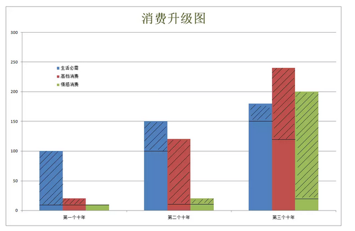
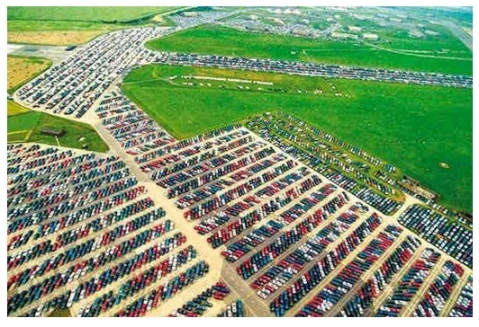
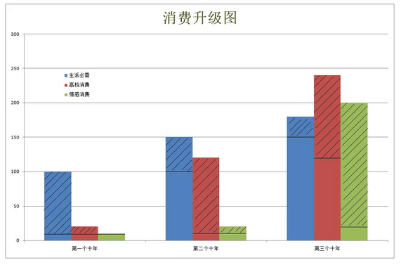

# 螳螂捕蝉的朝鲜楼市
------------------

原创： yevon\_ou [[水库论坛]](/) 2018-04-27

螳螂捕蝉的朝鲜楼市 ~\#1760~
===========================

 

螳螂捕蝉的朝鲜楼市 \#1760

上一篇[[次文]](http://mp.weixin.qq.com/s?__biz=MzAxNTMxMTc0MA==&mid=2651017412&idx=2&sn=43da456975fe402725dd2ac8a32cc455&chksm=807206d7b7058fc15d86dc9b640ad4f478cc35c984627fda9c9b3a1f48fd36a22ed8499deeaf&scene=21#wechat_redirect)，创造了水库最高阅读"转化"记录。我自己都买了20斤。

 

现在是投资朝鲜最好的时机么。

不是

 

 

一）       赚钱天堂

 

这二天的一个热点新闻，算是《[[朝鲜宣布改革开放]](https://mp.weixin.qq.com/s?__biz=MzA4MjgzNjM1OQ==&mid=2654767115&idx=3&sn=959cb04dc84406385fea872f36bd79f4&chksm=843786e3b3400ff5056adb70842d042619d84a006d0c408d30a872af6c4272abbe22f7e36a66&mpshare=1&scene=21&srcid=042642YwUAVTMBMmE6HFyH3y&pass_ticket=dvEJc#wechat_redirect)》。

哪怕象"地球知识局"这样的大号，都搞了篇《[[朝鲜买房指南]](https://mp.weixin.qq.com/s?__biz=MzI1ODUzNjQ1Mw==&mid=2247493125&idx=1&sn=c68049756f0bb2c88c418884aeab4bd7&chksm=ea04036fdd738a792bcf3fa977ec4fe3348a42c76e0238ece80a6028dc40270d92b14c58a551&scene=21&pass_ticket=dvEJcmxhQB/82Q/LXMrX8dnSLfRm0yeZ7PUskXCMWf#wechat_redirect)》，真是斯文扫地啊。

 

水库的口号，从来是"比斯文更斯文，比扫地更扫地"。

我们才是地产界第一专业的。

因此这事，得让水库来说：现在是投资朝鲜的最佳时机么？

NO，不是

 

 

为了解释这个概念，我首先要问大家一个问题。

-   目前全世界最理想赚钱天堂，是哪个国家

-   全中国最容易赚钱的城市，是哪一个。北上深，还是大凉山？

 

这个问题的答案，国际公认是"美国"。

美国虽然有这样那样的缺点，弊端丛生。近年来优势也有所拉近。

但在全世界"投资者"的心目中，最佳的赚钱天堂，依然是美国。

只有美国，才拥有最庞大最厚实的"资本市场"。无论广度和深度，都是无可取代的。

 

同样道理，中国最赚钱的城市，是大凉山，还是北上深。

答案，肯定是北上深。从人口流动，产业扎堆的数据，人往高处走。

大凉山虽然极度贫困，各项物价都非常低。却竞争不过物价沸腾的"一线城市"。

 

 

里面，投资牵涉到一个"财富增量"的问题。

（对于大资金）重要的是绝对增长，而不是相对增长。

 

 

北朝鲜的人均GDP，按照官方数字，目前是\$665美金。

我们假设它可以按照一个非常快的数字，每年增长+10%

则十年之后，它的人均GDP是\$1665.

 

这是什么概念呢，就是每人增长\$1000美金。

相比之下，我们看看北京。

-   2015年，人均GDP \$16827

-   2016年，人均GDP \$18676

北京只花了半年的时间，人均GDP就增长了1000美金。

 

人类新增财富，主要还是在美国，欧洲，北京，上海等地方产出。

 

 

只有在发达地区，才在剧烈地，迅猛地，产生"新增财富"。

在中国，高速公路，电厂，地铁，购物中心，石油炼化厂，一个接一个地拔地而起。

 

而北朝鲜呢，你说发展很快吧，人家也引以为骄傲的。

우리오빠花了3年的时间，兴建了一个炼钢厂。GDP增长+300%

河北人不屑一顾。"俺们每年造十几个呢"。

 

 

 

二）       绝对回报

 

投资这种事，分为"绝对回报"和"相对回报"。

穷乡僻壤，第三世界的国家，其特点是"相对回报"非常高。造二个化肥厂，洗煤厂，很快可以刷GDP。

但是"绝对回报"是不高的。

 

 

我们做地产的，常常会说"大资金去深圳，小资金去CQ"。

你要说"投资回报比"，西部城市，8000/m的城市，肯定增长更快，回报更强劲。

 

可是网友们有500W，1000W现金，我们就劝你留在深圳，别去远郡了。

为什么，"池子太小，装不下"。

 

重庆沈阳贵阳昆明等城市，一样存在"限购限贷"政策。

资金到了1000W层面，你是根本没办法建仓的。不可能买上十几套，几十套，并贷款。

大资金，就只能留在京沪。只能留在发达市场。

 

 

同样道理，北朝鲜也是"池子"太小。

忙死忙活，赚几十万。

从这个国家，赚出10W斤大米，真心不容易。

 

将军赶路，不打小兔。

北朝鲜现在基本没有大型的投资项目，都是小打小闹几十万。哪怕给你赚一倍，又有多少钱呢。

 

 

可是如果你调度大笔资金，例如1000W美金去朝鲜。

然后你想一想，北朝鲜去年的全国GDP，一共只有200亿美金。

外汇储备，在10亿美金数量级。

你投1000W，就占去了1%

安全么，靠得住么，不怕抢么。

 

单纯从投资上讲，朝鲜可能还不如吉林。无论GDP增长绝对值，相对值，都是完爆。

都说"投资不过山海关"，

遑论 "投资不过鸭绿江"呢。

 

 

如果我们回溯中国"改革开放"的历史。

1980年代的时候，欧美华尔街的"大亨"，是根本不投资中国的。

 

最早一批进入大陆的，都是港资，台资。身家数百万元的小老板。

一直要到十几年之后，90年代中后期，中国人均GDP突破\$1000美金（当时物价）

然后才是世界"500强"蜂拥进入中国的工业化时代。

 

 

 

三）       产业拐点

 

第二个原因，则是"产业拐点"。

传统的教科书式"经济学"，太文明，太老实，流于空想。

我们真实的世界运行，"财富学"绝不是这样构成的。

 

 

传统的经济学，虚构了一个叫做"复利"的东西。

传统经济学告诉我们，社会好像是线性发展的。

你今天经营一个纺织厂，毛线，棉锭，就按每年+15%的速度增长。经过三十几年，复利乘法，规模是现在的100倍。你成了大企业家富人。

 

现实世界是怎样的呢。

你勤勤恳恳，埋头研发塑料铅桶。复利增加产量。

突然有一天，塑料桶卖不动了。

房价飞涨，一套房子比整个工厂还贵。

你坚守实业。破产，倒闭，扫马路。

 

 

我们整个社会的真相，是存在"产业升级"的。

简直象打AOE，分为"石器时代，青铜时代，铁器时代"。

一个新的时代来临，旧的产品，全部都要归零。要清盘重写的。

 

"三十年辛苦劳动，五年一把收割"。

 

 

最早进入北朝鲜的那批人，他们是非常苦的。

北朝鲜的生产力非常低下，虽然增长很快，但是绝对生活还是很苦。

初期，还要承担很多很多不可测的政策风险。

 

而当你辛苦奋斗三十年。整个社会财富积累到一定阶段时。

你是被人"一把椤"的。

社会一定不是平滑发展的，一定不是线型发展的，一定不是理性增长的。

 

-   有可能是房地产，一把刮去你几十年的积蓄。

-   有可能一些后生晚辈，搞出来ICO。几个空气币，就号称换你工厂。

-   有可能马斯克吹技术突破，电动汽车颠覆燃油汽车。

-   有可能消费者口味改变，健身教练，瑜伽，素食减肥，获得巨大流行。

 

如图。斜线部分表示"增长"额。

 

任何一个国家，一个经济体，刚兴起的时候，他一定是"轻工业"主导的。

出口导向型经济，一亿件衬衫换一架飞机。

最初的时候，生产一些纺织品，运动鞋，儿童玩具，塑料纸花。

 

到了第二个阶段，开始"重工业化"。

生产力到了一定基础，汽车，通信，造船，石化等大型产业会兴起。

GDP增长，靠"资本密集型"产业拉动。

 

第三个阶段，所谓"后工业时代"。

当汽车，钢铁，电子机器人也充分饱和。类似于美国的"汽车坟场"。

人类物质极大满足，就会开始追求一些精神上的愉悦。医疗，健康，直播，冲浪和度假。

小老板们容易犯的错误，他们在"最初十年"，克勤克俭，塑料铅桶厂支撑起了整个国家的经济增长。

而小老板们以为，这样的日子是"持续到永远"。

 

其实不会的。

"塑料铅桶"的市场会饱和。

而下一级的经济增长点，和你无关。

经济增长点，不是靠把100亿件衬衫，提高到1000亿件。

而是靠开始造汽车。

 

根本不存在"产业转型"。

你做衬衫的人，没法改行做汽车的。

做汽车是另外一批人。

 

 

如果我们仔细看这个图表，在最初十年，几乎所有的"增长"，都是靠蓝色柱子。

但是之后的20年，30年，蓝色柱子增长是不大的。

经济不是靠你拉动的，财富也不在你的手里。

 

 

因此正确的战略是什么，是"收割"。

你不需要介入最初十年的"辛勤开垦"。胼手砥足非常苦难，而且初期政策风险也高。

不需要和朝鲜人，一起经历改革开放的最初十年。

 

你瞅着机会，等待"转型"那一刻。

在转型时，一些新产业，会在短短几年内，以10倍，100倍的速度增长。 

 

你不需要去做财富的创造者，你只要去做财富的搬运工。

 

社会的发展，一定不是线型的。

朝鲜即使会改革开放，也一定经过二三次波折。

而在"产业转型"时，青铜时代升级到铁器时代，意味着原有的装备归零，小老板财富归零。

全社会财富剧烈再分配。

 

 

对于"社会转型"宏观大历史的判断，哪些行业会兴起，哪些行业会没落，哪些行业可以敛财暴富。已走过的路，并不会消失。日光之下，并无新事。

 "[[降维攻击]](http://mp.weixin.qq.com/s?__biz=MzAxNTMxMTc0MA==&mid=2651015713&idx=1&sn=6f075efc8bf34cb204f214d6952cc2cd&chksm=80721c32b70595243cf377c47163f05a6c10cd52df7adaf2b1852d037f2691649b8449d7ced5&scene=21#wechat_redirect)"，凭借中国的经验，足以让你抢先半步。

 

时辰未到

先让他积累十年财富好了。

 

 

 

四）       结语

 

在一个饭都吃不饱的世道里，是不会有人关心房地产的。

-   食品，面粉加工业

-   纺织业

-   家用电器

-   摩托车，交通工具

-   电信

-   重化工，能源工业

-   金融，地产和对赌

-   生命，长寿和情感

大致这个顺序

 

越南早就改革开放了，难道南宁经济/房价，便起来了么。

朝鲜之路，时辰未到。

 

 

（yevon\_ou\@163.com，2018年4月26日暮）

 

水库芸姨凑过头来看了一眼，"你的意思说，30年以后，你辛苦积攒的几十套房子，在你孙子眼里，还不如明星的一个戒指么"。

呃，周六芸姨发"选秀中的八卦"。
