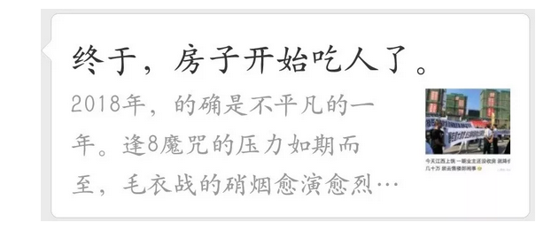
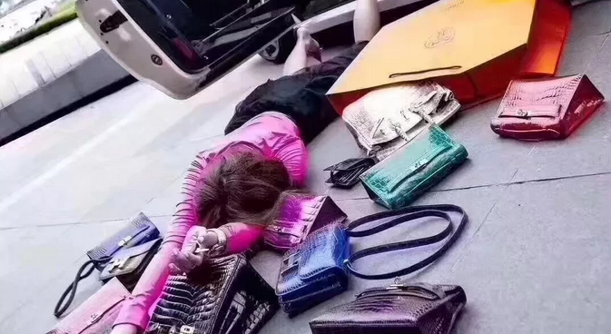
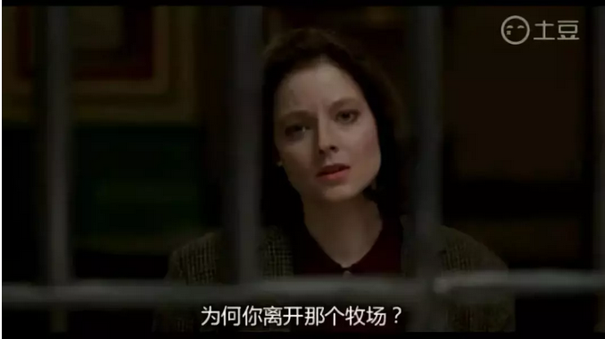

# 房价下跌天下毒 \#1940

原创： yevon\_ou [水库论坛](/) 2018-10-17

**房价下跌天下毒 ~\#1940~**

 

 

 

一）媒体

 

1993年的时候，中国还是一个相对贫穷落后的国家。

当时浦东开发，上海《新民晚报》社，派遣了一支小队到沙特去，参加国际会议，向外国友人取经。

 

沙特一家媒体的主编问，"贵刊发行量多少"。

新民晚报谦虚地说"不多，不多"。

沙特媒体骄傲地，写下了数字："3 000"

《新民晚报》拿过便笺纸，写了"1 000 000"份。

沙特小编昏了过去。

 

 

我们非常幸运地，生活在了一个波澜壮阔的大时代。

能做到一些，以前无法想象的事。

 

在之前，3000份，就是一个中等城市"都市报"容纳的极限了。

上海这样特大型城市，1800万人口，养活了100万份左右的常刊量。

 

今年不过10月16日，有幸之年，今年微信圈已经刷出二篇3500W+的爆款文章。

1)兽爷："疫苗之王",3800W+，已删除

2)青驿："[[终于，房子开始吃人了]](https://mp.weixin.qq.com/s?__biz=MzU1NzMxNjUxMA==&mid=2247487036&idx=1&sn=09b36a07c361dacc6358df4202935129&scene=21#wechat_redirect)"，3500W+，已删除

 

3500W的数量级，对于许多小语种媒体，例如俄语，法语，日语。已经超过了一个国家的力量。

这是最好的时代，如果你去干坏事。

 

 

 

二）投毒

 

我们想问一个问题："如果，这篇文章有毒呢"。

如果这是一篇，污蔑诽谤，歪曲事实，编造罪名，居心歹毒的文章呢。

 

那么"受害者"，就是3500W阅读者。

范围越广，危害越大。名气从来都是双刃剑。

 

 

很不幸，"终于，房子开始吃人了"是一篇河豚有毒的文章。

看起来煽动悲悯，但其实诬蔑陷构。把人性的弱点，全部都利用了。

 

作者提了五条核心意见：

1）楼市开始爆仓，跌成负资产

2）开始打砸售楼处

3）居民贷款余额，超过存款余额

4）开发商追求"活下去"

5）国家要转型了

 

这五个意见，全部都是以偏概全，一面之辞。

逻辑荒谬，断章取义，不值一晒。

 

前二天我出差在沈阳，来不及反驳。错过了一篇100000+.

而今天，水库论坛也不准备展开论述。

因为珠玉在前，找到了一篇《[[说房子开始吃人的是胡说八道！]](https://mp.weixin.qq.com/s?__biz=MzU1NzMxNjUxMA==&mid=2247487036&idx=1&sn=09b36a07c361dacc6358df4202935129&scene=21#wechat_redirect)》。

把我想说的话，全部都说到了。高手啊，无需赘述。

 

 

我们今天想问的，是另一个话题。

为什么总有人想吃人血馒头？

 

 

 

三）好莱坞

 

如果一个人，想要有高尚的品德。那他最好从来不看电视连续剧。

因为当红热播剧，几乎全部都是"大毒草"。

 

热播剧的标准套路，永远都是"霸道总裁爱上我"。

"穷人小子捕捉富家千金"。

 

电视剧里面，每一个奋斗逼都皱着川字眉，大喊："我要奋斗"。

但却用90%的时间在谈恋爱。

电视剧里面，每一个女主都是万人宠爱，一个营的男人狂追。但却完全控制不住自己的情绪波动，动辄要死要活。

 

拜托，没有一个男人喜欢炸弹型女生。

 

中华民族的传统文化中，"温柔"是吸收爆炸能力好么。

一个人，如果真想培养高尚金子般的情操，他就应该完全不看电视。

电视连续剧有害无益，全部都是错误的三观。

 

但是你并不能改变这一切。

"顾客就是上帝，消费者决定一切"。

 

对于"电视"产业链来说，它们的主要客户群，是月薪2500元的"前台小妹"。

于是霸道总裁专撩前台小妹，MBC编剧势所难免。

消费者喜欢什么，你就喂养什么。

一切都是商业竞争，生存压力竞赛。

 

而"社会责任"呢。不存在的。

电视教你庸俗，音乐教你堕落。流行娱乐界从来不在乎你吃了有毒。

 

 

这件事情，在西方曾经引发了剧烈的争论。

"媒体界需不需要承担社会责任"。

 

-   所有的严肃媒体。

-   所有的讲真话媒体。

-   都已经证明活不下去。

 

严肃的，辩论类的节目，根本没有收视率。

历史类，政治类，哲学类，所谓"社会大道"的学科。连0.1%收视率都没有。

 

探索通信公司曾经花巨资，外加补贴，拍摄了精美的"Discovery"频道。这是真正的大片。每一部都极尽华彩。然并卵，广告收入还不如小鲜肉。

 

 

"收视率"之王，永远都是综艺节目。爸爸去哪儿，相约星期六。

成本低廉的布景棚，找二个明星，在那里玩肥皂剧。越庸俗，越流行。

人民喜欢庸俗，你有什么办法。

 

因此，这是一个悖论。按照dT\>0的原则，人民喜欢什么，你就应该让他们自由。

但是从"父爱"的角度，所有的综艺，都在堕落。他们贩卖给你的"奶头乐"越多，你就越愚蠢。

 

 

娱乐业是一个"重度污染"的行业。

媒体业的利润，大量建筑在"负外部效应"。

也就是社会风气的恶化。

 

在房地产市场，道理也是如此。

 

3500W阅读，我们从来想都不敢想。

象水库论坛这样"坚持看多"的奸贼，是肯定刷不出3500W阅读的。

 

人民只会转他们喜欢的东西，人民只会喜欢庸俗的东西。

"房价明天就跌"皆大欢喜。"好好努力，负债买房"注定流行不起来，小众。

 

 

水库论坛篇篇用心，Discovery频道。如果我们"随大流"唱空，痛骂房产商。以水库的文笔，早就上千万粉丝，广告费接到手软。

 

可是我们坚持看多，揭露市场的真相。万科是骗子，必贵远是骗子。

"打砸售楼处"是假新闻。

"不要再犹豫，立即就买房"。

 

水库一年的PV，大概是3500W。我们全年的阅读量，拼命解毒。

还抵不过别人一篇的投毒。

 

 

良心是不可持续的。义务做好人，是不可持续的。

-   劝你奋发向上，天使难得。

-   劝你滑坡堕落，魔鬼才是低成本。

 

迷惘之际，我们想问：

如果整个市场的生态，就是走向堕落。

你该如何自处。

 

 

 

四）圣火

 

"生亦何欢，死亦何苦。怜我世人，忧患实多"

媒体需要社会责任么，媒体可以向社会乱抛垃圾么。

 

 

拦你是拦不住的。只要有"利益"存在，就永远会有人投毒。

哪怕再荒诞不经，再逻辑错误，被《[[说房子开始吃人的是胡说八道！]](https://mp.weixin.qq.com/s?__biz=MzU1NzMxNjUxMA==&mid=2247487036&idx=1&sn=09b36a07c361dacc6358df4202935129&scene=21#wechat_redirect)》驳斥得颜面扫地。

 

没用，"解毒文"我打开的时候，仅仅是第254个阅读者。

您看清楚了，三位数。

关联阅读，还有篇《[[10万+"房子要吃人"是如何割韭菜的]](https://mp.weixin.qq.com/s?__biz=MzIyNzU1MjM4MQ==&mid=2247485809&idx=1&sn=6e345645520c5d700c23626b784fa168&scene=21#wechat_redirect)》

这篇阅读，呃，4300

 

 

让"民众"觉醒，也是不可能的。关于这一方面，我也已绝望了。

人不可能被说服，只能被天启。

 

"实事求是"的性格，是天生的，是流淌在骨子里的。

"追求真理者"，工业文明性格，不到1%

 

有些人，就是流氓习气。就是只讲态度，不讲道理，胡搅蛮缠。

这种"农民"基因，经远古进化而留，没有几百年也洗不干净的。

 

 

面对漫山遍野的羔羊，是投毒他们，收割他们，吃羊肉卖羊皮喝羊汤。

还是顶着羔羊们的愤怒，解救领悟开导他们。这是个问题。

这个问题，困扰了我很久，饱受哲学和道德的冲突。费拉不堪。

一直到有一天，我看见了冬川豆一篇文章。讲《[[愚夫愚妇和波兰]](https://mp.weixin.qq.com/s?__biz=MzI4MjA3MTg2OA==&mid=2652505949&idx=1&sn=3291848574e1fcfdf41419c2bd748748&scene=21#wechat_redirect)》，豁然开朗。

 

-   低等族群生存的关键，是数量。

-   繁殖力决定一切。

 

 

"科普"启发民智，传播科学，这种事情是无意义的。

即使你把民众的智慧，提高十倍，那又怎样。

在真正的高手，例如哥哥眼里。哪怕中国人均见识提高10倍。我依然可以收割你。可以做局，卖"高高高科技"纳米保健品给你。

 

但中国人平均素质提高十倍，几乎是不可能的。

这工程太大了，一辈子都做不完。

电影《决裂》

 

八亿"孑孓"真正的力量，在于"数量"。在于生育能力。

"精英"阶层，虽然在生育领域小有优势。但绝不如智商眼界般的碾压。最多也就是3：2的区别吧。

 

法治社会，再伴随基础人权的保障，"死亡率"是很低的。

源源不断地，提供前台小妹洪流。

 

 

"综艺"的目的，是让人快乐。

因此"前台小妹"，就安心地去看总裁剧吧。

八亿屌丝，乐淘淘地等待"房价暴跌"。

 

鸡汤好喝，滋补身体。只要这些：有助于你们"感到快乐"。

 

快乐平安，则生育率上升。

 

 

综艺节目，只要做到了"生育率上升"。就算完成了目的。

哪怕你贩卖无脑鸡汤，把前台小妹带到沟里，也不要紧。

 

尽早结婚，生育很多个孩子。

"爬阶"的技术，水库和其他良心网站，藏在山涧秘洞等你去发掘。

 

只要你孩子多，数量堆死质量。

总有一二个运气好，可以顺利爬出奶头乐的天坑。

 

 

 

五）结语

 

今天我想提醒一下各位。时至2018.10.15。

 

-   天下所有房产大V，除了水库论坛，已经没有别家，继续看涨房价了。

-   全中国所有媒体，都在唱跌。已经没有一家看涨了。

 

 

我只希望，大家能记得这一个时刻。3500W阅读，一面倒的阵营。

六个月之后，一些不要脸的微博V，可别跳出来说"我是看多的"。

 

此据

 

 

 

（yevon\_ou\@163.com，2018年10月16日晚）
