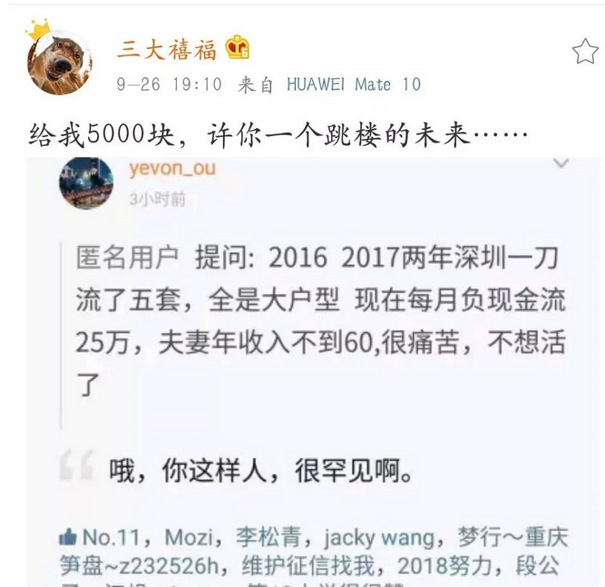

# 三无谣言 \#1950

原创： yevon\_ou [水库论坛](/) 2018-10-18

**三无谣言 ~\#1950~**

 

上篇讲到了《[终于，房子开始吃人了](http://mp.weixin.qq.com/s?__biz=MzAxNTMxMTc0MA==&mid=2651019098&idx=1&sn=226e90c31277a29335f781298e65b5e2&chksm=80720149b705885f8976ea6612103168716903a5b4089ea7592deb9fd8d65691ed0b59d01e63&scene=21#wechat_redirect)》

说到网络"谣言"，我这也有一例。

 

 

 

一）跳楼

 

大约三周之前，有一张截屏图片，刷遍了半个房圈。 

 

帖子的大意，是说有一个年轻人。"一刀流"加上了很大的杠杆。

正好这二年涨幅也不多。

于是"月供"-25W。眼看就要爆仓了，请问怎样解救。

 

 

这个故事，完美地符合了：

-   投机炒房

-   高杠杆

-   套牢跳楼

等核心要素。

 

一经出台，顿时刷爆了半个房圈。微信群热炒了整整半周。

无数大V，上蹿下跳，口诛笔伐。"喏喏，我说投机邪教吧"。

你看你看，出问题了。 

 

全网热刷。哥哥就默默看着，等着，守着，一言不发。

拿个小笔笔记录。

凡是贴的，转的，赞的，全部都是SB。

 

为什么，因为这是一条"三无谣言"。

 

 

 

二）三无谣言

 

在上一篇《[[房价下跌天下毒]](https://mp.weixin.qq.com/s?__biz=MzAxNTMxMTc0MA==&mid=2651019098&idx=1&sn=226e90c31277a29335f781298e65b5e2&scene=21#wechat_redirect)》中。我们讲述了，一个"社会谣言"想要传播的秘诀。

-   只写读者们喜闻乐道的故事

-   诉求一定要简单，粗暴

-   撒谎

-   不要怕逻辑多么地荒诞不经

 

至于科学和真理，这些都是无关紧要的。带偏了粉丝，煽动了民粹，都抵不过人血馒头的鲜美。

 

匿名用户 提问: 2016 2017两年深圳一刀流了五套，全是大户型
现在每月负现金流25万，夫妻年收入不到60,很痛苦，不想活了

 

象这样的提问方式，你是没有办法回答的。

你唯一的回答方法，只能是"哦"。

 

为什么"知识星球"不是随便人可以开的。

小白从业，开"知识星球"，就是被人坑死。

 

在一般人的想象中，类似问题，应该怎样回答。

相信每一个心地善良的人猿泰山，都会回答说：

 

-   你先别急，大家一起帮你想办法。

-   当初投资过于激进，的确不该。

-   看看还有什么额度，挖潜潜力。

-   要不，水库给你搞个众筹。大家一起募捐，大爱无疆。

 

 

如果你这样回答的话，对方接着再问：

-   兄台，我一刀流了10套，每个月月供-50W。目前感觉十分痛苦，请问该怎么办。

-   一刀流了30套，每个月-150W，请问该怎么办。

-   一刀流了50套，还借了3000W高利贷。今晚上没众筹200W就要去跳楼，请问怎么办。

 

你目瞪口呆，瞠目结舌。要不要你自己掏腰包，赔他200W？

这种问题，一开始就不用回答。

因为他是一个"三无谣言"。

 

-   无主体

-   无细节

-   无契约

 

 

你要知道这整件事，一共只有48个字。而某些地域的人，嘴皮一张，撒谎就象吃豆子一样寻常。

 

水库以前曾写过一篇《[[家里在一二线城市有很多套房是怎么的一种体验？]](http://mp.weixin.qq.com/s?__biz=MzAxNTMxMTc0MA==&mid=2651018257&idx=1&sn=8be5768d47d083c077efa52dc50555f1&chksm=80720202b7058b14e0c3a2ab3d5e0a95e7e3c8310968b717cc1f5a7e1aae3a7fdc81f653d760&scene=21#wechat_redirect)》，讲的一个知乎er，嘴皮一飞，在成都就有十七八套房了。

然后就成人生导师，开始冒充大神。

指点"房子不如诗和远方"了。 

 

同样道理，在这个48字的帖子中，他说五套房，你就信五套房啊。

他说月供-25W，你就真信-25W啊。

他说要跳楼了。你就真拿去《[[终于，房子要开始吃人了]](https://mp.weixin.qq.com/s?__biz=MzU0ODk1NjcwMQ==&mid=2247484142&idx=4&sn=feeb3d2e14bd00e4d6fc790de041e749&scene=21#wechat_redirect)》，当作革命写作素材啊。

 

 

实名制是公信力的基础。

 

水库是一个非常宽容的星球。呃，主要是收费贵。

因此我们是允许用户"匿名"的。五星服务。

 

但是"匿名"不代表公信力。

你一个陌生的id，匿名的id，你说话让人怎么相信你。

谁知道你怎么编的。嘴皮一翻，炒楼亏五千万都可以。

 

想做一个有"公信力"的发言人，你至少需要是水库老id。

凭"实名"发言，混过六个月大半年的。

平时发言踊跃，人设丰满。

而且还要参加大量的"水库线下"活动。刷脸见真人。别人才会信任你，水库拆解圈才会接纳你。

 

 

"三无"谣言的第二步，是"无细节"。

有时候，当事人迫于某种压力，的确不能实名露面。在公信力大打折扣的基础上，你的"故事"要足够丰满，也能获取信任。

 

你说你的"月供"五套房-25W，平均每套房负五万。

考虑到千万级豪宅，每个月还有2\~3W的房租收。也就是你的实际月供，要超过-7W。

 

再进一步反推，则每套房子贷款，应该在1200\~1400W之间。

五套房子，合计贷款6000\~7000W。

 

 

请问：

1）这么大金额的贷款，你是怎么贷出来的。

2）你的首付款呢。再怎么高评，首付1000W也是要的。

3）你的第一个1000W，是怎么赚来的。

4）什么样的人，会去买七千万的豪宅。

 

这整个故事里面，漏洞百出。

傻空吹牛的基础，顾头不顾腚。嘴皮一翻，数量级翻十倍。

月供5000，直接吹成月供50000.

 

但在内行人眼里，楼市是一个复杂的"有机整体"。

切掉任何一个器官，都会导致淋巴系统大变位。

你简单地说"月供-25W"，是根本没有任何公信力的。

 

 

每一个人，能贷款的上限是有限的。

多军绞尽脑汁，也积累不起来-6000W的房贷。

你一对中产夫妻，以为想负债就负债，想破产就破产，想跳楼就跳楼。

亲，骚操作到能跳楼。也是需要大量技术含量的。

 

一个真实有说服力的细节，必需说明这五套房子，各位处什么板块。2016年价格多少，今天价格多少。

当年为什么买入，有没有遵循"非笋勿入"原则。有没有获取大户型折价。

费用如何控制，如何赎楼，有没有全款抵押。过桥流程有没有失控。

操作时如何安排，五个首套如何寻觅。收入证明如何解决。代持人如何控制。房价波动之后，代持人情绪如何。

 

什么，你说他们有部分是二套，那二套的首付就更多了。

 

 

 

"三无"谣言的第三个问题，是"无契约"。

水库从来没有教过你，买五套7000W的豪宅。

水库的说法，从来都是"[大舰需要小船护航，护卫舰绝不可少](http://mp.weixin.qq.com/s?__biz=MzAxNTMxMTc0MA==&mid=2651015069&idx=1&sn=b35d79dd91b1687a1b2dd0546841fcc3&chksm=8072118eb705989858d6d3c1cc7e15c24761a5a1af465c213729490c50b44757fbc3866f1d90&scene=21#wechat_redirect)"。

"新手不推荐老破大流派"。

"严格控制成本，缩短赎楼时间，当天拿证"。

 

你如果严格按照"水库"心法来操作的话，则风险是非常非常小的。

7000W的单子，水库至少会让你准备2\~3套流动性非常好的小房子作为护航。

同时搭建周边拆解网络。

本身还有信用卡，信用贷等大量金融工具备用。

 

 

你买的什么楼盘，买之前有没有咨询过水库。是不是买的"远郊一手品牌CEO贵妇"盘。

水库在深圳只推荐过振业城，中海康城这二个楼盘。2016年推荐时28000，目前40000，从任何角度看，都是赚钱的。

 

小心李鬼，注意山寨网站会推荐坑爹楼盘。认清正牌"水库论坛"。

 

你说你亏钱了，那你是不是跟随"水库心法"呢。

你上的真水库，还是李鬼网站。

 

水库要求你"克勤克俭"，看房200套，你做到了没有。

买房之前，就"选筹标的""配置结构"，有没有付费进知识星球咨询。

 

如果这些都没有的话，你冠一个"水库传人"抬头。然后说你套牢了要跳楼。

抱歉，这锅水库不背。

 

此处应有广告。

添加助理微信，加入"水库"知识星球。剩余六个月，特价3500元\*90%折。

 

 

 

三）人血馒头

 

这个世界很可怕的，很多人想吃人血馒头。

小白兔行走于江湖，遍地都是豺狼虎豹。

 

只不过想吃你血的，并不是水库。从任何标准讲，水库都是相对良心，业界善意好人。

想吃人血馒头的，是上窜下跳，微博那帮小v们。禧福龙华洛杉矶香主堂主，知名不具。

 

 

"五套一刀流套牢"这个提问，一看就不靠谱。

是一个"无主体，无细节，无契约"的三无问题。

 

《[[我们的仇家遍天下]](http://mp.weixin.qq.com/s?__biz=MzAxNTMxMTc0MA==&mid=2651015468&idx=1&sn=fb43eaa78d57588695c9d5e230ffa4df&chksm=80721f3fb705962952d461a1da4e650c2eb49c48095068a9f37b5f508f849e711f365ab108c1&scene=21#wechat_redirect)》哥哥背后的软刀子挨得多了。这类陷阱，一看就知道怎么回事。

但我没想到，谣言会传到微博上，而且会传得那么凶。

 

 

当然"微博v"的智商，哥哥还是有信心的。

他们不是蠢，他们仅仅是坏。

他们未必识不破"三无谣言"，他们就是想传播。跟风唱衰水库。

 

毕竟，在整个生态圈中，所有的V，都是为KFS站台的。

拿KFS的返佣，是ｖ们的主要收入来源。

 

整个房圈，只有水库，是坚持站在C端说话的。只有我们，是帮助"消费者"赚到钱的。

凡是跟着水库走的，买的都是老破大，二手房。水库在其中，赚不到丝毫佣金。但却切切实实能帮网友们赚钱。

 

这段，可参阅《[[被遗弃，被抛弃的B2C
\#1600]](http://mp.weixin.qq.com/s?__biz=MzAxNTMxMTc0MA==&mid=2651016590&idx=1&sn=93c4043d76844552ed9ad46bf3ff682c&chksm=80721b9db705928b49dda650ca8da8b9a4beb0735c92ad9f83e90e88ef0a9d6973d6bb7bfafa&scene=21#wechat_redirect)》

 

 

 

孔子说，"唯上智和下愚不移"。

小白生活在这个星球上，是很多危险的。好人坏人，往往脸谱颠倒。

 

媒体热炒的，未必是真相。参见《[[终于，房子开始吃人了]](https://mp.weixin.qq.com/s?__biz=MzU0ODk1NjcwMQ==&mid=2247484142&idx=4&sn=feeb3d2e14bd00e4d6fc790de041e749&scene=21#wechat_redirect)》。

众人唾骂的，未必是奸贼。参见微博群v狂欢围攻。

 

 

能自己判断，什么是"三无谣言"。这是走上智慧的开始。

 

 

 

（yevon\_ou\@163.com，2018年10月17日午）
