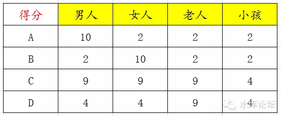
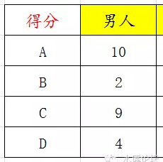

# 市场营销入门 \#210

yevon\_ou [水库论坛](/) 2015-06-03

市场营销入门 ~\#210~

"职业炒家"这个话题并没有说完，后面还有789。

只不过我们对Hard Sale感到厌倦。从今天起，我们换个话题。

首先，让我们看一张图表。假设市场上有男人、女人、老人、孩子四类人群。有A、B、C、D四种商品。请问哪种商品最佳。

}

1.  胜组

这个问题的答案，是 B \> A \> D \> C

这道题我问过很多人，一般最常见的回答，多数人都是选C最佳。

因为你简单加一加，A的总分是10+2+2+2=16分

B是16分

C是31分

D是21分

很多人立即会以为，C具有全方位最佳的"性价比"。在客店内更受欢迎，能卖出更好的销量。产品可以更加成功。

这个就是市场营销学和普通人的区别。也是欧美公司，可以在中国市场称雄肆虐的原因。

科学家会武功，神仙也挡不住。

你看，假设有一个男人，在商店里待了5分钟。他出来的时候，手里拿着什么。拿的是货物A。

再来了一个女人，逛商店5分钟，她买的是货物B。

再来一个老人，他买的是C或D。

再来一个小孩，他买的是C或D。

再来一个男人，他买A。

来个女人，买B

来个老人，C或D

来个小孩，C或D

一天下来，假设来了"男女老少"各100人。则400人最终的购物商品是：

A：100件

B：100件

C：100件

D：100件

2.  问题之症结

你发现问题之所在了么。

当一个男人跑进商店，他根本不会考虑别人的想法。根本不会考虑女人们的价值观。他选的是自己喜欢的商品。

也就是这棵决策树中，他是竖着长的。

在男人眼里，他就是选择ABCD，他就是选最好的。所以他会买A回家。

同样道理。女人购物，她就会选B回家。

而商品C，虽然他在男人女人的眼里，得分都是9分。可是9分没有用。和露瑟没有区别。

一般而言，成年人的市场，是老人和小孩的10倍。\[1\]

而其中，女人市场又比男人市场重要。

所以B是最大的赢家。B \> A

然后我们来看C和D二样商品。

在成年人，男人女人的市场中，C和D都是完败。

但在老人小孩的细分市场中，他们还有一线转机。

这其中，D又比C好。

为什么。当一个老人或者一个儿童，走进商店的时候，他们面临的C和D打分几乎是完全一样的。

可是你别忘了，C的综合评分比D高。

C是9+9+9+4，综合评分高达31分。

而D的累积评分，只有21分。

"更高的品质往往意味着更高的成本"，即使C和D的销量一样。但C的成本往往要高一大截。

所以D \> C

总评分是B \> A \> D \> C，C是最差的选择。

3.  市场营销学的选择

中国人并不是一个整体，不是蚂蚁。\[2\]

每一个人，都是独立的个体。都有他们的喜怒哀乐。都有他们的习惯和偏好。

上周大象工会一篇《什么样的外星人可以直接打死》中，大象写道，传统意义上，国企老总把中国人理解成"中山装，红袖章，清一色面孔的人"。

而在西方社会，每一个人都是鲜活的人。

中国的企业家，传统上总是梦想做一件"最好的商品"。想用一件商品来满足十亿中国人。

这是一个巨大的工程。呕心沥血，最终"工程师治国"老总造出来的，可能是一件"9，9，9，9"的商品。

各方面指数都接近完美。要让所有人都满意，不容易呵。

而西方的500强企业，早早地就把中国消费者分成了"中国男人""中国女人""中国老人""中国小孩"。

他们设计4种产品。

成本更低，研发更快。反应链更敏捷，潮流更时尚。三个月就可以上市，成本只有你一半。

"无论哪个消费者走到店里，购买的都是我的（某一样）商品"。

西方500强奉行的是"10，1，1，1"商品指数。

并无情地把你"9，9，9，9"销量贬低到零。

这个细分，还可以更进一步分下去。譬如中国男人，还可以进一步分为北京男人，上海男人，广东男人，四川男人，东北男人............

如果你在男装市场陷入了泥沼，你可以试图进一步思考广东男人和东北男人有什么不同。从而获得细分优势。

你这商品可能狗Shit都不如，但在四川男人眼中，它是最棒的。这就够了。四千万消费者足够养活你了。

"细细分"是支脉话题，就不展开了。

4.  价值观的颠覆

"市场营销学"的价值观是什么。价值观就是"没有（hexin）价值观"。

请你把中国人视为一个个的人，而不是一个巨人。

中国应该有十万万个价值观，而不是一个价值观。

在营销学上，一直有一句著名的谚语："一个高级副总裁，可能会为他的定制男装感到骄傲。并在办公室里炫耀。而在他18岁读大学的女儿眼里，却会被贬得老土一文不如"。

这就是Marketing中的一条铁律："甲之美酒，乙之砒霜"。

你永远不可能让所有的人满意。同一件商品不可能覆盖所有消费者。许多人的审美观，是互相矛盾，甚至相互冲突的。

一个45岁的高级副总裁，和他18岁的女儿，其审美观必然是不同的。让他们同去选购西装，肯定是无法达成共识的。

所以Marketing思想的背后，其实是西方社会光辉灿烂的"多元文化"主体论。尊重每一个人的想法，用不同的商品适合不同的消费者。在每一个市场都做到第一。

只要你付钱。

另外说一句题外话。除了某些技术类的公司，譬如Windows桌面操作系统，高通的CDMA电信标准；

一般的消费品，很难做到市场第一。甚至百分之20\~30%的份额都属不易。

因为市场是多元化的。消费者的口味是互相冲突，自相矛盾的。

喜欢甜的，和不喜欢甜的。

喜欢蓝色的，和不喜欢蓝色的。

喜欢苹果味的，和不喜欢苹果味的。

所以单一产品无法满足所有消费者，无法占领100%的市场份额。

而如果一家公司旗下有多个子品牌系列，交叉火力，能否覆盖占领整个市场呢。中国销量排名前六的洗发水，有五家都是P&G旗下的。

答案还是不能。因为你同一家公司旗下诸多资源品牌，你就会加以"整合"。共同渠道销售，广告商誉，品牌Logo等资源。

而这一切，都会让消费者厌倦。许多消费者选购SLEK舒蕾，纯粹是因为不想看见那个"宝洁蓝"。

同一商标能占领的市场份额也是有限的。你不可能通过并购来扩大市场份额。除非你并购了之后从来不整合。

5.  与楼市的关系

微信号："水库论坛"是一个讲楼市的订阅号。在此我们突然改弦易辙，大讲市场营销Marketing干什么。

因为我们的楼市，本身是一个高度割裂的市场。

在大而化之的"职业炒家"系列文章之后，你要深入了解这个市场，就一定要阅读细分结构。

上海楼市，至少分割成三种截然不同的市场，三类完全迥异的人群。

这三类人，彼此对对方的价值观，地段评级，都看不顺眼。

互相擦肩走过，冷冷地看了对方一眼，一起吐出一句："SB"。

我们常常说，中国没有研究"房地产"的专家。中国只有研究"房地产泡沫"的专家。

我们每天只听见砖家坐而论道，大而化之地说："房地产要崩盘，要跌50%"。

可是房地产内部结构如何，上海分割成哪三个市场。从来没有一个"房地产专家"谈到过这事。能答得上来。

堪称国耻，一群卖大力丸的。

好了。第一节篇幅到此，下集再说。

（yevon\_ou\@163.com,2015年6月3日）

\[1\] 这主要和年龄跨度有关。假设每个年龄段人口一样，儿童是0\~6岁，成年人7\~60岁，老年人61\~70岁。则我横跨54年。

\[2\] 参考文献《什么样的外星人可以直接打死 \|
大象公会》http://mp.weixin.qq.com/s?\_\_biz=MjM5NzQwNjcyMQ==&mid=214571189&idx=1&sn=f5b799c94a64dc51bcf6afb386d2482a&scene=1&key=c468684b929d2be2da1c8fef928b7bbacdd40abab7aa8d26b27691cb5e9ac34bc991878aed0627d62990ed7aee21ceb5&ascene=1&uin=NDkyMjg2OTM1&devicetype=webwx&version=70000001&pass\_ticket=I1wL%2FplLakq%2F21uD8Iikw0V9dFtl1Ek3qMQ4ou8%2FYHDVfOPr9qk681Oc8h54ojZn
