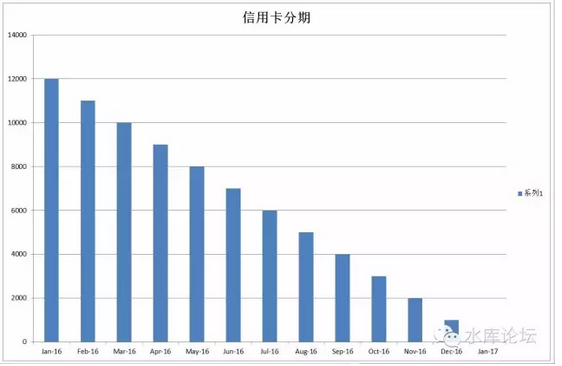
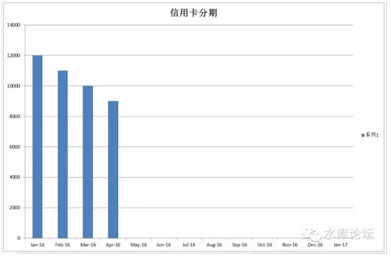

# 信用卡之分期 \#2180

原创： yevon\_ou [水库论坛](/) 2016-07-16

信用卡之分期 ~\#2180~

 

前高后低

 

 

一)分期之利率

 

用信用卡融资，大致有四种实际成本；

 

-   死扛最低还款额，18%

-   信用卡分期，14\~15%

-   促销分期，11\~12%

-   循环套卡，4\~5%

 

 

尾号8880浦发信用卡本月账单人民币50000、美元0.00,最低还款额人民币2500、美元0.00,到期还款日07月31日。分12期还款回复ZDFQ（空格）8880,每期费率0.74%.7/1-9/30通过自助渠道成功办理12期及以上账单分期且累计金额满3万元可减50元分期手续费,见信用卡官网【浦发银行】

 

对于信用卡"分期"的实际利率计算。很多人都是错误的。

举个例子，浦发银行的分期"手续费"是每期0.74%，则这样的行为，消费者实际承担的利率是多少？

 

我们以12000元，分12期为例。

如图，如果你问银行"分期"12000元的话，其实你欠银行的钱，是不断减少的。

-   1月你欠12000元

-   4月你欠9000元

-   8月你欠5000元

-   ............

 

 

如果平均下来，"前高后低"，平均来算，你并没有欠银行12000元。

欠多少呢。

数学平均很容易计算，就是（12000+0）/ 2 = 6000.

所以你实际是"平均借6000，借十二个月"。

 

 

而银行的利息呢，银行的利息是按照"全程"0.74%计算的。

你仔细看银行的业务手册，在那些密密麻麻的小字里面，[他是写着"全额"]0.74%，[而不是"差额"。]

 

所以你实际支付给银行的利息是12000\*0.74%\*12=1065.60元。

真实利率1065.60/6000=17.76%

 

 

所以呢，银行推介的信用卡分期利率，有一种简单的速算法，就是乘以2

-   浦发分期0.74%，实际利率0.74%\*12\*2=17.76%

-   上海银行分期0.65%，实际利率0.65%\*12\*2=15.6%

-   光大福卡分期0.55%，实际利率13.2%

 

 

可见，银行收取你的利息是非常高的。一般都高达15%以上。是名副其实的"高利贷"。

名义上他收取的利率不高，但是要乘以2的。所以实际很高。

 

除了一些刚踏足社会的大学生，以及数学不好的小白，一般人应该尽量避免"信用卡分期"。

因为这是收费很高很高的一个坑。

 

 

二)分期之优惠

 

58折分期手续费来袭！即日起至7/31,通过浦发信用卡官方微信输入"我要分期"或浦大喜奔App办理12期且一次性支付手续费的账单分期或单笔消费分期均可享手续费58折,优惠的手续费在分期成功后的次月返还。限收到此短信的主卡持卡人专享,折扣当月有效,询卡背面热线(活动码E01)【浦发银行】

 

 

在某些情况下，银行会提供优惠。例如上例短信。

 

在优惠的情况下，相当于利率打折。譬如浦发银行这个短信；

打折后他的真实利率就是：17.76%\*58% =10.3%

这个利率还是很高。但可以勉强考虑了。

 

 

银行会时不时提供各种优惠。例如光大福卡，任何消费自动分期。小卡自动免第一期手续费。

则它的实际利率，就是13.2% \* (11/12)=12.1%

 

又或者是，招商银行分12期，经常会有豁免一期，豁免二期之优惠。则：

招商分期实际利率：0.66%\*12\*2=15.84%

豁免一期：15.84 \* (11/12)= 14.82%

豁免二期：15.84 \* (10/12)= 13.20%

 

 

一般而言，各大银行的"优惠"分期，力度都不是很给力。

象浦发58折，已经是有史以来难得了。

分期之后，实际利率也很难降到10%以下。

 

 

 

三)业界良心

 

在所有的分期信用卡中，可以分为二类：

-   工商银行

-   其他所有银行

 

为什么，只有工商银行是与众不同的。堪称业界良心。

如图，浦发银行12期手续费，一共要收0.74%\*12=8.88%

而工商银行呢，他只收3.90%

 

看清楚，3.90%

3.90%

3.90%!

 

这意味着工行的"分期利率"，仅仅是浦发的一半都不到。

按照乘以2的简易算法，年化7.8%

 

 

在所有的信用卡中，大致可以划分为二类。

-   工商银行

-   非工商银行

 

其区别就在于，其他所有银行的分期利率，都在14\~15%左右。哪怕打折促销，再便宜再便宜，也要10\~11%以上。

 

 

而只有奇葩，奇葩，奇葩的工商银行，是可以提供给你一个7.8%左右的分期利率的。

这是革命性的区别。

 

因为8%是一个门槛。多军还是比较保守的。

对于8%以下的资金，我们大规模使用。对于8%以上的资金，我们很少使用。

"借高利贷炒房子"，那是疯魔流的做法。

疯魔流的介绍，见之前炒房各大流派卷。

 

所以工商银行信用卡的地位非常崇高。工行信用卡额度，和其他信用卡是分列的。

很多时候，我们就把"ICBC额度"当现金用。

 

 

工行分期3，6，9，12，18，24，真实利率差得不多。

一般因为刷得多容易封卡，所以我们倾向于分24期。

 

最后补充一下，工行还有一种"牡丹畅通卡"。

畅通卡的分期利率，比标准表格还要再低0.25%左右。

但是最近工行挺坏的。拒绝把畅通卡和其他普卡调平额度。

 

 

 

四)工行分期的技术问题

 

假设给你一张100W的工行卡，你最多可以获得多少现金。

答案并不是100万，而是928591.3元。

 

因为工行在申请分期时，他要求"手续费内含"。

譬如你申请24期分期，费率是7.69%

 

你申请100W元的分期，系统就会要求一笔107.69W元的扣款。

他会要求"全部费用都在授信额度之内"。所以是一零七万。

因此获得现金上限是100W/107.69% = 92.85W.

 

 

 

另一个问题，100W元的工行卡，分24期，每个月月供多少。

答案并不是4W。

而是8W。

 

因为你100W元消费。然后分24期，月供4W。

可是过了一个月。你还了点。还剩96W。

又过了一个月，你又还了点。还欠92W。

..................

 

这富余的8W额度，你并不会浪费。

你会进行一笔8W的消费，然后再做这8W的分廿四期，月供3000.

 

再还再分，再还再分。

............

最终这会形成一个等差数列。计算比较复杂。你实战一回就明白。

 

一般我们给你的"速算"答案就是8W，翻倍。

这个技巧没有太大的意义。纯粹让你对自己的现金流心中有底。

 

 

 

五)上海银行神器秘法

 

有没有办法把"非ICBC分期利率"降低一点。

答案还是有的。

 

在水库上，之前我们发过一篇私享文章：《上海银行神器使用秘法》

http://www.shuiku.net/forum.php?mod=viewthread&tid=11824

 

它讲的是银行信用卡分期系统中的一个bug，所谓："截断"。

 

上海银行的"分期客户协议"中，有一条额外的条款；

-   客户可以申请"提前还款"。提前终止分期

\
 

如图，我们知道"浦发分期"为什么贵。其实仅仅的0.74%\*12=8.88%，他并不是太贵。

如果你借了12000元，一个月付利息88.80元，其实并不是太高的利息。

 

利息真正高昂之处，在于你"越还越少"越还越少。

-   当你本金还欠10000

-   当你本金还欠9000

-   当你本金还欠3000

-   当你本金还欠1000

 

当"借欠本金"已经减少，可利息不变，还是88.80元。那就十分恶心了。

最吸血的情况，借1000元，一个月88.80元利息。那就是九分息了。

香港黑社会都没这么恶劣。

 

 

那应该怎么做呢。做法就是借助银行特殊协议"截断"。

如图，我就只借你4个月。

本金从12000-\>11000-\>10000-\>9000.

 

在9000这个时候，我就申请"提前还款"。把全额还了，然后再借出来。

这样，我的实际欠款平均是：（12000+9000）/2 = 10500元。

真实利率是：88.80\*12/10500= 10.15%

 

利用"截断"，你可以把分期利率控制在8%\~9%\~10%\~11%左右。

每三四个月截断一次。眼看看"本金/利息"不划算了。你就截断提前还款。

 

 

最后声明一下，因为手贱写了那篇《上海银行神奇秘法》。

后来不知道这个洞，传到上海银行卡部了。

于是这个洞就塌了。

上海银行发布公告，"分期不允许截断"。

 

但是呢，全上海有32家信用卡发卡行。

咳咳，也有小径开着的。

 

\* 之前ICBC也可以分期截断的。那画面太美，不敢看。利率低到\<4%。

 

 

 

六)分零期

 

还有一个丧尽天良的做法。即所谓"分零期"。

 

 

如下表。假设7月5日刷卡，8月30日最后还款日。金额50000元。

-   到了8月29日，向银行申请"分期付款"。

-   银行簿记为8月29日"收入50000元"，本期账单还清。

-   银行9月5日出新账单，记录4166.66元消费，和325元手续费。

 

 

但是，你还有一种做法；

-   到了8月29日，向银行申请"分期付款"。

-   银行簿记为8月29日"收入50000元"，本期账单还清。

-   9月4日申请"取消分期"。

-   银行簿记为9月4日消费50000元，9月30日最后还款日。没有手续费。

 

看到没有，在这样的操作方法下。你的还款日，由8月30日，变成了9月30日。

足足延缓了一个月。而且没有任何手续费。

 

更为严重的是，这个方法是可以"一直做下去"的。

也就是你9月还能再搞一次，再延到10月，11月，12月。

 

这实在是太丧尽天良了。也纯粹是攻击银行bug。

我们今天把它写出来，就是不准备使用的意思。

 

 

咳咳，贵在创新，举一反三。

 

 

 

七)分期与征信

 

在旧版征信中，"分期"是不列入征信的。

 

也就是你消费了银行50000元，接着去申请房贷，银行会认为你贷款太高。

但是如果你把50000元"转为分期"。他立即在征信上"消失了"。

征信会直接显示你的信用卡没有任何欠款。没有任何月还款额。

 

在新版征信中，应该是有所改进。

 

 

 

（yevon\_ou\@163.com，2016年7月15日晚）
