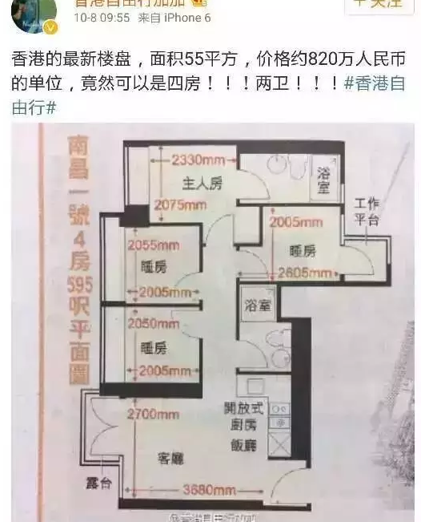

# 装修基础知识概念 \#2550（应该是欧大编号重复了）

原创： yevon\_ou [水库论坛](/) 2016-10-10

装修基础知识概念 ~\#2550~
=====================================================================================================================

停更了一段时间，今天我们继续顺原大纲讲下去。

 

这篇本来叫做《凤变冰基础知识》，讲的是老破小如何包装，如何装修，最后做出冰冰一样的效果。

 

只不过装修这一行，我也并不能算顶级高手。最多只能算二流。

而且我疏懒已久，已经有一段时间没跑装修了。很多事有点遗忘。

所以简单地谈一点框架原则。

 

 

一）基础知识

 

装修分二种，小于40平米的装修，和大于250平米的装修。

这二种装修天差地远，截然不同。几乎可以说是完全不同的工作。

 

其流程，经验，材料，工期，各大概念完全不同。

甚至都没有了交流的必要。

 

 

在本文中，我们主要介绍的都是"小于40平米"的装修。集中于一室，一室半，二居之类的。

上限不超过60平米。

因为"凤变冰"面积是很重要的一个因素，最理想是30平米以下极小户型。这样的话租金比例回报最高。

其次是50平米二居，厅完全不需要。可以住二个家庭。

相对于底层消费市场，任何一点舒适性都是浪费。你多5个平米，买来都是价钱，但是并不能显著推高租金。

 

 

而一般女性读者会比较关心"标准二房"。

也就是90\~100平米的2/2/1.

这一类的设计该如何处理。

 

这一类的设计，您找设计师啊。

我们教授的是[炒楼赚钱]的技巧，不会关心你文青[婆婆妈妈的自住需求]。

想要"温馨家的体验"，把大小姐脾气发在设计师的身上好了。

 

 

 

二）开始入手

 

装修的第一件事，是找个团队。

 

找装修团队有二种方法，一种是找著名的装修公司。

譬如上海有荣欣、波涛、申远空间。

还有百安居，土巴兔，888元/平米的小米装修。

 

\* 如果你用百安居装修团队的话，则他们往往会强制你只用B&Q的建材。

\* 搜装修队千万别用百度

 

 

选择大型"装修公司"的主要缺点，一个是贵。

任何账务，只要通过"装修公司"走帐，7%的营业税是逃不掉的。

装修师傅是绝对的政治强势团体。你什么时候见过装修师傅个人交税嘛。

但包进企业，就要交税。

 

 

装修公司，一般会额外收你一个5%的"监理费用"。表示他们为你进行了质量监控。

再加上指定购买材料，行政费用和利润。

一般找装修公司，总体费用要贵20\~25%以上。

 

 

而另一个方面，则是装修公司"品质并无保证"。

装修这一行，严格地说一个团队就只有4个人。一个木工，一个泥水匠，一个总装，一个工头。

所以市场上的装修队以小型的"家庭式作坊"为主。

 

即使是装修公司，其实他也是一个个无数小团队"挂靠"的。

其核心还是四人团队小作坊。无非额外收一层管理手续费。

 

 

因此，对于职业多军，他们更多的是选择"御用装修队"。

御用装修队就是说，你先装一二次。

觉得效果，服务，态度都不错。以后你就把工头的名片留下来。

 

下次再要装修的话，直接找工头。

这样不用通过"装修公司"中转，节省至少20%的费用。

而且更灵活。小修小补也能弄。

甚至每次租客退房，或准备售房之前，都是需要"保养"维护弄一下的。

 

多军们的量很大。

以一支典型的装修队为例，流水线滚动操作。一年可以接12\~15单。

但是多军内部，派给他的单，每年可能就有6\~8单。

 

因此多军和"御用装修队"的关系是非常牢固的。太熟了，他们也就不会坑你。彼此沟通也更默契。

 

几乎可以说，半支队伍都是我们养起来的。

 

 

 

三）装修步骤

 

装修主要分四个步骤；

 

1）水电隐蔽工程

2）木工

3）泥水匠

4）总装

 

其中，最令人烦恼的，和技术含量最高的，是第一步："隐蔽工程"。

 

 

和许多人预想的不一样，普通人总以为装修中最难的是什么。

是繁复的吊顶

射灯，灯光，配饰

大吊灯，电视柜等等高大上的东西？

 

 

都不是，这些东西，甚至可以说是"毫无难度"的。

因为他们都是"表层"的东西。

如果用手来比拟，是骨骼，筋络，肌肉，一直到了最外层的表皮。

 

在手上涂涂画画，那是最简单的事。洗个手就没了。

大吊灯，电视墙，这些都属于"表层"类的东西。随时可以拆下，搬走。

不客气地说，象侦探片里拍的。给我168个小时，我可以把你家改造得你进门不认识。

 

 

而真正困难的，是"隐蔽工程"。

因为现代文明社会，人人爱美。再排明线走管，是绝对不能忍受的事情。

所以一切都是暗线。

 

暗线意味着，当你这个房子还是毛坯的时候。

哪里是电视，哪里是冰箱，哪里是床头柜。

哪里手机可以充电，哪里Hi-Fi可以连线，空调挂壁在墙上开哪个位置洞。这些都是六个月之前就要想好的事。

 

你好比Dolby 5.1音效吧。他是二个喇叭在前方，电视机旁。

五个喇叭在后方，沙发环绕。

则你布线，要预先从地板下面穿过，二路线在地面，二路线在天花板。而且音响线还特别讲究。

当你还没有开始装修时，你就想好了，这里是放Hi-Fi的，沙发是什么形状的。甚至换个Cybertech款沙发都不行。

 

 

但是我们的社会，是一个剧烈变动的社会。

每一天，每一刻，不停地有新科技出现。不停地有新材料。

好比Wifi的出现，就使得原先每个房间预留的网线不再重要。

AirPlay的出现，使得原本预留的视听媒体中心不再重要。AV转接枢纽形如废物。

 

技术不仅有好处，也有坏处。

你以为你全部都预留到了。

但是你楼上楼下的Wifi需要桥接，而楼梯口没有电源插座怎么办。无数无数的问题。

 

 

这就是"大房子装修"和小房子的区别。

随着你面积的增大，你的"深谋远虑"难度是呈指数复杂增加的。

 

而且大房子的装修周期很长。随着装修的深入，你LP，你老妈，你ZMN，无可避免地会来"视察"。

领导的每一次视察，都会带来新的"最高指示"。

 

转角可以做个吧台，厨房门可以换个方向开，洗衣机的位置不喜欢，床的背后增加二大排衣柜。

妈咪呀，你知不知道洗衣机换个位置，是要做下排水的。

 

 

 "隐蔽工程"做好了以后，这一切都是无法更改的。而每一个"合理化"意见，其背后都要非常巨大的工作量。艰苦卓绝的返工。

斑斑血泪。

 

 

前些年，某人买了一套世茂滨江。精装豪装。原本是拎包入住的。

可是世茂是老牌豪宅，造的年份太早，室内没有地暖。

 

老太太一句话，要地暖。那怎么办。

把所有的豪装，腾空60cm。海拔60cm以下的区域，全部铲掉。

 

把整个地板彻底翘开。不可避免的全部水管电管重铺。

然后安装地暖，然后再重新覆盖上去。

 

然后你再想想那墙纸.........

60cm腾空铲掉。复原后再把墙纸续接上。修旧如旧，颜色一模一样。这又是怎样的难度。

 

整个工程，耗时八个月。花掉了60几万。

而地暖本身的成本，不过十几万。

 

 

 

再有一次，某个做企业装修发了财的亿万富少，买了套洋房自己装。

真心是被他老娘弄烦了。

发下了狠话，"设计图纸怎样的，一个字都不能改"。

哪怕装得土，哪怕没效率，哪怕水龙头装反了。我就是不能让你改。一个字都不能改。

否则不停地返工，这事就没底了。

 

大少向来以孝顺出名。

"老娘，您要是想提合理化意见"。

"我把隔壁那套又买下来了，一模一样的户型。咱再装一次不就得了么"。

 

 

 

扯得远了，哥哥做大房子，那是斑斑血泪刻骨铭心。

"老破小"流不是我的主战风格，最多只能算略懂二流高手。

 

老破小的装修，要简单得多多。

40平米的房子，和240平米的房子。装修难度绝对不是相差六倍。而有可能是十六倍。

 

 

对于老破小来说，它一共就只有这么点面积。变化不大。

都已经形成了固定套路。无脑照搬即可。

 

整体工期，可以压缩在45天以内。

而且因为老婆，老娘，ZMN，通常都对"老破小"兴趣不大。

也很少到工地视察，给出最高指示。简直是幸福完美。

 

 

 

四）材料和费用

 

关于装修，小白们最喜欢问的另一个问题，"去哪里买才省钱"。

去哪里买质量有保障，价格便宜，有没有推荐的御用。

 

我们回答只有二个字："淘宝"。

 

 

很多人忽略了一件事，材料的费用，在今时今日今天，已经越来越不重要了。

2007年我装修一套51平米的房子，一共花了30000元。其中；

-   装修费22000元

-   人工费8000

 

折算下来，大约是75%:25%，而人力费用在160元/平米。

 

 

而今时今日，前天拿到装修师傅关于闵行一套房子报价。

-   材料费550元/平米

-   人力费370元/平米

 

可见，物料成本在近十年并没有明显的升幅。家电费用还在下降。

而人力成本几乎翻了一倍。占40%

未来甚至可能人力占50%以上。

 

 

而在总体的"物料成本"中，你又可以用ABC分析法。

ABC分析法指工厂企业，仓库管理常用的一种方法。其中：

-   A类商品，20%商品占了80%价值

-   B类，打酱油的

-   C类商品，80%商品占了20%价值

 

 

对于装修成本来说，厨房，卫浴，地板，油漆，这些A类占据了80%以上的货值。

剩下的五金件，腻子，一共才20%价值不到。合计不会超过一万元。

 

你把四五个大件控制好。剩下一万元何必斤斤计较。

由于整个话题很大。我们后面的篇幅再慢慢细细讲。

 

 

 

（yevon\_ou\@163.com，2016年10月9日晨）
