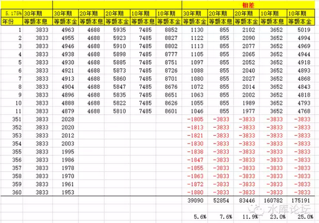

# 贷款选择的精算法 \#2280

原创： yevon\_ou [水库论坛](/) 2016-07-31

贷款选择的精算法~\#2280~

贷款应该如何选择，贷20年还是30年。

等额本息还是等额本金。

数学上可以严格证明存在最优解：30年等额本息。

一)学术腐败

有一句笑话，说中国没有研究"房地产"的专家。哦，那么多人是干嘛的。中国只有研究"房地产泡沫"的专家。

我们目前是整个学术圈的糜烂。诸多专家口诛笔伐，都在痛骂指责"房地产泡沫"。中国只有研究崩盘泡沫论的专家。

而真正和房地产有关的原理规则技巧呢。却没有人研究。

举个例子，贷款是应该20年好还是30年好。

等额本息好还是等额本金好。

光这个问题就可以吵上几十年。

更有甚者，目前的银行一线工作人员体会是:"等额本金"好。

很多客户知道了等额本金之后，哭晕在沙发上。纷纷拉着信贷员的手说，原来还有这样的好东西，你为什么不介绍给我。

甚至还有粪青怒而发文，等额本金更优异，银行为什么故意不介绍给客户，是不是想多赚利息。

这些都是篱笆（liba.com）网上真实发生的事情。篱笆是和水库类似，一个谈房产的BBS论坛。只不过水平远逊，约相当于小学生的水平。

却反映了目前DS社会底层的真实面貌。能见到普通人是怎样弱的。

至于贷款20年好，还是30年好，则讨论得各有千秋。

比较主流的说法是："要看你拿了钱去做投资，投资收益超过5.175%，则30年好。否则应该越短越好"。

这快成了理论结语，以及主流"共识"了。甚至一些比较大卡的财经杂志，类如《理财周刊》，也会引用如此的说法。

当然，还有一些非主流的用户。主要集中在女性。

"银行贷款最不划算了。它是倒过来算的。先还利息，后还本金。所以贷款短的话，前几年全部都是先还利息"。

更脑残的是，这样的言论居然还十分普及。包括一些高等教育的所谓白领丽人。

只能说，女人都是火星动物，和ET没啥区别。

二）最优解

我们来看二个情况。

Case 1，你每月月供4000元。

Case 2，你每月月供3000元。但可以选择性加供1000元。

利率都是一样的。请问这二个情况孰优。

答案至为明显。Case 2绝对优。方案明显胜出。

因为这相当于你多了一个选择权，多了一个Option。

Case 2当你在还月供的那一刻，你可以选则是还3000，还是还4000。

如果在还款的当月，利率十分之高。譬如正值新股发行，又或者有好的投资项目。那你就还3000。把剩下的1000拿去做投资。

如果当月投资回报一般，那你就还4000。最坏的情况也就和Case 1打平。

这是怎样一个模型呢。这就是20年月供，和30年月供的模型。以一笔9折贷款，700000元为例；

20年月供，每月4687.63元

30年月供，每月3832.97元。二者相差854.66元。

因为在中国，是存在"提前还款"制度的。而且提前还款，通常是没有罚息的（一年之后）。

所以最优的策略是，你永远应该选30年期贷款。然后不停地提前还款。

哪怕你想好还款能力很强，这笔贷款七八年内就会还清的。你也不要选八年。

而是应该选30年，然后不停地提前还款。

因为银行和你签的协议，相当于一份Duty。约定了你每月必须得还4000。这是一种约束。

还不如约束每月还3000，而我有多还的自由。

这样，哪怕遇到职场风险也不怕。安全系数更是大大增强。

最后说明一下。这个策略会有一点点小小的费用。以每半年提前还贷一次而计，大约在20元左右。

三）等额本金与等额本息

等额本金和等额本息哪个更划算。

当然是等额本息更划算。

理由呢。如前所述。30年期贷款比20年期更划算，因为你可以拿着3000元月供，还有1000元的选择权。而不是银行逼死你的每月"必需"得还4000。

如果有更好的投资机会。甚至万一你失去工作。

"收益性，安全性"，都是等额本息更佳。这是绝对优。不存在争辩的余地。

"30年期等额本息"是所有贷款中最优的选择。这是绝对优，不存在争辩的余地。

如果有谁还在说"看具体情况""酌情而定""因人而异"。那么他们多半就是大卡经济学家。混饭吃的。

四）定量计算

知道了"30年期等额本息"是所有贷款中的最优选择。我们甚至还可以进一步地告诉你，划算多少。差百分之几。

在这里，我们选择的贴现率是15%。不要问我为什么。关于货币经济学的解释，会另外专启文章。你只要记住这个结论就可以了。

另外要注意的是，这个贴现率和前三章无关。无论15%还是12%还是8%，"30年期等额本息"都是最优解。

以一笔9折，70万元贷款为例:

其中，基础是"30年期等额本息"，每月还款3833元。

然后旁边是另外五种按揭模式的月供，以及他们与3833元的差额。

对账这一系列的差额，以NPV(15%/12，J10:J371)代入，就可以得出他们的贴现值。

答案十分清晰，相对于"等额本息"而言，"等额本金"大概贵了5.6%

你贷款100万元的等额本息，和贷款94.4万元等额本金，效果是一样的。

这是一个巨大的差异！

另外几种贷款模式，于此类似，"30年期等额本息"是最划算的。如果他贷100万元，则；

-   相当于以30年期等额本金贷款94.4万元

-   相当于以20年期等额本息贷款92.4万元

-   相当于以20年期等额本金贷款88.1万元

-   相当于以10年期等额本息贷款77.0万元

-   相当于以10年期等额本金贷款75.0万元

不懂计算亏一生。很多人仅仅在"贷款方式"选择上面，就轻易地亏掉了数十万元。

或许有人会问。你这个15%的贴现率也太高了。做什么样的投资，才能达到如此回报呢。

很简单。因为差异还是较小，每月仅数百数千元。所以简单的"烤鸭烧鹅大法"即可。

你每天晚上回家，路过老广东菜馆。对，就那家卤香四溢的广东菜馆，你多带一只烧鹅回家。当作加餐。

你不用做什么投资。你就纯消费，每天多加一餐，每餐多加一道菜。

你的人生就赚回来了。每一分钱都更有意义。

就象有的哲人说的，"人生真正的财富只有二种，陪伴孩子的时间和你花出去的钱"。

(yevon\_ou\@163.com，2015年3月11日晚)
