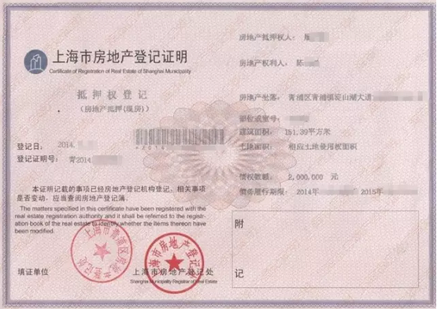

# 杂食与多核之读后感 \#2440 
--------------------------

原创： yevon\_ou [[水库论坛]](/)
2016-09-09

 杂食与多核之读后感 ~\#2440~
=========================================================================================================================================================================================================================================================================

 

《杂食与多核》写于三年之前。

另补一篇弥补上下文。

 

 

一）多核

 

很多人都在问，"信用贷，信用卡，房贷"该按照哪个次序来申请。

因为如果一个人名下的信用贷很多的话，他会办不了房贷。

一个人名下信用卡很多的话，他会办不下信用贷。

 

 

这个问题问得不对。

因为他还没有摆脱"单核"的思维。

 

戏法人人会变，各有巧妙不同。

很多事情，很多场景，就是一句话。讲出来，就"破局"了。

 

 

对于"信用贷，信用卡，房贷"这件事来说。你要站在"多核"的角度来看。

好比你有八个核。

当你申请房贷，申请新的新用卡，申请新的信用贷之时，你必须保持"张三"的信用记录是完全干净的。

 

 

现在的央行征信系统，经过了几次升级。基本上所有的"负债"行为都会有所记录。

但是你可以"没有负债"。

 

在你申请的那一天，"张三"名下的确是所有的信用卡都还清，所有的信用贷都没有使用。

干干净净，漂亮得不能再漂亮。

 

 

如果你是"单核"思路，这样做法会招致以灾难。

因为"信用卡+信用贷"，都已经变成了长期资金。变成了你首付的一部分。

如果把信用卡全部都还清，这压力是难以承受的。

 

可是如果你有8个核呢。

那就等于你还清1/8的信用卡额度。还剩下有7/8的额度。

那就一点压力也没有了。

 

 

ps.另外补充一下。信用卡申办后，"没有开卡"，统计方法也是不同的。

预先把所有的信用额度都申请满。但是不要开卡，不要使用。

也能使得你的征信报告大大好看。

"信用贷"同理。

 

 

二）信用卡总额度

 

同理，另一条科技树，"信用卡总额度"。

 

目前外面的行规，大概是：

-   普通市民80W

-   公务员130W

 

等一个普通人，他的"信用卡总额度"达到了人民币捌拾万元以后。

他再去"申请新卡"就变得极为困难。

 

按照人民银行的指导精神，信用卡额度进行总额控制。

既然每一家银行都能看见你的信用报告。则到了80W元以后，32家也寸步难进。

 

 

可是我们知道，资深的多军，往往都要拥有500\~600W的信用卡额度。甚至更多。

一般400W额度可以维持300W的输出。这是最基本的要求了。

又如何做到呢。

 

说穿了一文不值。也是靠"多核"。

 

 

一个身份证的上限是80W元。

那你为什么不多用几个身份证呢。老爸老妈，表弟表妹，同窗铁友，每一分力量都可以调动起来。

 

我们见到哪怕信用卡《[[空当接龙]](http://mp.weixin.qq.com/s?__biz=MzAxNTMxMTc0MA==&mid=2651014760&idx=1&sn=3082d0dd2433468e0663480e7478c7f0&scene=21#wechat_redirect)》系列写完以后，反馈绝大多数的网友依然只有80W元的额度。

因为你没有调动"多核"。而一个单核的力量，主频始终是有上限的。

 

 

ps.前天水库上有一篇文章《封顶机的岁月》，讲的是另外一种思路。

"失卡上限"的思路。非常好，很有创新值得一看。

http://www.shuiku.net/forum.php?mod=viewthread&tid=47621

 

 

 

三）还款收入

 

"杂食与多核"的第三个应用，是"收入证明"。

 

 

众所周知，"抵押贷款"是一件非常伤身体的事情。

一般来说，我们采取的速算数是1.1%，也就是你一笔300W元的抵押贷款，你的月供就要33000。

 

而另一个方面，按照银监会的指引，33000的月供，50%你就需要66000的"工资证明"。

三百万元在今天，已经是房地产市场一个微不足道的数字。

可是66000元的月供工薪证明，这是什么概念！

 

 

而可怕的是，这还仅仅是一个开始。

如果你办第二笔300W元抵押贷款，你的月供就有66000元。"收入证明"就要开132000元。

如果你办第三笔300W元抵押贷款。你的月供就要100000元。"收入证明"就要开20W。

 

月薪廿万什么概念。毫无疑问，这是一个巨大的障碍。

怎么破？

 

 

一个比较简单的做法，是"房租转移"。

好比最初的六个月，你让所有的房租，全部入LG的卡。

然后离婚，以LG作为主贷人。

 

按照一般银行的要求，"房租是可以作为收入的"。

以P银行为例，它的规矩是"房租按流水算50%，房租有纳税发票按100%计收入"。

这里面就有很大的余地。你不会介意交三个月的发票税的。

 

 

当然，以上都是废话。

真正的核心秘诀是，"并不是所有的银行，都要求房贷不超过收入\>50%"。

 

对于某几家国有亲儿子银行来说，其操办的规矩是"收入\>房贷+5000元"。

也就是你扣完房贷，还能留5000元生活费就够了。

这和\>50%相比，其中的差距，足够填入一个太平洋。

让人泪流满面。

具体请咨询你的贷款中介。

 

 

言归正传，第一轮申请的时候，你把所有的"房租收入"，归并到你LG的银行卡名下。并作为他的收入。

再找一家国有亲儿子银行，这事就算过了。

 

然后呢，第二轮后6个月，你通知房客交租到"LP"的银行卡。

离婚之后，这就变成了LP的收入。

运作同理。

 

 

当然，这个玩法更复杂还能和接力贷结合在一起。

甚至LG给LP作为担保人，二个人收入可以合并计算。然后离婚。

其中的手法和奥秘甚多。

自己悟了。说出来洞就踏了。

 

 

 

四）用残身份证

 

就总体而言，我们的策略是"有计划地用残掉一个身份证"。

 

 

这需要非常谨慎仔细的规划。"信用贷，信用卡，房贷，抵押按揭"，一步步来。

当最终的结果，是将所有的负债归并到A名下。

然后把A名下的收入抽走。

从放贷的那一刻始，使得A身份证彻底残废化。

 

这其中的做法，和"并发式购买"，同时做N套房首套颇为类似。

反正你自己悟了。

记住，"一个个身份证"逐个地废过去。从老人的身份证开始。

 

 

 

五）注意事项

 

注意事项；

1）在59岁之前，一定要将老人的信用卡全部都申请完。

一般59岁和29岁没有区别。但是一旦到了60岁，一退休，信用卡就非常难以申请。

 

如果你正常使用的话，60岁以后，银行并不会把信用卡收回。

也就是你可以61岁，62岁......继续无限的使用下去。到期换卡也没有问题。

 

但是你尽量别惹"麻烦"。

不要引起银行的注意，不要动辄去投诉。真的让银行注意到你了，卡就销了。

 

 

2）接力贷

 

接力贷的二个槛是59岁和65周岁。

一旦过了59岁，接力贷就难办许多。一旦到了65周岁，哪怕只过了一个月，接力贷就几乎申请不下来。

 

所以老人的剩余资源要在59岁之前全部都榨取完。

 

 

3）移民亲戚

 

在所有的"核"里面，最好用的是"移民海外"亲戚。

他们通常学历很高，信用很好。

运气好的话，甚至可以获得二张免费房票。

 

"近系血亲"出国之前，一定要恳求他办完所有的信用产品。

 

 

 

六）核的控制

 

很多人都在问，"核"的控制。

首先，"品德"是最终的保障。人品如果败坏了，则永远都能找出瑕疵。即使你能赢官司，纠纷和扯皮也能恶心得你吃苍蝇。

 

 

当对方"信用基本可靠"的基础上，控制"核"主要是靠抵押证。

小白们不知道，个人也是可以做抵押证的。

 

你如果在售楼处买了套房子，银行办了一笔房贷。最后你拿到绿色的房本。此外，还有一张红色的抵押证。

 

它的形状是这样的(图片来自网络)。

抵押证由银行信贷员去交易中心取来，然后保管在银行保险库的。

比较负责的中介，会给你一份复印件。让你归档。

（如果你从来没见过，那是你的中介比较烂）。

 

 

一般普通人不知道的。"个人"也可以申请抵押证的。

具体是上家，下家，带着房产证，身份证，一起到交易中心去。

 

然后当着工作人员的面，手写一张欠条，"本人张三，欠李四200W"。

交易中心，就可以帮你也出一张红色的"抵押证"。上面记录张三欠李四200W。

收费大约几十元。

 

 

有了"抵押证"之后，最基础的一点，这套房子就卖不掉了。

交易中心规定，抵押证张数没有限制。但是房产若要买卖，其抵押证必须为0.

 

也就是"核"如果想偷卖这套房子，他必须先偷到你的红色"抵押证"。

只要你抵押证好好地躺在保险箱里，则房子至少不能卖。

 

房子还在那里，产权没有变化，剩下的事情就好办。

至少房子还在。哪怕搞些乌七八糟事情，都是小钱了。

 

 

 

"代持"的第二道防线，是"完全委托公证书"。

所谓的"大授权书"。

 

持有了这一类公证书，你就可以在不知会房主的情况下，将该房屋网签，卖掉，收款，及其他各项权限。

"抵押证+公证书"的组合，基本可以防止95%的情况。

 

 

遗憾的是，由于秀相的"宏观调控"。左翼政府无所不在。

为了防止ABC单，秀相出了一条新的规定。

"大授权公证书仅限于直系血亲，而且时效不得超过二年"。

 

这就给你制造了很多麻烦。一般来说，对策只有几条；

1）核是你表哥的话，大授权给你姥姥。

2）和上家结婚

3）外地的公证处管得没有那么严。在许多外地公证处可以办。

 

 

"代持"的第三道防线，是保留所有的文书证据，转账证据。"多人签字见证"等等。

 

 

 

 

（yevon\_ou\@163.com，2016年9月5日暮）
