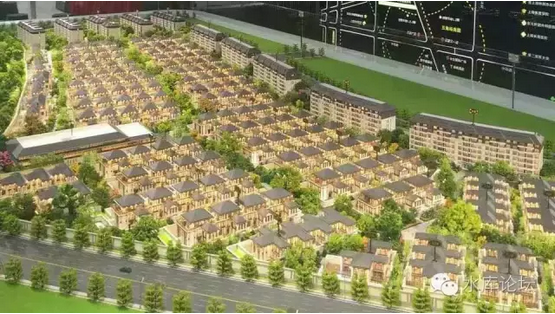
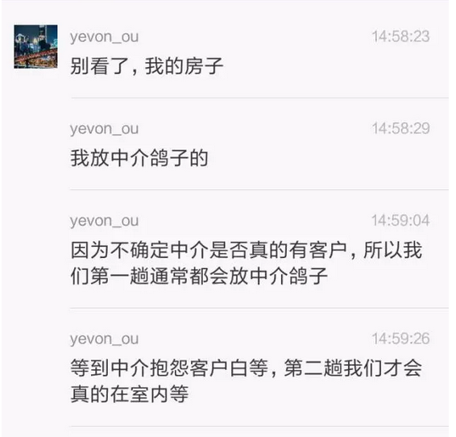
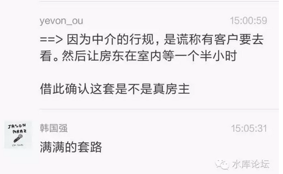

# 你的第一第二套房子 \#2580

原创： yevon\_ou [水库论坛](/) 2016-10-17

你的第一第二套房子 ~\#2580~

兵者，国之大事，生死之地，存亡之道，不可不察也。

 

 

一）开始

 

在你的一生之中，第一第二套房子，是最容易买的单子。

 

并不是说房价不贵。单看到"最容易"三个字，屌丝的膝盖一软。就忍不住想要跪。

我们的意思是说，相对于第三第四，第五第六套来说\-\-\-\-\--第一第二套实在是最容易的单子。

 

 

当你买第一套时，你的"主力部队"还在。

手里可能有积存了三五年的积蓄。公积金余额。奇葩的或许还有定期存款。

房票，贷票绝对不是问题。各项国家优惠政策等着你。

 

 

同时，你的"潜力"完全没有挖尽。

你几乎没有动用到"信用卡"虚空资源。父母亲朋的脂肪也没有燃尽。朋友圈从未开口借钱。

这样的情况下，你还哭诉"买不起房子"。真心是罪无可赦。无他，唯傻耳。

 

 

 

"第一套房"当你购买时，几乎不需要任何技巧。

你唯一需要的。仅仅是下定决心。

咬咬牙，把几百万堆上赌桌。仅此而已。

 

 

我们说，修真路上有三道槛，第一套，第六套，第十六套。

其中，第一套的"筑基"阶段最重要。

 

第一套，是一个分水岭。无论用怎样的言语形容。都不能强调它的重要性。

第一套，是多军和傻空的分水岭。是智慧和偏执的分水岭。是自由主义和计划奴隶的分水岭。

 

因为关于第一套"重要性"的话题太多了。今天我们就不冗余重复了。

对于买第一套房，关键有三点：

-   守拙

-   勤奋

-   大智慧

 

 

 

二）守拙

 

知其雄，守其雌，为天下溪。

\-\-\-\-\-- 老子《道德经》

 

 

假设，假设啊，有一个人，已经决定做多军了。

不要问"多军/傻空"分水岭问题。假设这个人已经决定好做多军了，开始买他的第一套。

请问，他需要注意什么问题。

 

我的回答是："守拙"。

知其雄，守其雌，为天下溪。

 

这句话的意思，是知道自己的长处，知道自己的短处。

原本是"中国棋院"贴在影壁上的。

 

 

 

当你去买"第一套"房子。则你大概率的99.99%是菜鸟。

少数天才不讨论。

 

菜鸟的意思，是你要"听劝"。

小说《英雄志》，江充怒极而笑。三派人马斗到最后，江太师问"你知道我最大的本事是什么"。

死对头踏波而来"其实太师才是我们的生死盟友"。

"太师最大的才能，是自知之明"。

 

 

 

"菜鸟"最缺乏的能力，恰恰也是自知之明。

蠢货总以为自己最聪明。自踏出校门那刻起，好像全世界都欠他的。

 

就"买房"这件事来说吧。多军老手再三告诫的是：

"远郊一手品牌精装CEO盘小户型高单价酒店式公寓"。

 

呃，PLUS"以上全错"。

也就是说，这八个元素；

-   远郊

-   一手

-   品牌

-   精装

-   CEO盘

-   小户型

-   高单价

-   酒店式公寓

统统都是不可以碰的。碰一个道歉，碰二个赔钱，碰三个粉身碎骨。

 

而资深炒楼多军建议的呢，是：

"市区边缘 二手 国营开发商 毛坯 亲民盘大户型 低单价 纯住宅"。

我们只说一次，请牢牢抄下来。并贴在你的床头。

 

 

第一套房子很重要。有学法律界的朋友都知道，上庭的"诉讼律师"最重要的是大学毕业后第一场案子。

很重要，非常重要。甚至有风水上的意义。

如果第一场案子你输了，你会难过一辈子。永远都不会忘记。

 

而对于"炒房业"，第一单案子同样重要。

因为一个人好不容易鼓起勇气，高位接盘花几百万买"第一套房子"。

 

第一套如果不赚钱，对你的士气打击是灾难性的。

对你整个人生观是摧毁的。难保又滑入了傻空的深渊。

 

 

所以多军建议你买房龄略老的二手房。这样的房子，虽然没什么"新鲜刺激"。但是随着大势上涨，却是十拿九稳的事。

新手最怕上手第一单就亏钱。只要第一单能赚，以后都好说。

 

 

最怕的是，有些"聪明人"偏偏不信邪，偏偏不"守拙"。

他们非得有自己的想法。开口第一句话就是："Yevon\_ou是很NB的，但这一趟他看错了"。

"水库建议虽然很好，但我们还有更好的办法"。

 

 

于是呢，多军教导他们"不要购买品牌附加值"。

可是呢，他们第一套，去买了8.5万的青浦万科天空之城（请自行搜下地图）。

然后，就没有然后了。

 

于是呢，多军教导他们"避免处房情结"。

可是丈母娘一个电话打过来，"去买一手新房子"。

然后就没有然后了。

 

于是呢，多军教导他们"只有大城市，才有房地产"。

你妈被销售忽悠去买"桐乡皮革城"。

然后就没有然后了。

 

于是呢，多军教导他们"关注于价值"。

可是你听说"买商铺才是高手"，6%租金回报包租。

然后就没有然后了。

 

 

在过去十六年，哪怕史无前例的房产大牛市。

可还是有不少人亏钱。十六年前买了"桐乡皮革城"的人，到今天也没有出来。

今天花七八万买万科的人，也不知道什么时候可以出来。

 

 

如果你上手买了一手CEO。狠狠地套了几年毫无涨幅。恐怕你也会得出；

"童话里都是骗人的"

"房地产其实不赚钱"。

然后，也就没有然后了。

 

你丫偏偏不肯跟着水库教程做，偏偏要自己添料。

 

（新江湾某新开盘一手房，稠密到近乎没有地面道路）

\
 

三）勤奋

 

守拙，勤奋，大智慧。新手买房的第二个重点，是"勤奋"。

 

 

一直不停地有人问我，该如何买房。

也有人不停问我，"炒楼学"这一科该如何入手。

 

我的回答向来很简单，五个字："看房二百套"。

看房二百套，自然心里象明镜一样。

 

 

我们说的"看房二百套"，绝对不是指你在网络上刷着。搜房网，链家网，一个晚上键盘专家。

我们说的"看房二百套"，指的是线下看房。约了中介经纪人，以实地开门为准。

打开一扇外门算一套。门没开不算。

 

 

 

许多人以为"看房二百套"是一个很简单的任务。

我就问你一个问题，"你知道人一天可以看几套"。

 

我们指的带看，是隔天晚上在网上选好房源，然后打电话给中介经纪人。今天中午请了假，抽了时间去看。

这个数字在香港高一点，因为比较诚信。大约可以看到10\~11套/天。平均每个小时一套。

极限时候，有个小妹妹曾创下一天看了15套。花了十二个小时的记录。

 

而在上海，一般草率的估计，每一天7套。

七套，这么少？感觉不止呀。

 

因为上海的中介和房东都很不讲诚信，里面的套路很多。有空再讲。

总而言之，加上中介打电话沟通的时间。平均每一个小区，2\~3个小时看2\~3套房源，基本就这个效率。

而上海又很大，你换一个小区继续看。路上的交通时间往往就花了不少。

再加上中介接头，打电话沟通。

总的来说，你花一整天在上面。周六上午9:30出门，17:00回巢。基本就看三个小区7\~8套。

 

 

 

而"看房二百套"，纯粹从这个"看房"的数字来说。哪怕你把全部的双休日都扑上去，每个周末看14套。

你也需要14周左右。三个半月。

 

在这三个半月内，你的劳动是"高强度"的。

看房绝对不是一种随便跑跑的活。尤其随着巡游半径的增大，体力消耗急剧上升。

 

每一天晚上，你都要做好工作，预先和中介约定好明天会面。

然后，你还要忍受中介的种种套路，种种陷阱。

"房子看不到，给您换一套"这已经算最轻的欺骗了。

 

 

 

你设想一下，假设你花三到四个月的时间，高强度的，全心全意去做一件事。

和中介充分博弈，充分搏斗。

三个月之后，你的战斗力会不会"脱胎换骨"。

 

看房这种事，看到后来"眼睛一瞥，心中有数"。任何一套房子，在楼下逛二圈，心中就估个八九不离十。

 

常常有人问："这套房子笋不笋"。到底是不是买点，到底是业主急抛，还是本身价格就低。

这种问题没法回答的。就算我回答了，你也听不进。

 

所以你需要的，还是"看房二百套"。

当你花上十四个星期的双周末，每个Weekend都从眼睛睁开一直忙到忘记吃午饭。

则四个月后，你自然成了大师。心中自然有一杆秤。

无差别人类劳动。

 

 

 

此外，"看房二百套"还有一个好处，是有可能打出"笋盘"爆击。

笋盘在哪里，我也不知道笋在哪里。

看房二百套，自然有笋盘。

 

这一个片区，你几乎每套房子都看过了。然后一下子眼前一亮。美女和美房一样难以掩饰。赞不绝口。

 

 

 

笋盘从逻辑上来讲，有非常大的救命意义。

尤其是对于一些"聪明人"。

 

对于"聪明人"来说，他永远觉得房价贵了5000元/平米。

反正是全世界都欠他的。看任何一套房子都很好，但最求任何一套，都能给他再砍5000元/平米。

聪明人总是想着赚尽最后一分钱。聪明人的下场往往凄惨无比。

 

 

在过去十六年，死得最惨的就是这帮"聪明人"。

他们的名字，简直成了"观望"的代名词。

此后房价涨了十六年，他们就"观望"了十六年。一直从内环三房，观望成了郊环厮所。

 

 

对于重度"聪明人"那是无药可救。

对于轻度"聪明人"，则笋盘可以医病救人。

 

笋盘七折，相当于回到了一年前的价钱。

"聪明人"不是不明白。有的时候也真是一步踏空，难以放下面子而已。

 

现在你和他说，"房价"可以回到一年之前的价格。他可以用一个七折买下错失的房子。给他一次Load/Save的机会。

这个时候，"轻度"智障的聪明人，是可以拯救的。

他还来得及幡然醒悟，赶紧一把紧紧抓住。

 

至于"重度"的，打了七折不够，还要再打三折。

40000元/m的房子，30000元/m卖给他，他还嫌不够。非得要4000元/m。

那还是赶紧换LG吧。

 

 

 

如果有人说，老师，您这第二节，还是没什么干货呀。

那我问你，95%的人，看房不足20套。

是不是，你自己举手。大家可以做个投票调查。

 

"勤奋"本身就是一种智慧，一种最大的智慧。

只要你老老实实地做到了"看房二百套"。你本身就已经战胜了95%的业余选手。

 

 

 

四）大智慧

 

兵者，国之大事，生死之地，存亡之道，不可不察也。

 

 

最后，提一个问题。

假设你预计了周末，约好房产中介去看7套房子。可是你现在发现自己无法出行了。

为什么，因为你要赶图纸。

 

你手头有一张小组长摊派下来的图纸。例如，苦憋的设计院攻城狮。

甲方要求改图纸，厚厚的二百个圆弧，这个周末要赶出来。

请问，你怎么做。

 

 

答案很简单。

99%的理工男会选择"工作为重"。事业最重要，最崇高，最高尚。

然后，就没有然后了。

 

 

我们曾经提出过一个问题，难度依次从高到低。

1）老板下午宣布你提干

2）老板下午提干面试。三选一

3）老板下午召开提干动员大会。

4）下午有个会，公司月度总结。老板在。要好好表现。

5）下午有个会，老板不在。

 

另一方面，御用中介打电话给你。

"最新出来一套笋盘。信息绝对可靠。2:00可以到店里签约，如果不赶过来，笋盘就没有了"。

 

好了，现在请告诉我你的答案。

在哪一级情况下，你会溜出公司，去抢笋盘。

 

 

我没有在微信里群发调查。但我相信，绝大多数人的回答，最多是3.

==\>  下午召开提干动员大会

 

 

在这样的情况下，你把"提干"抛在脑后。偷偷溜出来啃笋盘，已经是需要很大的勇气了。

别的不说，让你妈妈听见了。肯定要骂你"不务正业，不求上进"被骂得抬不起头来。

 

我相信只有不到0.1%的人，才会选择1.

"老板今天下午宣布你提干"，这么极品，这时候你还能请假溜出来。去啃笋盘。

 

而真正的答案，应该是0.

真正勤奋的人不上班。

 

 

这就叫做"兵者,国之大事,生死之地"。

什么才是"国之大事"。是600W的房子买卖重要，还是加薪3000元重要。

 

 

提干升一级，最多也就差二三千的工资。

而且提干主要看资历，你年龄到了，今年不升明年也会升。就总体而言，并不是稍纵即逝的机会。

 

而你"啃"中一套笋盘，可以赚多少。

200W，300W，还是500W。

换算成工资，是20年，30年，还是50年？

 

不经意间，你为了公司一个会议，甚至就为了在老板面前留下一个好印象。

你就错失了几百万的商机。

你这究竟是勤奋还是愚蠢？

 

 

我们见过最愚蠢的例子。是从小受"根正苗红"的教育。完全没有"破三观"的思考。

凡是公司的事，再小的也是大事。

狗屁客户的一个毫不重要的修改理由，你会勤勤恳恳地周末改上48小时，昏天暗地。

而相应的，买房子看房子，却是漠不经心的"旁门左道，君子远疱厨"。

 

这样的男人，在社会上是失败的，在家里是令人恶心的。

 

 

 

我们的第三个技巧："大智慧"。

你一定要分清楚轻重缓急，哪一个才是正业，哪一个才是旁门左道。

 

你要用非常非常谨慎的态度去看待"买房"。

看二百套房子，记二大本笔记。跑穿几双皮鞋。房子才是大事，开会是小事。

 

 

买房这种事，应该比董事长专程把你叫到办公室，连升三级更重要！！

 

 

 

 

（yevon\_ou\@163.com，2016年10月17日暮）
