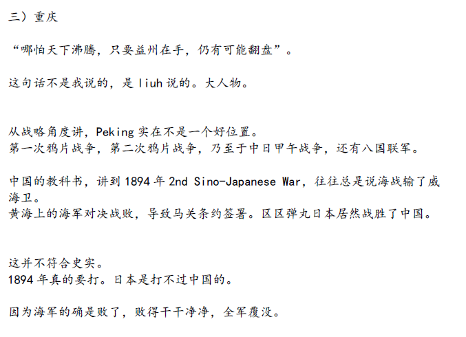
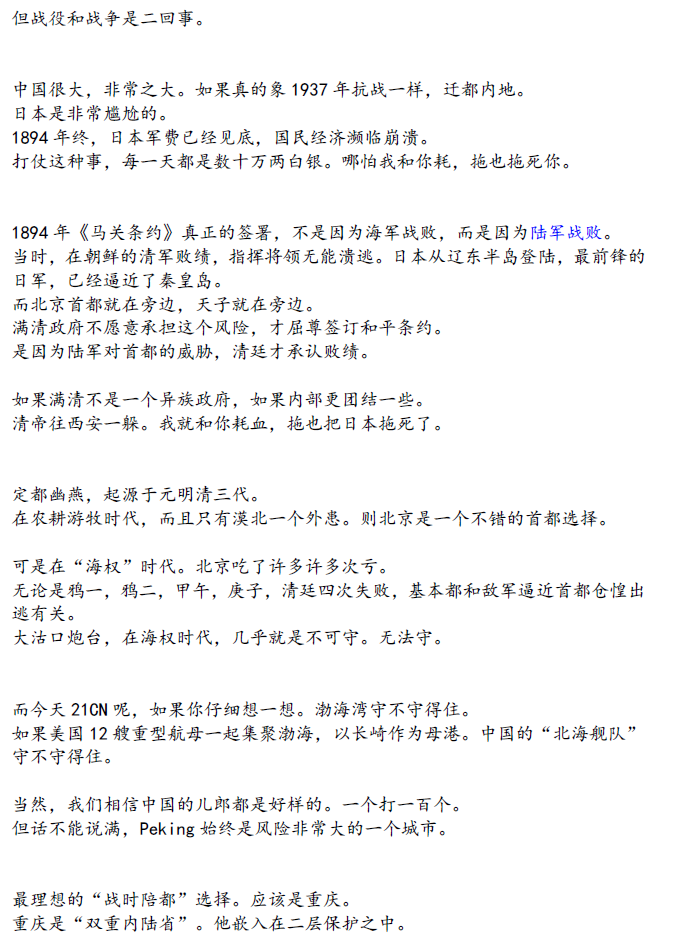
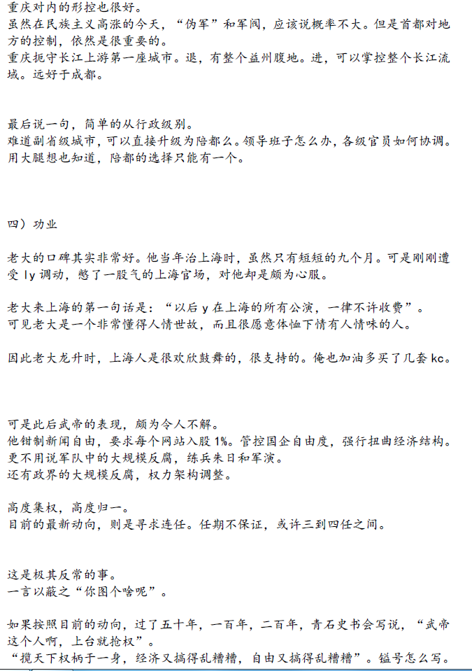
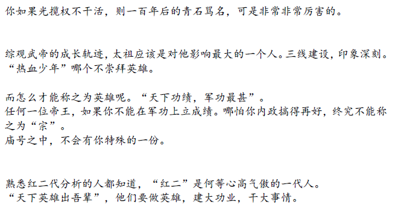

# 《下一站·重庆》下 \#2670

原创： yevon\_ou [水库论坛](/) 2016-11-02
===========================================================

《下一站·重庆》下 ~\#2670~

重庆是陪都的建设规格。

一）南海

首先，让我们看南海。

关于南海，最能说服我的，是知乎上的一个帖子《为什么渤海不能成为战略核潜艇的堡垒海区？》[[\[1\]](http://www.shuiku.net/file:/D:/Users/yevon_ou/Documents/yevon_ou/%E5%8E%9F%E5%88%9B%E4%BD%9C%E6%96%87/%E3%80%8A%E4%B8%8B%E4%B8%80%E7%AB%99%C2%B7%E9%87%8D%E5%BA%86%E3%80%8B%EF%BC%88%E4%B8%8B%EF%BC%89%232670.docx#_ftn1)<http://www.zhihu.com/question/48949480/answer/113503757>]

为了阅读简单，我大致概括一下其中意思。

中国目前在南海大展拳脚，很多人都欢欣鼓舞。是不是要抢占经济利益，是不是要挖南海石油了。

答案都不是。中国目前在南海的局面，不是"开始"，而是"结束"。

因为中国目前建设成这个样子，那就是这个样子了。不会再有进一步的行动。不会再有更多的领土和经济要求，甚至有可能会回吐一部分石油利益。

因为南海真正的用途。是作为"战略核潜艇"的母巢。

很多人都知道"美苏争霸"，知道"冷战"。知道世界离核子大战只差一步。

但事实上，核战包括几个部分。其中很重要一环，是"二次打击能力"。

意思是说，哪怕你第一轮，出其不意地，趁我圣诞节假期的，一下子发射了几千枚巨大核弹。把我整个美国本土都炸了。

但我还有一些东西，是你炸不掉的。

主要是核潜艇，飞机，地下井。

其中，核潜艇是潜伏在世界大洋深处的。甚至保持通信静默，谁也不知道核潜艇在哪里。

如果本土被炸，核潜艇就会探起头来。发射20\~30枚洲际导弹。足以把你所有的大城市都炸一遍。这就是"二次报复能力"。

另一种工具。是飞机。极限岁月美国任何时刻都有1/3的B2轰炸机，是在天空中巡航，不落地的。

意思就是说，核弹炸不了高空中的飞机。哪怕你把我机场都毁了，我还有"二次报复能力"。

扯得远了，对于核潜艇来说，他需要一个"母港"。

任何海军都需要母港。虽然潜艇的生存能力非常强，但六个月九个月，他始终需要回母港一次的。

不仅仅是补充燃料。而且食品，生活用品，人员休息，每一样东西都需要基地的给养。

对于苏联海军来说，他们有一个极其不利的局面。苏联迄今都没有真正意义上的"出海口"。

苏联最主要的海港，是圣彼得堡。

但是圣彼得堡出海，要经过遥远而狭长的北海。

一般而言，核潜艇很难被侦察到。

但这是建立在"鱼游大海"潜龙深渊的基础上。

如果核潜艇定期每六个月返回一次母港。然后敌方雷达用不间断的方法持续跟踪。

则你的潜艇行踪，还是可以被锁定在相当小的范围内。

中国也是同样的道理。在整个耄时代，中国只有一艘核潜艇。据说噪音非常大，性能很低。

当时是m下了死命令。要先解决[有没有，而不是好不好]的问题。

97黄海危机时，曾经浮上来和美国海军正面对峙。

而目前，中国维持着每年3艘核潜艇的产量，目前已经拥有了28艘核潜艇和51艘常规潜艇的规模。

这是非常庞大的潜艇编队。

对于中国来说，中国同样缺少"母港"。

原本的北海舰队，老巢在渤海。但是渤海的水很浅，只有15\~85米。非常不利于潜艇隐藏。

而且渤海，乃至于整个东南海面，紧紧地被美国"第一岛链"锁住。雷达无所不在。几乎是掐住喉咙。

相比之下，真正的潜艇天堂。是南海。

在这里，我们要看另一个帖子《南海真相 \|
装了这么多年哑巴，菲律宾和美国为啥到现在才急眼？》，关于南海的地图。

[[http://www.kunlunce.cn/ssjj/guojipinglun/2016-07-14/105973.html]](http://www.kunlunce.cn/ssjj/guojipinglun/2016-07-14/105973.html)

所谓的中国"九段线"。他其实构成了一个圆环。

通过岸基\--大型地面武器的保护。在南海构出了一个三角形的禁区。

以后，这里就是30艘潜艇的母巢。

中国最主要的"二次报复"核潜艇打击能力。

因此，南海是中国的"核心利益"。

我们可以看到，老大冲到南海，简直就是横冲直撞，野猪进了玉米地。

用"悍然"二个字形容绝不为过。短短的一年，填海就超过了东南亚诸国家四十年的总和。

而且明年还要厉害。因为在永兴岛上"核电站"快造好了。

有知乎网友问，"为啥呢"。

回答说，"你打红警，开局不造电厂么"

结合阅读：南海上新的挖泥船大神器《中国第一座海上浮动核电站开工，如何看待？》[[\[2\]]](http://www.shuiku.net/file:/D:/Users/yevon_ou/Documents/yevon_ou/%E5%8E%9F%E5%88%9B%E4%BD%9C%E6%96%87/%E3%80%8A%E4%B8%8B%E4%B8%80%E7%AB%99%C2%B7%E9%87%8D%E5%BA%86%E3%80%8B%EF%BC%88%E4%B8%8B%EF%BC%89%232670.docx#_ftn2)

比较有价值的回复是：

[[https://www.zhihu.com/question/52320780/answer/129990980]](https://www.zhihu.com/question/52320780/answer/129990980)

[[https://www.zhihu.com/question/52320780/answer/130102124]](https://www.zhihu.com/question/52320780/answer/130102124)

与"核潜艇母巢"相比，南海上的经济渔业石油等利益，中国并不是太看重。

东南亚各国，在经过最初的惊慌之后，发现和中国还是有很多"合作"之处的。

继上任"南海仲裁案"之后，菲律宾总统杜特尔特于10月18访华。发表了亲华的声明。此后，又马不停蹄地访问了美国，日本。

在中国网民的眼里，这位菲西北的壮汉成了"假离婚骗贷款"的人。但是在政治家眼里，杜特尔特传递了清晰无比的信息。

-   对于中国：随便你们在南海怎么搞，我管不了

-   对于美国：我还是您最忠实的小弟。除了中国人在门口打桩，其他我都听您的。

-   对于日本：打打杀杀多不好啊，大家发财做生意吧。

对于中国"息壤"式的填岛。菲律宾是根本管不着，他也没有力量管。

神仙打架，到处都是航母，核潜艇，洲际导弹。

菲律宾几艘淘汰驱逐舰，你让他怎么管。

所以杜特尔特态度很明确，你挖路挖到我家门口了。我也就捏着鼻子忍了。反正我知道你不是冲着我来。

来要一笔安家费，几百亿红包挺好。

但回头还得和"青帮"老大说说，我生是青帮的人，死是青帮的鬼。俺就在挖土一件事上没出头，可不意味我背叛组织。

所以杜特尔特依然是[诚实的]。他的形象完美无缺。

二）准备

以下内容为隐匿版

什么叫大事情呢。我从百度搜了一段；

1823年12月2日，美国总统[詹姆斯·门罗]（JamesMonroe）向国会提出了由[[约翰·昆西·亚当斯]](http://baike.baidu.com/view/135071.htm)拟定的[[国情咨文]{.underline}](http://baike.baidu.com/view/55008.htm)，咨文中有关外交方面的主要内容被称为"门罗宣言"，即后来被称之为"[[门罗主义]{.underline}](http://baike.baidu.com/view/89190.htm)"。其内容大致可归纳为三个基本原则：即"反对欧洲国家再在美洲夺取殖民地"原则、"不干涉"原则和"美洲体系"原则。

美洲：是美国人的美洲

但是门罗宣言打着"美洲是美洲人的美洲"的幌子，实际上是美国企图建立它在美洲地区统治并且与欧洲列强争霸的宣言。随着美国历史的发展，曾经起过进步作用的门罗宣言成为美国在美洲进行侵略扩张的工具。美国在[[门罗主义]](http://baike.baidu.com/view/89190.htm)的旗号下，在美洲进行疯狂的领土扩张。19世纪30年代---40年代，美国从[[墨西哥]](http://baike.baidu.com/view/10169.htm)夺取了[[得克萨斯]{.underline}](http://baike.baidu.com/view/209675.htm)；1842---1844年，美国把英国排挤出[[俄勒冈]{.underline}](http://baike.baidu.com/view/927724.htm)；1846---1848年，美国[[波尔克]{.underline}](http://baike.baidu.com/subview/5460281/16825942.htm)总统发动侵略墨西哥的战争，掠夺了墨西哥全部领土的一半以上。

1819---1853年，美国在北美大陆通过掠夺、兼并、廉价购买等方式，扩大领土达到130万平方英里，大约为1819年以前美国国土总面积的80%，包括今天美国的[[加利福尼亚]](http://baike.baidu.com/view/269543.htm)、[[内华达]](http://baike.baidu.com/view/605045.htm)、[[犹他]{.underline}](http://baike.baidu.com/view/801489.htm)、[[科罗拉多]{.underline}](http://baike.baidu.com/view/552293.htm)、[[亚利桑那]{.underline}](http://baike.baidu.com/view/771206.htm)、[[新墨西哥]{.underline}](http://baike.baidu.com/view/425983.htm)6个洲的大片土地。到19世纪中叶前，美国领土已经由沿着[[大西洋]{.underline}](http://baike.baidu.com/subview/16056/5938977.htm)13洲的狭长地带，一直扩展到[[太平洋]{.underline}](http://baike.baidu.com/view/1955.htm)沿岸。

([[yevon\_ou\@163.com]](mailto:yevon_ou@163.com)，2016年11月8日午)

[[\[1\]]](http://www.shuiku.net/file:/D:/Users/yevon_ou/Documents/yevon_ou/%E5%8E%9F%E5%88%9B%E4%BD%9C%E6%96%87/%E3%80%8A%E4%B8%8B%E4%B8%80%E7%AB%99%C2%B7%E9%87%8D%E5%BA%86%E3%80%8B%EF%BC%88%E4%B8%8B%EF%BC%89%232670.docx#_ftnref1) 《为什么渤海不能成为战略核潜艇的堡垒海区？》[[http://www.zhihu.com/question/48949480/answer/113503757]](http://www.zhihu.com/question/48949480/answer/113503757)

[[\[2\]]](http://www.shuiku.net/file:/D:/Users/yevon_ou/Documents/yevon_ou/%E5%8E%9F%E5%88%9B%E4%BD%9C%E6%96%87/%E3%80%8A%E4%B8%8B%E4%B8%80%E7%AB%99%C2%B7%E9%87%8D%E5%BA%86%E3%80%8B%EF%BC%88%E4%B8%8B%EF%BC%89%232670.docx#_ftnref2) 《中国第一座海上浮动核电站开工，如何看待？》

[[https://www.zhihu.com/question/52320780/answer/129990980]](https://www.zhihu.com/question/52320780/answer/129990980)

[[https://www.zhihu.com/question/52320780/answer/130102124]](https://www.zhihu.com/question/52320780/answer/130102124)
