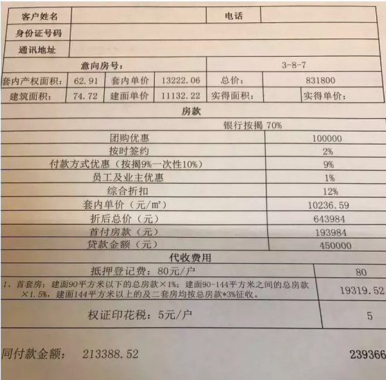
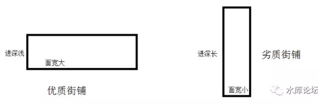
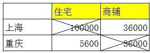
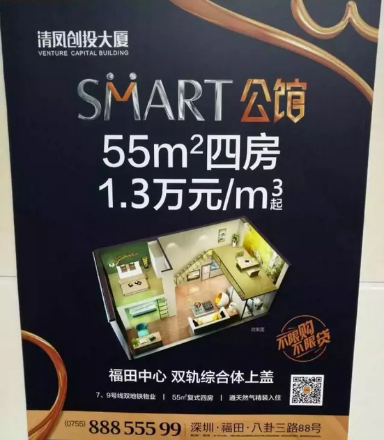

# 异大陆的审美观 \#2700

原创： yevon\_ou [水库论坛](/) 2016-12-14

异大陆的审美观 ~\#2700~

近期身体一直不佳，更新缓慢，抱歉

 

原来树并不都是长同一个样子的。

 

 

一）树叶

 

我曾在加拿大住了非常长的时间。迄今为止，随手拿一张照片。哪怕地况地貌非常类似，但我几乎立刻可以分辨出，哪张是中国，哪张是北美。

 

这事，一开始我也搞不清楚，直觉从何而来。

直到后来，我恍恍惚惚地发现。是树不对。

 

 

虽然我完全不懂植物学，对分行概念也是一知半解。

但是北美的植被，和亚洲的植被，有着巨大的区别。科属种都不一样。

一张照片，看看背景，就觉得怪怪的。觉得不似你的家乡。

 

同样道理，也适合非洲。

非洲大峡谷，大转弯。它整个的天空颜色就是怪怪的，悬崖也怪怪的，森林也怪怪的。充满了一种魔幻的色彩。

 

 

 

好吧，我们言归正传，来看一段楼书。

 

【皇冠国际】

本次推售项目收官之作，总体量26万方，函盖品质高层、奢侈一线江景豪宅、滨江酒店式公寓、高档写字楼.

项目地址：南滨路中段（喜来登酒店旁）

 

在售产品：1.2.3号楼。3号楼品质高层、1，2号江景豪宅.

3号楼在售户型：（均价11000～13000）

A户型：建面102.14，套内85.99

B户型：建面91.28，套内76.85

C户型：建面74.72，套内62.91

D户型：建面127.20，套内107.09

E户型：建面115.89，套内97.57

配置：总层高：29层4梯11户  物管：2.8

教育配套：小学（浦辉珊瑚实验小学带指标进合同）.中学（辅仁中学划片区）。

1，2号楼在售户型：（均价17000～19000）

A户型：建面194.61，套内161.05

B户型：建面179.55，套内148.59

配置：总层高：33层3梯3户 物管：3.2

 

这是重庆的一个楼盘。你们先别激动，本段不是广告。

房子已经【快卖完了】，所以才举例给你们看。

 

水库论坛到现在也没接过"硬广"。真的要接，第一个也一定是高大上的，例如翠湖之类的。

 

我举这个楼盘的例子，是让你们"划重点"。

划重点，划重点。找到了没有？

15秒之内找不到，投资功力减一级。

 

 

这个楼盘的重点。就在于"价格"对不上。

你看JPG图片中的例子，建面74.72的房子，最后折下来总价是643984元，8618元/平米。

 

而如果你看楼书中的宣传。

3号楼在售户型：（均价11000～13000）

1，2号楼在售户型：（均价17000～19000）

 

那么，问题出在哪里呢。

 

 

 

二）倒挂

 

我们研究重庆的房地产市场，惊讶地发现，"大小户型倒挂"。

-   越大面积户型越贵

-   越小面积户型越便宜。

 

 

这在上海房地产市场，是无论如何理解不了的。

上海目前有二大情况；

1）房价太贵，购买力跟不上

2）中产旺盛，纺锤型社会阶层

 

 

其中，近年上海楼市户型是不断做小的。大约每年减3平米的样子。

在2000年时，"主流"二房120平米。

到2016年时，"主流"二房70平米。

 

为什么要户型做小。因为购买力跟不上，房价太贵，超出购房者负担能力。

只能靠面积的缩小，总价不变，单价抬高。

 

另一方面，则是近年"实体民营工厂"纷纷破产。塑料铅桶，小老板这一个阶层萎靡不振。

因此3000W以上的区段销售乏力。反倒是屌丝中环线房子卖得给力。

 

我们一直密切关注着上海楼市的"主流户型"面积趋势。这是判断楼市有没有泡沫，以及泡沫会不会破裂的一个非常有用的微观信号。

 

 

而重庆楼市，是完全不一样的。就好比亚洲和北美的植被。猛一看你只觉得眼睛火辣辣，涂上了马应龙。

-   重庆户型越大，单价越高。

-   楼龄超过5年，价值急剧贬值。

 

 

这说明重庆的楼市运行规律；

1）住房不是压力。一个以自住为主导的市场

2）"总价约束"不存在，小户型没有溢价

3）社会各阶层神完气足，购买力潜力巨大

 

在重庆的微观户型选择中，我倾向于小户型。理由后面再说。

 

 

 

同样道理，另一个特征，则是商铺市场。

2012年我在重庆的时候，正赶上卖商铺。

 

当时，某一个小区，住宅均价大约5600元/平米。

商铺（二楼）卖36000元/平米。

 

售楼员小姑娘特热情，一个劲地拉住我。

"您是上海来的，那您一定很资深啦"。

"资深的投资客，我推荐你买商铺。俺们这里重庆资深炒家全部都是买商铺的"。

 

 

我白了白眼睛。"住宅5600的地方，你让我36000买商铺。而且还是二楼，而且还是深筒型进深"。

"你知不知道，上海住宅卖100000元/平米的地方，商铺卖多少钱"。

"那总得，50W/平米了吧"。

"36000"。

 

         住宅     商铺
  ------ -------- -------
  上海   100000   36000
  重庆   5600     36000

 

 

顺手转一段御用中介(微信：HU15000199431)发过来的商铺消息。二个月前的。

【内环内 倒挂商铺 诚意出售】

东绣路1152号商铺，面积113.24平；

东绣路1154号商铺，面积117.73平。

售  价：24000元/平

合同价：31000元/平

 

商铺1-2层，无贷款无抵押。

1152号商铺租约情况：租户艾灸、小儿推拿，租期至2021年08月01日，目前租金6615元/月；

1154号商铺租约情况：租户面包烘焙，租期至2019年3月31日，目前租金6825元/月；

 

周边小区有爱家亚洲花园、涵合园、东方龙苑、上海绿城、锦绣天第、锦绣满堂花园、东城新村，售价70000-100000元/平。

各付各税。买方仅3%契税。

 

 

三）异见

 

很多人在上海生活了三十年。

从他们一出生，就生活在了这个大都市。一直到童年，青年，成年。

 

途中他们虽然有旅游，有出差，有短暂地居住在另一个城市。

但是他们从未真正融入过另一个城市。

他们不知道在另一片大陆上，连树叶的形状都是不一样的。

 

 

我们有幸，比他们的视野更宽阔一些。

当我们接触了不同的城市，不同的国家，不同的市场，不同的人群。

我们最终发现，很多"天经地义"的伦理。其实未必成立。

 

在上海房地产市场形成的估计逻辑，喜好，优劣，价差，尊卑；

等你换了一个市场，未必成立。

 

 

 

曾经有浦东帮和浦西帮吵得热火朝天。浦东帮坚持认为"清静"比"热闹"号。

乡下鸟不拉屎的地方，比内环线好。

也有浦东帮认为，"绿化"决定一切。公园绿地最多就是最好的地段。

 

还有浦东帮是"仁恒"粉。

凡事非仁恒不买。一个个仁恒盘跟过去，结果每次都花+150%价格买CEO盘。

 

 

结果这些浦东帮"估值""偏好""价值"，等你去了一趟重庆。在重庆的面前，全都被击得粉碎。

自从我们推介重庆之后，前前后后有了十几拨人，飞去了重庆。

当他们出发时，往往是抱着不屑，不认可的态度。

可是真等他们落地，站在售楼处的大厅里。剩下的，唯有"泪流满面"。

 

你需要为"仁恒"的品质付多少钱。

象上图中的楼盘，就是8618/m。所有的建筑物品质，都在这里了。

 

四）异大陆的审美观

 

当我们的见识越来越多，当我们走出上海，见过越来越多的城市。

在每一个城市，价格体系和审美观都是不一样的。

 

 

譬如说在北京，CBD商业几乎全部都在东边，写字楼按面积论绝大多数在东三环。

海淀破破烂烂，就是一个北大荒。

而海淀西城却是北京房价最高的二个区。比朝阳贵近一倍。

其主要的卖点，是"学区"。

 

北京买房，关键看学区。一张"学票"的价格，几乎要400\~500W。

所谓的房价贵，其实是学票贵。

 

这次中关村二小爆出"霸凌"事件，给学区房敲响了警钟。

"学票"价格，存在着巨大的价值风险。

但是"前仆后继"依然是不可改变的肉猪。

 

 

 

同样的"学票"逻辑，拿到上海，就行不通了。

上海的私立教育，远远好于北京。尤其是上海最Top的顶尖名校，几乎全是私立的。前十名中，只有一二名公立。

 

而上海土著，大致有各种各样的"关系"。可以进好的小学。

上海最好的重点初中，也全部都在浦西。

 

基本只有湖南，湖北籍贯的一些衡水妈妈。还在苦苦致力于购买"上海学区房"。

所谓"浦东成功地以全市10%好学校，创造了全市90%的学区房"。

全部都是炮灰。

 

 

而目前上海影响整个房地产市场，最看中最严重的，却是"总价约束"。

总价约束，购买力就这么点了。

面积决定一切。小户型卖出天价。

 

什么地段，什么品质，统统都不重要。

你把户型再做小10%，你的单价就能卖高10%

 

 

这样的"游戏规则"，拿到重庆去，又不适用了。

重庆目前几乎没有"购房压力"。房价远远低于直辖市的负担线。

重庆人买房子纯粹是由于"自住需求"，家庭有需要才买。

因此更有钱的人，不仅仅是买更好地段，更贵的单价，而且面积也会大一点。

 

 

重庆的容积率比较高。和广州，深圳差不多，有4\~5左右。

同时，重庆的城市比较密集。不象北京上海深圳，发了命一样开发新区。

重庆受电商的冲击又比较小。

因此重庆的"商铺"和香港的"商铺"一样很值钱。

 

 

重庆房价很低，股市又不振。

重庆人如果完成了生活基本必需。他们的钱是没有去处，没有地方可投的。

住宅的标的太小。50\~60W一套。

对于真的有钱人，买上上百套住宅。打理烦也烦死了。

 

因此重庆的"投资"喜欢买商铺。商铺被炒成天价。

而上海人都知道，"商铺"是个坑。是吃人的大坑。

上海商铺根本卖不动。职业炒家也不会去碰铺。

 

每一个市场，都有每一个市场的运行逻辑。

价值观彼此之间，是互相矛盾的。

 

 

哪怕你把这些事情，内外逻辑，前因后果，都想得清清楚楚。市场"三分"，各个细分市场，消费者心理也都摸透了。

你把这样的经验，拿到海外市场。顿时又是一番水土不服。

 

 

譬如你在硅谷，在澳洲，同样一套独立屋。估值应该是60W澳币，还是80W澳币。

相邻二个街区。学区都是差不多的。楼龄也类似。

价格却可以相差20\~30%

这时候应该怎么判断。这里面的学费是永远也交不完的。唯有靠时间积累。

 

 

 

五）解决方案

 

最后我们来看解决方案，如图；

 

首先，我们假定你并不能"通晓明悟"。

世界上的道理那么多，Marketing细分的消费者心理那么细腻。

我们只能说略懂。谁也不敢狂妄地说通彻人心。

我在房地产市场做了16年，最后只能说越做越迷惘。

 

 

那么，我们应该如何投资判断？

我的答案是：如果无法判断，那就选最便宜的

 

 

好比在小户型，大户型这个选择上。

到底是重庆人错了，还是上海人错了。

应该是重庆学上海的样，小户型单价\>\>大户型

还是上海人学重庆人样，同一小区大户型单价\>小户型

 

你可以研究"消费者心理""人口趋势""通货膨胀趋势""购买力趋势"等等一系列的Marketing分析。

但我们还有更简单的方法：买便宜的。

 

-   在上海，我就倾向于买大户型

-   在重庆，我就倾向于买小户型

 

你先把成本降下来，先立于不败之地。

然后再慢慢想办法去看风云变幻。

 

 

同样道理，2012年我去重庆的时候，小姑娘和我说："每差一个楼层，单价差10元人民币"。

什么，我差点把舌头吞了下去。

 

你再说一遍，你确定你的单位没有问题的。

每一层差10元。不是10元一平方英尺，或者立方英尺之类的？

 

（再次圈重点）

回答说，就差10元。好比10楼单价是5600

11楼单价5610

12楼单价5620

13楼单价5630

............

......

30楼单价5800元/m

 

 

我毫不犹豫地说，"给我买次顶吧"。越高越好。

因为上海的高层建筑，每一层差不多是0.8%，按照八万的单价，每一层就要500元/m

楼上楼下，单价可以差一万。

 

而你只差10元/层。

我真心不明白这个KFS怎么想的。反正我买高的。

 

 

同样道理，重庆对于"朝向"的价值判断，和上海很不一样。

"全北"的户型完全没有任何折价。一样能卖得出去。

"全南"也没有溢价。

那你该怎么办。想也不用想。

 

 

对于商铺的选择也是一样。

基本对重庆商铺敬而远之。

 

 

 

六）结语

 

我们长期在上海，久而久之形成了一套"价值判断体系"。

 

但是这套体系，并不是放之四海而皆准的。北京有北京的审美体系，重庆有重庆的审美体系。北美有北美的审美体系。

当我们走出去，看得更多。才知道我们曾经的"坚持"和信仰错得有多厉害。

 

 

当二种"价值体系"开始碰撞时，你会感到迷惘。

你会不确定"价值"的真正位置所在。

这时候，你可以靠Marketing的分析，分析消费者的趋势，分析市场的定位，分析未来对手盘在哪里。最后做出细微的判断。

 

 

但你也有一种直截了当的处理方法：

买便宜的

 

 

 

（yevon\_ou\@163.com，2016年12月13日晚）
