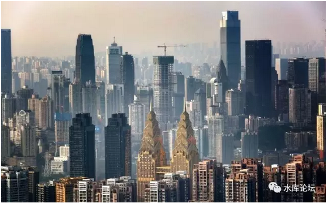

# 二线城市的切入点 \#2750

原创： yevon\_ou [水库论坛](/) 2017-01-07

二线城市的切入点 ~\#2750~

 

模式与框架

 

 

> 一）前言

 

本文为《重庆卷》系列的最后一篇。

以后随着零碎的信息累积，可能还会有整理补充。但是成系统的，本篇为《重庆卷》的终结。

 

前天《重庆楼市地段分析2017版》\#2730被删。

昨天《重庆部分楼盘点评》\#2740被删。[\[1\]]

这样算下来，《重庆卷》一共发了十篇。居然被删除了五篇。

 

 

不发了，实在是心灰意懒。

感觉有一个巨大的眼睛，在注视着发言。本篇草草终结，不想有喝咖啡的风险。

 

 

 

> 二）数量级

 

上海楼市80000元/m

重庆楼市8000元/m

 

要分析重庆楼市"投资"，有一个梗是绝对绕不过去的。

即上海的房价，大约是重庆10倍左右。

Apple to Apple，内环对内环，新房对新房。基本就是这个比例。

 

 

这个倍率，对于"职业炒家"来说。有着非常重要的意义。

意思是我们"换仓"的话，[上海卖掉一套房子，重庆可以买入十套。]

 

但是，我们更延伸推想一下。"上海卖掉十套"呢。

==\> 则重庆可以买入100套。

 

 

 

一般情况下，我们的计划是，上海卖掉10套内环线。

凑足8000W\~10000W的资金。拿去建仓重庆。

 

 

因此前二天在读者留言中，有人问："推高重庆，您是不是想趁机出货"。

我的回复是："对不起，没仓"。

 

-   要智商低到什么程度，才会相信，一个人的力量可以炒起一座城。

-   要智商低到什么程度，才会相信，房价是靠"炒楼"炒上去的。

-   正义，商人是降低物价的。

 

告诉你真话，我在重庆真的没什么仓位。

如果以个人散户的名义，在重庆买入三套五套，合计建立300\~500W的仓位。

对于我们来说，仅是0.x%的数量级。

四舍五入为零。

 

 

我们现在面临一个什么问题呢。职业炒家无法在重庆建仓。

如果在上海卖掉一套房子，在重庆就可以买10套。

如果在上海卖掉十套房子，在重庆就可以买100套。

 

考虑到上海的房产，负债率都已经很低。

《[长线负债率](http://mp.weixin.qq.com/s?__biz=MzAxNTMxMTc0MA==&mid=2651014727&idx=1&sn=b64eae1b2a0b201fd8676aa3286849e4&scene=21#wechat_redirect)》一文说到，平均\<25%

而你重新建仓的话，负债率还可以拉高。最终应该\>超过100套。

 

 

 

100套房子是什么概念呢。

以一幢典型的重庆建筑为例，28层，二梯五户。

则整幢楼138户。

 

也就是说，你去到重庆，你可以买下一幢楼！

 

 [\[2\]]\

三）扫楼

 

这样的"发散性"思维，进一步延伸的话。

上海的一个标准小区，有多大。

 

答案是，标准的楼盘，大约是400\~500户。

一个街区，四幢楼。

 

上海小区如果有1000户的话，一般就要分割为"一期、二期"开盘。

目前上海市政府对于开盘的最小规定是30000平米（建面）。

 

 

将这个概念进一步发散，好像也不大嘛。

譬如说，上海多军的几个大佬凑一凑。三四个朋友，我们就可以买下400套房子。

 

那我们不如买下一整个小区算了。

 

再进一步的发散思维，你如果检视重庆一些二线"开发商"的财务实力。

很多的KFS，其资本金也就2亿现金左右。

 

整幢的Marriott万豪酒店，其投资3.5亿。

不就七套翠湖隽荟么。 

 

 

数量级到了我们这个数字，再要运作，会是十分困难的事。

水库文章《目录》中，从很早的编号，就在说"回报率"的概念。

回报率绝对不是"富者益富，富者恒富"。

 

毒教育没说的真相是："富者恒贫"。

因为回报的增长，是需要"全要素增长"。每一项资源都要成比例增长。

 

而有钱人在"其他资源"方面，和穷人并没有100倍的差距。

因此"财富增值"的速度。必然是穷人快于富人。

 

回到"投资重庆房产"这个话题。我们面临一个很现实的瓶颈，"房票+贷票"是有限的。

无论你多么有钱，象"家庭式炒楼"你也不可能做100套。

 

即使你是专业人士，靠"技巧"可以买得比别人多一点。适当"规避"政策限制。

但也不过是2:1，或者4:2的优势吧。

真的想买100套，则处处瓶颈。

 

 

在水库第一卷《[炒房客的流派](http://mp.weixin.qq.com/s?__biz=MzAxNTMxMTc0MA==&mid=400390677&idx=1&sn=c8f73e45fbfb40d55433617611adf9c0&scene=21#wechat_redirect)》系列中，有一篇总结性的著作《[列兵和阶层](http://mp.weixin.qq.com/s?__biz=MzAxNTMxMTc0MA==&mid=400767707&idx=1&sn=efe96aeaf2961d43ddf8718961c35994&scene=21#wechat_redirect)》。非常重要，建议一定要看。

 

任何一个商业模式一旦建立，建立之初，一定是最赚钱的。

炒楼这一行，从0到2000W，是最最最快的。

但是"边际效益递减"。如果你不改模式的话，你的增长就会越来越慢，回报越来越低。直到最后龟速。

 

 

对于"重庆投资建仓"，它遵循同样的道理。

你要说建仓，我们真心在重庆没什么仓位。

因为"个人散户"，我没法建仓。即使用亲友名义买三套五套，那也是芝麻小钱。

 

 

《二线城市的切入点》，我们考虑组团以KFS的方式。去收购一整个地产项目。

 

 

 

> 四）运作

 

我们考虑收购一整个地产项目，几百套房子。

位置最好是中环线，把成本降下来。

重庆渝北礼嘉照母山不要，不想和土著人混在一起。

地铁出口，户型以中小型为主。

 
然后我们：整体出租。

我们不出售。既然要捂盘，我们就整体出租。

 

要知道，"凤变冰"整条科技树，在我们手里也是通的。

我们有足够多的设计力量，装修力量。以及最重要的"领先重庆"水平审美观。

 

 

好比当年香港人造的房子，上海人无论如何怎样看，总觉得非常舒服。

我们在重庆装修出来的房子，也一定可以保证"高大上"。远远颠覆重庆人的审美观。

总之就是洋气，远远超出当地人的土鳖。

 

 

而我们是"大业主"。是整体出租。

"大业主"本身对于小业主，在品质物业档次上，又是碾压性的优势。

 

大业主可以保持"极极高"的物业管理水准。

哪里灯不亮，水泥缺了一个角，水景枯涝，这些在传统"物业"下几乎无解的问题。在"大业主"手里都不是问题。

 

只有大业主，才能肆无忌惮地使用物业维修基金。

才能舍得[大手笔]地花钱，才知道"花钱就是赚钱"。物业就应该越花钱越好。

而不是愚蠢的受制业主委员会，宁可省钱也不愿意维护。

 

 

 

于是，我们挟"大业主"的物业优势，上海人的"洋气"眼光。

再加上全套凤变冰的装修手法。

我们可以在重庆打造出"著名"的居住社区。

形成白领小资中的风向标。"逼格爆棚"横扫中高端租赁市场。

 

 

而我们不出售。我们长持。

重庆本身的房租，就有4.5%左右。

如果加上我们针对性的优化，租金口碑和品牌，最终可以获得比市场更高的租金。

我们用租金来还贷款。

 

 

这样，计划撑七年左右。大业主负责翻新"外墙"外立面。保证翻新后光亮全新。（这也是只有大业主才能干的活）

到2025年，成熟了，我们分拆出售。

 

 

凡是投资重庆的人，一直死去活来纠缠于一个难事。

"处房情结"，二手房有大量的折价怎么办。

 

我们不卖二手房，我们卖一手房给你。

 

 

如果资金量充沛的话，我们甚至幻想收购"土地储备"的KFS。

最好KFS除了450套房之外，还有一二块空地。

 

这块空地，作为"二期"项目。我们拖到2020年再开发。

造得越晚越好。

全套的营建商资源，我们手里也是齐的。

 

 

 

> 五）运作

 

以上的计划，是不是听着很疯狂，很不靠谱。象讲故事一样。

说实话，KFS我也没做过。

对我来说，也是全新的领域。

 

 

但是，我们可以讲另一个故事；

很久很久以前，在上海滩有一个很穷的人。一个小白领，全副身家20W。

 

这个小白领，通过"三成按揭"买房子。

房子大涨，他的财富增加10倍。成为了一个几百万身家的中产阶级。

 

 

但是，"链式反应"他的脚步并没有停下来。

在几百万的情况下，他再用"三成首付"，买入三套房子。

房价大涨。这一轮博中，赌赢了之后，他就完全拥有了三套房子。小康二千万。

 

此后呢，第三轮。

你再"一化三，三化九"。

等第三轮战役结束时，你拥有了10套房子。

 

 

可见，你这10套房子，最初的源头，都是从20W，一个亭子间变幻开始的。

最初的时候，你仅仅是上海滩再穷迫潦倒不过的一个小年青。

 

现在，你把上海"十套住宅"抛了。

十套住宅是很大实物么。屁也不是。

但你搬到了重庆，你就翻了十倍。

 

 

当你搬到了重庆之后，你就成长成为了"一幢楼"。

甚至进一步的脚步，你会逐渐看到"一个小区"。

乃至于成为KFS，整体大型的开发。

 

如果你回首人生历程，会不会有唏嘘的感觉。

 

 

 

> 六）结语

 

本人在重庆仅有微不足道的仓位。以"个人"名义购买的物业，金额极少，不值一晒。

仅能宣称还存在于市场，没有完全踏空。

 

 

在我们的计划中，重庆前途无量。2017年人气微热，但整体大牛仍只启动了一半。

在我们的计划中，"重庆战役"是未来二年后的事。

 

 

未来二三年，我们会逐步抛售上海一些物业。

并将资金集中起来，集中成一个可以和KFS谈判的数字。

最终以大军团开发商的方式移步重庆，并尝试新的破阶模式和人生。

 

酱紫

 

（yevon\_ou\@163.com，2017年1月7日午。商务协作请联系此email）

 

[\[1\]]可以在水库微信号中，回复编号，例如\#F2730，来获取文献。

[\[2\]] 图片来源未知。感谢水库匿名网友。
