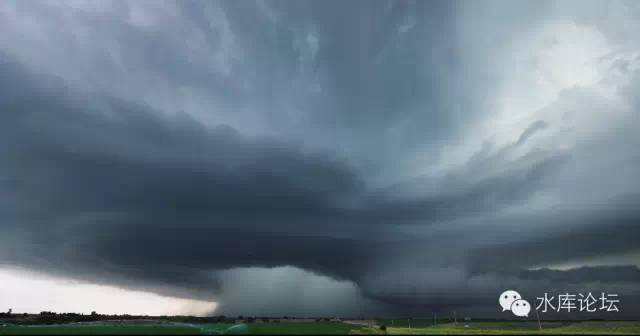
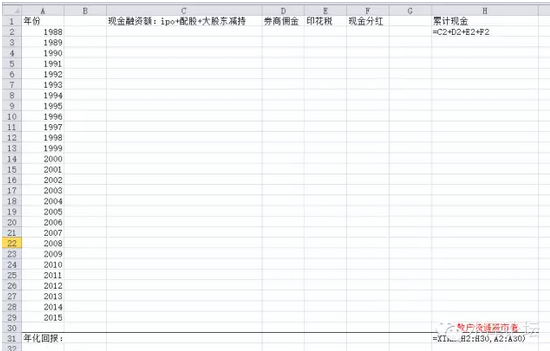

# 股市骗局（三）\-\-\-\-- 估值 \#2930

yevon\_ou [水库论坛](/) 2015-05-08

股市骗局（三）\-\-\-\--估值 ~\#2930~

股市的合理价值是600点。

一）老派绅士

"*不要忘了，除了票面收益之外，债券持有人还享有公司清盘时的优先偿还权*"。

这句话是末日博士麦嘉华说的。在中国，估计99%的股市投资者根本不知道他在说什么，99.99999%的投资者，根本不在意这句话是什么意思。

这句话是古典投资者的老派理论。按照最经典的定义，价值是什么；

价值就是未来所有现金流的总贴现。

遗憾的是，传统的经典已经离我们那么遥远，遥远到99.99999%的人都忘了他的距离。

二）流通市值

在上一篇《股市骗局（二）\-\-\-\--
回报率》之中，我们说到了股市正确的回报率计算方法，应该遵循以下的IRR表格。

其中，每一年都是股民们的"净现金投入"。

一直到最后一年，他们手里的财富是"总流通市值"。

然后用IRR拉一拉，就可以算出年化的回报率。

但事实上，这个公式仍然是错误的。其错误在于"总流通市值"的计算不对。

什么叫做流通市值？

许多人计算股市财富，就简单地将
"股价\*股数"。包括许多美国公司，数千亿刀的市值，也是这样计算出来的。

但其实这样的算法，非常地不精确。德隆系吕梁等"老庄股"轰然崩塌，也证明了纸面财富并不是真正的财富。

你作为散户，买卖100股，200股，或许可以按照当前的价格成交。但如果你抛售100W股，1000W股，抛售公司10%的股份；

那么股价就会大跌，甚至跌去一半有多。

20万亿股票，和20万亿现金，绝对不是同等数量级的财富。

那么，股民手中的"流通股份"。如果我们将其视为一个整体，应该如何估值呢。

三）生命

所谓的"生命周期法"，就是回归本源。

股票的价值=未来所有现金流的贴现。

绝大多数的公司，直到破产，分红甚至都拿不回现在的股价！

我们看到了一个无比残酷的现实。一只股票，譬如80元/股。每股盈利可能只有几角几分。而分红为零，甚至是负数。

在目前我们市场上，许许多多的股票，都是80倍以上的市盈率。而分红基本忽略。十年分红抵不上一次交易手续费。

在国际市场上，长期以来，市盈率PE始终维持在9\~12倍之间。而中国股民的起步价就是20倍。动辄稍微有点增长，就是40倍PE。

忽悠大师们说，"20倍市盈率，对应着5%的回报，应属合理。股价仍被低估"。

是这样计算的么。不是的。因为他们偷换了一个很重要的前提。他们假设公司是永续的!

而事实上，公司是要提折旧的。

一家公司可以存活多久？1915年道琼斯30只股票，迄今只有GE还存在。1900年全美国最大的100家公司，迄今有一半倒闭，约一半被收购，活下来的不到5%

大企业尚且如此，何况小企业。

1999年时，美国人曾经做过一项调查。"你认为你的公司可以活过下一个100年么"。

当时如日中天的微软，Intel，得分都在20%以下。大笨象IBM是34%

现在才过了15年，都不用等2300年。现实已经看得很清楚了。

微软，Intel，IBM都快完蛋了。

柯达和Nokia已经完蛋了。

Honda预期今年明年完蛋。

石油类股，Exxon
Mobile，虽然还活着，但已显露颓像。整个石油产业有可能在20年内被新能源摧毁。

大企业尚且如此，何况小企业。

如果你要说中国的企业，"基业长青"，更加谈何容易。

中国的变革更快，产业变迁更迅速。时间更加"被加速"。

你想想30年前的中国是什么样子的。

想想20年前。

甚至想想2000年时我们有多穷。很多人还买不起空调。

按照中国目前日新月异的发展速度。你能信保你手里的公司，那些中不溜秋的公司，在30年后还存在，还有竞争力，还能活着？

中国目前绝大多数的上市公司，除了40家"中"字头巨无霸。其他多半活不过15年。

股票是要提"折旧"的。绝大多数中国公司，必须在15年之内折旧完毕。

也就是说，任何股票，无论他多么地光辉灿烂。他的市盈率都不应该超过15倍。15仅仅是拿回本金。

如果考虑到投资利息，PE不应该超过10倍。

所以你看欧美这么多优质的企业，长期股市PE维持在9\~12倍。为什么，人家要提折旧啊。

四）生命周期法

一只股票该值多少钱。股票的价值=未来所有现金流的贴现

目前，全球股市，都已经呈现泡沫。哪怕以标杆的NYSE为例，分红率大约为2%。

这样意味着，这只股票，你持有50年，刚刚收回本金。

而这50年内，这家公司有九成九的概率已经破产了。

哪怕破产的前一年，前二年，该公司还是巨无霸，还是五百强公司。

但事实总是如此。股价的下坠，是从99美元-\>9美元-\>0.9美元（雷曼兄弟）

几乎一夜之间，数百亿的市值就清零。

船沉的时候，所有人都无法幸免。

如果我们研究一只只个股。那么目前全美国，估计股票投资的价值都是负数。

全美国任何一支股票。在其彻底破产之前，分红都拿不回本金。

那么事情就奇怪哉也。既然每一只股票都是亏的。为什么他们集合在一起，2000\~3000只股票构成市场，集合却成了赢利的呢？股市总指数是涨的呢。

这牵涉到了庞氏骗局。只要有后继的傻瓜，源源不断进入，指数就不会下跌。老股民可以将股票卖给新股民。

全球股市的现值估值，建筑在"股价\*股数"，而不是生命周期法。

我们想象一下，假设明天"政府将股市关闭"。

假设政府将股市关闭。从此以后再也不许交易。所有的股民，拿着你们的股票，安安心心回家等分红。一直等上50年，等这些老公司自然消亡为止。

那么，你们手里的股票值多少钱？？?

从理论上来说，"关闭交易"并不影响股票的估值。

但是如果你回到家去，关上门，静心地想上几十年，你就会对手里的股份，有更清醒的认识。

一只每年分红0.20元的证券，而且点点滴滴时断时续，十几年后还不保证本金会破产归零。

那么这个证券，估值最多就1.5元。而不是现在的80元。

许多坚持股市"价值投资"的人们，扪心自问。你们拿这股票回家。从今以后如同1949年般不许交易几十年。你们的股票值多少钱?！

真相并不复杂。复杂的是你不愿意真诚面对内心。

股市就值600点。

用"生命周期法"，你会对自己手里的股票有更清醒的估值。假设明天股市从此关闭。你只能持有分红。

美国股市的合理价值，大约是1/3-1/2，大约在8000点左右。

中国股市的合理价值，大约是1/10-1/20，大约在600点左右。

中国A股目前是4500点。为什么说1/10是600点呢。

因为这里还有许多非流通"中"字头的基石。银行股石油股等巨无霸。他们的估值不可能无限下降。而许多小盘股。其实际价值应该是接近于零的。

而你该去买银行股么。也不是。他分三次红就要配一次股。派三粒糖就要拿回去一个西瓜。总分红还是负的。

五）一场游戏

你要说"A股的合理估值是600点"。估计会引来一群人的耻笑。

为什么，因为从A股面世以来，他从未回到过合理价值。

有时候我们也开始怀疑投资界的另一条圣典："是泡沫总会破裂的"。

就目前而言，这条定律并不正确。至少也要做大的修改。

从1988年面世，迄今A股走过27年的岁月。

在这27年内，"A股始终维持五倍以上的泡沫"。

这是一个巨大的泡沫。具体表现为任何公司，只要A股一上市，立刻就是鸡犬升天。

但奇异的是，这个泡沫从未破灭。有些时候还膨胀得更大了一点。

但估值是客观的。用任何一个方式，都无法推算出600点以外的其他答案。

[当一只股票，直至破产，分红甚至都不能拿回现股价的10%。]这不是泡沫是什么。公司是要提折旧的。

英大证券有个李大霄。当股指2300点时，他声嘶力竭地说"钻石底"。当估值到了4300点，他又拼命大喊"太空顶"。

其实这是搞笑的。A股哪里有什么"价值投资者"。A股的合理估值是600点。

600点以上，都是投机。

4500点固然是泡沫。2300点依然是泡沫。二千三也能腰斩再腰斩。

既然是泡沫，大家就玩投机游戏。

600点价值的东西，既然可以炒到4500点，为什么不能炒到12000点。

股票在600点以上，都是博彩业。而不是金融业。

博彩业么，天空无上限，智商无下限。

玩玩而已，不必当真。娱乐至上。

（yevon\_ou\@163.com，2015年5月8日午）
