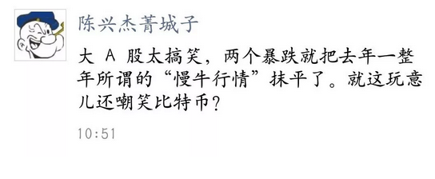
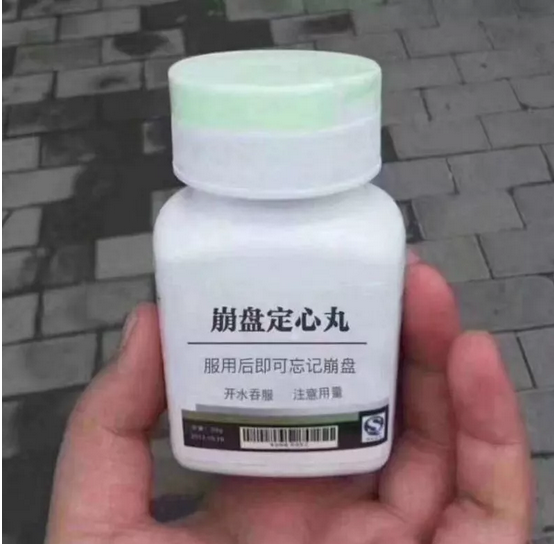
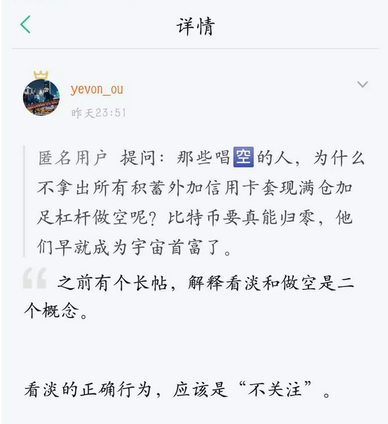

# 投机的一些基本原理 \#3250

原创： yevon\_ou [水库论坛](/) 2018-02-10

 投机的一些基本原理 ~\#3250~
======================================================================================================================

 

无裤汉的夜宴。

 

 

一）股灾

 

快过年了，正经思索的文章没什么人看。今天写一些轻松简单的。

本周美股大跌，A股大跌，数字货币大跌，堪称哀鸿遍野。

 

"证券"这种事，真心没什么好劝的。老祖宗早有明断：

三根阳线改变信仰

 

股民的记忆，比金鱼还短。金鱼好歹还有七秒。

你别看股民们捶胸顿足的，一个个唠叨十七八遍。发誓"只要这次解套，这辈子不再炒股"。

其实都是假的。

 

 

"戒股"这种事，好比戒烟。

抽的不是烟，而是寂寞。炒的也不是股，而是无聊。

生活永远二点一线，不找点话题，难道关注韩庚表白卢靖姗么。

 

"股市暴跌"绝不是第一次，也绝不会是最后一次。

"三根阳线改变信仰"。既然你煽脸打得再疼，也不长记忆。那就没什么好劝的了。

 

因此今天我们要说的，是另一个话题。 

  
二）投机

 

今天我们来回答一个教科书级的问题："什么是投机，什么是投资"。

投资/投机的区别在哪里。

 

目前我们主流"教科书"谱写的，绝对是错的 

教科书主要有二种定义；

1）凡是长期持有的，叫投资。短期博取差价的，叫投机。

2）凡是谋取收租红利的，叫投资。贪图资本差价的，叫投机。

 

这二种说法，都是大错特错。

真心不要脸。财经界编出来，欺骗全国人民，妄图宏观掠夺人民的。

 

 

 

举个例子，假设有一支债券，你左看右看，经过充分研究，内蕴价值就是5元。

今天价格3元，你买进了。

明天一夜之间，突然10元了。请问，你卖不卖。

 

答案当然是卖啊。

没有任何理由不卖啊。

5元的东西卖了10元，你囿于"长期/短期""收租/本金"，睁着眼10元不抛。

10元[不抛，才是最大的罪恶]。才是最大的资源配置不合理。

 

 

 

学术上，"短期交易二次"比"短期交易一次"更光荣，更高尚。

因为dT\>0，每一次交易都是好的。

一次交易，是对价格不公的一次纠正。是对社会的一次贡献。

二次交易，是对价格不公的二次纠正。是对社会的二次贡献。

 

-   二次交易比一次更光荣。

-   任何限制短期买卖的"调控政策"，全都是不要脸和暴政。生产力的净损失。

 

 

那么，"投资"和"投机"真正应该如何定义呢。

这个问题我想了很久，一直到近年，才小有所得。

我认为，凡是投入于"正和市场"的称为投资。投入"负和市场"的是投机。

 

 

譬如说，有一支股票，现在价值10元/股，每年分红0.5元，分红率5%

你心里知道，几十万股东的互相博弈，其平均收益是5%

 

因为股东之间，买进卖出，打麻将有输有赢。

每个人都自认为是股神。都自认韩剧男女主角，命运待你不同。

82%的美国人，认为自己比社会平均更聪明。

 

但整体平均回报，就是5%

一个小小的正和游戏。

 

 

 

另一个例子，例如"钱宝"。

钱宝承诺投资人15\~18%的回报。其实却是一个典型的空壳"庞氏骗局"。

张小雷并没有把募集来的钱，投资于火星汽车，真空高铁，5G通讯之类大热门的项目。

他其实是把"新投资人"的钱，用来支付"旧投资人"。

 

然后你再扣除钱宝昂贵的"渠道费用"，员工工资，办公租金，税费杂费。

象"e租宝"垮台后，揭露出来"渠道费"可以高达30%。

公司募集100W元，到手只有70W元，30W要返给"拉客"的人。这里面的损耗，是非常非常惊人的。

整个系统，是一个巨大的"负和系统"。

 

 

-   凡是入场前，就知道自己从事"正和游戏"，称为投资

-   凡是入场前，就知道自己从事"负和游戏"，称为投机。

 

 

然后再举个例子。譬如你妈妈，是"钱宝"公司的财务。从一开始她就摸底知道，全公司的财务状况，以及哪一天会"触雷"。

那你再投"钱宝"，拿18%的利息，是投资还是投机。

 

我认为是"投资"。

因为你是专业人士，不是普通人士。从一开始，你的赢面就是大于五十一的。

 

 

同样道理，有很多"羽毛球巡回赛"。每人出2.5W美金，40个人凑100W美金。

扣掉场地费，冠军拿80W美金。

如果你是世界冠军，你去参加这样的巡回比赛。你是投资，而不是投机。

 

 

 

三）A股市场

 

中国的A股市场，是"投资"还是"投机"。

很不幸，根据我的计算下来，是"投机"。

 

中国A股的分红率，大概在1.5%左右。

每一年，A股市场的印花税，券商佣金，基金管理费，差不多也在1.5%左右。正好抵消。

 

顺便驳斥一下"A股长持不动，节约交易费用，当能致富"的异端邪说。

A股即使20年彻底不交易，也不过多30%收益。难道给你账户+30%，就发财了？

 

 

张化桥当年曾经算过，中国企业的"融资利率"，十分高昂。

银根紧缩的年份，中小企业投身"拆借市场"，回报率在13%左右。

 

按照这样算法，投资于"A股"市场，获得0%的"零和回报"，真实是一件成本高昂的事情。

按照张化桥的利率算法，他给出A股估值，大概在1500点左右。

 

但是张化桥还忘记了一件很重要的事。A股并不是"永续债"。

并不是说，给你13%的利息，你就可以拿一辈子的。

A股的公司，会"破产"的。

如果算上"破产折旧"，A股的估值还要低。

 

具体多少点，反正三根阳线改变信仰，俺也懒得说了。

顺便说一句得罪人的话。A股市场中，有一群卖酒的骗子。

整天忽悠别人：价值投资，蓝筹投资，永恒投资。

媒体小编，基金销售，股评KOL，推波助澜。

 

"价值投资"的基金经理们，是不是真的关注"价值"？

他们是"正和游戏"，还是"负和游戏"。

 

你只要问，中国有哪一只蓝筹股，靠收分红，能跑赢余额宝利息。

全部都是骗子。

"价值投资"KOL其实都是在投机。炒高了骗你接手。

 

 

币圈呢，币圈"负和"得一塌糊涂。问都不用问了。

凡是投身币圈的，都是社会上最Low最Low的渣子。

下九流，无裤汉。

 

 

 

四）做空

 

"爱"的反面是什么，是恨么。

不是。"浓浓的爱"和"浓浓的恨"其实是同一样东西。

爱的反面，是"不关注"。 

川陀的反面，"第二基地"在圆心。

 

对于"数字货币"，作者的观点一向明确：\$1

一文不值。比特币不是\$20000跌到\$6000的问题，而是二万跌到零。

无论三千，三百，都不是支撑位。

 

但长期以来，都有"知识星球"小白会员问：

"老大，你这么看淡ICO，为什么不反手做空。为什么不沽清它到零"。

 

哥哥满脸怒色，默念三遍"是金主，是金主，是金主"。

看在知识星球每年收费￥5500元/年的份上，金主就是上帝，金主您玩得高兴。

让我们来举个例子。

假设我创设一个"水库币"，设1亿份。

其中9999.9万份，都捏在我个人手上，并不流通。

[只有1000枚]，在市场上流通。

 

现在我搞个交易所。你们自己玩也好。我拉小伙伴来玩也好。

俺很容易，就把价格"炒"到了50元/枚。

算了一下身家，哇塞，50亿哎。原来发财这么容易。

 

这个时候，你事实拥有双向无限控盘能力的。

 

 

如果你想涨，你完全可以把价格炒到50000元/枚。

因为市场上流通盘就只有1000枚。全部买下，也不过5千万。

水库几个朋友一凑就有。

 

如果有人胆敢"做空"ICO，那一定死得**惨不可言**。

我可以逼空，逼仓，一直把你逼死。炒到5000万/枚，逼着你在流动性枯竭的市场上补货。

 

 

而另一方面，想要价格低，我可以无限砸盘。

我手里还有99999.90万枚，如果我想要"抛"，任何一个价格我都能砸倒。

你总不可能真拿50亿出来接。

您真拿50亿来接了，哈哈，那我携款远航。

 

 

-   绝大多数ICO市场，都是双向绝对控盘。

-   [看空和做空]是二个概念。

-   投机学基本常识。

 

 

你好端端在马路上走着，突然过来一个小丑。

抛着彩球，"快来看呀，猜猜我下一个是红球，还是绿球"。

 

这时候，你千万不能去赌。无论你猜红球，绿球，都是输。

无论你猜红盘，绿盘，都是输。

 

 

正确的做法，是扭头就走。

你这个是骗局，我不参与。

"爱"的背面，是"不关心"。

随便ICO叫吼得再凶，我不参与。你每个月还要付电费，我看你怎么死。

 

 

 

五）无裤汉的夜宴

 

\* 后面还有几节，吃晚饭了，不写了。

 

 

 

（yevon\_ou\@163.com，2018年2月9日暮）
