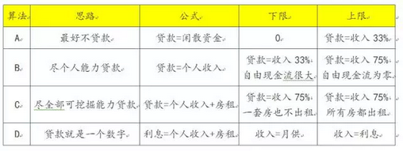

# 越是到了后期，内功心法越是简单。往往就只有一句话，一个公式。

天诛进阶传说已久的D算法，说穿了只有一个智识障："贷款永不归还"。

一）世界观

"贷款永不归还"。这句话是什么意思。

在我们正统的AB算法之中，遵循的是传统的思路。也就是田园风格，小家碧玉，宁静而又恬逸。

在这样的生活中，是没有"贷款"的存在的。生活也永远没有压力。

当进化到C算法之后，我们有了贷款，并尽力去偿还贷款。

可是你仔细看，C算法的最终目的，还是"还清贷款"。也就是你按照现金流盈亏平衡的原则，尽可能去多贷。

每月勤勤恳恳地活着。终有一天，360个月以后，你会还清贷款。回归"正常人"的生活。

可是，这样的思路是不对的。

水库论坛是一个"毁三观"的论坛。

因为从小生活在一个Communism的国家，这养成了我们质疑一切的习惯。因为谁也不知道哪条准则原则，就是国家精心安排的洗脑教育。

"贷款"真的应该还清么。

你看李嘉诚的长江实业，现在还有上千亿的银行贷款。可是直到李嘉诚退休，过世，你认为长江实业会还清银行贷款么。你认为长江实业会以"还清银行贷款"作为奋斗目标么。

不会的。对于整个李嘉诚，长江实业，富人阶层来说，这1000亿已经成为"底仓"了。或许会有800\~1200亿的波动范围，但无论如何，长实绝不可能将贷款还完。

贷款是什么。贷款绝不是一种要归还的东西，贷款是一种[理财产品]。

二）D算法

搞清楚了这个概念。我们再回过头来看D算法，就显得十分清晰。

C算法的上限=D算法的下限，大致是年收入的30倍左右。

计算如下，按照目前的利率水准，每一期的月供，大约是贷款总额的0.6%，一年7.2%

房屋本身的租金，1000W房子租25000，大约是房价的3%，或贷款额的4%

则每一套房子，你现金缺口：7.2%-4%=3.2%

这部分要靠你自己的工薪性收入去填。所以就是30倍。

你每年"税后消费后"结余60W，你就能撑起2000W的房贷规模。

但是我们从C算法跨入到D算法时，我们的扩张能力要增加不少。

在D算法中，你只需要和利息打平。

目前基准利率是5%，房租收入等于贷款额的4%

则你每年的缺口，仅仅只有5%-4%=1%

也就是说，你可以撑起自己收入"100倍"的资产组合包。50W的年薪，可以维持运作5000W贷款。

这仅仅是一个最简单的举例。在真实的世界中，多军的资金来源往往很杂。

按揭贷款，抵押贷款，私人借款，信用卡，企业经营贷款。在这么众多"借款来源"之中，30年期按揭贷款往往只有一笔。只有第一笔才能做按揭。

这就导致多军的资金流压力，远远大于理论值。

当你只有一千多万的外债借款时，往往月供就要上10W了。这极大地限制了你的扩张步伐。

因为你没有那么多的现金流来源去补，无法做到现金流平衡。

而当你知道了D算法之后，你就相当于吃了一颗定心丸。

你只要计算一下"总收入=总利息"支出。只要这二项打平。在D算法下你就是可以活过来的。

即使你扩张锐意，也不会遭遇麻烦。

三）D算法的实务操作

在实际实战中，D算法主要靠"持续不断的加按揭"。

譬如说南瓜太妹搞了笔800W的企业贷款，分36期，每个月还25万多。还到吐血\~怨声载道，死去活来。

她一度质疑在如此艰辛的生活下，还能不能进一步扩张，还有没有未来。

我说没问题啊，随时迈入下一个关口。

因为你归还的800W贷款，每月月供25W。其中有21W其实是还本金，只有4W是还利息。

看似你每个月都在往银行搬桑塔纳，其实你是在存款，不经意间银行又有300W\~400W的信用恢复。

那么你该怎么办呢。过个二年二年半，重新再问银行申请借出来！

这时候，你一笔又可以再借个五六百万，马上就是大型项目的首付。金额增加，时间拉长，而月供也并没有变化。

一般而言，我们对抵押贷款的利率并不敏感。甚至对抵押贷款是10年，还是20年30年，也并不敏感。

而后者，往往是新晋多军津津乐道，以为天大的事情一般。

为什么，因为我们清楚，无论怎样的抵押贷款，"三年之内肯定要毁掉重新做"。

一笔十年期的抵押贷，过了三年，我们往往并不等到他全程都结束。

截断他。

重新向银行申请借出来。哪怕其他所有的条件都不变，我之前36个月还进去的几十万"本金"至少可以重新借出来。

一笔10年期贷款，到了第7年末。我们就重新办一下。再把他"展期"成十年。

哪怕和当初月供利率都不变，我也能加按套出几十万。

而实际操作中，因为房价总是在涨的。还款三年之后，再去做的新抵押借款，往往可以借得比当年多。某些情况下，甚至可以做到"正现金流"。

抵押，本身会有一点运作成本。假设为贷款金额的0.5%。如果你每三年操作一次，这些成本要平摊到每年中去。即利率上升0.2%

真实利率由7.6%升到7.8%左右。

此处可以精算。

四）流水线操作

假设你有8套房子。那么你可以按照如下图表操作：

在2015年，你以A标的向银行申请加按200W元。

这200万，部分用于还月供贷款，部分用于买新房2N扩张，部分用于个人花天酒地消费。

到了2016年，你以B单位向银行申请加按200W元。

这200万，部分用于还月供贷款，部分用于买新房2N扩张，部分用于个人花天酒地消费。

到2017年，你以C单元向银行申请加按200W元。

到2018年，你以D单元向银行申请加按200W元。

............

............

到2023年，你再以A单元向银行申请加按200W元。

也许有人会问，你A元不是已经借过200W元了么。怎么又可以再借？

别忘了，这时候已经过了八年，你的贷款已经还得差不多了。

你每个月还进去的，其实一大半都是本金，只有小部分才是利息。现在这些本金又积累成你的财富了。

按照这个pipeline流水线的模式，你每一年都可以新增200W的现金流。一小部分留出作月供，足够的实力够你再去2N，足够的实力够你花天酒地。

这是一件了不起的事啊！

你想象一下，一个"税后年薪"200W元的钻石级领，过的是什么样子的人生。而普通人一年五六十万，又是怎样的生活质量。

有这个Pipeline存在，你就可以保证在可预见的将来，每一年都有200W现金年收入。

要做到这一点，首先你要有十个"成熟"的儿子。

我们一直说，在第1套，6套，16套时，会有明显的分界线边际。

要形成这套流水线架构，你至少需要八套房子，最好十套，最少六套。

五）结语

从一开始，我们就没想把贷款还清过。任何一个资深的多军都明白，"完全没有贷款"，是一种不可想象的生活。晚上也是睡不着觉的。

工业时代，城市生活，我们和田园农村永别，再也不是那样的三观。

我们假设的是D算法[永远维持]那个水准，贷款永远不变。当一套房子的贷款，由100W降到70W时，我们就再做一次加按揭，再把他的负债率泵上去。

贷款是什么，贷款只不过是一种理财工具。

（yevon\_ou\@163.com，2015年9月22日晚）\[1\]\[2\]\[3\]

\[1\]参考文献《第三个负号》http://www.libaclub.com/t\_113\_6371667\_1.htm

\[2\]《第三个负号之D算法之戏说篇》http://www.shuiku.net/forum.php?mod=viewthread&tid=18830

\[3\]《第三个负号之D算法》http://www.shuiku.net/forum.php?mod=viewthread&tid=18789
