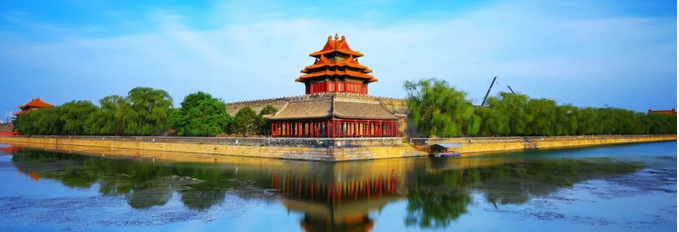
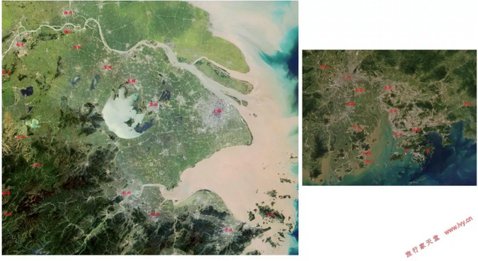

# 我们都是不死鸟 \#4020

yevon1ou [[水库论坛]](/) 2月4日

我们都是不死鸟 ~\#4020~

 

川流不息的命运大河

 

 

一)拜新年

 

棋牌室里最难的，一个是下军棋，一个是斗地主。

什么样的人，拿了二个王，四个2，四个A，居然还能打输掉呢。

 

没有办法，哥哥欠了一屁股的利士封。

大年初一，被迫也要更文，挣广告商的红包贴补家用。

 

 

近期"封号"高峰期。多说多封，不说少封。原则上，水库本来想经年累月，一篇帖子也不发新的。

如果水库"更新"了，那一定是接广告了。人为财死，停不下来。

 

 

今天的文章，排期正好大年初一。金亥送福，选题当然得写篇大吉大利的。在这里给各位拜年了

 

 

二)不死鸟

 

投资市场寒冬中，选题"大吉大利"，唱多殊为不易。

 

哥哥我一边写文章，一边冷得直打哆嗦。

跑到厨房一看，不出意料，"暖气炉"果然又停了。

 

这只生产于2003年代的"依玛"燃气炉，是房东留下来的。十几年前的欧洲技术，不接地气。

其特点，对于"气压"特别敏感。

 

譬如北京的天然气中，如果"含气量"稍微不足（酒里掺水），这款燃气炉很容易就罢工。

常常有睡到晚上半夜，突然觉得寒冷彻骨。

爬起来去厨房调试，果然是气压不足，导致机器宕机。

 

你说北京首善之地，搞得天然气气压都不够。您这不是存心冻我么。

温温暖暖才能过新年啊。

 

那怎么办呢，活人还能给困难绊死。

哥哥找出了一米八的棉大衣，暖婆子，电热汀，十八般武艺一起上。

围炉烤炭赏春秋，自然也有一股千年皇城根的味道。

 

冻不死，我们都是"不死鸟"。

 

 

 

三)腹地

 

前二天，有人问我"上海的经济怎么样，还有没有希望"。 

（图片闽赣，不敢贴）

我回答说，有希望，上海是一头不死鸟。

 

 

最近的五年，上海经济表现非常差。五年累计增幅，全国31个省份中垫底。

和经济相关的，上海错过了一个又一个的"风口"。

汽车，石化，制药，电子，论新兴的独角兽企业，上海屈指可数。

 

相应的，上海"房价"表现也非常差。严格说是"令人失望"。

有产阶级普遍不满。

占人口多数的市民阶层，并没有得到实惠。

 

 

暗地统计一下的话，这段日子向我咨询"上海怎么走"的问题，也多起来了。

很多人想问的是，"上海还有没有希望"。

 

对于这样的问题，我一般是摊开地图，指着"你看"。

中国从隋唐时代开始，就有"扬一益二"的说法。"江南"的土地一旦开发，其富饶程度，远远超过干旱的华北平原。

 

进入工业时代之后，长三角又有着最优良的平原和水网。沿着沪宁线二岸拓展，可以极大地摊薄基建成本，物流成本。

平原在"搞经济"方面，优势是巨大的，难以抵挡的。

 

 

另一个可以类比的，是"珠江三角洲"。

长期以来，如果有人问，"广州深圳好 VS
上海好"，你可以毫不犹豫地回答他，上海好。

 

哪怕珠三角目前气势如虹。广州+佛山+深圳+东莞，已经连成一片"超超级"城市群。

连美国人都惊呼的，历史上前所未有"特大城市群"。

 

 

可是你看看地图，珠江三角洲的致命问题，是它的平原太少。

广州往北进入清远，就到了山区。咫尺之遥。

 

在全国地图上，珠江三角洲就是小小的一块。"腹地"撑死了一亿人口。

因此珠三角的GDP上限，就是：人均50000USD \*
1亿人口。

但是"长三角"不同。"江南"的总人口是2亿。

人口体量翻一倍，经济总量甚至要增长2.5倍左右。

 

"上海"是长三角的龙头。自从海运开始，苏州衰弱，此地位从未动摇。

作为"2亿人口"的龙头，上海就是不死鸟。二亿人口在，上海总有翻身的一天。

 

如果我们纵观历史，"上海"现在并不是最惨的状态。

1980年代初，上海人穷了三十年，而广东深圳已经开始改革开放。

当时大量的上海女儿，甚至以嫁到广州为荣。

  

之后，随着1990年代"中国第二级"改革开放。长江三角洲迅速崛起，并成为中国最大的经济发动机。

哪怕现在有点困难，但只要给点政策，枯树逢春也是很快的。

 

 

 

四)树大根深

 

www.360doc.com/content/16/0626/00/366082\_570766683.shtml

-   冬川豆有句名言："只要愚夫愚妇还笃信上帝，波兰就永远不会灭亡"。

-   现代人分析美国国势："只要红脖没有死光，山巅之城就不会陨落"。

-   看力量，要看实质。

 

力量真正的源泉，不是向上，而是向下的。

树大根深，有土壤的地方，就有生命。根系才是力量，花朵只是表象。

只要二亿人口还在，上海就是不死鸟。

 

"权健"保健品为什么永远也打不完。因为土壤是"消费者"。

只要中国还有上亿空虚的，孤独的，没有子女陪伴，没受过高等教育的中老年人；

那就肯定会有卖"香炉灰"的保健公司冒出来。

 

 

山东，广东，为什么出大官。

因为山东本身就是"人口大省"。逼近一亿人口。接近东三省的总和。

一亿人口的"基本盘"，庙堂之上，一定会有山东籍的官僚。也一定会有山东人的代表。

这是不随谱系和代际转移的。

 

 

西北为什么不出人才。因为西北缺水，缺水就没有人口。

很少有人知道，陕西省的人口，只有四川的1/3

若扣除"汉中"，这数字还要少。

 

昔日"关中平原"沃野千里，帝王霸业。

如今已萎缩到不足中国经济的2%

 

 

 

五)中国经济的基本盘

 

过年了，省不了要置办年货。

大街小巷，走亲访友，和各行各业的人聊聊。

 

在过去一年中，中国A股指数跌了-25%

币圈清零，创业链崩盘。

其他大小金融市场，各有不同程度下跌。

 

以一个长期居住在北京金融业的人，"天都要塌下来了"。

身边四处都是TMT裁员的消息。

朋友圈一片惨淡。

 

可是你拜年购物呢，你会发现"其实没那么糟"。

太阳照常升起。该吃的吃，该喝的喝。

亿万富翁跳楼，不影响小人物的日常。

 

以一个普通人的视角，2018年真没什么大事。

百姓的日子，还是过得很太平，惬意，舒适的。

抖音化

 

树大根深，中国经济的基本盘，是十三亿人口的"衣、食、住、行"。

而这一切，都还依然非常正常健康。

太平盛世。 

 

北京是一个特例。

相当于十三亿人口，每人给你1元钱，于是立刻诞生了一个13亿的富豪。

 

苍天厚土承载着，厚重的土地母亲，吐出一口果脯，就能锻造一个亿万富豪。

豪门商战，发财故事，却往往占据了我们99%的眼球。

 

当飓风吹来，"枝芽"很容易被摧毁。

你赔给每个人1元钱，你就亏了13亿。

BAT，TMD公司，排名几经起伏。强东几个跌停，就能洗去百亿市值。

 

"枝芽"面临十七级台风，然而厚土无惧。

再强的冲击，也不能撼动大地。

 

 

从某些意义上讲，"中国经济"也是不死鸟。

因为十三亿人，吃喝拉撒，基本需求摆在那里。跌了一个京东，自然会再冒出来一个拼多多。

生产力与日俱增，道路基建不断延伸。

 

不管宏观调控面如何摇摆，中国是大国。根系繁殖。

只要十三亿人口迈入工业化，中国就永远是大国。再怎么玩也是大国。

 

豪门恩怨，商战情仇。

马爸爸净资产多少，股市收盘点位如何，这些都是过眼云烟，不值一哂。

 

等到哪一天中国人都不生孩子，这才是根系枯萎。

关系到国运的生死大事，没有孩子，繁荣只会是表相。

 

 

 

六)结语

 

总体来说，中国对网络还算宽容的。

从历史上横向对比，大致可以架平\~\~咳咳时期。

 

他最多封你的号。你换个地方，重新开一家报馆，重新开一个报纸，你还可以活下去。

皇恩浩荡，感激不尽。

 

 

写得好的自媒体，也会有不死鸟。

三根阳线改变信仰。

楼市涨一涨，你们自然会掘地三尺找到我。

做人还是要乐观点的，恭喜发财

 

 

（yevon\_ou\@163.com，2019年2月4日暮）
