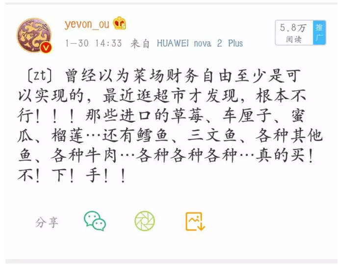
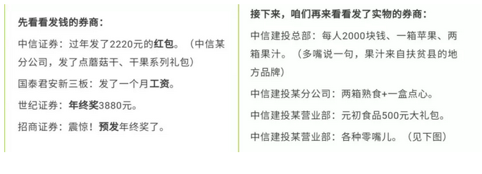

# 新一轮经济周期似已到来 \#4040

yevon\_ou [[水库线下]](/) 今天

**新一轮经济周期似已到来 ~\#4040~**

 

 

冬天到了，春天还会远么。

 

 

一）超市

 

有一项极为重要的，不可逆的，影响到十亿人民的大型经济指标，正在深刻地发生着变化。

 

 

为了解释这个变化，我们首先要讲引言。

众所周知，2018年是"经济寒冬"。随着强力的环保审查，强力的金融收紧，强力的企业监管，各行各业哀鸿遍野。

 

许多民营中小企业主纷纷表示，"开了30年的工厂，到今天再也坚持不住了"。

微博上，财上海整天冷嘲热讽，塑料铅桶。

 

如果你身边有小微企业，民营工厂主，2018年是一个需要给予他们关怀的年份。许多老板，就倒在了"结构调整"中。鹰派的漫长，寒雪冷得让人看不到尽头。

 

 

但是，绝大多数人，并不具备经济学常识。他们不知道"企业关厂，环保合规"，鹰派漫长的经济寒冬，其背后的意义是什么。

意义什么，超市里的物价大涨了。

 

物价，是供求关系的体现。供小于求，物价自然大涨。

塑料铅桶厂，纷纷都倒闭了。那么剩下的塑料铅桶，自然就开始涨价，老板开始赚钱。

 

需求并不会减少，中国人的消费有增无减。

好比说，一瓶青霉素浇过，细菌杀死99.999%。剩下的一点点抗药菌，就可以独享全部的营养。

 

度假前我逛超市，最大的感受，是超市的价格"涨"了。

 

以前我们买东西，喜欢用一张"老人头"。

甚至有一个漫画，100元钱，在1995年可以把购物车堆满。

在2005年，可以把购物车铺一层。

在2015年，就只够买二瓶洗发水了。

 

 

现在我们逛超市，根本不是"100元钱"的概念。

而是"1000元"钱。

 

我总结了一下最近几张Carrefour单子，还有京东的购物车消费。

最直观感受，家乐福每次1800\~2000元左右。

京东一个月可以花一万！

 

巧克力，矿泉水，水饺，糖果，西瓜，牛奶，童装，儿童玩具，全面上涨。

具体的购物清单，比较繁琐。我也懒得贴了。

各位杠精的话，自己去超市看看。

 

 

 

二）金融

 

超市的"终端物价"上涨，这意味着什么。

您不懂金融的话，大多数人也答不上来。

 

意味着股市立即会上涨

 

 

对于企业而言，"售价"上涨，简直就是生死阀，救命稻草。

不管再破的企业，价格涨+20%，就是二十点的毛利！

 

资本市场，是极其极其敏感的。

对于资本市场，基金经理只要晚上泡几次超市。

基金经理立刻可以分辨出，自己投资的公司，销售额上升了，毛利率也上升了，明年的业绩报表，一定非常闪亮。

 

虽然中国的股市，是一个大泡泡。

但是大家炒炒概念，搞搞热点，赚点吃饭行情，基金经理还是高兴的。

 

 

 

三）输家

 

超市里的物价涨了，企业赢利增加了。企业主很高兴。

股票涨了，基本面也靓丽了，基金经理很高兴。

 

四个人打麻将，三个人赢钱。请问，输钱的哪一位。

左看看，右看看，输钱的哪一位。

毫无疑问，当然就是你啦。

 

 

对于"小白领"来说，他就是最大的输家。

每天的日常开支，维持生活必需品，成本变高了。

做二堂瑜伽课，收你250元/小时，那都不算事。给小孩子报点学习课，收费直接虐到你怀疑人生。

 

小白领又没什么资产，可以"分享"金融市场的收益。

竭尽全力地活着。

 

 

"通货膨胀"对于工薪阶层而言，是最不利的信号。

因为所有东西都贵了。而他，却没有加薪，甚至都没有[[年终奖]](https://mp.weixin.qq.com/s?__biz=MzIxNTg2MTA5NQ==&mid=2247484048&idx=1&sn=d2872bf561df7ddfee892761c72f7cbb&scene=21#wechat_redirect)。

 

 

 

四）地产

 

或许有人问，"地产呢，地产圈怎么样"

 

这个问题，上周西港推介会\~深圳站，我已经回答过杨德龙老师了。

 

"炒股这一行，好比10000个人，每人拿着20W股本杀进股市"。

"一共合计20亿"

"请问，几轮半年炒作之后，他们的分布是怎样的"。

 

"股市，是一个大鳄吃小鱼的地方。是一个技术好，吃技术不好人的地方"。

"20W进去，出来绝无可能，依然是平均地每人20W"。

 

"这么多人中，肯定会出一个大褂。一个人就赚了2亿"。

"剩下的十几个人，各自赚了几千万"。

"一些百万级"。

"而最后奥迪变奥托的散户们，每人剩2W元逃出来"。

 

"那些赚百万千万的人，转手就买了房子"。

 

你本来人均20W，你是买不起房子的。

股市是一个"金字塔"形的火炉，进去财富集中度就变高了。

出来，土豪就有购买力了。

 

做地产的人，从来不急。

你股市兴旺，我们就看着你兴旺。反正你到最后获利出来，你还是要买房子的嘛。

这从来不是"跷跷板"的关系。而是"单向膜"。

 

 

另一方面，既然物价都涨了。味千拉面从28元，涨到了35元。二字头快绝迹了。

等到哪一天，吃一顿工作午餐，普遍都要"百元以上"。

您认为房价还会继续再是300W元么？

 

地产是最牢固的资产。对于地产人而言，我们也从来都不担心。

 

 

 

五）新一轮经济周期酝酿中

 

证券始祖，曾经提出过一个"美林时钟"的观点。

意思是，金融市场风水轮流转。不同的阶段，有不同的资产大项受益。有不同的人群和团体受益。

 

 

譬如说，在上一个时钟周期中，2018年绝对是转到了"冬"的位置。

在这个季节，物价恒定或下跌，工资缓慢增长，企业家是最吃亏的群体。

小白领最美妙的日子。

"我管我吃皇粮，哪在乎企业家跳楼"。

 

而如果时钟缓慢转到2019年，我们有概率认为这是一个"春"的契机。

以物价上涨为龙头，整盘棋重新又盘活了。 

-   物价上涨之后，企业家获利。

-   资本市场，注入800cc血液。

-   地产市场，显得相对廉价。

-   新一轮风口，投资，VC，又可以酝酿。

 

你想象一下，如果"毛利率"很高，则商界传奇，钢铁侠，贾布斯，罗锤子，新一轮PPT大战肯定又会开始。

PE/VC，不知道又会有多少"风口"故事可以吹

 

 

 

六）经济周期的尾声

 

"加工资"未必是一件好事。

尤其是你负责的工作并没有变化，效率也没有提高。突然加工资，更不是好事。

 

 

一年之计在于春，如果以"超市涨价"为标志，梳理产业分配的话。大致可以这样说：

-   春：物价上涨，企业毛利大幅增加

-   夏：为了攫取更多利润，企业纷纷增加产能。

-   球：为了产能，企业提高工资招人

-   冬：陷入新一轮高供应，高成本竞争。财务指标岌岌可危。

 

 

人口学上有"马尔萨斯陷阱"，人口的增长，会持续维持在生存线上下。

这原理对于工商业企业，也是一样适用的。

 

如果没有外界干预，企业就会不断增加产能，互拼成本。最终导致"毛利率再次死限"。

 

若毛利率很低很低，长期维持在3\~5%的水准。

一旦风吹草动，遭遇环保、合规风暴。企业又陷于破产的边缘。

人工降雨，来一次调控。撑不过的企业，统统冻死在寒冬中。

 

然后春天才会复苏。

 

 

 

七）结语

 

经济周期，是一套严谨的经济学学说。

受益者和工资理论，业界也没什么争议。

 

唯一重要的，是一项"极为重要的，不可逆的，影响千千万人"的指标。

超市到底涨了没有

 

 

如果涨价真的发生，则后面一堆经济学衍生推论，也接着发生。

包括股市，楼市，甚至PE/VC创投圈的"猪风口"，都是意想之中的事情。

 

"超市涨价"通常是不可逆的。也是整个通胀传递的最后一环。

重塑形体。

到底涨了没有，你先说。

 

 

 

（yevon\_ou\@163.com，2019年3月3日晚）
