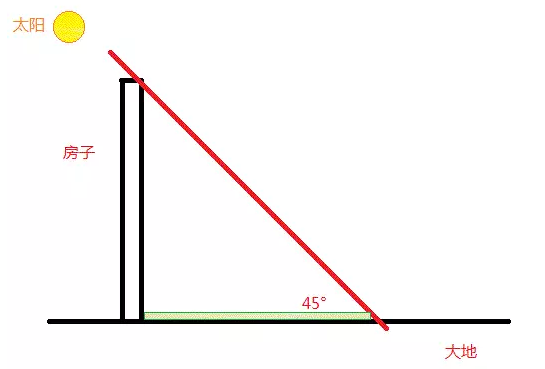

# 世界上最好的房型（2）\#440

yevon\_ou [水库论坛](/) 2015-11-18

 世界上最好的房型（2）
===============================================================================================================

昨天写了《世界上最好的房型》，朋友们纷纷表示不满意。

他们说，我们不要宏观上的分析。我们要微观上浴室，厨房，玄门怎么布置。要细节，要微调，要干货。

好。我们继续这个话题。

一）定位

谈论世界上最好的房型。首先要明白定位。

就如（1）中所说的，房型没有最好的，只有最合适的。

对于不同的阶层的人，有着不同的审美癖好。一个在"工薪族"眼里完美无缺的房型，在豪宅业主看来就是垃圾。

同样道理，豪宅族的鹿肉大餐，也不是小老百姓所能消费得起的。

所以这个话题，要从"定位"说起。

KFS拿到一块地。他首先要做的第一件事是"定位"。

粗略的划分，目前市场上分七级：

A. 300\~330平米，董事长级

B. 250\~270平米，总裁级

C. 180\~200平米，总监级

D. 130\~150平米，经理级

E. 90\~120平米，白领级

F. 60\~80平米（二房），屌丝级

G. 40\~50平米，单身级

其实在A之上，还有一个S级。也就是1000平米以上豪宅。只不过这个市场非常小，有空再说。

对于"总裁级"，这里要特别说明一下。

所谓总裁，就是打工到顶。"一人之下，万人之上"。公司的总经理。但他毕竟不是老板。收入和社会层级，还是要逊色很多的。

典型的譬如新闸路"远中风华园"。廿套小联排，250000/㎡，但他的房型是220平米的。

当时在业内就引起了非议。这叫"错配"。

业内人士质疑，你这个单价是"董事长级"的，而面积却是"总裁级"的。你让销售怎么卖。

当然地块限制，KFS也是有苦衷的。这是后话。

对于产品的设计，你一定要"配套"。地段，面积，规格，三位一体，缺一不可。

譬如你在静安区丽都这样的地段，你要做公寓，就是100000/㎡的单价。你就应该设计120\~160平米。针对的客户是总监高管。

如果你做250000/㎡的联排，那么买得起的就是董事长。董事长住220平米，他会觉得太小，住得不舒服。所以350平米合适。

同样道理，如果你在远郊地铁房。拿一块屌丝地。周边医院学校超市配套什么也没有。

那么你的房型设计，就应该以70/90为主。二房尽量紧凑。针对的客户，是刚踏入职场的上班族小白领。

远郊除了别墅，否则是很少看到大面积好房子的。因为"地段，面积，规格"三位一体。

在什么样的地段，就要造什么样的规格。再确定什么样的面积。

千万别相信什么"市区小房子"和"郊区大房子"之类的选择。那是屌丝们的想法。

有钱人的含义就是，"面积也比你大，单价也比你高"。

二）中流

知道了面积的定位。我们继续来看宋家泰的案例。

在他的文章中，他研究的是一个160的房型。

这样的阶段，相当于企业中层干部。年收入在40\~50W，或者60W\~70W（夫妻）。

个人净资产在800W左右。买第二套房，年龄35\~38岁。

你首先确定了160㎡是D类型，然后再来讨论其内部的分配。

"虎哥"是一个挺有想法的人，他不满足于现有的生活。

所以他合适的"社会阶层"应该是130\~150平米，而他画出来的，却是一个160㎡的房型。

所以宋家泰一看，就皱眉头了。"你这个是不是太浪费"了。其实，作为一个比他高一阶的社会阶层，譬如C类总监级。总监绝不会说这样的话，反而会说"160是不是小了点"。

在160这个房型设计图中。虎哥喊出了他的心声。

他要求是主卧要大点，客厅得小点，次卧更小点。而厨房则变得可有可无，甚至是开放式的。

我们首先要明白，160是一个硬约束。

和豪宅设计不同，豪宅几乎没有面积约束。你想要这个大，那个大都可以。

而对于工薪住宅，他是有"总面积约束"的。

在这个例子中，如果160是总量的话。那么你这个大了，那个就得小。变成了一种取舍问题。

虎哥的设计方案，是"取卧室，舍客厅"。宋国泰惊呼不可，一定要"保客厅，弃卧室"。

对于豪宅就没有这样的问题，你完全可以"大卧室，大客厅"。

天下武功，唯快不破。

天下房型，唯大不破。

继续虎哥的话题。虎哥画出了他朝思梦想的房型。然后宋国泰拿去给八个朋友看，八个朋友都说不行。为什么不行呢，我们逐个逐个分析。

首先，你这个客户群太小。

得屌丝者得天下。虽然我知道你这个概念很好，你很有品味。但是你的客户群太少了。

在之后的对话中，宋国泰是这样描绘虎哥的：

*老虎作为一个顶尖设计公司的老板之一，每天早上眼屎还没扣干净就已经堵在延安路高架上了，晚上回家的时候已经是后半夜了，哪里还需要什么客厅？！主卧室要大，那是因为他回家时老婆已经关灯睡觉了，不敢开灯又不能跘着床，卧室太小早晚会被骂死。内个小书房、小冰箱、宵夜不都是这种生活方式的体现吗？*

可想而知，什么样的人不需要客厅，而要卧室大大大。"天黑上班，天黑下班"的人群啊！

因为你丫整天不在家，所以你才需要一张舒适的大床。

而问题是，你这样的人有多少。是主流么？

凡是俺LP喜欢的餐厅都会倒闭。

凡是她喜欢的餐厅，都会第一时间倒闭。破产，关门大吉。

越是喜欢越是倒闭。她越是赞不绝口的店，越是死得快。有时候甚至SWFC我停车到楼下，上楼它就已经倒闭了。

为什么，我只能安慰她说："不是你的品味有问题。Niche
Market你实在太小众市场了"。

作为一个设计师，你可以小众，可以品味，可以特立独行。

可是对于KFS，他敢么。

*大户型真不敢多做，卖不出去咋办？我拿什么还总包的钱？我拿什么还基金的钱？卖的慢怎么办？我IRR怎么办？我ROE怎么算？富人还是少呵！中小城市连中产阶级都没几个！我还是紧紧抱着贫下中农吧！*

这是虎哥设计图被砍的第一个原因。我们接下来再看后面"八仙"的分析。

到了第二段，他说道：

这个户型面宽要13米，对于一个150-160平方米的户型而言，略显奢侈，"**开发商都是要进深大的，这样出面积**，你是开发商你懂得

他这里讲到了一个"进深"的概念。并且说160平米，但却有13米的光照面，这是不可以接受的。为什么呢。

为此，我画了一个图：

凡是房子，都会造成影子。

日照是一种稀缺资源。并不是一个小区的每一套房子，每一套房子的每一个房间，都可以晒到阳光的。

那么，阳光应该如何计算呢。

你看上图中的图例。这是假设当太阳成45°角的时候样子。

在这个时候，房子在地面上造成的阴影。"其面积正好等于房子表面积"。

也就是说，你把房子全部推成"楼倒倒"。一块块平铺在大地上。

你把整个小区铺满。小区一共有100亩地，则能晒到太阳的一共也是66666平米窗户。

可见，无论你怎样设计。整个小区能晒到阳光的房间，其总量是恒定的。1:1就是你占地总面积。

那么，KFS要卖面积，要卖尽量高的总价。他的设计，就一定要"深进深"。

譬如世茂滨江的房型。他的主要核心卖点，是江景看黄浦江。

可是江岸线就这么长。整个地块也不过数百米的距离。

世茂集团为了尽量多地卖"江景房"。他们设计出了甚至有30米进深的骇人听闻的房型。

整个套内，面对江的可能就二个房间，7米宽幅。

可是房间深深深，后面一直延伸出去，足足有三十米深。是一个长筒型。

据说香港最贵的房子，既不是南湾半岛，也不是山顶豪宅。

而是沙田跑马地的房子。尤其是面对跑马场，可以坐在家里看赌马的房子，更是赌徒们的最爱。

可是因为正对着跑马场的视野有限。一共就这么点距离。于是就出现一些非常匪夷所思的房型。

譬如一种典型的"扇形"房型。他每一个套内，开间只有1米。

你没看错。只有1米，有的甚至一米都不到。而后面扇面很深，总面积也有400\~500尺。

这一米乃至半米的窗户，正好够你伸一架望远镜出去。每到跑马日，无数的长筒短筒就纷纷从窗户中升出去。赌徒们大呼酣战。以单价而论，这反而是全香港最贵的房子。

扯得远了。我们还是回到虎哥户型的问题上。

户型的第三个问题是，他无法配套。

观看户型图和设计户型图，这是二个概念。很多人犯的一个错误，他只看了"小地图"，而没有看"大地图"。

什么叫小地图，虎哥画的那张，宋国泰画的那张，就叫小地图。

什么叫大地图，一整个楼层的全体平面图，叫大地图。

在之前几个批评中，有人说虎哥的图纸凹凸太多。既增加了建筑成本，也不节能。

其实虎哥最大的问题，反而出在大地图上。

作为大地图，你要考虑更多的事。现在基本都是板式楼层，一梯二户。那么电梯如何安置，楼梯如何安置，回廊如何安置？

上海目前的产品进化，蝶楼塔楼基本淘汰，全是以板楼为主了。板楼者，无非一梯二户，或者二梯四户。

而目前的建筑规范，无法做到一梯二户一幢楼。

1T2H，2T4H其实没区别。基本都是一幢房子四套ABCD。

这样就引发了一个问题。即中间套的问题。

很多人画房型，天马行空，他们把自己最喜欢的东西都画上，房型可以画得很靓丽。

可问题是，A和D没有问题，BC夹在中间怎么办？

边套和中间套有很大区别。售价也差至少5%。最简单的说，边套是三面墙的，无论通风和采光都要远远好于中套。

在"大地图"中，你要考虑的是，边套和中套是共用一个电梯，共用一个电梯厅的。

如果你开门在这个位置，那么中套该如何设计。

边套可以凹凹凸凸，那中套只能凸凸凹凹了。反正和你拼成一个正方形。

我甚至见网友画过一个房型，他是G字型。其中大门入口在正中那点上。那我也只能苦笑了。你让邻居家如何设计？

请问中套如何设计？

中套既不能面积太小，拉低整个小区的档次。也不能贫富太悬殊。一个住局长，一个住苦力。

设计师是讲快感的。而KFS则要讲金钱。

你画出来小地图爽了，大地图该如何配套。开发商算总账的。

三）红尘中人

忙忙碌碌，我们都是红尘中人。

正如宋国泰文中所说的，小的创新是可以接受的，大的颠覆是不可以接受的。

在八个人对虎哥的批评之中，有一些小的批评是可以改的，也无足痛痒。譬如面斗淋浴房的尺寸，洁具的位置。

有一些中型的错误的确是虎哥没想周全。譬如大地图中套如何设计。

但在大的框架上，一个160平米的房子，却要设计出"财务自由"那批人的喜好。却是不可能的。

"阶层与礼教"每一个阶级都有他们的生活方式。不可能跳出红尘五丈之外。最多也就夜里想想，白天梦就醒了。

在开发商容忍的范围，给你设计师一些个人才华的空间。但你要逾礼，就毫不犹豫把你抛弃。

那么，我们这个行业还要不要创新，还要不要梦想进取和动力？

当然需要。你看世茂滨江的30米进深，跑马地1米宽的"扇形""锥形"住宅，不就是创新么。

只不过这些创新，并不是基于设计师个人的喜好。而是基于消费者的驱动，有什么样的消费者，才有什么样的产品。

消费者才是王者。市场的需求，才是王者。

真正的创新，应该是站在市场的最前沿。不停地嗅取消费者的"最新喜好"。每一期造出的房子，都是当期最畅销最适合的房型。

这样的工作，很枯燥，很重复，很无聊。远远不能和设计师的才华横溢相比。

但是，这才是真正"高尚"的工作。

那些造出来让你骂娘，土得让你掉渣的设计师，才是真正天才的设计师。

（yevon\_ou\@163.com，2014年11月12日午）

最后还有一点篇幅，俺再聊聊S级的房型设计。

所谓S级，这是1000平米以上。

（吃饭，未完待续）
