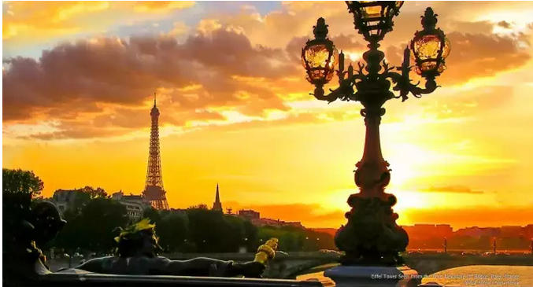
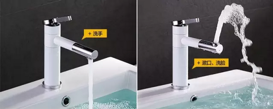

# 炒房客的流派（五）\-\-\--周转流 \#500

yevon\_ou [水库论坛](/) 2015-11-15

炒房客的流派（五）\-\-\--周转流 ~\#500~
=================================================================================================================================

在流派系列中，我们说道了"法租民宿流"，可以使得租金提高200\~300%

"药单流"可以降低买入价至60\~70%

现在我们要问，可不可以，可不可以回报再高一点？

答案是：高周转率。

一）周转流

有一个流派，被称为"凤姐变冰冰"。

其核心的思想，是装修再出售。

手法是，你先在市场上找一套最破最破，但是骨架框子还不错的房子。

好比逃难潮中找一个黑炭泥面的黄丫头，但仔细一看，还算是个美人胚子。

然后你教她琴棋书画，等到太平年份，丫鬟卖个好价钱。

我们一直惊讶不能理解的一件事，"怎么会有人把家搞得像狗窝一样的"。

一套房子要出售，最重要的是什么："品相，品相，品相"。

但是偏偏就有人把屋子弄得象狗窝一样，而且狗窝都不收拾一下，就直接这么出售。

于是怎样，于是你只能卖一个很低的价格。

"凤姐变冰冰"这个流派，有以下几个步骤：

1）找一套最破最破的房子。最好是[因为破，导致折价]的房子。

因为你反正要敲到"原始社会"然后再重新装修，那么那些本身装修得不好不坏的房子，才是最为尴尬的。

你干脆就买最破的，反正我都要敲掉的，你帮我把"买入价"降下来。

2）进行装修

很多人有一个误解。认为"装修"可以给房子带来附加值。

这种说法是绝对错误的。精装修房是要绝对回避的，譬如臭名昭著的仁恒。

如果你买二套温州土老板的房子，你有可能被里面"金碧辉煌"的底色吓倒。这种纯皇鎏金的风格，还有黑胡桃木的家具，非常地耗钱。动辄几十万。

而这样的"高档"装修，在真正的Re-Sale市场，并不能卖出价钱。装修投资，绝不是材料越高档越贵越好。

职业炒家所做的装修，是一种被称为"专为出售所做的装修"。

这种装修很怪，很怪异，内行几乎一眼就看得出来。啊，原来对面也是同行，哈。

"专为出售所做的装修"有一些基本元素：

a.  a) 通常是极简风格，或者北欧Cybertech风格。因为相对于繁复法欧，极简无疑省钱。

b.  b) 用料并不高档。但足以吸引眼球。

你花200,000元买一个GROHE的花洒，并不能使你的房子升值。

相反，500元买一个可以360°向上喷水（洗脸）的水龙头。则非常地有逼格。

a.  c) 材料质量不重要，关键是要新

这里面一个诀窍：大规模地使用玻璃，塑料面。

真正有经验的装修师傅都知道，玻璃做的样板房，看上去晶莹剔透，美艳不可方物。

可是时间久了，玻璃表面会氧化。最终所有的玻璃都会钝化，而变得象老光镜一样混糊糊地非常难看。

可是，全新的玻璃，厨房塑料面板，在短时间内能给人非常大的视觉冲击。形成一种"很新很新很新\-\--全新"的概念，从而极大托高售价。

a.  d) 灯光一定要亮，超亮。绝不能有一种暮气沉沉的感觉。暗=旧

总体而言，这样一种装修风格，是完全围绕"为卖而装修"的。

如果你是自住，一定不会这样装修。会选一些更经久耐用但看上去很土的材质。

本篇不是谈装修的，就不展开了。

3）第三步，转手出售。

二）赢利的基础

周转流为什么可以赚钱。"凤姐变冰冰"赢利的基础是什么。

其基础，来自于房地产估值模式不同。

我们之前有一篇文章可以参考：《炒楼的回报有多高》\[1\]

             买入年   第二年   第三年   第四年   第五年   第六年
  ---------- -------- -------- -------- -------- -------- --------
  房屋价值   75       115      131      150      175      200

可见，如果我买入的第二年就抛售的话，那利润率是115÷75=153%

而此后第三，第四年出售的话，131÷115=115%

也就是第一年有近50%的毛利，此后每一年就只有15%

为什么会这样呢。因为炒家的利润，其实分为二个部分。

1）资产性收益。手中所有的"库存"跟随大势上涨。这个速度大约是每年15%

2）交易性收益。**因为人的运作**，发现笋盘或者解药药单之类的，获得50%增值。

笋盘是什么，笋盘就是你以75W的价格，买到了价值100W的房子。

但是这样的收入，是一次性的。仅在第一年存在。

此后每年还是15%的大盘平均速度。

"凤姐变冰冰"的流派思路，就是停驻于"第一年"。

既然第一年有50%收益，以后每年15%，那我永远第一年好了。

75买进，115卖出。

再75买进，115卖出。

一套房子拿到手\~\~装修。从很破很破，变到身光颈靓。

然后你就卖出，拿到+50%的赢利，再投入下一笔交易。

循环往复，赢利岂不是更高？

三）生存的土壤

"周转流"能不能活下去。未来这个流派是会壮大，还是消亡。

答案是壮大。

这块土壤很肥沃，耕之不尽。

我们必须注意到，"90后"和70后是完全不同的二种人群群体。

当我们这些苦憋的70后存在于市场，当2000年我刚刚踏入这行时，装修是完全卖不出价钱的。

上海人的意见很明确，很务实。无论你什么样的装修，哪怕你40W房子再扔20W**豪装**上去，你还是只能卖40W价钱。

装修不能卖价，装修只能白送。"装修房=毛坯房价格"。我还不喜欢你的装修风格呢，缺什么我自己改。

但是到了80后，到了2005\~2010年的房地产市场。事情已经明显发生了变化。

装修是可以卖钱的。市场承认装修的增值。

装修与毛坯之间，出现和明显的差价。几乎可以覆盖装修款八成。

到了90后的年代，到了2011\~2015年的（上海）房地产市场，事情更发生了进一步的变化。

在这个90后为主要买家的时代中。装修是可以卖钱的，装修甚至可以卖出溢价，只要你装得有品味。对准了"目标客户"的口味。

装修-毛坯的差价=2倍装修款。

时代为什么会如此变迁呢。因为70后和90后，是完全不同的二个时代二个背景的人。

70后都是苦哈哈。如果装修花了25W，你收我20W我都不愿意。俺还想着自己跑跑建材市场，说不定能更省钱呢。

70后能吃苦，能用劳力来换取金钱。艰苦朴素。

而90后不同。90后从小生长在蜜糖之中，既没有经历过匮乏，也不能承受痛苦。

装修是一件极其"痛苦"的事情。哪怕非常优胜的老鸟，连续跑二个月建材市场，也会黑瘦一圈。更不提装修中各种心力消耗，各种破事。

而90后不能吃苦。他们不能跑建材市场。

相对来说，90后没有经历过匮乏。他们不知道"节俭"二个字代表的含义。如果有人花20W装修得现代摩登，再按照60W的差价卖给他们。他们会觉得"合理的附加值"，并愿意为此付费。

我无意谴责90后，我只想说一个事实，"通常一个王朝经历十几代堕落化，2010后，2030后，2050后，2xxx后"，整个国家也就完了。

综上所述，承平日久。90后的"享乐化"是一件不可阻挡的趋势。

也就是说，有越来越多的人，哪怕稍微收拾就能卖贵一点。"凤姐"也会折价出售。

哪怕明知道你装修成本没多少钱，"冰冰"也会有人高价接盘。因为他们就是懒得动。

四）周转

当流派讲到"法租民宿流"，租金基本已经挖到了尽头。

当流派讲到"药单法拍流"，成本基本已经挖到了尽头。

"周转流"讲的是周转。

高周转率，如果四个月一次，甚至三个月一次，每次+50%的利润。则一年下来利润更为客观，赚得更多。

这就是深圳著名id"业余套利"讲的创业故事。

但我们要说的是，他是在撒谎！

"周转流"只有理论上的价值，但是在现实生活中是不可行的。

为什么要单独挑"周转流"来作为一个流派。是说这种快速换手的模式，在其他岁月可行。可作为备用。

但是在2015年，却是不可能的。

为什么，还是因为交易成本太高。

交易成本实在太太高了！这使得任何的"短炒"都不可能。或者是，可以短炒，但利润都被政府拿走，为国家打工。

交易成本有多高，按照2015.11.14的法律，大约是在20%左右。

有人问，为什么这么高。按照国家明文法律，不就是营业税，所得税，没有多少么。而且还有很多**惠民**的政策豁免。

这种人多半是无耻的学院派，完全听不到民间疾苦的。

其一，你看文献不仔细。更不知实战之中的痛苦。

-   如果快速换手的话，营业税5.65%是逃不掉的。

-   买入方3%的契税也是逃不掉的。如果你炒小户型，则人力成本无法摊薄。

-   个人所得税2%，当你成为了一个"流派"，那你手里房子必然足够多。这笔钱也是逃不掉的。所谓"唯一"，是穷人散户的想法。

以上三项累计，明的税费成本是10%+1%中介费。

其二，真正干扰"高周转率"的，是"买卖时的压价"。

对于这件事，不是职业炒家，根本无法体会。

很多人炒股票炒昏头了。编起了房产故事，直接把股市经验拿过来吹牛。改头换姓就冒充楼神。

而房产交易，和股票有很大不同。

股票散户是50000元的数量级，楼市散户是500W元的数量级。完全二个世界。

股票你抛售1000股，你按照大屏幕上的"买一"价格，对着电脑敲就可以了。上下不会超过一二分钱。

而房产不同。如果你想抛售房产，明天你找个买家试试？

房产交易，是一个漫长的过程。这是任何一本入门教科书说的。

如果你想**快速**交易，你就在门口挂一个"For
Sale"的牌子。但这时候你的房子就不能按原价卖了。

按照美国的经验，如果你房子想"迅速"出售（一个月内），那价格是多少呢。通常是八折起，向下起。

而在中国，因为限购限贷二手房交易困难，这个数字更夸张。更低。

目前堪称"人类有史以来交易最困难"时期。市场流动性接近枯竭。

每年的二手房成交价中位数是220W元。这意味着什么，意味着80%的交易是老公房。

也就是说，只有老公房还是唯一交易流畅，能以接近不折价的速度（轻微折价95%），在短时期内抛掉。

而120平米以上的板楼，次新房，几乎完全被冰冻。每年每小区的换手率不足2%

按照"业余套利"吹牛的模型。他每年要交易30\~35套。这么高的换手频率，他唯一的可能性，是交易老公房。

但是，蚊子肉太小。这又限制了他的总获利。

更何况，如果你详细看他的复述记录的话，破绽更多。

一个人交易3套房子，是有可能真实的。交易34套，绝对不真实。

吹牛是个系统工程。

当一个工厂，吹嘘他的营业额增长十倍，各项财务数据加上一个0.

但是，如果你深入细想一步。吞吐量增加十倍，仅仅门口运货的卡车，就会造成彻底的交通堵塞。一个厂门甚至都来不及卸货。

炒楼的故事同理。

如果你把3套交易吹嘘成34套的话，会产生许多额外的问题。交通堵塞和厂门卸货。

地球上任何事物都不是"线性增长"的。业务量增长十倍，会发生许多新的瓶颈，新的业务模式，甚至组织架构重组。

在内行人眼里，一看就知道破绽实在太多了。你根本就不知道一年"交易34套"是怎样的业务模型。\[2\]

就像穷人幻想富人每天吃200个馒头。

五）后门

或许还会有一些人问，能否有一些旁门左道的方法，能规避节省掉交易成本。而使得"高周转率"可行。譬如；

1）公证

这是华南地区常见的行为。即上家不过户，仅仅做全权委托公证。

二个月装修，四个月周转。在四个月时间内，飞快地找到下家，直接节省了一次税费成本。

相信吹牛党"业余套利"等，也会以这理由辩解吧。

且不说整个流程中存在的道德风险，上家的人品以及交易流程控制。仅仅以这个模式而言，也是不可行的。

因为你"削弱"了你的客户受众面。

"公证"是可以做，但你的受众就少了。一些最老牌，最守旧的人，就不愿意和你交易。

从某些意义上讲，你这就变成了"小药单"。产权有轻微瑕疵的单子。

药单的结果，不仅仅是受众更少。而且剩下来的买家，也会要求更高的回报率。这会分走你的利润。

因为"小药单"而导致的压价损失，甚至会超过8%，超过你所节省的税费。而变得毫无意义。

2）企业产权

用公司的名义购买。同理，严重削弱了目标受众群体。

3）一手房更名

同理，削弱了受众面。

六）结语

利润 = (卖出价-买入价) \* 面积 \* 周转率

我们都知道"周转率"的重要性。可是在我们整个研究树中，对周转率的展开并不多，甚至默认他为1。

理论的背后，则是冰冷的事实。因为"税费和限购"，交易成本实在太高。以至于任何增加周转率的行径都不可行。还不如拿住死捂。

我们知道有一些人在吹嘘号召"高周转率"，但我们在仔细研究了他们的文献发言之后，认为他们更有可能是在吹牛。

譬如剥皮的这篇：《傻空写作指南》http://www.shuiku.net/forum.php?mod=viewthread&tid=28079

环境决定物种。或许环境变化之后，此流派可以复苏。

但就目前而论，提高周转率的努力不存在。

（yevon\_ou\@163.com，2015年11月14日晚）

\[1\]《炒楼的回报有多高》http://www.shuiku.net/forum.php?mod=viewthread&tid=6330

[\[2\] ]蚂蚁体重如果增加100万倍的话，并不会变成大象。他的体重会立刻把它的细腿压垮。肺的呼吸系统无法承受血液动力。必须进行彻底的生物学器官重组。有兴趣可阅读这方面文献很多。
