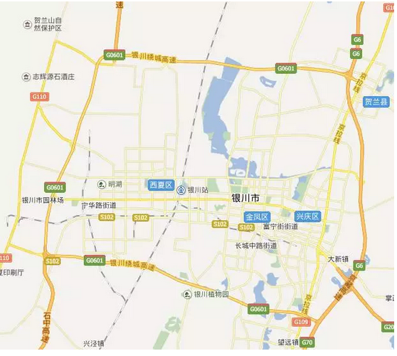
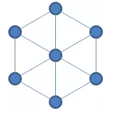
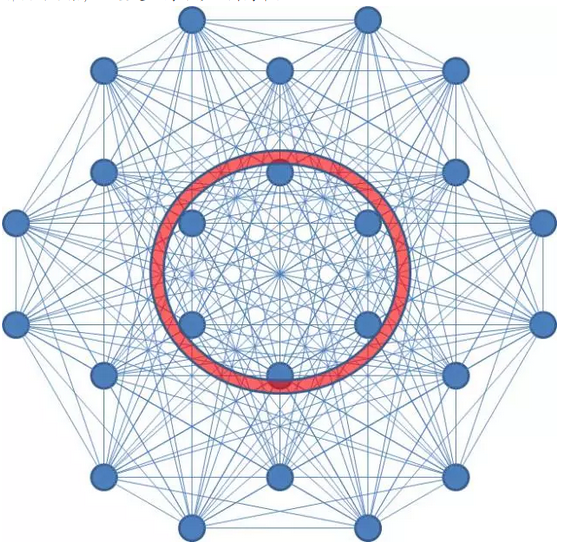

# 城市规划导论 \#580

原创： yevon\_ou [水库论坛](/) 2015-12-07

城市规划导论 ~\#580~
==============================================================================================================

商业区和住宅区应该如何分立。

机场和码头对经济的拉动效应如何。

交通堵塞如何打通节点。

一）城市规划导论

干我们这一行的人，如果完全没有看过《城市规划导论》。反而才是不正常的了。

自从入了这一行，我们就开始苦恼；无数次晚上，我们从深夜惊醒，然后再摸摸反省，是否已经被时代淘汰。

因为城市发展实在是太快了。板块轮动，热点起伏。

政府是一个大怪兽，他可以摧毁一片价值，也可以拔起一片价值。所谓"南海边划个圈，崛起了座座金山"。深圳的GDP总量接近超过香港。

而长安洛阳，已经化为了灰烬。

所以我们对"城市规划"充满了兴趣。市府的内部文件，究竟是怎样的。

那些搞"开发规划"的人，其思路思维如何。

如果你能提早预测到热点，提前埋伏，自然赚得盆满钵满。

最差最差，也能作为拆迁指引。

对于城市规划这件事，我们一直想问：

-   哪些开发区成功了，成功的原因是什么。

-   成功之后导致地价房价的变化是什么。

-   失败的原因是什么。

-   失败之后投资的断尾逃生生路是什么。

-   政府下一个开发区，会圈选在哪里。

-   CBD和CLD的比例是什么。

-   如何估算CLD的房价，最终能达到什么位置。

-   辐射半径衰减有多快。

-   CLD的形状是什么，条状块状还是辐射

-   楼市的"马太效应"是否存在。

-   人口密度和交通堵塞

-   商铺和住宅物业的换算比例。

复旦有"城市规划系"。但我们既不是这一系的学生，又没有老师教。

炒楼这一行如果你要踏步前行，那便只能自己学。

所以，俺上当当去把"城市规划"相关的书籍都买N本，外加《美国大城市的生与死》也就不足为奇了。

二）移民团

首先要说的是，《城市规划导论》那本书我并没有看完。那天晚上只看了140页。后半夜实在太累昏昏欲睡，于是便看《量子力学》去了。

此后我要看的书实在太多，便没有复看第二遍。

所以本文全部的阐述，仅限于这前140页。

若有"城市规划"系的师兄，或者其他大牛大师，切请手下留情。

可能有人会问，为何你"治学"如此不谨慎呢。看书只看了前一百多页，简直和韦小宝差不多了。

让我们再回想一下，在"城市规划导论"这本书里面，它都说了些什么。

"假设有一个小镇，他有5000个人口。则他最初的形状可能是圆形的"。

你没看错。的确是5000人。尼玛五千人啊。

书上接着说，如果这个城市要发展，要拓张，则它的形状很有可能是"线性"的。如图二：

}

也有可能是"扇形"的。线形和扇形是最有可能的发展方式。如图三：

看到这里，哥哥已经凌乱了。北京，上海，你见过哪一个城市如"图三"的布局风貌。

接着书上又说，还有一个形状，如图四：

哥哥痛苦地把书合上扉页。我还是去看"量子力学"吧。

三）发展之逻辑

《城市规划导论》讲的是什么。他其实讲的是：非常非常小Town级别的小镇。

而五十万人以上称为City。上海北京纽约东京伦敦，这种二千五百万人的巨无霸，英文要称之为Metropolitan，即国际性大都市。

整本书，以及我能找到的手里的资料，他们基本上都是讲Town的。

因为全世界主流都是Town，有几千几万个。每一个Town都需要自来水，供电，煤气和垃圾处理场。

研究这些，规划系的师兄们能找到工作。

而上海北京这样魔都级的城市，全世界也不超过十个。教科书以谨慎为原则，一般讲的都是二十年之前的例子。

所以你是找不到"魔都规划经验"的。同理也找不到千万人口巨型城市的规划文献。至少在已有的出版物内找不到。

我一直很想学习这方面的内部资料，若哪位师兄有文件。请电邮我，见文尾email。

由于我在现有出版物中，找不到"魔都帝都级"的城市规划营养学识，所以剩下只是我一点粗浅领悟了。错误和谬误可能比较多，各位别打脸。

或许Simcity之类游戏也能提供很多知识点。但那个游戏我也不擅长。

首先我们看思路。对于Town来说，它的图一，意味着修了一条公路：

}

如图，本来山脚下一个小镇。等你公路修通了以后，新的住户就可以沿着公路一路延伸开去。沿路而居。

同样道理，如图三：

他其实也是公路。只不过这个公路呈一个"辐射带"的形状。公路二边的人都尽量向主干道赶。争取上主路。

你如果在上海远郊，建一条通往青浦，南汇，金山的地铁线。

则地铁线沿线的人口居民，也会呈辐射面分布。如图5。

辐射半径大约是3KM。再远就不是地铁房了。

而对于第三个例子：

这个例子相当于"建厂"。

好比镇子里本来只有一个木材厂，所有的人都围绕着木材厂生活工作。

而现在，在离开镇子2KM的地方，又兴建了一个采石场。于是小镇就变成了"双中心"。

四）土地的进一步思考

对于双中心的城市来说，一开始他是如图4的：

可是时间久了。整个城市的面貌，很有可能变成如图6。蓝色表示有人居住的区域。

}

为什么呢。答案很简单。因为生活在中央这块"长方形区域"。生活很方便。

在这个地理位置，无论你是去木材，还是采石厂。距离都很近。

因为人不可能一辈子不换工作的。又或者是同一个家庭里面，夫妻双方一个伐木一个采石。

又如幼儿园，医院，学校，戏院。将各种各样公共设施放在中间，地理上都很方便。

举个现实的例子，在中国国土上，有一个非常典型的双城。那就是银川市。

银川分新城，老城。当中隔开约20分钟的公交车程。

当二十年前银川新城开始建设的时候，"老城\-\--新城"之间几乎是没有任何建筑的。

新城完全是政府行为。不计成本所有新的公共设施都放在新城，逐步打造出来。

而二十年后，如果我们看回地图，惊讶地发现新老城"之间"的区域已经被逐步填满。

而二端则还是一片空白。

再大一点的例子，三个点怎么样。这个镇上有三个厂。伐木，采石，纺织。

如图7。在这个图中，到三个工厂都比较近的位置，是图中三角形。

而A点，又比BCD点位置要好。即我们所谓的"市中心"。

五）市中心

好了，现在我们来看一张比较接近"现代都市"的图。譬如这样的六角蜂巢。图8

这个中等城市有六家工厂。我们特意用连线，将他们二二相连起来。来看看这个城市的交通情况如何。

如果这幅图还看不出什么感觉。我们来看一个更大的。十八格蜂巢。图9

这个图其实已经非常接近上海的实际了。你完全可以把其中一个点，想象成一个商业中心。譬如徐家汇。

如果我要把这张图"二二相连"。从每一个点到每一个点，画一个连线图呢。

密集恐惧症者勿入。图10。

真是一张漂亮的图形。

纯种理工男用VBA画的。

六）都市的逻辑

如果我们仔细观察图10，我们能得出什么结论呢。

1）市中心到每一个点都很方便，郊区距离较远

这是符合常识的，不用解释。

2）市中心交通线高度密集，容易形成堵车。

这是大都市的必然结论。如果你把"18格蜂巢"画大一圈，问题还要更严重。

只要是大型都市，则你内核必然堵车。这是几何原理决定的。

解决的方案，一般是沿内环修一圈高架。

3）都市是有边界的。

我们看到，如果你在外环线以内，虽然总体而言僻处郊区。可还是有几个目标点，你是有优势的。是最近上班。如图中A点。

可是如果你到了外环线以外，你就有可能到所有的商业点都显得更遥远。如图中B点。

七）都市发展的思考

当一个人类定居点打下木桩，第一个移民团可能仅5000人口。他是一个Town小镇。

绝大多数的小镇，这辈子终身也就是一个小镇了。只有不到0.0001%的定居点可以发展形成大都市。

当一个小镇开始成长，最开始他的形状，永远都是奇形怪状的。宛如引力没有驯服行星。

当镇越长越大，逐渐出现第二第三个"就业点"，则在地理环境"距离最短"的区域，比较容易发展出商业和定居点。

这一切的背后，都是经济学和降低成本提高效率。

当一个小镇继续长大，如果没有山川阻隔，则人类大多数的城市，形状都是圆形的。

因为同等周长，圆形面积最大。

都市成长成圆形，是因为经济上的原因。自发的，市场会逐渐把都市边界拉圆。

所以，我对北京南城不是那么悲观。

如果一个地段，到国贸，金融街，三元桥，三里屯，二环各大部委，都只需要很短的时间，转瞬就到。

则这个地段，一定是大有前途的。好好拆迁一下，环境弄弄干净，马上就是豪宅区。

例如双井，广渠门，崇文门，前门，都是非常好的地方。

也有天生的反例。譬如象深圳。

深圳本身的地势就是怪怪的。他不是平原城市，而是二山峡谷城市。[\[1\]]

东西长近100公里，南北仅10公里。

深圳的地理你不能用环线套。但基础原理还是一样的。

你先把深圳重要的CBD，机场，商场，医院剧场，值得一去的地方，用红笔都圈出来。有必要的话还可以加上权重。

然后你计算每一个点，看看深圳地图上，每一个点到那些目的地的距离和时间。加权一下，就知道各地段的便利度。

另外补充一下，现代都市都是"立体交通"，除了地面车流，还有高架高速和地铁轻轨。

计算生活便利度时，要把这些都考虑进去。

三亚地形图。亚龙湾和三亚市区，是不连在一起的。

整个城市呈一个"斗"字型。

八）被动的规划

便利度非常重要。我们来到北京上海，是为了享受丰富的多彩人生。而不是为了看树看海看电视。

所以尽揽三环内的繁华，远远要比六环外吃大娘水饺更重要。

影响一个地段档次的有很多因素。例如历史人文，绿化，景观，居民人口，化工污染。但是无论如何，"便利"是一个很重要的指标。

你到所有的CBD都很近，你生活在灯红酒绿的市中心，那你就是好地段。

那么，很多人是不是以为这就领悟到地段好坏，时政变迁的奥义了呢。

当然不是，我们再看回十八蜂巢图：

}

重要的关键，是这18格子的"CBD"在哪里。这才是真正要命的事。

有了CBD，才有CLD [\[2\]]

要命的是，我们完全不知道CBD下一步在哪里。政府的下一步产业规划，就业岗位在哪里。

这才是真正的城市规划奥义。

（未完待续）

(yevon\_ou\@163.com,2015年12月7日丑时)

[\[1\] ]同理还有青岛

[\[2\]] CLD，Central Living District，中央居住区
