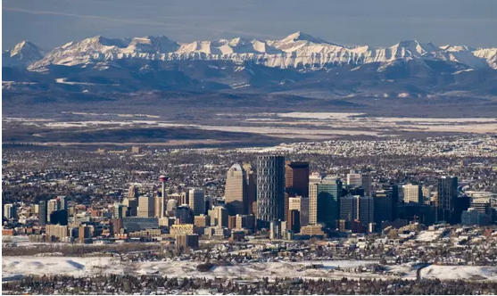

# 城市规划导论（三）\-\-\-\-- 可以预测 \#600

原创： yevon\_ou [水库论坛](/) 2015-12-09

 城市规划导论（三）\-\-\-\-- 可以预测 ~\#600~
=======================================================================================================================================

真相只有一个

一）国家级新区

中国国家级新区一览表

  浦东新区       1992年10月11日   上海               1210.41
  -------------- ---------------- ------------------ ---------------------
  滨海新区       2006年05月26日   天津               2270
  两江新区       2010年05月05日   重庆               1200
  舟山群岛新区   2011年06月30日   舟山               陆地1440，海域20800
  兰州新区       2012年08月20日   兰州               1700
  南沙新区       2012年09月06日   广州               803
  西咸新区       2014年01月06日   西安、咸阳         882
  贵安新区       2014年01月06日   贵阳、安顺         2451
  西海岸新区     2014年06月03日   青岛               陆地2096，海域5000
  金普新区       2014年06月23日   大连               2299
  天府新区       2014年10月02日   成都、眉山、资阳   1578
  湘江新区       2015年04月08日   长沙               490
  江北新区       2015年06月27日   南京               2451
  福州新区       2015年08月30日   福州               1892
  滇中新区       2015年09月07日   昆明               482

以上，仅仅是中国的"国家"级新区。

当然，如果你仔细阅读表格的话，里面还是有很大玄虚的。最明显的是"时间"。

第一个是上海"浦东新区"，时间是1992年。

浦东新区的开发，引发了巨大的反响。暗地里也争破了头，所以一直到2006年，十四年后，天津才如愿拿到了第二个"滨海新区"。

但此后就一发不可收拾。第三个只隔了4年。你再看后面四五六号;

内行人仅仅看看时间，就能读出许多"含金量"了。

二）市级新区

政府拥有强大的力量，任性的脾气，这是事实。任何人也绕不过去的。

揣摩政府的脾气，揣摩政府的举动，就成了非常非常重要的事。这也是必须承认的。

有过一段时间，我们取了大量大量的资料来看。阅读的结果，只能使我们越来越糊涂。

基本上，每一个区都有自己的"五年规划"。每一个区都有自己的开发建设远景。

你再往下看，则几乎每个区都有自己的"CBD"。普陀搞了长风商务园区，长宁搞了虹桥，杨浦有了五角场。还没算莘庄川沙紫竹。

我们知道，CBD关键是这个C=Central。外国的城市，可不是这个样的。

（加拿大石油城Calgary）

如果按照每一个区的规划，如果前滩，后滩，长风，虹桥，新江湾，浦江，世博，临港等各大规划区都能做出来的话。那么；

-   全球500强，恐怕要在上海设立5000多个总部

-   中国500强，全部要缩在一个区内办公。

-   每平方公里税收过千亿，上海要有N个。

这显然是不可能的。

迷惑的进一步，我们看看政府之前说的那些，都完成了么。

-   陆家嘴堪称核心名片，是不是成为金融中心了。

-   老牌的金桥商务区，古北商务区，大柏树商务区，现况状态怎么样。

-   世博有世博效应么

-   北虹口国际航运中心，游艇码头中心，军工路复兴岛开发，有眉目了么。

这个名单还可以列出很长很长。

如果我们还不死心，我们再往前翻。我们翻出了1986年的上海城市规划。

《上海城市总体规划图 1986》

http://www.supdri.com/2040/index.php?c=channel&molds=oper&id=4

当时的总体规划思路，是一轴二翼。"有步骤地向杭州湾北岸和长江口南岸两翼展开"

也就是说，城市发展的重心，是向宝山移民住满长江沿线，向金山移民住满杭州湾沿线。

如果你信了1986年的规划，搬到了金山枫泾投资居住。今天会不会哭晕在厮所？

那么，我们看了这么多的规划，这么多的资料，最后得出的结论是什么呢。

真相只有一个：

任何规划都无效。

三）醉汉漫步

为什么规划无效呢。因为市府没有钱。

在我们之前写的《从来不存在"土地财政" \#82》《新城不是希望 \#290》等文章中说到，土地财政是亏钱的。

新城其实是一种效率很低的东西。亏钱，亏得很厉害。

你可以亏空，可以每一代人金融破产一次。但亏空终究不是好事情吧。

目前每一个农民进城，开销在10\~15W元左右。一个30万人的卫星城，需要400\~500亿人民币。

每平方公里3000人密度。占地大约100平方公里。

其道路，水电，消防警力，医院学校，各种公共设施开销都是天文数字。

地方政府一般没有财力大肆的兴建新城。

他们造一个是可以的。亏空挪用。

造三个，达到100W人口规模，就显得很吃力，类似于郑州新城。亏空有上限。

而象京沪深广渝，近年都吸纳了500W以上"新增人口"，这绝对不是轻飘飘一句"烧钱"就可以解决的。

如果你是一个地级市，你是一个小城镇。

类似于奉化，溪口这样的小城，地委书记去搞了笔钱，圈了5平方公里土地搞"开发"，你是完全无法预计书记们是怎么想的。

而到了几十万人规模，象银川、郑州、呼和浩特这样的城市，他们搞新城建设，就会遇见"预算软约束"不再是无迹可寻了。

象上海北京这种超大型城市，他要容纳1000W左右的外来人口。每30W一个新板块，则新增板块数目要达到30\~50个。

这样，就会明显地显露"规律"。

好比数学上，有一个著名的"醉汉走路"故事。

醉汉从原点出发，走一步路，向东南西北方向无法预料。

可是醉汉如果走100步，1000步，则随机的事情就会逐渐显现"统计规律"。到最后甚至可以精确地计算出布朗运动，概率分布，醉汉落脚点位置。

这是一道高中生都会解的概率题，当N非常大的时候，醉汉第N步离开原点的距离是根号（N）。

四）大都市的概率

从1995年户籍壁垒打破，外地人开始大规模进入上海，迄今约20年。

因为数量实在太大，哪怕是领导的"任性"。也任性出一定规律，至少是统计规律。

如果我们看过去20年的上海发展轨迹，至少有几条总结是可以得出的。

1）任何规划都没有100%完成。

缩水的原因，新城本来是一件亏钱买卖。自然做不到头。

2）什么样的板块最能得到发展。政府拥有最多土地的板块。

其背后依然还是预算不足。

关于第二点我们要专门说明一下。什么样的土地会得到"重点开发"。

譬如说政府宣布兴建一条地铁，再扔二个研发中心过去。又给优惠政策，要打造世界航运中心。

我们知道，地铁是一种高度"外部性"的东西，地铁所经之处，沿途所有的房产都会升值涨价。

同样道理，大型的商场，公园，文化中心，优质医院学校，也是加分的选项。这些公共性设施，都会提高地段价值。

而政府会怎样配置这些"公共品"的位置呢。很多人认为政府会出于全社会的考虑，又或者基于效率的通盘统筹。

我们认为不是的。

我们认为，政府规划公共品时，有且唯一而且最重要的考虑内容，"政府在哪一个方向上土地储备最多"。

因为地铁是一个严重的"外部性"商品，地铁拉过，沿途土地都升值。

而地铁又是一个很昂贵的东西。

如果地铁从"已出售"区域拉过，万众欢腾，沿途的百姓纷纷庆祝自己投资眼光正确。

而对于政府来说，他是没有利益的。

政府最喜欢的，是地铁从"未出售"区域拉过，然后沿途的土地升值都落到政府手里。

政府这么做也是无奈的。因为"土地财政"是亏钱的，亏得实在太厉害。修地铁，基础建设道桥路隧，这些都是天文数字。远远不是3元/张的地铁票可以赚回来的。

精打细算，政府只是想少亏一点。政府也是"自利人"。

3）如果一个板块地被卖完了，则后续的承诺就会缩水。

原因还是预算软约束。

我们越来越觉得我们的政府，是在"经营城市"。所做的一切，都是为了卖出土地。

当一块土地开始做规划时，政府首先考虑的是，"我在那有没有筹码"。

只有政府手里掌控最多空地，大把筹码在手的板块，才最容易得到发展。

当发展的时候，政府会不断把"利好"叠加上去。

譬如地铁，商场，学校，医院，创意中心，国际xx中心，文化艺术中心。

[同时，政府手里掌控着非常大的"舆论媒体"资源]。在这一个阶段，会把该板块炒热，炒成"万众关注"的状态。

而此后，开发了一小段，政府就开始卖地。

卖地之时，必然是该板块炒得最热的时候。把所有的媒体资源都叠上，力争卖一个最好的价钱。

卖地之后，形势逆转。

土地只有在政府手里，才会是政治宠儿。等到了你手里，您自求多福吧。

政府在该板块拥有的筹码越少，政府越不愿意投真钱。

如果全是吃骨头不吐肉，类似市中心拆迁。那得要中央三令五申才做做呢。

省政府手里的牌是有限的。媒体资源也不能天天帮你唱赞歌，还有很多板块需要唱呢。

当拍地之后，对该区域该板块的支持就会逐渐缩小。答应说好的"商务中心"会因为种种原因没有建成。而舆论媒体的支持与善意，更是镜花水月。

这也就是许多板块一下子很热，你买了，接下来长期冷的原因。

以上是我们对整个游戏规则粗浅的揣测。

未完待续。

（yevon\_ou\@163.com,2015年12月8日午）
