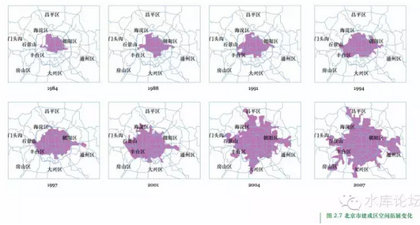

# 城市规划导论（五）\-\-\-\--重心 \#620

原创： yevon\_ou [水库论坛](/) 2015-12-14

 城市规划导论（五）\-\-\-\--重心 ~\#620~
=================================================================================================================================

假如一个板块持续地强，每一次都跑赢大市。那他会成为宇宙中心。

所以，楼市无板块。

一）板块问答

关于城市的"板块轮炒"，我们有一系列问题；

1）"板块轮炒"会停止么。有没有结束的时候。

答：如果人口不再流入，就不会再有新的板块开发。整个城市将形成凝滞的状态。

当城市凝滞，地段的优劣就会固化。而且随着时间的推移，这种"尊卑"优劣会显得强化。有钱人会尽量向"上只角"迁移，哪怕不是为了舒适，而是为了体面。

而当城市剧烈成长时，这个效应不明显。

1949\~1980年之间的北京上海，是这样的例子。因为长时间的户籍锁死，人口不再流动新区不再增加。

所以老北京，老上海，有贯穿几十年生命烙印的"地段鄙视"情节。

欧洲的一些城市，百年老城，这种情节也非常严重。

2）北京上海的人口流入，会停止么。或者说超大城市人口有没有上限。

答：我们首先要看限制人口上限的原因是什么。

在古代，主要是粮食。譬如长安，洛阳，鼎盛时期大约是100万人口。

有详细数据明文记载的都城，主要是开封，也是一百万人口。

而地区性都市，如华东第一大城商业中心：苏州，大约在30万人口左右。

其背后，主要是运粮困难。

开封的汴河水运，在历史上是一个大故事。相关研究汗牛充栋。在农业国家，倾国之力维持一个100万人口的非耕作区已经是极限。

若考虑成本，30万人城市是极限。

现代性的大都市，从铁路开始。

譬如上海有近3000万人口[\[1\]]，刘慈欣的"超新星爆发"一文中考证说，上海需要十二根铁轨，日夜不停地给上海送粮食。

这是大动脉生命线，绝对不可以切断的。否则上海分分钟饿死。

但是总体而言，现代性的"国际性大都市"，限制都市规模的，主要是政治因素，而非经济因素。

12根铁轨并非极限，大工业时代，再修建36条都不是问题。

淡水也不是问题。目前海淡的成本是8元/吨。而各位的家庭水费，早已达到了1.81元/上下水。海淡项目只要踮踮脚，还是可以够得到的。

真正的阻力，来自于政治呼声。

1970\~1990年代欧美历史早已先验，当外地人大量涌入时，反对声最大的是当地土著。

土著们会抗议外地人抢走了工作岗位，抢走医疗资源，抢走教育资源，住房，交通，治安，卫生，奶粉，风俗等全面冲突。

伦敦人为了反对人口增长，修建了超宽车道Hwy把伦敦包起来。以使得新区和伦敦完全不可能靠步行来往。

保护伦敦市区的面积不再增加。其背后，其实是房东和土著们的利益。

巴黎的扩张，受到了越来越严厉的环境保护和"历史文化"压力。使得任何郊区化的大规模开发都不可能实现。其背后，依然是房东和土著的压力。

在现有的技术上，一个城市容纳5000W人口是没有太大的瓶颈的。上限可能是江浙皖赣人口的1/3，也就是一亿左右。

可实际能成长成多少，关键看政治形势和土著们的政治游说能力。

3）这里面利益差别大么。

答：非常大。

房地产是一种较"刚需"的产品。[自住底仓盘]又多。其价格随"供需比"变化非常大。

从101:100，到95:100，再到90:100，

其价格可能可以差10倍。

举个例子，休斯顿是美国第四大城市，人口超过650W。绝对举足轻重。

休斯顿是美国航空航天中心，全球第六（美国第一）港口。近年主要致力于发展癌症晚期治疗和尖端医疗，代表未来美国最有希望的产业方向。

德州又是石油州。

可是休斯顿房价呢，大约仅只有7\~9W美金一幢。150㎡建筑面积独立小别墅。

与此相比，纽约岛房子均价75W美金。旧金山湾区等地都要60\~70W美金。

其背后的逻辑呢，这绝对不能用"房价/收入比"之类异端邪说来解释的。

唯一的解释，休斯顿是美国最Liberty的城市，Texas是美国最Liberty的州。

休斯顿是没有城市"规划"的。也就是只要你愿意，郊外的荒地你可以无限制地将城市延伸出去。低成本乃至无成本地降低房价。

而纽约，旧金山，San Jose等地房价，关键是政府有严格地"Zone
Control",土地改性十分不易。

制度差异，就差了十倍房价。

4）你的意思，是不是应关注"土地控制"。强势政府，土地严控的城市涨得快，甚至比GDP等经济指标更重要。

答：是的。

5）上海楼市的下一步板块轮动会怎么走。

答：从目前看，上海北京深圳成长成"巨型城市"的道路仍未停止。若没有太大突变的话，则5000W人口之前阻力不大。

以上海每年流入60W人口计，这个趋势还能维持30年。

2016\~2018上海的开发步骤明显放在北四区（虹口，闸北，杨浦，宝山）。再往后不好说。

6）北四区的房价被高估了还是低估了。

答：这个问题不好说。

首先我们看一个模型，假设N年以后，上海所有的中环线板块，都被犁地一般"开发"了一遍。

则整个中环线等距，他们的价格应该是差不多的。

但是这个过程，是一个极其漫长十几，二十年的过程。于是你就有了"先开发，后开发"的问题。

当一个板块出于热点开发中时，当地的居民洋洋得意，房价飞涨，热点关注，莘庄甚至一度涨得和卢湾差不多价钱。

可是等一个板块热点炒完，接下来就是好几年的沉寂，死水微澜，增长缓慢。不知不觉中，你又把[平均涨幅]给还回去了。

所以当"北四区"热点开发时，其涨幅是很快的。

但是没有涨的中环各块也别着急，风水轮流转。很快就是他慢你快了。

7）我能否象炒股票一样，追逐热点，高抛低吸。把每一轮的涨幅都吃尽。

答：难，很难。即使你看穿预料未来也一样。

因为可怕的交易成本。

当然你可以试试。

8）会不会有某个版块强，很强，一直强，在每一个阶段都超强。

答：如果有这样的板块存在，就代表他的"累计涨幅"要比别人大一大截。

楼市和股市不一样。股市虽然有"大盘指数"，可是各股和大盘是很分化的。

好比医药股和电信股，走势就可以完全不同。

大盘仅仅代表宏观经济层面。

可是楼市不是。楼市如果有3000个小区，他其实代表的是同一个城市。

也就是这3000个小区，是同进同退，同涨同落的。

内环永远比中环贵，中环永远比外环贵。

假如你某一个板块，持续走强。譬如莘庄，如果莘庄涨到10W，15W，20W一平米，而普闸虹杨还是卖5W。

这意味着你莘庄周边的板块，卖八万。再递减，卖六万。

也就是市中心搬到莘庄去了。

这种情况若有可能发生。那就是整个城市的"重心转移"。

9）什么叫"重心转移"

重心转移就是整个城市永久性，不可逆地发生了移动。

好比千百年来，宋代以后，上海的重心一直是在"松江织造府"。并产生了醉白池，方塔园等名胜古迹。

而"上海"这个名词，古代是不存在的。黄浦江畔属于天涯海角的蛮荒地方。

1840年英国人来了以后，他们非常需要找到一条水道，可以通往当时华东最大的城市商业中心：苏州。英国人在苏州河畔打下木桩。外滩成为了上海建城的开始。

\*
当然后来发现苏州河其实并不通苏州，外国人地理都是体育老师教的。而随后太平军起义占领苏州，苏州士绅尽数逃入上海。于是上海崛起。

如果你站在一个松江土著"醉白池"的眼里看来，当然认为黄浦区卢湾区的崛起不可思议。

可是这二个板块越走越强，越走越强，最终远远把松江抛在后面。

这背后，是城市重心永久性的转移。

10）上海的重心会转移么。

长期以来，我们对地理条件的恐惧，主要来自于"地倾西南"。

这是一个非常明显的现象，也是完全无法阻挡的现象。

上海每年递增60W人口，其主要来自于江浙皖。

因为地理的原因，上海僻处东方，东朝大海，所以新来的人口，全部都集中于西区，尤其是西五区。

浦东虽然号称是YP之家，可是在全部900W人口中，浦东才分到了200W小数。

"地倾西南"的结果，就是上海整个城市的中心，不停向西去，向西去。

很快，要找上海的地理中心，将不再以人民广场为起点。而是以"徐家汇"为起点。

四通八达最方便的"市中心"，将不再是人民广场，而是徐家汇。徐汇才是经商效率最高的地方。

浦东的"开发"，部分缓解这一个问题。

好比一个极西的秤砣上，加了一个向东的砝码。

因为浦东开发，把城市的重心拉回来了一点。而且浦东重"质"，他虽然只有200/900，可是浦东大学生比例远远高于西四区\[2\]，收入和Bigger话语权都要更高一点。

从长远看，上海的市中心仍然将处于"西斜"的状态。浦东虽然高薪职位众多，可是薪水再高也档不住九亭白完人多。

人是一切的基础，只要有人，其他都会起来的。

设想一下，假设松江新城聚集了2500W人口，成为第一大人口行政区。

则上海的CBD，CLD必然又再迁回松江。

外滩，陆家嘴将贬为"天涯海角"般偏远的蛮荒之地。

11）城市有边界么

答：一套房子，一个地段，最重要的升值发生在"由城乡结合部转为市区"的一瞬间。

譬如说，最近某学院派教授号召大家去投资团购"固安"。

固安在什么地方，天安门南60KM。

我们要分清楚一个问题，"谁在买固安"。固安的主要消费者群体是谁。

-   河北的农村房子5000\~6000一平米。如果你的消费者群体是河北农民的话，则他们只有五六万的年收入，只能够承受五六千的房价。

-   国贸燕莎上班的小白领月薪2\~3W元。年薪三十万，他们能承受50000\~60000/m的房价。

"城乡结合部转为市区"最主要一个关键节点，是你的消费群体变了。

-   好比你20KM远郊房，以前一直是卖给本地农民的，又土又穷。无论"互联网经济"如何红火，你的房子始终是升值缓慢，一点也涨不起来。

-   可是有一天，突然之间，你的领地上来了一批拿着iPhone/iPod的奇形怪兽。他们拿着几百万的购房款，看见什么房子都说"便宜，便宜"。

这其中的契机，有可能是修了一条地铁，有可能是修了一条hwy，但更多的情况，是城市的自然扩张。

小白领其实是被越赶越远的，小白领能够居住的极限，就是城市的边界。

城市的市中心，房价可能已经涨到了极为恐怖的地步。譬如十几万每平米，上KW一套。

因为无法承受，小白领往外搬。可是中环也被填满了，于是他们再往外搬，外环也被填满，于是到了最远的边界。

郊区土地升值的大头，当且仅当"城乡结合部转为市区的一瞬间"。

这个涨幅可能是惊人的。往往会是5000/m到20000/m的瞬间跳涨。可是之前三年，和之后三年，都仅仅是平均涨幅。

当1995年上海开始户籍松动时，上海的"郊区"边界是徐家汇，离人民广场7.5KM左右。

到了2005年，上海的边界是莘庄。离人广15KM。

到了2015年，上海的边界大约是泗泾南翔浦江航头杨行，离人广22KM。

按照这个速度，到2025年，上海边界或可能达到30KM左右。

到2035年，或许可达到35KM。

超过35KM半径的房产，没有必要购买。因为他们可能永远也没有机会溶入上海。

22\~35KM之间的房产，可以购买。他们在未来的十五年中会有一个突变。

22KM之内的房产，只会有平均涨幅。

}

（未完待续）

最近COC出11本了，所以更新会少点。

（yevon\_ou\@163.com，2015年12月13日晚）

[\[1\]]上海有1400W户籍人口，900W外来人口，还有900W"短期路过人口"。指逗留时间不超过六个月的侯鸟式人群。但是粮食消耗量是严格地按3000W走的。

[\[2\]]浦东大学生%低于闵行
