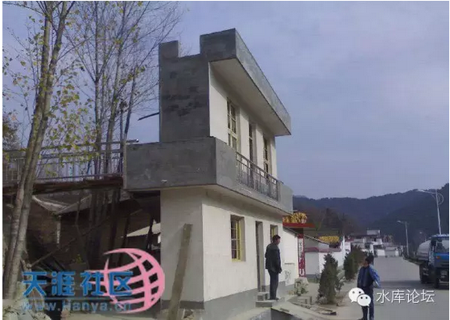
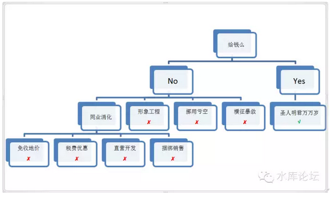

# 绝望的县官 \#790

原创： yevon\_ou [水库论坛](/) 2016-02-19

绝望的县官 ~\#790~

当领导不给钱，却要求你变出许多房子。县官就快绝望了。

 

小人物的自保术有四。

 

 

一）绝望的县官

 

秀相一开口，就是1000万套经济适用房。换算成物资，大约是3万亿的财富。

可是他不给钱。扭扭捏捏地说给个2000亿，剩下28000亿你们自筹。

 

这样的情况下，县官基本就是被逼到绝境了。

领导一句话，下面人可是要具体干实事的。

 

只不过中国人民的智慧是无穷的。历朝历代，这样的"政治笑料"也不是第一次。

最近的一次，离我们也不过是58年的时间。

 

所以地方官员，在对付处理这类折腾，有着丰富的经验。从封建王朝，到大炼钢铁，到今天，古代的传统智慧依然有效。具体来说，无非以下几种方法：

-   横征暴敛

-   亏空挪用

-   形象工程

-   内部消化

 

 

二）横征暴敛

 

在封建王朝，一般遇到朝廷"摊派"下来。无论是修大运河，修长城，还是辽饷海饷。

县官们逼到急了。一般只有横征暴敛。

 

具体的做法，就是派征粮队下乡。敲开老百姓的屋子，预征"民国88年"的田税。

现代社会，当然文明一点。征粮队这么臭名昭著的事是不做了。俺们最多派一些"税务稽查"小组，下去看看工商业企业有没有偷税漏税。

 

 

各位，不要以为县官都是坏人。什么"丁剥皮""王刮地"之类的。

其实横征暴敛，是一件成本很高的事情。从长远来看，伤害了整个地区工商业的发展潜力。削弱了未来税收。

 

横征暴敛来的钱，又不进官员自己手里。细水长流的事，每个人都懂。而且还白白坏了官声。

官员都是渴望升职的，哪怕不能升职，留下一个"青天"的好名声也是乡愿。

 

"税务稽查"小组征来的钱，是进国库的。又不是落到你县长自己手里。白白还得罪人，落个"刮地三尺"的坏名声。

所以横征暴敛，并不是常用方法。也请各位体谅县官。

 

 

三）挪用亏空

 

如果不想刮地三尺。那建经济适用房的经费，就只能挪用亏空了。

再强调一句话，"圣人在上面空口白话，底下人要干实事的"。

 

 

干实事的人，就要研究What，How。

你说要建1000万套经济适用房。经费从哪里来，款项从哪里凑。

 

有支出就必须有财源。当你产生新增支出，你就必须削减或者砍掉一些旧的项目。

 

 

而砍哪一个好呢。是教师的工资，还是医院报销保险费用？

我们看"民国"时期的电影电视连续剧，你就会发现里面特别容易"拖欠教师工资"。

例如电影《1942》，教育局六个月没发工资了，教师和大学生们的补助全都饿着。

 

为什么，因为当时民国是一个"小政府"。他的政府职能十分有限。

预算很小。支出也很少。

那么可以"挪用"的空间也很少。主要的开支就是国民教育开支。能拖欠的只有教师工资。

难道你还能拖欠动物园老虎口粮。那时候没有动物园。

 

 

还是回到我们今天经济适用房的话题。

如果秀相不给钱，而强迫县官们造几十万套经济适用房。

那县官唯一能做的，就是从其他地方挪用抽调钱款。

 

无论是拖欠六个月教师工资，还是降低医疗保险报销，还是晚上没有路灯，下雨没有排水管道；科教文卫，又或者县太爷那辆奔驰车。

砍哪一项预算，你说吧。

 

 

四）形象工程

 

当横征暴敛，挪用亏空这二条路都走不通的时候。

有点良心的官员，就只能搞形象工程了。

 

典型的譬如说，*领导您看，这是100户新建的小区。*

*花园绿化，植树成荫。配套齐全，水泥过硬。品质是一流的。*

*这样的小区，保证只卖你3000元/平米*。让所有屌丝都满意。

 

领导一看，嗯，不错不错。的确是花园小区。为民尽心地好官。

而其他的呢。

其他的，领导啊，依照这个样板工程。还有900户在建。

另外还有9000户正在筹款融资.........

 

您看，这样合着算起来，不就是10000套房子了么。

高级领导一看，心情大悦。只要大领导给过一个"好"字。有了正面定调，以后吏部的人也不会找你麻烦。

 

 

而此后呢。秘诀就出在100+900+9000上面。

这100套是真金白银优质工程，不假。

后面的900套，在建工程，正在建设。等大领导走了，档次规模自然不如从前。

而再往后9000套呢，谁也不知道在哪里了............

 

 

 

按照这个思路，你也就不难理解，为什么河南会造出只有一堵墙的经济适用房了。

譬如象这个报导：《中国最牛"门面房"，绝对雷到你！》

http://bbs.tianya.cn/post-free-1613241-1.shtml

 

 

他说的是河南某地的经济适用房，只有一堵墙。正对着省道公路。

领导汽车开过的时候，远看过去漂亮气派。

可是其背后，还是破旧土墙。

 

"形象工程"，几乎是不加赋，不挪用情况下，最好的解决方法了。

但是这件事，在中国的环境下也是做不了的。

 

为什么，因为中国养了一群"文科生小编"。

而当记者们发现这种"一堵墙"经济适用房时，就掀起了轩然大波。

 

 

新闻，以野草般的速度扩散。

人民群众说起这件事来，恨得牙痒痒的。

在文科生小编可怜的脑容量看来，仿佛"经济适用房"是圣天子拨下来的。因为手下人的贪官污吏们贪污，贪污掉了他的经济适用房，才害得他没房子住的。

 

你可以想象20\~30岁年轻人，那一群人是如何阅读此则新闻的。

你可以想象他们杀死人的目光。

你可以想象他们胸中熊熊燃烧的怒火。他们以为县官贪污了"他们的"房子。

如果这时候有人登高一呼，杀光贪官的话。毫不怀疑，绝对是一个接一个枪毙的。

 

 

然而这并不符合正义，也不符合事实。

事实是，县官其实是帮你的。"形象工程"几乎是最好的应对方法。有良心的做法。

否则的话，你是想要横征暴敛，导致企业破产。小白领失去工作。

还是亏空挪用。拖欠教师工资，拖欠医院医药费呢。

 

 

所以说，"文科生小编"其实并不知道自己在做什么。正义感爆棚的"北大青年"也不知道新闻的后果是什么。

政治太复杂，经济太复杂。记者无力分辨。

他们甚至不知道假新闻会涨，还是真新闻会涨。

 

所以对媒体人来说，最明智的做法，应该是仅仅迅速报导事实。仅此而已。

 

 

 

五）税收输出性行业

 

绝望的县官只有几条路可以走。

-   横征暴敛（加税）

-   亏空挪用

-   形象工程（欺上瞒下）

-   内部消化

 

在目前中国的时政下，前三条路都走不通。剩下的，只有第四条路了。

 

"内部消化"的本意，民意呼声认为房地产有"高额利润"。

秀相和其幕僚的想法，也是认为KFS是"不道德"的。KFS和炒家赚走了大量利润。

既然这样，我们把这些体系内的"蠹虫"剥离。由政府直接造房子卖给人民，岂不是省掉了奸商环节。

 

秀相的智商和教育，是有一点问题的。这点必须要认清。

否则他也不会蠢到搞什么"农超对接"了。

 

但是，"内部消化"是一个大问题。我们要等到下一篇，用一整章完整的篇幅来说。

 

 

 

在本篇的最后一点篇幅内，我们想说一下"税收输出型行业"和"税收输入型行业"。

 

 

什么叫"税收输出型"行业，就是拿钱走的行业。

譬如房地产，钢铁，汽车，化工，煤炭，纺织，乃至于所有传统行业。

 

相反的，国家持续性投入资源，如电商般不断亏损的。

则是"税收输入型"行业。

 

1949年以后，实行残酷的"剪刀差"。把农产品的价格压得很低很低，把农民逼得很苦很苦。

而国家，则从农业中攫取了巨大的财富。转而反哺起工业。

据说建立起了"门类齐全"的工业体系。

这时候，农业就是典型的"输出型"行业。工业就是典型的"输入型"行业。

 

 

一般来说，一个行业如果是"税收输入型"行业，他就能获得"超常规"的发展。

会有大量政策和资金，不计成本的投入。整个行业发展很快，产品价格也更低，以获得出口竞争力。

 

而如果一个行业是"税收输出型"行业，则政府不停地在这个行业身上吸血。只有产出没有投入，持续地把黄金拿走。

整个行业反应为奄奄一息。而他的产品和销量，也绝对不可能便宜。

 

 

"十年调控"为什么始终搞不好。因为秀相始终是把房地产作为一个"税收输出型"行业。

无论嘴上喊得多么好心，为国为民。秀相内心里想的，始终是从房地产行业"拿钱走"。

 

他搞经济适用房，为什么失败。因为他是"拿钱走"。

他不仅仅不给一分钱，相反他还要拿钱走。要抽营业税，所得税，土地增值税。

那老百姓肯定是更苦，更惨，更买不起房的。

 

因为宏观调控，所以房价飞涨

因为宏观调控，所以房价飞涨

因为宏观调控，所以房价飞涨

 

 

那么，什么是秀相心目中的"税收输入型"行业呢。

我们可以发现在他的任期后期，他投入非常大的金额，数以千亿万亿计，投入于光伏，风电，新能源。

 

而这些钱，基本是被烧掉的。联合骗贷，上下游合谋骗取掉的。

几千亿投下去，到今天我们也没有光伏革命。

而如果这些钱用于房地产市场，则早就几百万套真正的"经济适用房"。

 

 

人的童年，会对人的一生造成非常大的影响。就象有一首儿歌唱的。

"小燕子，穿花衣，年年岁岁来这里"

"旁边盖起了大工厂............"

 

 

对于秀相来说，他的童年沉浸在计划经济的田园牧歌之中。

他心目中的理想社会，或者说他有权力以后，调节设计"输入输出"可以人为设计的理想世界；

 

"是一个光伏新能源新科技勃勃生机的社会，投机倒把炒房客全部除草"

 

我们必须指出，这样的"理想"，是完全不符合经济学的。"农超对接"是完全不符合经济学的。

其结果，必然是社会的大灾难。

也就是更高的房价！

 

 

 

(yevon\_ou\@163.com，2015年2月5日晚)
