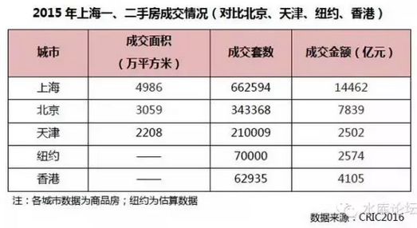

# 差异化信贷 \#820

原创： yevon\_ou [水库论坛](/) 2016-02-21

差异化信贷 ~\#820~

差异化信贷，最终却被搞得了不伦不类。

 

 

一）差异化信贷

 

衙门办事，有一定固定的套路。

 

我D流传下来的优良套路，一套就是"组合拳"。

通过税收，信贷，规划，宣传等一系列的手段，"组合拳"出击。以免单一方式药剂过重造成偏激。

 

另外一个套路，则是"有保有压"。

具体的做法，和Marketing差不多。把市场细分，细分成2\~3类。然后再有保有压，有鼓励有抑制。免得单方向用力。

 

 

第一轮基于收税的"不道德"营业税基本上是失败了。

面对全社会铺天盖地房价过高的指责。幕僚们给秀相开出了第二轮调控方案。其主要的思路就是"有保有压"

-   7090

-   差异化信贷

 

"有保有压"的确是一门很不错的思路。"市场细分"更是一门伟大的科学。

我们唯一没想到的，经书能被念得这么坏。

 

 

二）信用

 

如果我们学习西方经验，把商品分为高档，中档，低档。

则高档需要豪华的包装，在华丽的厅堂发售，卖给上层人士。

中档需要关注性价比。

低档需要廉价。

这是正常国家。

 

而在2B国家呢。

秀相把信贷市场划分成了"第一套"和"第二套"。

然后他说"第二套利率上浮40%"。

 

这事就十分奇怪了。因为他做这个决策，绝不是基于经济考虑，绝不是基于风险考虑。而纯粹就是领导一拍脑门子。

而对于实际情况呢，"第二套"的人信用往往远远要比"第一套"好得多。

 

什么样的人最容易违约。穷人最容易违约。

那些拼拼凑凑积攒了十几年，把所有钱填进去拼一个首付。这样的家庭最容易违约。

因为他们别无"余力"。力穷智竭，收入就只有这么点。

 

 

而对于一个"第二套"的贷款人。他距离购买第一套住房，往往已经过了二三年。

在这段时间内，房价已经有了可观增幅。原本的贷款比例，已经降到了50%，30%以下。

而他有能力，有意愿购买第二套住房。真说明他是有实力的，有办法增加积蓄。

这样的人，应该是信用远远更好于第一套房。远好于"刚买房"的穷人。

 

 

三）政府干预

 

但是在秀相的"理想"，在秀相的三观之下。事情完全不是这样发展。

秀相基本是基于自己的"喜好"和政治，人为了规定了一个政府利率。

 

-   第一套房70%最低折扣。

-   第二套房110%基准利率。

 

这其中就是40%的利率差异。并导致了一系列的不良问题。

 

 

首先是银行不愿意放贷。对于"第一套房"，虽然秀相再三关照要"支持自住"。可是银行考虑的是风险和定价。

房贷利率很低，再要打七折给一帮滚地龙，那就太不靠谱了。

 

而另一方面呢。"第二套房"简直成了银行的财神爷。

因为"第二套房"的人基本没风险。他们又有了好几年的信贷记录。银行可以摸清还款人品。

这样的优质客户，本来要90折，85折抢客户的。现在政府强行规定110%，岂不是掉财神爷。

 

但这仅仅是一个方面。对于客户，客户不满意了。

客户盘算盘算，利率这么高。一有钱就提前还款了。尽量地不欠高息利息。

所以"第二套房"的业务很少。

银行没生意，客户也不满意。

 

这就是"政府管制"而导致失败的一个典型例子。道理很简单。小学生一看就懂。

 

四）全面差异化

 

在第二轮宏观调控中，秀相搞了许许多差异化政策。包括对第一第二套房的歧视，包括对小户型大户型的税收，包括营业税二年五年再改二年。

 

这么多的差异化，有一个共同点。他们全都不是[基于市场]的合理配置的。

不是按高中低档，"高风险高收益"来设置的。

 

秀相虽然把市场细分为了ABCDE好几类。但他对于每一类的处置，纯粹是凭他个人喜好，观念和理想来进行设置的。

-   风险高的，给低利率。

-   风险低的，给高利率。

-   贡献大的，收高税率。

-   贡献小的，收低税率。

 

这是一种病。帝国垂暮行政僵化的"老年病"。行政失灵是一个端倪，等弥漫到全身，帝国就完了。

 

 

错误的政策，对整体生产力造成了损坏。

每当广播里播放"抑制投资需求，鼓励自住需求""为中低收入人群建造住宅""首套优惠"；那你就得小心了，因为这些行为，全都会使得房价更高。

 

 

五）危害度估计

 

我们说过，在全部的九轮调控中，危害最大的是第1，8，9轮。

也就是营业税，限购，房产税。

其他秀相搞的调控也有"危害"，但是危害没这么大。为什么，因为规模小。

 

譬如说7090政策，从推出到消亡只不过二三年时间，坚持不下去。

相应的，对生产力破坏，也就二三年。

[\[1\]]（如图。90平米以下，一般交易量只占30%左右。

如果你非要规定7090，那存粹是脑残。）

 

 

而"差异化信贷"，虽然是件恶政。但其实对中国人伤害也很小。换算成房价，或许也就是多涨500元/平米的数量级。

为什么呢，因为申请贷款的人极少。

 

 

我问一个数字，许多人或许不相信。

假设有一个楼盘，大开门做生意，销售一空，卖了100亿。

请问，这100亿销售额中，银行的新增贷款有多少。

 

很多人可能会说"投机炒作"。整个房地产市场全都是泡沫吹起来的。高度依赖银行贷款。

贷款总数有90亿，80亿？

别开玩笑了。贷款的上限是七成，也就是70亿。

 

那么，许多人再猜，60亿，50亿。再往下就不能一口咬定"房地产泡沫"了。

我手里没有精确的数字。但政府最后一次公开是2004年，当时的数据是28%

 

卖100亿销售额，仅申请28亿贷款。是不是令你很震撼！

也就是说这个市场中绝大多数的土豪，是一次性付款的。72%是一次性付款的。

 

 

如果你还不信，我这有一条更新一点的数据。

http://shanghai.pbc.gov.cn/fzhshanghai/113571/3005323/index.html

 

《中国人民银行 上海总部》2016-01-15 16:08:03

（五）个人消费贷款高速增长，对内需拉动作用凸显。当年全市新增本外币个人消费贷款2029.7亿元，同比多增1088.8亿元，占全市各项贷款增量的41.6%，比重同比提升17.5个百分点。从贷款种类看，**当年全市新增本外币个人住房贷款1539.7亿元**，同比多增942.1亿元，其中下半年新增1077.3亿元，同比多增857.3亿元；12月份新增本外币个人住房贷款206.4亿元，同比多增136.2亿元。当年全市本外币个人汽车消费贷款增加345.5亿元，同比多增99.6亿元；本外币个人其他消费贷款增加144.8亿元，同比多增46亿元。

 

我们再看另一个数据。

 

上海一年交易66万套房子，总金额是14400亿。

交易14400亿，新产生1540亿房贷。这个比例是11%，非常逆天的数字。

 

当然，这个数字是"新增"，不是"新申请"。

还要扣掉每年消散的房贷。一般银行"贷款池"每年失去1/6的贷款余额。

所以这些数字加起来，上海人申请"房贷"的比例。大概是20%

 

上海任一套房产买卖。平均首付八成，贷款二成！

 

 

而"第二套房"房贷比例呢。由于我们拿不到统计局内部资料，就更无法细算。

但一般和银行内部信贷员接触结果，"第一套房""第二套房"比例至少在1：20以上。

平均每办20笔房贷，才会遇到1笔"二套"

 

"第二套房"应该享受更优惠利率，可是在秀相的个人偏好之下，却变成了110%

这是生产力的扭曲。

只不过贷款的人极少，凤毛麟角，所以对我们全社会的危害还不是太大。

 

先主~（刘备）~曾经说过"勿以恶小而为之，勿以善小而不为"。

虽然危害不是很大，但终究是件作恶。道理还是要讲清楚的。

 

 

六）忽悠

 

前二天有人在东北吃了条鱼，于是就有人出来洗地《天价菜单贵族鱼》[\[2\]]

我们看了不禁摇头。鱼翅燕窝只会在五星级酒店，而大排档不会提供，因为没有消费者。

下岗城市，一家路边摊摆着原材料几万元的鱼，您忽悠谁呀。

 

 

对于东北出来的老干部，忽悠就成了必不可少的技能。

当秀相《国五条》《国六条》《国八条》《国九条》，宏观调控搞了N轮，房价反而越调越高。

民意汹涌，屌丝群情愤慨。脸面上就有点挂不住了。

 

在这样情况下，秀相就必须要"做点什么"。关键不是成绩，而是态度。显得我依然在辛勤地努力。

于是中国大地上，就发生了极为诡异的事情。

"第二套房首付不得低于40%"

"第二套房首付不得低于50%"

"第二套房首付不得低于60%"

"第二套房首付不得低于70%"

 

这事搞到最后，甚至连马路上开出租的司机都发现端倪了。你说这事有效果么，把"二套"的首付由60%加到70%，你说真的有效果么。

 

答案是完全没有任何效果。

因为申请"第二套房"歧视贷款利率的人非常少。可能连总人群的1%都不到。

 

对于这么小的亚群，无论你怎么压迫。对于99%的房地产市场来说，都是没有任何涟漪的。

无论你是50%，60%，70%首付。根本就没有人申请二套贷。

其道理，和秀相征收70%的商铺"土地增值税"差不多。一分钱也收不到。

 

 

"人生如戏，全靠演技"。本来是国计民生的严肃房产大事，硬生生被您搞成了荒诞喜剧。

您在台上国王的新衣，我们在台下拼命鼓掌还不行么。

 

因为宏观调控，所以房价飞涨

因为宏观调控，所以房价飞涨

因为宏观调控，所以房价飞涨

 

 

（yevon\_ou\@163.com,2016年2月19日子时）

 

 

\[1\] 资料来自于《上海，全球最大的房地产市场》https://mp.weixin.qq.com/s?\_\_biz=MjM5MTEwMTM4Ng==&mid=401950586&idx=1&sn=8c1f8ca53a76fcb508ef584e2b146012&scene=1&srcid=021807qvHmYXaYiAFEP1cX4O&pass\_ticket=P9a5wW6YjPipDInJRlinn%2Fn1R4ppy78d5m1srz%2BYj4B%2F4BDNl7T9H%2Fuc5S%2B%2Beuex\#rd

\[2\]《天价菜单贵族鱼》http://media.weibo.cn/article?id=2309403942445174913806&location=35&from=timeline&isappinstalled=1
