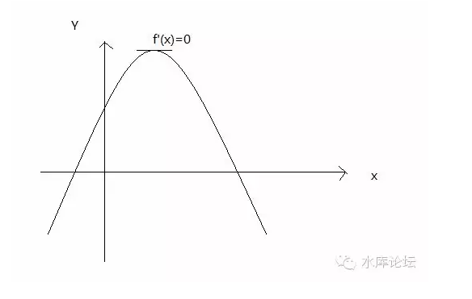

# 减调控 \#940 
-------------

原创： yevon\_ou [[水库论坛]](/)
2016-04-03

减调控 ~\#940~
==============

 

只有减调控，才能降房价

 

 

一）利益

 

昨天那篇《[[炒楼业黄金时代]](http://mp.weixin.qq.com/s?__biz=MzAxNTMxMTc0MA==&mid=403391036&idx=1&sn=2416ee9f1731daca3905e605fbfbe55a&scene=21#wechat_redirect)》发出以后，有一封读者来信。

 

阿密：

前一篇文章大骂ZF、秀相，认为25%的交易成本太高让炒房的大都歇菜了。这片文章又在高呼税越多利润越高，竞争对手都死了就你能到处捡便宜，这逻辑我也是醉了，整个一屁股决定脑袋！

 

 

对于这种网友质问，我们只有有气无力地回骂一句："你是单细胞生物么"。

你是单细胞生物么，智商低于50？

 

哪个白痴告诉你，炒家喜欢房价上涨。哪个白痴告诉你，房价涨了对炒家是好事。

[SB以为天经地义的事]，其实根本不是。

蠢，猪。

 

 

对于房东来说，价格上涨并不一定是好事。原因有三；

1）增加税费。虽然价格上涨，可是"税后"净到手反而低了。

2）降低了周转率

3）心劳

 

如果要用一句话来形容炒家对"宏观调控"的态度，那就是"吃毒药涨内力"。

 

 

二）宏观调控表格

 

我们有如下表格。

其中第一栏是买家"名义价格"，你写给交易中心的价格。

 

第二栏是买家"隐性支出"。

1980年时，全中国最受欢迎的产品是9寸电视机。出于宣传社会主义"伟大"优越性的原因，政府将金星彩电限定了价格999元RMB不许超过。

而事实的情况呢。当时你花999元是根本买不到电视机的。你还需要一张"电视机采购票"。这张票据当时要1000多元。也就是机器+票据，一共得2000多元。

 

第三栏是买家"实际成本"。你可以理解为A+B，第一栏加第二栏。

 

最后一栏是"卖家净到手"。 

 

回到"炒家欢迎房价上涨"这个话题。我们仔细看"第一栏"和"第四栏"。

其实二者并不对等。

"房价上涨"和"炒家获利"并不是同一回事。

 

 

某些宏观调控举措，使得名义价格上升，可"炒家到手"反而是下降的。

最典型的譬如北京市迄今强征的"20%个人所得税"。不可减免。

 

原本房东卖100W的房子，因为20%的税收存在；

有可能变成：[房价110W，房东到手90W]。

这样情况下，名义上"名义价格"是上升了，可是房东实际到手是减少了。税费由双方分摊。

 

 

三）吃毒药涨内力

 

接下来我们观察第四栏。炒家的利益这一栏。

就总体而言，红绿参半。

-   凡是对KFS的迫害，对炒家基本是好事

-   凡是对交易的限制，对炒家基本是坏事。

 

这也符合我们一开始就说的，在《[[宏观调控卷\-\--引言]](http://mp.weixin.qq.com/s?__biz=MzAxNTMxMTc0MA==&mid=401416191&idx=1&sn=069148f5226f13f51e08597f87d15d22&scene=21#wechat_redirect)》中提到；

宏观调控这件事，屌丝大亏，炒家小亏，政府小亏。所有人都是输家。

宏调调控取消越早越好。

 

你要具体展开"宏观调控对炒家的影响"这个话题。他至少牵涉到三方面；

1）目前的价格，有很大的隐患。我们形容为"吃毒药长内力"。

但是这个话题很大。我们要单独开一篇来讲。

 

2）"黄金时代"之后，单笔交易的利润增加了许多。可是"周转率"下降了。

他牵涉到一个"角质化"的问题。笋盘的收益是一次性的，而周转率的影响是长期的。

 

你给我一套六折的盘，我当然很高兴。可是如果持有周期被拖到八年十年，利润率又摊薄了。

这一段要到Section 2精算时再讲。

 

 

3）整个系统中，有一个元素是配不平的。

也就是全部的方程式，有一个值是不守恒的。

 

就是这个不守恒的值，带来了无穷无尽的痛苦。以及对秀相无穷无尽的怨恨。

也要到Section 2再讲。

 

 

四）减调控

 

我们继续观察这张表格，还能发现一个很奇异的现象。

 

他的第三栏，"实际购房成本"是全红的。

33个箭头，每一个都是

 

 

这是一个非常非常重要的结论。也是所有的理论之本。

"因为宏观调控，所以房价飞涨"。

 

你的各种各样政策组合，咏春拳上下左右乱打。政策可以千变万化。

但我们有一个结论是恒定的，购房者的"实际成本"只会增加。

无论政府推出任何措施，只会使你**更加买不起房**。

 

 

这句话讲起来似乎比较笑料。譬如有一次我们和傻空对话。

"政府即将对大户型征税"；

"房价大涨"

"政府即将对小户型征税"。

"房价大涨"

"政府即将鼓励小户型开发，7090"。

"房价大涨"

"政府即将鼓励大户型开发，3090"。

"房价大涨"。

"政府即将加息"

"房价大涨"

"政府即将减息"

"房价大涨"

傻空怒不可遏，冲跳过来对着眼眶就是一拳，"左也是涨，右也是涨，你玩我啊！"

 

 

对啊，事实就是如此。哥哥哈哈一笑，甩出一张图纸；

 

高中一年级的微积分，你还没有扔掉吧。

凡事存在一个最高点。在最高点f\'(x)=0

超过了这个位置，无论向左还是向右，y值都会降低。

 

 

经济的规律，和图表类似。

自由经济，市场经济，是生产力效率最大的经济。

而你对自由的任何偏离，无论是鼓励大户型，还是鼓励小户型，无论对货币的任何操纵，都会导致效率的损失。

 

市场的事情，留给市场。

高宗给我们留下的，是最好的制度。不需要你任何调控。

秀相对市场施加的任何"管制"，都偏离了f\'(x)=0的最佳状态。都会导致民生凋敝，房价上涨。

 

在2012年秀相任期的末期，"宏调调控"的频率几乎是每个月一次。大姨妈般月月加息加准，每三个月一次《国N条》新政。

当时有朋友问我，你对接下来的局面怎么看，接下来的房价怎么走。

 

我头也不抬，眼皮也不抬。直接就回答说："涨"。

朋友们大惊，"政策要下个月出来，你连下个月会出什么政策都不知道。你怎么能一言断定'必涨'"

简直难以理解啊。

我回答说，"我的确是不知道秀相下一步会出什么样的政策，也不知道李稻葵无底线能出什么花样"。

 

但是，无论他出怎样的政策，有一点是不会变的。那就是"加调控"。

他的方向，一定是朝向更多的管制，更多的税费，更多的限制交易。

(否则，官场上岂不是打自己的脸)

 

而你只要加调控，破坏了自由和市场经济，就一定是房价"涨"的。（实际价格第三栏一定）

 

因为宏观调控，所以房价飞涨

因为宏观调控，所以房价飞涨

因为宏观调控，所以房价飞涨

 

你只要是加调控，其结果一定是房价更猛烈上涨。管得越多，房价越高。

你只有"减调控"，你才可以降房价。

 

你只有减调控，你只有取消了限购，限贷，营业税，所得税，土增税，7090，经济适用房，保障房，KFS融资限制，KFS上市限制............

你只有把2003年之后，秀相搞出来的乱七八糟政策全部撤销掉。你才可能把房价降下来。

 

秀相一手炒高全国房价：

 

我们认为，通过[宏观调控]把全国房价扯得这么高，是一件很不道德的事！

 

 

(yevon\_ou\@163.com，2016年4月2日)
