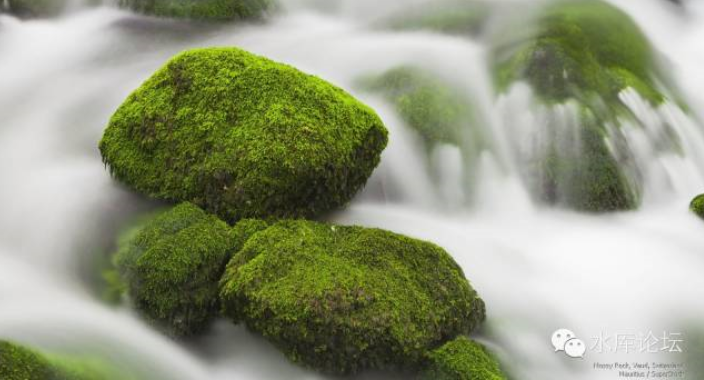

# 香港楼市崩盘始末（下） \#980

原创： yevon\_ou [水库论坛](/) 2016-04-14

香港楼市崩盘始末（下） ~\#980~

真正让人印象深刻的，反而是跌下来之后"既得利益集团"的嘴脸。

 

 

一）负资产

 

1997\~2003，香港楼市最低潮时，他大概产生了106000名"负资产"人群。

按照香港240万套房产，占总人口的5%。

 

 

这些人是怎样产生的呢。在房地产市场，要形成"负资产"其实殊为不易。

首先你要在市场[最狂热]的时候冲进去，而且要买那种"[严重高估]"的盘，一般情况下是一手CEO.

其次你首付要[足够低]，香港允许"二按"。首付5%，贷款可贷95%。

 

那么，你反过来想一想，什么样的人，会在"最狂热的时候，用最小的首付买入一手CEO盘呢"。一般只有二种答案：

-   重度投机者

-   菜鸟

 

2002年时去香港公司考察内务，听取述职。有一个司机叫做阿伟。40岁的夫妻俩，没有孩子养了条狗。

"我为什么不养孩子呢。因为生了孩子他也买不起房子，不如别让他生下来受苦。"

"我一直忍忍忍等等等，到97实在熬不住了。没想到就接了最后一棒"。

"先生你让我怎样加班，怎样骂人发脾气都可以。我只求你不要把我炒鱿鱼，否则我就真的没有活路了"。

 

在我们看来，这种劳动人民司机就属于"菜鸟"类型的。当他最终冲进去时，他却完全不懂选筹。以至于买了贵货。

 

买楼这种事，当然是要买着买着，久病成医才能攒经验值。

老兵和新兵绝对不是同一类生物。

你弱你有理啊。

 

 

二）你弱你有理

 

在我们看来，认赌服输。看错了走势，只能怨你自己"学艺不精"。

但是后来事实的走向，远远超乎大陆人上海人的想象。

 

"负资产者受到了普遍的同情"。如果我们说今天Donald
Trump川普在美国和"政治正确"作殊死搏斗的话；

那么当时在2000年的香港，"负资产者"就是绝对的政治正确。

 

 

几乎所有的政治团体，都对"负资产者"表示同情。几乎任何一个民意"立法会"议员，一开口就是要解决负资产问题。

尤其当1998.11发生了第一例"烧炭"\[1\] 事件。白左圣母心被彻底击碎了。

苹果日报的标题是"惨，惨，惨，惨，惨"。小白左婊们一边流着眼泪，一边发誓让这样的惨剧再也不要发生。

 

 

这些事情的合力是什么。合力就是"救市"成了绝对绝对政治正确的事情。

当中国傻空还在为"调控降房价"欢呼之时，他们其实也正在掘自己的坟墓。

政府干预，请走得越远越好。

 

 

三）救市

 

1997年金融风暴一发生，那群家伙就希冀"联系汇率"被击溃取消。

 

很多人不明白"联汇"的意义是什么。联系汇率的意思，就是港府失去了"印钞权"。

本来楼市崩溃，对于政府及政治特权群体而言，只要我开动印钞机，把港币印成日元，韩元，津巴布韦元。哪一个价格位稳定不住。无论10W，8W单价都小菜一碟。

 

 

可惜当时的香港政府还是有一点操守的。坚决拒绝了房东们的要挟。

于是就爆发了2003.07.01的"大游绗"。董伯伯站在中环城楼上，面如土色。

 

大游绗的目标是什么，目标就是中产们反对"楼价下跌"。

董伯伯当时搞了"八万五"。他的心思是好的，97时香港楼价已是全球第一高。

过高的楼价并无好处，而且也削弱香港长远竞争力。既然已经回归了，"中英联合声明"中TG提出的50公顷用地限制自然作废。

都是亲爹政府了，董伯伯好不容易申请了扩大供地。

 

在7月1日的那一天，董伯伯心里悔啊。我想他是把肠子都悔青了。

"别看游绗有50W人口，我的八万五政策可是惠及了500W底层市民"。

"屌丝，屌丝人呢"。

"屌丝，屌丝人呢。我为你们谋取了地价下跌。现在你们倒是跳出来为我说句话啊"。

"屌丝们出来，我为你们降了房价地价。现在我需要你们的声音和帮助"。

 

 

屌丝们没有出来。那些受了"八万五"恩惠的人，没有一个跳出来，为董伯伯说二句话。在他最脆弱的时候，没有一个"楼价下跌"受益者跳出来为董辩护。

 

屌丝这种畜生，它就不配让你待他太好。

屌丝这种畜生，就活该生活在政治生物链最底层。

因为屌丝只有自私和贪婪，而丝毫都不懂感恩。

 

 

四）孙九招

 

事情后来的发展结果呢，董伯伯以"健康原因"黯然下台。

后来人接位。整个政治生态已经看得很清楚了，什么能做，什么不能做。哪些人可以得罪，哪些人不可以得罪。

 

有兴趣的人，可以去搜一下"孙九招"。指的是当时"房屋及规划地政局"局长孙明扬。

政治风向明确之后，他一开始是"孙一招"，收紧土地供应。后来则扩展到"孙九招"，包括土地房屋地铁基建的全面收紧。

当"房东阶层"发起疯来，那真是极其可怕的。

 

严格地说，香港2003\~2005年那一段时间，根本就没有供地。土地供给量为零。人为地制造了一段大冰河期。

长期以来，香港每年的新建都在45000套左右。董建华所谓"八万五"，也不过五万私营，三万公营。

 

可是近年香港供应逐渐衰弱，最近二年甚至都徘徊在15000套的水准。这样香港年轻人才是真的"买不起楼""买不到楼"。

供应为什么会下降，是因为各大KFS手中"土地储备"在下降。

土地储备下降，是因为之前有一段非常漫长的"冰河期"。

 

 

五）房东凶猛

 

我们可以复盘一下香港1997"楼崩"之后发生的事。下半场才是真正精彩之处。

 

-   当房价下跌时，房东阶层才作为一个"政治庞然大物"浮出水面。

-   房东迅速地获得了"政治正确"权。

-   政府连轻微的几十例"烧炭自杀"都承受不起。

 

 

很多人或许还不体会"政治正确"这个词有多凶猛。

如果你了解当年这段历史的话，香港房东们的要求，基本是"100%回到九七巅峰原价"。

100%，只有100%回到，才能消灭负资产。才能让有产阶级满意。

 

这是一个非常没有道理的要求。

因为97的房价，根本就是"急升"的。这是非常虚的。根本没有经过充分的换手和市场承认。

 

打个比方，2016.4月上海楼市目前价位，大致是8/5/4格局。

可是回归前最后一段时间，1997升旗前的最后六个月。他就从8W，一口气拉到了20W。

廿万一平米，相对于工资或者物价，就是这个比例。

 

 

然后这个价格是肯定站不住的。明显的违反了价值原理。

他肯定要跌下来，经过三个70%，最后20-\>14-\>10-\>7，最后跌到了内环六七万的样子。

其实这还是一个很合理的数字。并不算贱卖的数字。

 

 

可是"房东"阶层已经坐不住了。整个社会价值，舆论导向，政府态度，已经极大地偏向了同情怜悯房东。

相应地18W，19W冲进去的那些菜鸟，会套牢一批人。会形成负资产。

负资产在政治上，简直就象残疾黑人同性恋一样，是"无敌铁金刚"。

 

然后你再在负资产的倒霉鬼里面，选出大约0.5%的人，让他们"烧炭"。

于是圣母婊少女心顿时被感动得不行了，尤其遇见几例带小孩冚家铲的。照片一发，简直横扫大杀器啊。

 

所以房价一定要"救市"。救市的目标，不是要恢复合理价。而是要恢复"最高价"。

中国人的国民性，想象力不足，而坚毅不拔。

一旦20W这个价格被"刷"出来，他们就会说6W的价格是打了三折。而以20作为政治奋斗目标。而丝毫不管公平与正义。

 

 

六）求仁得仁

             1991   1995   1997   2003    2016
  ---------- ------ ------ ------ ------- ------
  价格       25     60     100    35      160
  持有到今   7.7%   4.8%   2.5%   12.4%   

按照官方的数字，香港房价在2012年正式回复97高点。

到了目前2016年，价格大约是160%

 

上表列出了你从1991，1995，1997，2003几个关键节点，如果你"买入\-\--持有"。

经过了十年浪潮，笑看风云，最后获得的复合回报是多少。

 

按照这个价格，你几乎可以说"炒楼永不败"。哪怕将香港经济扭曲扭曲再扭曲。

因为有一个巨大的可怕的"房东阶层"。

我实在没有勇气和这股政治力量对抗。

 

 

（yevon\_ou\@163.com，2016年4月13日晚）[\[2\]]

 

 

 

\[1\] 死者是一名中年妇女。化学功底深厚纯原创发明。在《完全自杀手册》http://baike.baidu.com/subview/656343/5129253.htm中没有摘录，被考证为全球第一例。

\[2\] 上一篇《香港楼市崩盘始末（上）》中，郁金香的部分引自于包宗华老师2004年文献。特此声明。
