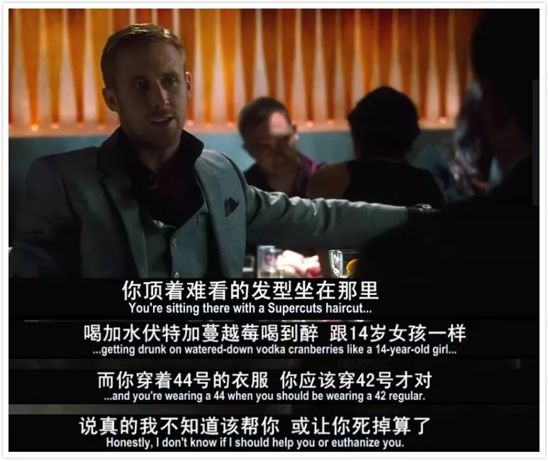

# 欧洲审美还能流行多久 \#C33

原创： yevon1ou [水库线下](/) 2018-08-13

**欧洲审美还能流行多久 ~\#C33~**

 

Q：你说法国有什么缺点。

A：嗯，法国菜实在太难吃了。上帝怜悯可怜的法国人。

法国人气死一半。

 

Q：你说英国有什么缺点。

A：英国的服装实在是太丑了。可怜圣马丁的人，都没衣服穿。

英国人气死一半。

 

 

 

一）丑衣

 

昨天晚上失眠，于是四处刷订阅号。刷到一篇"反裤衩阵地"写的《[[中国男人对自己的迷之自信怎么来的？]](https://mp.weixin.qq.com/s?__biz=MjM5ODAxNDg4MQ==&mid=2657219173&idx=1&sn=9d082ac2857dece1f7b923854147e9eb&scene=21#wechat_redirect)》

原文100000+，文章也的确写得不错。建议看看。

 

在文中，作者声嘶力竭，大声疾呼。

"中国人为什么不穿漂亮点的衣服"。

"中国人为什么不精致地生活"。

"我用米兰货，我陶醉"

哥哥一边抠着脚，一边懒洋洋说："为什么不买，因为这些衣服很丑呀"。

 

 

 

爱美之心，人皆有之。

哪怕身家丰厚，不意味着就喜欢穿"丑"衣服。

看见漂亮的，飘逸的，神采的衣服，一样会眼前一亮。男人和女人，对于美的追求，本来就是别无二致的。

 

那么，我为什么没有"顺"你的意，没有按照"时尚博主"的推荐，去买你高亮三次的品牌呢。

因为这些衣服超级丑呀！难道你不觉得难看得发呕呕么

 

LV，Zegna，BVLGARY，Paul&Shark，这些牌子对男人没有吸引力的唯一原因：

是它们太丑，太下贱，穿了你都不好意思出门。

 

只有最最最Low的扶洋女人，才会选择这些牌子。

这充分显明了她们审美情趣的低下。以及社会地位的贱微。

 

 

 

二）贴身

 

为什么。因为中西方对于"男装"的审美。立足点就有根本性的不同。

欧美男装的审美，在于"合身"。

 

欧美男装的标准，就是一个衣架子，收拢得越小越好。恨不得贴身就是一层鱼皮，紧紧把你包上。

如果你可以穿42号的西装，你就绝对不要穿44号的。44号就会被批评为"不合身"。

 

在欧美，一个顶级的裁缝，一定要无限了解你的身材。一套男装，大约有领围，肩宽，胸围，袖长，腰围，臀围，裤长等十几个指标。

等裁缝把这些参数，都换算成布料裁剪了，简直就是一场三维建模。

 

 

和"紧凑合身"审美观相匹配的，则是欧美人对于身材的追求。

因为衣服的极限，是象"黑豹"中这样的紧身衣。完全贴合身材。

那么你是一个胖子，还是健康健美，也就容易被人看见。

 

因此欧美文化中，有非常浓重的"健身"文化。

男人一定要锻炼出八块腹肌。

象龙虾般纤节的腰肢，巨大的胸部肌肉。

这些全都可以原汁原味的体现在你的西装中。欧洲人穿男装，简直就是一场斗臀大会。

 

 

 

三）中式服装

 

但是对于"中式男装"。他的逻辑绝对不是这样的。

中式男装的审美原则，叫做"藏"。 

密密掩掩，纹丝不露。我的心思你别猜。

 

中国古代以来，穿衣风格就是"宽袍大袖"。

衣袖必须很宽，甚至可以垂下半襟。衣袍一定是宽松的，遮掩得什么也看不到。

你看武侠片，白衣大侠挥舞宝剑，衣带飘飘，霓裳若仙，就是这种感觉。

 

极其贴身的短衣打扮，

你别吓我，只有佣人才这样穿！

 

只有佣人才这样穿！

只有佣人才这样穿！

整个欧洲的审美，就是低俗的，下贱的，粗鲁的，只有佣人才穿欧美西装。

 

 

 

造成这样"文化差异"的缘由，是什么呢。

中国从很久以前，就是"缙绅文化"。北宋的富庶，一个看门人，都比罗马贵族活得好。

 

中国的缙绅地主阶层，很早以前就过得很好。中国的人力又便宜。因此他们舒服到"不需要自己干活"。

 

你看盛唐中的巍峨气象，君王们都是宽袍大袖的。然后后面跟了无数的小卒。

贵族们一切都不需要自己做。

捧扇的，捧琴的，捧书的，甚至捧痰盂的，后面十七八个佣人跟着。佣人都是短衣打扮的。

 

而贵族呢，贵族只需要"飘飘欲仙"。

宽袍大袖，穿着完全不便于"下地干活"的衣服。

 

而欧美的文化呢。真正Middle
Age中世纪"皇家传统"，到了今天欧美反威权市场，早就已经绝迹了。

欧美现在盛行的"奢侈品"文化，包括圣马丁学院教授的全套逻辑理念审美方法，全都基于19世纪资产阶级大爆发。

 

这些人，原本也不过是一些经营有善的小店主，磨坊主，皮具马鞍主。资本家仍然是下地干活的人。距离真正的"武士勋贵"，还有无限远的距离。

 

 

因此欧美的审美观，是"精明，干练"。

衣服一定要很贴身，这样才便于行动，干活，见客户。

 

料子一定要深色（男装就二种色），耐磨，这样才不怕沾染污渍，拉钩抽丝。

西装，其实就是劳动服。

 

因此真正有文化的人，看着西方在售的审美观，目前所谓的"奢侈品"，是一点提不起喜欢欲望的。

你这不就是泥腿子洗脚上岸么。在中国，只有佣人才穿得五短紧凑的。

 

 

 

四）精致和阶级上升

 

（关于中国男人健身和斗美，整段删）

 

 

 

五）奢侈在东方

 

奢侈在东方，这是千古不变的道理。

 

早从BC558年，大流士时代开始，东方的富裕和奢侈，就震得西方人目瞪口呆。希腊人望尘莫及。

 

因为东方具备大量的平原和草原，可以聚集海量的人口，同时压低人均工资。

东方君王/贵族出行，动辄十几个仆人的服侍队伍，在西方是不可想象的。

 

整个欧洲大陆，几乎就没几块像样的平原。被山脉莱茵河谷割裂得支离破碎。

因此欧洲历史上，人口较少，人均资源较多，人力较值钱。

 

 

这样的"东西方"文化差异，在"工业革命"的时代被改变。

工业革命所锻发出的千倍百倍生产力，使得东方的君主，哪怕堆积了上百个农奴，也没有西方的中产阶级生活质量好。

这使得人们仓促以为，西方代表了"富裕，奢侈"的生活符号。

 

其实这是不对的。随着"工业革命"的全球扩散，东方国家的逐渐工业化，现代化，赶上了和西方的差距。

 

东方的奢侈，是西方望尘莫及的。

 

买条丝巾，买个手袋，这些东西也配叫做"奢侈品"。真是笑掉了人的大牙。

再过40年，东方奢侈起来，会让全球目瞪口呆。

 

[weibo.com/1853047530/zilrasbZw]

（大图不雅，就不贴了）

 

 

（yevon\_ou\@163.com，2018年8月12日午）
