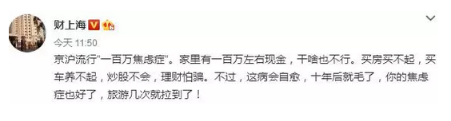
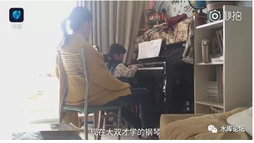
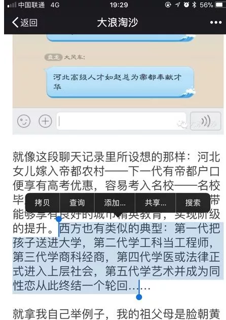

# 中产阶级的地雷阵 \#D03

yevon\_ou [水库论坛](/) 2017-11-22

 中产阶级的地雷阵 ~\#D03~
===========================================================================================================================================================================================================================================================================================

爬阶很难

滑落很容易。

 

 

一）前言

 

上个星期没有更新。因为全心全意准备《[人文经济学会](https://mp.weixin.qq.com/s?__biz=MzAxNTMxMTc0MA==&mid=2651016446&idx=1&sn=9fd0d6e59c7493553733e13ade3a2eef&chksm=80721aedb70593fba9fd6c4a777397863701da107f5fa36d7671e2e0e2d4d6886c32e7834365&scene=21#wechat_redirect)》的讲座。

讲座刚结束，《功夫财经》小妹就过来催稿了。

 

"欧大，您讲的东西很好，都有价值"。

"可是太高大上了。动辄三四千万的理财配置"。

"贫穷限制了我的想象力，您什么时候也讲讲，100W现金的中产阶级如何投资啊"。

 
哥哥吓得猛一哆嗦，"[我也很绝望啊](http://mp.weixin.qq.com/s?__biz=MzAxNTMxMTc0MA==&mid=2651015687&idx=1&sn=442341381f6b04978c955feb6155bef7&chksm=80721c14b7059502b3f8111e1c2ed983375a162d57ee723aa9e16effa3d0dfe978b157526726&scene=21#wechat_redirect)"。

100W投资，这个话题没法写的。怎么写都是死路一条。

你能接触的投资，全都是跑不赢通胀的。好的投资，你都接触不到。

 

 

在整个社会中，你就是羊。

全社会的羊毛衫，都靠从羊身上剪来。保护羊是不可能的。

 

我们偶尔救济二条落网之鱼。

"赚钱"道路，鸿篇巨著，百转千回，九死一生才能绕出地雷阵。

学会了"水库"心法，也要靠本人的勤奋，加一点点运气。

 

 

不过，我可以给你写写"亏钱"的法子。

有什么办法，可以让你迅速地亏钱。100W全部都扔在水漂里。一颗子弹定向消灭一个中产阶级家庭。

 

赚钱的门路，找一个都很难。

亏钱的门路，闭着眼睛俺能说上一千种。

 

哥哥列了三个例子。非常巧，都是和子女教育有关。

 

 

 

二）教育投资

 

知乎上有一个很有名的帖子："有哪些政治正确的东西是错误的"。

答案是温酒写的，"全部都是错误的"。

 
因为一件正确的事，我们可以直接称呼它"正确的"。

只有不正确的事，才需要形容为"政治正确"。\[1\]

 

同样道理，在我们的生活周边，也有一些事情"政治正确"化。

一旦*政治正确*，人类就只用惯性和世俗的眼光去看待它。而失去了进一步思考。

尤其是进一步控制它的能力。

 

第一个明显的陷阱：对教育的无限投资。

 

 

譬如说，你在家里面吼。说你要买一套大房子。

说你要买四室三厅，带一个大露台。此类的户型极其罕见，房东的报价，仅仅只有市场价七成。

机会难得，笋盘一去不复返。

 

你会得到怎样的待遇。你得到的待遇极其冷淡。家里面的老人，决不会砸锅卖铁支持你的"挖笋"进程。

 

相反的，他们会冷嘲热讽，"房价马上就要开跌了，现在不宜买房"。

"中央三令五申，挂牌价猛增15000套"。

"控制风险，安全第一，破产就在眼前"。

 

 

但是，你换个说辞。

你不再买200平米，1000W的大笋盘了。

你改买30平米。

 

30平米，1000W，不是开玩笑哦。

 

颠倒黑白的是，你在家里，会得到"英雄般"的待遇。

因为你买的是"学区房"。亲戚好友不管谁质疑，你只要直接回答"房价是要跌了，为了孩子没有办法"。

 

你用四只手指捂着眼睛，通过指缝，半得意半炫耀地看着亲戚，谁敢说半个不字。

 

 

"为了教育"，在中国目前就是[刀枪不入金钟罩铁布衫神勇铁金刚]。谁也不敢批评半句。

亲戚们永远也不会评说，200平米和30平米房子，哪个泡沫更大。

亲戚们永远也不会评说，拉着你死命劝你别买学区房。危险！

可实际情况呢，没有劝阻，没有谏议，轰隆隆坠落无底深渊。

 

 

在中国，本科之后的教育，回报率基本是个负数。

 

学历并不是越高越好。

最笨的人才去读研究生。考研是低智商，低情商的表现。

 

对于内陆省份来说，上不了211，野鸡大学的学费，回报就是负数。

还不如考个Blue Fly。

 

对于京沪大城市来说，本科之后的教育，也是个负数。

决定人生的是高考。第一学历才是学历。

 

 

 

"教育"这种事，本质是一种投资学选择。

在研究生"录取率"如此高的今天，绝大多数的人，并不是因为"考不上"而不读研究生。

他们纯粹是因为"不划算"而不读研究生。

 

研究生本身，也并不意味着更高的情操，或者更高的审美品位。

譬如说，你每天看着200对果蝇交配，连续看上二年。你觉得这种事很有审美么。

 

 

但是中产阶级并不明白这个道理。

在目前的"Mid-Low
Class"中，对"教育"的投资，几乎是压倒性，一面倒，不计成本的。

 

 

我们知道，经济规律这种事，你可以不理睬它。但是它不会不理你。

不计成本，不计回报，无限制的教育投资，恶果显现。

 

我们看到，一些Mid-Low
Class的父母，本身可能仅仅是一个营业员，一位卡车司机。

但是他们会倾注全部的资源，省吃俭用，把全部的家财，堆积在孩子身上学钢琴。并期冀孩子可以成才。

 

 

我们并不是说，学"八国外语"不好。

我们指的是，"经济学"才是高等科学。

 

凡事都要讲"费效比"。你大把投资，牺牲掉父母所有的人生和幸福。

能成才么，不能。

能赚钱么，不能。

能快乐么，不能。

 

最终的结果，是一个36岁嫁不出去的生物女博士，绷着马脸，在五星级大酒店大堂里弹琴卖艺维持生计。

您是不配作为套房客人的，你只配当个服务生。

 

《偷鸡腿妈妈：住垃圾场送娃学钢琴》\[2\]

 

 

 

 

三）移民投资

 

中产阶级手里有了100W元。不满足于传统的股票，债券投资。想要高人一等，出人头地。

除了砸在孩子身上，进行硕博教育。还能干什么。

还能出国。

 

我真心不明白，一些40岁事业有成，单位实权骨干，为什么要急吼吼出国！

 

中国有几件"政治正确"的事。老百姓习以为常，路径依赖。

自以为天经地义，实则荒谬绝伦。

教育是一项，出国又是一项。

 

 

-   出国为什么

-   什么人需要出国

-   出国有什么利益

-   出国有什么缺点

-   哪些国家，用何种方式，什么渠道出国。

对于这些问题，中产阶级一无所知。

 

你如果和内陆省份一些家庭聊过，他们的思想，基本是"为出国而出国"。

仿佛你只要一抵达美洲大陆，白银珠宝都会滚滚而落，直接跳出"游戏通关"的字幕。

而瞎眼罔顾美国欧洲也有大量穷人，黑人老墨，生活水准远远不如京沪的事实。

 

 

中产阶级，是一个很特色的阶层。

严格来说，他们并不是上层阶级。而仅仅是"模仿"上流社会。

而这个模仿，又不是实时的。而是时滞很严重的。

 

 

1980年代，国门刚刚打开，欧美港澳台收入20000元/月，中国人收入80元/月。差异极为巨大狂野。

当时的京沪粤，沿海大城市，人们惊讶地发现，去日本打黑工二年，回来就是农村首富。

所以80年代形成了巨大的"出国潮"，并因此被内陆省份模仿和牢记。

 

 

但是，时移世易，到了2017年，京沪的上层生活水准早已远远超过欧美中产。"移民"对于A8阶层来说，毫无任何吸引力。

 

三里屯的老外，都变成White Trash了。

因为啤酒涨价，最近开始改喝可乐。

 

但是，中产阶级和上流社会的区别是，中产阶级只具备"模仿"能力，中产阶级是不具备"思考"能力的。

当上海A8早已不屑欧美穷鬼时，内陆的中产阶级，依然飞蛾扑火一般奋勇出国。

 

出国不是手段，出国就是目的。

出国人云亦云，不算收益成本。

盲从的下场，必然又是一次排队枪毙。

 

一个中产家庭，一旦出国，整个家庭就算毁了。

从零做起，慢速轨道，回天无力。中产迅速返贫。

 

 

 

四）艺术投资

 

第三个陷阱地雷，是艺术。

尤其是画画，女孩子学画画，一定要坚定拒绝。

 

 

我们看韩剧，[韩剧里](http://mp.weixin.qq.com/s?__biz=MzAxNTMxMTc0MA==&mid=210009763&idx=1&sn=4c6655048bfe023db1720a9c5fd9adab&scene=21#wechat_redirect)，有一个非常典型的范例。

富家贵女，例如社长的妹妹，嫁不出去的姑妈，刁蛮的大小姐，富商千金，无一例外，她们的专业是"美术系"。

 

这些贵妇，贵小姐们，并不需要上班打表，维持生计。

可是她们在"专业"系科选择上，无一例外选择了绘画，更远远超过第二名的音乐。为什么。

 

 

因为绘画，是一门"不用竞争"的学科。

一旦你选定了画家作为终身职业，你就再也不用面临激烈的竞争，残酷的排位赛制考试。

 

当你女儿，当你的小孩，16岁时向你提出"想学画画"。此时，你一定要坚决拒绝。

当她说出这句话时，她的潜台词其实是，"我已厌倦了激烈的竞争，我已害怕努力和奋斗，我宁愿做一个懦夫躲起来藏起来"。

 

 

于是，贵族小姐，可以堂而皇之的找一个画室躲起来，可以IB。反正可以用父母的钱，衣食无忧。

她可以毫无压力地工作，花几个月的时间画一幅画。别人甚至还不能评论"艺术"的工资。尽管她们一辈子也卖不出去一幅画。

 

 

真正的绘工大师，是极其辛苦的，也是极度清贫的。日夜勤勉。

那笔锋，刀锋，每一划都是灵魂之作。用生命在绘画。

 

而贵妇们不是。

她们是如此之懒，懒到连"音乐"都不愿意选科。

你要当众演奏一段小提琴的话，至少你也是刻苦训练锻炼，反复练习的。

琴弦的轻微桎梏和生疏，观众是轻易可以听出来的。

 

 

无论你是小有身家的企业家，还是自恃清高的知识分子。

当你的女儿，向你申请"学画画"时，一定要坚决拒绝。

 

家族如此富裕，再多养一个人口，本身不算很大的负担。

但真正的麻烦是，"躲避竞争"是一个潘多拉魔盒。如鸦片毒瘾，千万不能沾。

 

在此后她的人生中，会有无数无数杜十娘问题，象连环炸弹一样，不停爆发出来。

 

 

 

五）结语

 

前二天我见了一个温州行业会长，问他温州近期经济怎样。

他说老一辈的企业家还都活着，每一个都是人精。聪明狡猾，诡计多端，要收割老狐狸们实在不易。

 

然并卵，哪怕你再牛强，421的规律，总是避免不了的。

家族财富，四个再强大的局长处长，最终只留下了一个傻白甜，女继承人。

我再问他，那么继承人培养得如何。"出国留学投资读书艺术科目"效果如何。

他苦笑着说，出去了二十五个人。

 

其中二十四个人，辛勤读书，学成归国，高科文凭。

只有一个学渣，在美国整天跑车把妹，考试参考"天才枪手"。混了一个文凭。

 

然后你猜，二代中有能力继承家业的，成才了几个？

 

 

 

 

（yevon\_ou\@163.com，2017年11月14日午）

 

 

原文于11月17日首发于《功夫财经》，链接在[此](https://mp.weixin.qq.com/s?__biz=MzIzOTA3NTA5Mg==&mid=2652446696&idx=1&sn=c886101959907588adf9b27236523fea&chksm=f2c21593c5b59c850bb51f4821bad7d7d5a170e5f599255b09acb9acff4c3f6ca6cc2c5caf10&mpshare=1&scene=21&srcid=1118Ivbt26RArMLmoYHox5mU&pass_ticket=e4j8xyM9gSy1I1GkpKjyQuOlvZykNkAVjd59FA24NUxPfK79OGQF2YRNYEBqmfDO#wechat_redirect)。遗憾的是，还是有人留言：

 

[\[1\]]《有哪些政治正确的东西是错误的》

https://www.zhihu.com/question/21094902/answer/211695264

\[2\]《偷鸡腿妈妈：住垃圾场送娃学钢琴》

http://news.163.com/17/1108/14/D2NOP0M50001114AEE.html
