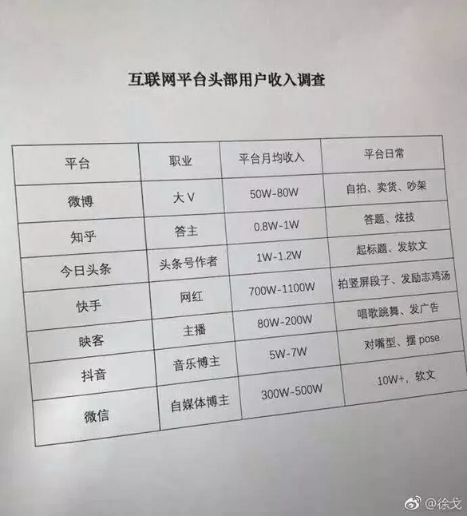

# 有很多很多套房子，是怎样一种体验 ~\#D11~

原创： yevon\_ou [水库论坛](/) 2018-07-24

有很多很多套房子，是怎样一种体验 ~\#D11~

 

静如渊

 

一）       现编的故事

 

在一二线城市，有十几套房子，是怎样一种体验？

这个问题可不好答。

 

按照目前的市值，如果京沪深有十几套的话，那要估值1亿了。

如果在二线城市有十几套，也要四五千万。

你让一个半亿富豪，来给你写体会录。一般是没那么空的。

 

 

前几天，有人在起点上面吐槽，说现在的"神魔小说"，怎么格局那么小。

动辄都是修炼了几千年，几万年，可是做起事来，却还像街头小流氓打架似的。

 

举个例子，某大卖网红小说，版税前茅的。说兄弟二个人，都是控制世界经济命脉，家里面涉足十几个产业，管理几万人的大公司。

兄弟恶斗，斗到最后快搏命了。弟弟提出："给我200W RMB，从今往后一笔勾销"。

哥哥想也不想，一口拒绝："你疯了吗，那么大一笔钱"。

 

因此呢，上知乎，分享你刚编的故事。

如果你没有这个身份，经历，背景，你编的故事，就很容易出窍。

没有经历过，毕竟是漏洞百出的。

 

 

 

二）       第一套

 

人的一生，会经过几次蜕变。按水库的说法，是第一套，第六套，第十六套。

不管哪一个广告商，谈论起"知乎"这个平台，都是眉头紧锁。

从这张互联网大V报价开看，知乎也是一个奇葩的存在。

知乎V特别地不值钱，Top1000几乎和叫花子一样。

 

按照广告商的话语，知乎的主要用户，是在校大学生，硕士生，以及部分刚毕业人士，"不仅又穷又酸，而且有反社会倾向"。

 

 

反社会倾向指的是，浑浑噩噩，懵懵懂懂，知乎er仿佛是生活在一个"异次元"空间。

先烈前辈们，制定下的，残酷无比的"社会运转法则"。对于未出校门的象牙塔，几乎是没用的。

 

 

如果你的学哥，学长们，今年24岁，踏上社会第二年，第三年。

则他们会向你哭诉"玻璃天花板"，社会各向矢量的走投无路。

 

你985自以为的天之骄子，一踏上社会，却只能给你开3000元工资。

而且升职十分艰难缓慢，每熬几年，才升一级。工资加得也不多。

光靠工资的话，勉强这辈子都买不起北京的房子。

 

如果你想创业的话，你会发现，这个社会，方方面面都已经被人"堵住"了。

所有能赚钱的领域，所有你能设想到的阵地，都已经密密麻麻站满了人。人家不仅占据了最有力的位置，而且还挖了壕沟。

 

年轻人不甘于这血淋淋的现实，却只能嘴炮喊二句"掀桌子"。呸，你也配。

还有一部分年轻人，则遁入了二次元世界。 

在目前的年轻人中，以及部分"老儿童"之中，存在一批"躲避的人"。

他们不愿意直面艰难困苦的现实世界，宁可躲进一个"自欺欺人"的虚拟痴癫中，内心渴望永远也不要长大。永远也不要经历成人礼。所谓的"反社会性格"。

 

 

如何治疗此类病症呢：一套房子。

一套房子，从此跨入有产阶级。有恒产者有恒心。

 

作为有产阶级，你看待世界的眼光，就不会那么Cynical。

你就会更加理性，更加融入我们的现实世界。遵循现实世界的游戏法则，遵循层层既得利益集团制定的"升阶规则"。

 

 

如果要说体验的话，第一套房子，是你的"成人礼"。

是你告别青涩，告别幻想。使得心境平静下来的冰淇淋。

 

 

 

三）       第六套

 

第6套房子，或者第6\~8套房子。意味着什么呢。

6套房子，意味着财务自由。

目前在京沪深，财务自由的标准，大概是5000W元人民币。

 

 

当你第一次达到6套房子时，你会遭遇非常严重的"反噬"。

对的，就是反噬。

 

非亲身经历的人，绝对写不出这样的转折。

当你达到财务自由时，你遭遇的绝不是意气风发的畅快，而是反噬。

 

 

作为多军老人，我们在2006年时，就已经有很多人。

然后到了2008\~2009之后，市场迎来剧烈的四万亿行情。很多人都赚了很多钱，然后多军就"分化"了。

 

许多人赚到第一个A8.5后，他们都面临一个棘手的问题。

"如果钱已经一辈子花不完了，为什么还要继续赚钱"。

 

 

这是一个非常严肃的问题，你别笑。这问题直到今天，都没有详细解决答案。

"如果钱已经一辈子花不完了，为什么还要继续赚钱"。

 

因为楼市这一行，内功心法有点问题。

虽然赞誉甚多，水库是"玄门内功心法"。但其实水库是内家心法的末流。

按我们的说法，也就和崆峒派差不多。

比武当，少林，高级套路差远了。

 

楼市这一行，始于A8，熟于A9，终于A10.

赚人生中的第一个1000W很容易，从0\~2000W这段过程，堪称进境最快的。

 

但是到了一定程度就\~慢\~了，后期更是提拔训练不上去。

因为你的各项资源都用完了，限购，限贷，收入征明，办卡额度。而且资产结构，也已高度"角质化"。

 

 

当你通过"崆峒派"心法，第一次达到A8.5时，你面临的是这样一种局面：

-   再往前走，难度阻力可能是之前三倍，而且赚钱也不多。

-   停下不动，这辈子钱也够花了。钱赚更多也没用。

 

 

因此我们把"财务自由"这个关口，称之为"天诛"。

天诛之后，每个人选择不同。

有的人，就真的停下来了。在水库2006最老一批多军之中，不乏这样的"元老"。

 

他们第一桶金赚得很快。

但此后也不算快。今天也不算富。

 

 

 

四）       第十六套

 

在A8.5的关头，有些人停下了。手里的钱，够吃吃喝喝一辈子。

有的人没停下，他们的心太大。哪怕可以"白领生活水准"富闲一辈子，他们还是觉得不够。

"我辈岂是蓬蒿人"，一艘游艇，就A8.5了。

 

有些人继续飞翔。如果你看到一个楼市A9.5，则他的勤奋和变态，不是A8.5的十倍。

而是二十倍，三十倍。

 

 

当你达到十六套之后，你会遭遇一个新的瓶颈："资源枯竭瓶颈"。

按照水库现有的，已披露的心法，

你到16套时，无论如何，所有的资源，必然已经全部耗尽。

 

这个时候你还想要再继续扩张，你就得需要新的心法，新的玩法。

具体是什么，是水库Section3里介绍的。这里也不准备说，反正本文讲的是"体验"，而不是内功。

 

 

 

如果你在一二线城市有十几套房子，请问是什么体验。

最大的体验是："空"。

 

赚了很多很多钱，并不意味着多好几倍的花天酒地。

毕竟，如果你想酒醉金迷的话，你在A8.5的阶段，就可以去堕落堕落了。

选择"走下去"的人，都是为了其他的信念，或者坚持。

 

更何况，富贵已久，哥哥什么事情没有见过。

当你刚到A8.5时，对某些奢侈还会吸引动心。但若你十年前就是A8.5，你会发现，整个世界的物质欲望，真的非常少非常少。全满足了。

 

 

A9.2以上的财富，并不意味着更多的消费。

它意味着什么呢。雨夜枯坐，一盏灰灯。

你就坐在书房里，静静地看着外面暴风雨。什么事情也不做。

 

你不需要消费，当然更不需要点外卖。

真正的体验，是一种"安全感"。

你心里非常清楚，虽然你现在不消费。但是只要你愿意，你随时可以买上1000碗海鲜粥，吃1碗，扔999碗。

 

你随时可以跑到最高档的4S店，玛莎拉蒂，路虎卡宴，想开哪辆，每个颜色都来一款。

这种感觉，很好。

 

 

财富真正可以给予你的，其实是一种安全感。

虽然你对世界索取很少，但只要你愿意，你随时可以刷卡。

 

是一种安全在握，生杀予夺的感受。

然后你再看看芸芸众生，再看看在职场中拼搏，忧虑孩子老人的父母们。

有一种站在岸上，看水中众生的感觉。

 
当你有了安全感以后，你的眉目会开始舒展。神情会开始坦然。

整个人，会具有一重山岳版的宁静。

富裕，会从每一个毛孔散发出来。

 

 

 

（yevon\_ou\@163.com，2018年7月24日暮）
