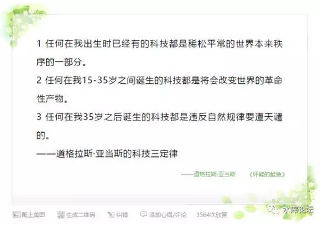

# 书籍时代的消亡 \#F1060

原创： yevon\_ou [水库论坛](/) 2017-05-03

书籍时代的消亡 ~\#F1060~
=====================================================================================================================

 

您的最后一本书籍

 

 

一）书籍

 

BC700，佛祖时代的经文，被称之为《贝叶经》。是用针刺在贝树叶子上的。

 

贝叶经极其容易损毁，携带也不方便。

此后漫长的封建岁月，书籍的主要载体是：羊皮。

 

虽然羊不算是很贵的动物，但数百张羊皮依然是很耗钱的。

我们想说："在古代，书籍是非常非常稀少的"。

 

 

书籍稀少到怎样一种程度。中世纪欧洲，如果一个人写了一本书。

那么他就把他的左手小指砍下来。

用根绳子，挂在书的扉页上面。表示这样的书再也不会有。

书比人更值钱。

 

 

在《临高启明》里讲了一个段子。临高集团想要贿赂海南书院。

送过去任何礼品，刘大霖都是不会收的。

但是临高集团，送的是一套现代印刷机精印的《四书五经》。

 

海南书院，虽然也号称书院。

但是以一县之力，甚至连一套齐的《四书五经》都凑不出。书籍昂贵，纸张昂贵。更不要说精装版，便携版了。

 

 

在《文明》系列游戏中，向来把"印刷术"列为一项非常重要的科技。

活字印刷，造纸，指南针，火药，被誉为中国古代四大发明。

这里面是非常非常有道理的。

 

"造纸"的出现，使得竹简的成本一下子降了二个零。为大规模的识字和文化传播奠定了基础。

而文字和吏治国家，则是一个辽阔帝国运转的枢石。

 

可以说，没有刀笔吏，就没有大型帝国。

如果没有"造纸"。中国会重回春秋，以分封制为主。

 

 

而"印刷术"的发明，使得人类科技文明传播，再大大向前走了一步。

"羊皮纸"时代，一本书只有一本，仅限于非常重要的宗教和巫术记载。

"造纸"时代，识字属于贵族。"洛阳纸贵"开启了东晋世代门阀。

"印刷术"时代，掀起了报纸大众知识革命和民煮浪潮。

 

 

一般认为1949年之前，中国的"识字率"是1%

一直到80年代，我们读书那阵。很多小学生还有记忆，学校里有蜡染工坊，有油纸和穿着工作服的印考卷师傅。

 

王选凭借其"汉字激光照排技术"，在改革开放初期获得了巨大的声誉。创立方正集团。史玉柱研制汉卡。

他们的名字，不该被忘记。

 

 

然后就是"五角丛书"，书籍的价格大幅降低。一直降到今天卖白纸的价格。

收集一套全本柏杨《资治通鉴》72册，再也不是什么难事。

甚至在旧书市场地位至高无上的"直版繁体"，前二天也有人送了我一套《笑傲江湖》。

 

 

我们唠唠叨叨写了八九百个字，想表达什么意思呢；

 

"以上全错"

 

 

二）买书

 
我想跟各位说，你现在所熟悉的社会，未必是一个常态。

你35岁时拥有的东西，往前30年未必存在。

往后30年，也未必存在。

 

书籍就是这样一类东西。

"书"的存在，难道就是亘古永恒，天长地久的么！

 

 

你往前数，哪怕仅往前回溯100年。

1917年的中国小朋友，难道是每个出生了以后，都有玩具玩，都有儿童书，都有婴儿奶粉喝的么。

往后1000年，2117年，他们会看书么。还是看iPad。[\[1\]]

 

 

 

我们习以为常的事情，校园记忆的事情。

1990年代刚上中学，到图书馆借武侠小说看。同学之间互相流传阅漫画书。《圣斗士星矢》都快被翻烂掉了。

 

我们对这些事情熟悉，刻骨铭心，镌刻在脑海记忆里。

可是你有没有想过，这样的青春，是[天经地义]的么。

我们的儿孙，后辈，会和我过一样的校园生活么。

 

 

当我们清醒下来，一个象哥哥这样无可救药重度怀疑论者不可知论晚期，马上就发现不对了。

事实上，我们买书的频率越来越少了。

 

 

 

三）Amazon

 

Amazon搞了一个作家计划。号称叫"彻底消灭出版商"。

在Amazon看来，"中间商"这种生物是不被需要的。

 

 

美国每年大约出版50万本书，而独立书店十分有限，在1500家的规模。

这意味着每一本书都得不到"充分的展示"。

 

书籍的竞争十分残酷。

每一本书，一旦放上门口堆头位。必须立刻产生销售。如果不能销售，则迅速被撤换。

象电影《2012》中，作者的书卖了428本。这是完全可能的。

有人开玩笑说，"书籍已经变成一种易腐烂商品。其保质期[介于牛奶和酸奶]之间"。

 

 

Amazon于是想出了一个计划。他们直接和作家签约。

作家写完Word文件，直接封订在Amazon的橱窗栏里面。

-   没有库存

-   没有保质期

-   没有印刷

-   没有展示位限制

-   不需要听挑剔的，没有品味的，低级庸俗的出版商"买手"苛刻刁难。*老混蛋不懂真经非说我这书卖不出去不肯给我封推展示位下架鄙视你垃圾。*

 

 

在我看来，Amazon这想法是好的。也极其充满了创意。

对传统的书商行业，是颠覆性的革命。一点不给实体书店活命。

但我还是要说一句；

"以上全错"

 

 

四）书籍时代的消亡

 

在我看来，Amazon依然是落后于时代了。

他想出了一个极其有创意的图书分销模式。但是革命不彻底。

 

他没有想过，连图书这种信息形式，本身都不存在了。

 

 

图书是什么。

图书本身是一连串的章节。譬如《红楼梦》1\~80回。每一回大约6000字。

《红楼梦》排版顺序是，第一回，第二回............第八十回。

 

那么，它简直就是80本薄薄的小册子。

用订书机，蛮力装订在一起。

我们不由得想问，这样的"格式"，合理么？

 

 

 

举个例子，yevon\_ou在写"水库论坛"微信公众号。

从第一回《[毁三观，竖新生](http://mp.weixin.qq.com/s?__biz=MzAxNTMxMTc0MA==&mid=204836730&idx=1&sn=39bb60c5ae70746e60cca2e78bbab5e4&scene=21#wechat_redirect)》\#1，到本篇，零零碎碎也有二三百篇了。

 

我们的格式是，每隔几天写一篇。

每一篇的末尾，有网友的打赏，评论，和点赞。

 

 

作者可以不停和读者互动。读者有时候还会点菜，"什么时候写写月供啊"，"最新加息政策怎么看"。

而作者写到一半，可以引用前几篇的文章。直接加个链接，例如《[中产阶级如何保护自己的财富](http://mp.weixin.qq.com/s?__biz=MzAxNTMxMTc0MA==&mid=2651015310&idx=1&sn=8bdd05b874cdf3e792e3bfcf33ba0e5f&chksm=80721e9db705978bd3557c5753fd213c4df4e1ea75392e6a3570dcf503646ae14419fd35d30a&scene=21#wechat_redirect)》\#F730

 

 

最绝妙的，是作者还可以"改"。

譬如说，今天看到一篇非常好的文章:《易中天："达康书记"也是你能叫的？》[\[2\]]

 

我在《[论儒·法·禅宗·基督自治与道教的复兴](http://mp.weixin.qq.com/s?__biz=MzAxNTMxMTc0MA==&mid=211128132&idx=1&sn=ca586ee1556e5e43c9949624294e49e6&scene=21#wechat_redirect)》~\#F10~一文中说，"儒教"也被称之为"礼教"。

儒的本质是等级制。而等级制需要确权，需要确定双方的长幼尊卑。

 

二个人见面需要行礼。行礼的方式和言语，其实就是"地位等级"的暗中衡量。

行礼，决定了二个人以后相处的尊卑服从次序。

 

这段话写的时候，苦于没有太好的"称呼行礼"参照，行文寡淡无味。今天看见易中天这篇文章，如获至宝。于是俺高高兴兴地把参考"注释"加到了\#F10中去。

 

 

 

如果我们把"水库论坛"视为一课"炒楼学"教科书的话。

你是买一本书的效果好。

还是关注一个微信公众号的效果好。

 

答案毫无疑问是"微信公众号"的效果好。

因为微信公众号他是"活"的。可以有互动，有更新，有改良。甚至每一次打开，内容都会有轻微改进不一样。

 

 

有人说，手机拍照，手机录像，自媒体兴起了以后。

报纸"报导新闻"，就再也没有人看了。

因为报纸是一种非常非常缓慢的工具。今天晚上发生的事情，最快也要到明天晨报才能发刊。

朋友圈早就刷屏，刷烂掉了。

 

 

同样道理，我对于书籍的怀疑是；

"作为一种知识组织形式，'书'是否已经过期"。

 

 

各位，我们看待问题，一定要看清本源。

书籍，不过是一种知识学习途径。

上课，也是一种知识学习途径。

刷朋友圈，刷知乎，也是一种知识学习途径。

甚至连"社会大学"，也是一种知识学习途径。

它们并没有什么不同。核心都是[学习知识]。

 

 

目前社会上对"碎片化时代"颇有微词，学术界普遍对碎片学习时间不屑一顾。

这是不对的，屁股决定脑袋。

是教书匠为了维持自己的职业特权，而在进行辩护。

 

真正导致"碎片化"形象低下的，是没有考试。

没有考试，则你不能甄别学生质量。罗振宇的每一堂演讲，都必须假设台下都是完全没有基础的小白。从而降低了演讲质量。

 

 

如果能够对学生进行真正意义上的严格考试。

考不通则留级。

则函授，或者网络大学的效率，是会超过课堂的。

哪怕老师拉个群，让学生在群里自由讨论。老师不时点播指引（小密圈），这样的效率，都好过你在课堂里枯坐45分钟。

 

 

Amazon研究的是"书籍"的分销模式。

而我则是担心，未来连"书籍"都不复存在了。

 

 

 

五）未来的知识

 

书籍只不过一种表象，其本质是知识的传播。

未来知识的传播，不一定要靠"80回装订"成一本红楼梦的方式进行。完全可以VR趟一回。

 

 

所谓书籍，作者写成了一篇篇6000字左右的"章节"，再机械地装订在一起。

这样的"知识组织"形式，何等的可笑！

完全是中古时代的遗留物。化石未进化完全的遗骨。

 

 

未来的时代，"知识学习"一定有更多的组织方式。例如微信公众号，订阅推送。

小密圈，私密辅导答疑。

然后你再去实战一把。实战中遇到困难和困惑，到群里面来问。大家帮助。难保还能借你点钱。

这样的成长速度，是非常非常快的。

 

 

时代在发展，"知识组织"的形式在变革。

20年之后，我们的下一代，很可能就完全不需要书籍了。或许也完全不需要大学，课堂，校园。

 

 

在这整个时代落幕之前，您有限的经费，不如只购买一本书吧。

也请多多赠送亲朋好友。

您的最后一本书书籍；（作者：yevon\_ou）

 

当当：   
http://product.dangdang.com/25061484.html?\_utm\_ad\_id=64237 【阅读原文~~】

京东：    http://t.cn/RXikuVk

博库：    http://shop111676.cn/j50Wb5

亚马逊：  https://www.amazon.cn/dp/B06XY257T2

中信（机场高铁精装版）：https://detail.tmall.com/item.htm?spm=0.0.0.0.M2KKEi&id=549816044097

 

（yevon\_ou\@163.com，2017年5月2日暮）

 

 

 

[\[1\]] E-ink技术已经可以做到完全无损视力。

[\[2\]]《易中天："达康书记"也是你能叫的？》http://www.pcpop.com/doc/3/3980/3980633.shtml
