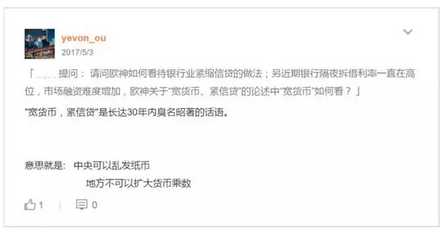
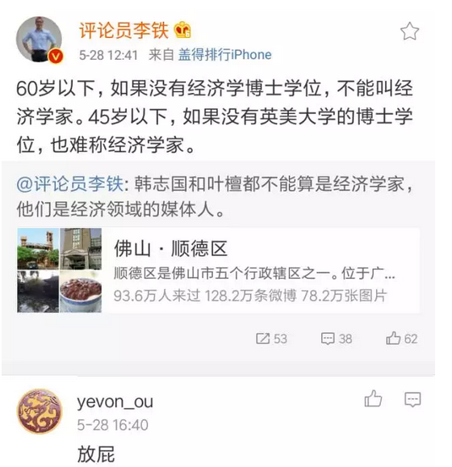
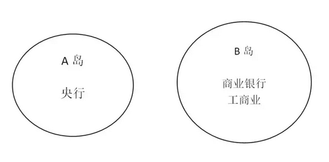
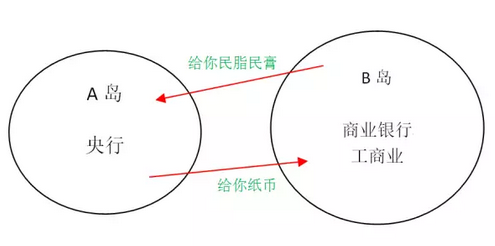
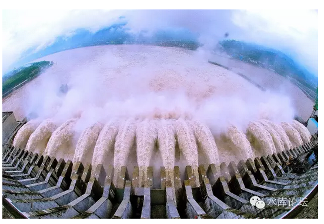

# 宽货币·紧信贷 \#F1110

原创： yevon\_ou [水库论坛](/)

**水库论坛**

微信号 Shuiku-net

功能介绍 科学尚未普及

2017-05-29

宽货币·紧信贷 ~\#F1110~

一）       序言

 

今天我们来讲一个话题，"宽货币·紧信贷"。

 

水库论坛关于"体"的部分。主要有二个方面：楼市基础+货币经济学。

在《[大纲的困扰](http://mp.weixin.qq.com/s?__biz=MzAxNTMxMTc0MA==&mid=205315770&idx=1&sn=8556c606ff340f29a598184580326bc5&scene=21#wechat_redirect)》~\#40~一文中，我们开篇名义：微信号只讲楼市。

货币经济学一概不谈。免得听众睡着。

 

 

不过最近实在没什么话题好讲。昨天晚上刷微博，刷到一个话题又让我气闷。

 

 

在我看来，中国的经济学，基本属于"以上全错"类型。

我不是说叶檀渣，我是说在座的各位，全部都是垃圾。

 

5.20张五常在深圳演讲《从科学角度看经济学的灾难》

老爷子磕叨二个小时，其实概括来讲，就二句话。

-   目前的院系经济学，已经走入歧途。整天捣鼓计量经济学。

-   而对最基础的原理，一片混淆。

 

 

水库文章中，曾有一篇《税收真的能「劫富济贫」吗？》~\#F250~，那是撕上海财经大学的。

当年有一个博士生，大言不惭地在知乎谈《福利经济学》。

 

我上去二个耳刮子。

"你什么学校的"。

"你老师什么学校的"。

"你怎么获得文凭的"。

我倒是奇怪了。《福利经济学》这种东西，居然还能有老师站在台上堂而皇之地教，居然还有学生在下面做笔记。你们居然还有考试。

 

你丫妈妈桑有没有教过你逻辑。

有逻辑的话，你怎么听课听得下去。

世上根本[不存在]《福利经济学》这门学科。

 

 

福利是什么，福利即抢劫。

世上没有白吃的午餐，福利一定有纳税人买单。

福利就其本质，是完全不工作的寄生虫绿教徒，躺在纳税人头上，抢劫纳税人的本国居民。

 

 

抢劫的事，你还有理了。

《福利经济学》不过分赃经济学。

那以后是不是还要搞"山贼经济学""马匪经济学"。

 

三观不正，你搞那么多图表微积分有屁用。

在我看来，中国所有科院派"（伪）经济学家"都不配颁发博士文凭。

我不是说你啊。

我是说在座的各位，全部都是垃圾。

叶檀无异。

 

 

（看了这张表以后，彻底对学术界SCI失去信心）

二）       宽货币·紧信贷

 

言归正传，最近几个月中国金融界的核心主线，是"宽货币·紧信贷"。

"金融会议六点意见"之后，更是全面收紧。

 

-   商业银行放贷，对民间是好事还是坏事。

-   控制信贷，能否抑制通胀。对民间是好事还是坏事。

-   央行是否要持续提供货币，以维持经济正常运行。对民间好事还是坏事。

 

对于这些基础问题，目前"正统派"回答[全部都是错的]。

不是说他们的图表画得不好。

而是他们的三观，全部都是错误的。

 

你所学的"商业银行理论"，货币乘数理论，全部都可以扔进垃圾堆去。

我们从头说起。

 

 

 

设想一下，假设存在二个国家。一个岛A，一个岛B。

彼此相隔十分遥远，除了定期的航运往来，彼此之间并无交流。

 

其中岛B，是一个富庶的国家。

应有尽有，汽车电子卫星医药女装美甲，一切享受都有。你可以把它想象成日本。

 

岛B这个国家，它唯一的缺点，是完全没有"钢铁业"。

整个国家，一寸铁矿石都没有。保证让你掘地三尺，都找不到Fe元素。

 

我们知道，钢铁是现代社会的基石。

你造铁路，造大桥。造汽车，造机床，任何一样东西都要用到钢铁。

没有钢铁，整个社会寸步难行。

 

 

与此同时，大洋的彼岸。还有另外一个国家A。

A国的唯一特色，就是拥有大量的铁矿。

 

 

则ＡＢ二国的关系，显然可以描述得非常简单清晰；

-   Ａ卖铁矿给Ｂ

-   Ｂ卖汽车电子女装面膜护肤品保健品冰箱洗衣机彩电手机相机换钢铁。

 

 

话说Ｂ国人民，日夜辛勤劳作，然后要把"劳动产出品"的很大一部分，交给Ａ国。换取Ａ国的钢铁。

时间久而久之，Ｂ国人民不由有了想法。

 

"可不可以降低外贸依存度"

"可不可以更有效地使用钢铁"

 

 
举个例子，图左是我们常用的易拉罐罐子。从小到大，撕了无数的指环下来当戒指。

图右是９０年代之后改革，新款的易拉罐盖子。

你知道二者的区别么。

 

 

区别就是，新款的"回收率"可以达到１００％

对于旧款来说，"拉环"撕开之后，随手一扔。绝大部分时间，是找不回的。

拉环占铝材5%，整体回收率95%

 

而新款的易拉罐，铝的回收率几乎是100%

任何一寸都不会浪费。

 

 

对于"B国"来说，他的工商业（界），利益是一致的。

大家都在竭尽全力地减少着"钢材消耗量"。可以复用的情况，尽量回收。

一吨钢铁，恨不得反复利用三次，四次，五次，十次。

旧大桥被腐蚀了，拿回炼钢厂重练。

冰箱，洗衣机淘汰了。绝对不会散置在垃圾填埋场。肯定有专业的拾荒队伍，把每一寸的金属都分解。然后再重新卖给废钢厂。

Recycle次数越多越好，对资源的利用越有效越好。

 

 

三）       央行和商业银行

 

好了，现在我们有另一个模型：央行，商业银行，工商业。

 
在整个游戏之中，一共有三个玩家：央行，商业银行，工商业。

有人以为"商业银行"的屁股是坐在A岛的，此大谬也。

 

给你份开业牌照，难道你就以为自己姓赵了。

商业银行，也是民营工商业的一种。受全社会平均[利润持平]。他当然是希望实业利润更高的。

 

 

因为《中华人民共和国人民银行法》明文规定，RMB是中国红旗境内唯一合法的货币。

因此B岛具有汽车电子女装面膜化妆品电视机等一切行业，唯独不具备"印钞行业"。

 

钞票和"钢铁"一样，也是一种经济体必需品。

随着生产和GDP的不断增加，你对"通货"的需求也会不断增加。否则整个经济体就难以运转。

因此B岛，必需向A岛进口"货币"。

 

 

这个"货币"是什么呢，就是铸币税。

每一年，随着经济的发展，央行就可以"独家垄断"[\[1\]]印发纸币。

你工人农民白领，辛辛苦苦耕地织布画图烧菜，央行凭借着"印纸币"就全拿走了。

 

 

但是B岛的反抗，也是显而易见的。

在维持"经济运转"的基础上，B岛会尽量缩减"纸币"的进口。

就好比一个资源匮乏的岛国，会尽量地节约能源，以使得资源利用最大化最效率化。

对基础货币的需求，要尽量缩减。全体工商业结成联盟，使货币被反复重复衍生利用。

央行是敌人，银行业和工商业是人民同盟。

 

 

 

而A岛的贪婪是无止境的。

 

久而久之，但A岛胃口越来越大想要掠夺更多的面膜化妆品时，他发现B岛对"货币"没什么需求。

 

或者说，"不新发纸币"社会也不会通缩。

"一新发纸币"社会马上就通胀。

科技效率的提升，抵消了对基础原料的需求。

 

 

那怎么办呢，A岛想了半天。

"把他的腿打断"。

把B岛所有的废品回收站，Recycle设施停工。

 

 

四）       任性地滥发纸币

 

各位，在我们目前工业社会中，"铝"是一种廉价资源。

铝虽然消耗量很大，广泛地用于易拉罐，餐具，包装，家电等各种场合。

但是铝的"回收率"很高。

几乎可以做到100%

也就是一吨铝可以重复用。除非更多的农村人口进入城市，否则铝矿几乎永远够用。

 

但是，假设哪一天A岛出台一条法令："所有的易拉罐不许复用"，必须全部填埋到土中呢。

那么对于"铝"的需求就会激增。由重复性产品变成一次性产品。

 

 

"宽货币·紧信贷"的原理与此类似。

央行不知道听哪国学者瞎说，以为经济学的原理，就是要控制好M2，M2不会通胀。[\[2\]]

 

于是央行想，我准备发布240万亿M2，是基础货币40万亿\*6倍货币乘数。

还是60万亿\*4倍乘数

还是80万亿\*3倍乘数呢

 

显然是80亿\*3最有利啊！

"宽货币"的意思，就是央行要印很多很多的钱，去造铁公基，四万亿，曹妃甸。

"紧信贷"的意思，就是你们不允许"高效节约"使用资源。必须处于低乘数。

 

-   我们要向你出售很多很多铝锭。

-   但是不允许你易拉罐重复使用。

-   这样A国利益最大化。

 

 

我想，央行对于"货币电子化"，互联网手机银行，肯定是悔得肠子都青了。

要什么电子化呢，科技越发达，则对"基础资源"的利用更高效。

瞬时转账，货币光速。

 

央行最好恨不得把所有的电讯网络都关掉。

电子化货币也关掉。

大家全部退回到实物银洋的境界。

 

以后要买东西，您自己带一麻袋的银币出门。

 

最好是退回石器时代，没有划账，没有票据，没有信用系统。

整个社会的货币乘数，无限接近于1。

 

则维持M2总量不变的话，最多可以印发240万亿基础货币。

12\*20=240

40\*6=240

80\*3=240

240 \* 1 = 240

**把全国的商业银行封门**。废除中国境内的一切信用和信贷。

货币乘数跌到1，理论基础货币就可以达到240万亿。

央行还能印几十年铁公基。

 

弗里德曼（Milton Friedman）90年代来亚洲考察：

发现工人在用铲子挖运河而没有重型机械，便问原因。

当地官员答："用铲子是为了创造更多就业。"

弗里德曼："那别用铲子了，用勺子挖吧。"

 

中国央行：为了控制通胀，给人民更好的生活。要严格限制商业银行撮合双方自愿的交易。

答：那还要什么银行。把银行封了不是更好。

 

请记住：

-   商业银行增加货币信贷乘数，是好事。节约了来自中央银行（A岛）的剥削。

-   所有自愿的借贷，都是好事。dT\>0

-   中央银行增加的任何基础货币，都是剥削。

 

你所学习的商业银行学，全部都是错误的。

 

 

五）       经济规律

 

"宽货币·紧信贷"是一个非常邪恶的话语。

它意味着"吃完人民吃地方"。

中央机构无限扩权，并掠夺地方机构的给养。

带来全国的败坏。

 

每当入不敷出，滥发纸币，央行又不想"通货膨胀"的时候。

"宽货币·紧信贷"就会一再被提出。

 

控制M2不变。

-   40\*6

-   还是60\*4

-   还是80\*3

-   还是240\*1

 

而我们纵观历史数十载，如此可笑的政策。

却是一次也没有成功过。

 

 

因为"货币乘数"基本上是一个常数。

且随着电子化，城市化，高学历化，科技化的发展，这个乘数一直在升高。

只要网银发展，"资源有效利用"，货币乘数扩大，就是不可逆的。

 

人类文明的强大，有二条主线。

1）      获得更多的资源

2）      对资源更好的利用

即使同样的吨位，技术的进步，也使得今天的汽车和二战时期性能差几倍。对资源的更有效利用，是不可逆的趋势。

 

 

在历史上，中国央行主要通过"存款准备金"和"行政调控"等方法，"紧信贷"切断货币乘数。

-   [存款准备金的危害极大](http://mp.weixin.qq.com/s?__biz=MzAxNTMxMTc0MA==&mid=402421369&idx=1&sn=5fffe56d2891fb960a37433c4bbfab21&scene=21#wechat_redirect)。存款准备金直接导致：影子银行，地下钱庄。对工商业迫害高利率。[\[3\]]

-   "行政调控"不可持久。而且总会被绕过去。

 

 

在过去几年，我们看到了一条又一条的"通道"崛起，然后又被灭掉，然后又崛起。

从最初的p2p，到表外资产理财产品，万能险，到同业存款，再到今天的基金通道业务.........

市场创新永远存在，只要"紧信贷"，就一定会有人想出货币[复用]的方法。\
从长远看，"紧信贷"政策是一点用处都没有的。

 

 

而且"宽货币·紧信贷"会造成恶劣结果。

"几年"一次的危机。

 

"宽货币·紧信贷"制造了一种幻觉，以为M2被压下去了。

80\*3，央行于是放心大胆地印刷了80万亿基础货币（预计）。

但事实上，"紧信贷"是紧不下去的。行政调控总会被市场击败。更严厉的管制，只会导致"脱媒"。使得所有的信贷活动，都不从银行渠道走。

 

 

终有一天，央行从美梦中醒来。抬头一看，货币乘数达到了惊人的80\*6=480，

于是引发了大灾难。

也就是几年一次的大洪水，其实从"宽货币·紧信贷"那天，就已经打好了基础。

 

 

 

（yevon\_ou\@163.com，2017年5月29日）

 

 

 

\[1\]真正的奥派认为，健康的国家，应该是多种货币的。任何一个私营机构都可以印发自己的货币。因而把"铸币税"回赠至民间。铸币税\-\-\--\>工商业利润的一部分\-\-\--\>人民的收益

[\[2\]]经济在于自由，而不在于统计。通过计划方法控制M2，那是削足适履。

[\[3\]]参见《准备金率和地下钱庄》\#830
