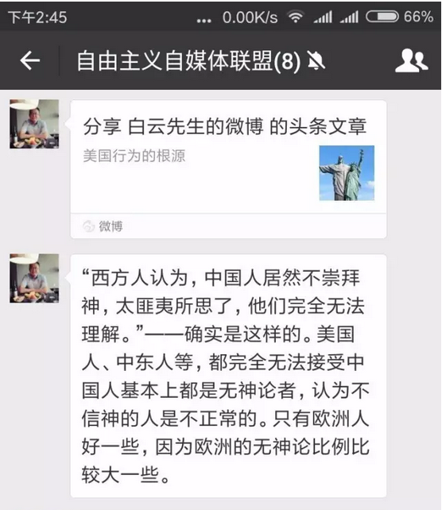
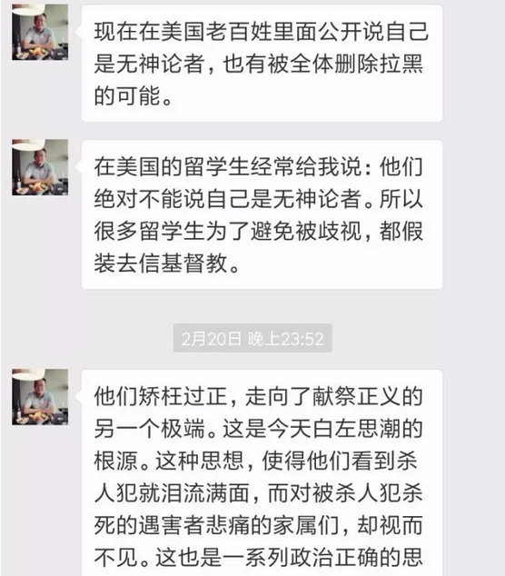
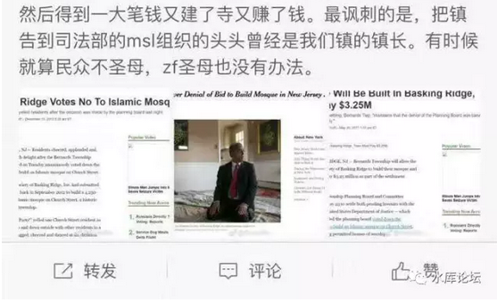
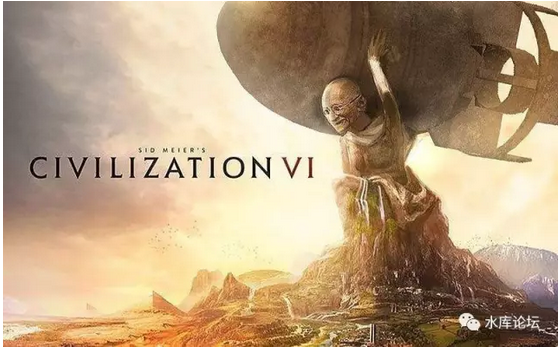

# 正本清源说奥派 \#F1170

yevon\_ou [水库论坛](/) 2017-09-22

正本清源说奥派 ~\#F1170~
=======================================================================================================================

人类的终极目标是什么：

SURVIVAL ！

 

 

一）       前言

 

话说这二天风声不对。

楼市是肯定不能谈了。卢俊粉丝数不到水库40%（约22W），居然也被封了。步步都是雷区。打死也不群发。收声。

 
八卦也不能谈。居然连娱乐明星，毒舌电影都不能发。

实在无所适从啊。

 

想来想去，要不我写"科幻小说"吧。尤其是硬科幻，有深厚物理学知识做背景的。怎么看都是浓浓的Hightec味。

于是哥哥调出了《一千万个幸运》~\#F145~欠稿了几万年准备开始大修。尤其把女巫的死写得煽情点。克大妈破坏国际贸易。

 

且慢，且慢，希拉里·克林顿大妈。

俺的心脏猛地一收。自我审查，会不会有问题呢。

我的小心肝呀。本人不同意本人的观点，上一篇文章纯属猴子打字而成。

 

 

 

想来想去，要不我写一点"经济学原理"吧。

从最基础的Lv 0开始，正本清源说奥派。

 

从"体，用，术"开始，一级一级往上说。

预计可能写七个层面。

 

近期我身体也不好。对这种"大文"极其畏惧。

写楼市的文章，堪称一挥而就。3000字，五六万的阅读，写写只要二小时。

叫好又叫座，赚钱又涨粉。

 

可是写"大文"，实在呕心沥血。

每写一篇传世之作，旁征博引，心力交瘁。半条命交代。

燃烧生命啊。

 

 

 

二）       理性基础

 

二个人坐在一起讨论学问，一定要有一个"共识基础"。

要有一块共识的地基，然后才可以向上讨论问题。

 

 

譬如说，二个粤菜师傅坐在一起。则双方对于"浓汁高汤"，基本是没有什么分歧的。

剩下的，仅仅是料理的手法和辅料的添加。可以直接从很专业的层面聊起。

 

但是，如果一个粤菜师傅，和一个英国厨师坐在一起。

双方的"共识"就很少了。

 

英国师傅，会觉得白汤高汤破坏蛋白质。

粤菜师傅，会觉得英国主食都是猪食。

双方剩下的"共同点"，或许仅仅是"色，香，味"摆盘的考究了。

 

更进一步，如果是一个厨师，和一个音乐家坐在一起。

"共识"就更加少了。聊不到一块去。

剩下的"基础"，也许仅仅有"为人民服务"。

 

再进一步，一个正经工作的人，和一个索马里海盗坐在一起。

则连"为人民服务"都谈不上了。海盗专职就是杀人抢劫的。

双方的共同点，或许仅仅剩下"我也要追求美好的生活"。

 

再再再进一步，假设一个人和一只鸭子关在一起。

人和鸭子之间，连"沟通"都没有了，纯粹的鸡同鸭讲。

你如果和某些教徒关在一起，也是这种感受。

 

 

我们今天要讲的道理，仅限于最后一层。

"和一个理性人关在一起"。

那么我们Base的Base的Base，基础的基础的基础。

双方共识Level 0的出发点，会是什么。

 

Lv 0公理：适者生存

 

 

三）       人择定理

 

适者生存是我们一切讨论的基础。

是我们的最大和终极目的。

是最底层的利益。

 

 

水库文章\#F860，写的是《哲学的几重境界》。

 

我们说，哲学是世界上最难最难最难的学科。

因为哲学的本意，即"虚空中开辟圣殿"。

 

因为哲学这一课，是没有"初始公理"的。

中学生几何学，有五大公理。就像盖房子一样，在公理的"地基"之上，一层层盖出万丈大厦。

 

但是哲学之难，他是没有"地基"的。任何一块模板都可以抽掉，任何一块大厦都可以抽掉。

怀疑之怀疑之怀疑，否定之否定之否定。

 

 

举个例子，我们举一个哲学史上非常著名的梗："上帝是万能的，那么上帝能不能造出一块：上帝也举不动的石头"。

中国教科书，有这段章节。

唯物主义者，以极其傲慢的语气，痛斥了宗教的虚伪，矛盾，丑陋。

哥哥掩面而过。谁编的教材，二字套餐。

 

 

你说，这个问题，应该怎么回答？

答案是：造得出。

问：那上帝举得动么。

答：举不动。

问：上帝造得出他举不动的石头，那不是自相矛盾么。

答：谁告诉你上帝必须遵守因果律。

 

这个才是正确的回答方法。

破解得干干净净。

上帝既然是全知全能的，那么上帝为什么要遵循因果律？

如果上帝屈服于因果律，你岂不是把"逻辑"置于上帝之前。

 

如果"逻辑"是宇宙中不可或少的框架。

你就不是"虚空中构建圣殿"，而是找到了第一条木桩子。

 

 

扯得远了。我们继续来讲"人择定理"。

小明问："妈妈，我为什么要做作业"。

妈妈："读了好成绩，才能进大学"。

小明："为什么要进大学"。

妈妈："大学生赚到钱，才能活下去"。

小明："为什么要活下去。人类为什么要活着"。

妈妈："傻孩子，否则，就没人来提问题了"。

 

 

"人择定理"是一条非常巧妙的定理。因为他为"为什么"提供了一个Full  Stop.

一个人如果老问"原因的原因的原因"，则他在"人择定理"面前，就会被拦下来。

"如果不是这样，就没人来提问题了"。

 

 

我们选择"人择定理"作为我们的Lv 0.

适者生存是我们一切讨论的基础。

是我们的最大和终极目的。

是最底层的利益。

 

这就是"最终利益"。终极利益就是活下去。

 

 

 

四）       子集

 

我们必须清楚地意识到，哲学的世界，无穷无尽。

而你打下第一块地基，确立"活下去"作为中华民族的最高利益。

 

事实上你只取了真理的一个"子集"。

你已经无法代表无穷无尽的哲学世界了。

 
在哲学上，别人可以轻易地驳斥你。

 

譬如说，你怎么知道"生存"就是好的呢。

如果有"彼岸花"，死亡才是解脱。只要你死了，立刻进入天堂。三生三世十里桃花。

岂不是待在地球上，才是傻瓜？

对于这种"天堂论"，你完全没法反驳。

 

 

又譬如说，著名的"金鱼缸效应"。

谁知道人类是不是活在一个Matrix，所有的一切都是虚构的呢。如果是"虚无主义"，那奋斗还有什么意义呢。

 

 

又譬如说，著名的"怀疑论者"。

在"上帝举石头"的例子中，我们已经说过，在真正的哲学世界，"因果律"是可以违背的。

哪头猪告诉你因果律不能违背的。

 

如果因果律不成立，循环了99次的事情，下一次未必成立。

说不定哪一天外星人跳出来说，"地球人造出了戴森球，我要把你们毁灭"。

发展反而成了灭亡之道。

 

以上种种，都指向了一个质疑：

"我们选择的基石\~\~适者生存，可能并不一定正确"。

 

哲学的世界，无比广阔。

Lv 0的背后，有Lv -1，Lv -2，Lv -3

划出了第一块"公理"，本身就是谬误的开始。

 

 

五）       求仁得仁，无咎

 

对于种种"不完美"的质疑，我们是怎么回答的呢。

答：求仁得仁，无咎。

 

 

我以前曾有二个基督教的熟人，她们整天恐吓我；

"O桑，你不把财产都捐出来，交给教会。当心死了以后下地狱"。

"你再这样亵渎神灵，死了以后主判神罚"。

 

我淡淡一笑，"我要天堂中的惩罚干什么，我只要尘世的富贵就够了"。

"要不咱们做个交易，你把[尘世中的八套房子]都送给我。我为你祈福天堂中更加高升"。

"不换！"

 

 

民族的国民性，其实是有巨大差异的。

中国人的本性，就是世俗性的。求神拜佛，也是为了更好的富贵。而不是真心爱神。

 

欧洲人和美国"基本基因"中，却都有"献祭"的成份。

欧美人信耶稣，那是真的信。

为了献祭神的取悦，不惜现实生活中[纵容白左]。

 

 

中国人和美国人的国民性，有极大的不同。

中国人注重于"尘世"，哪怕拜神也是三心二意。

美国人却是真正的"虔信"，清教徒打心底相信上帝是真的。

 

 

反应到现实生活中，美国今天纵容"白左"，圣母黑人穆斯林非法移民强奸犯吃福利，几乎把这个国家掏空了。

但是美国人感觉很好，很High。

哪怕破家败灭了，他们反而更高兴。

为什么，因为献给神了。

 

（自杀式行为）

 

这种事情，如果你跑过去说："嗨，嗨，快停手"。

"灭种亡国"

"再这样搞下去，不出60年，所有的白人金发美少女，都要成为穆斯林的性奴"。

 

 

美国Liberal"婊子"会瞪你一眼说；

"那又怎么样，也挺好啊"

"白左不在乎"。

 

白左的确不在乎。她们重视的是"来世"的福祉。希望在上帝面前，获得赞扬和彰荣。人类毁灭，她们根本不在乎。

而中国人是世俗的，中国人着眼于世俗的利益。在世俗的争夺战中，中国人是必胜的。

 

 

 

六）       结语

 

在墨西哥安第斯山脉中，曾隐藏着一个民族叫做："玛雅"。

 

玛雅文明属于典型的"点错"科技树的社会。\[1\]

因为身处原始热带雨林，而且附近没有任何大型的铜矿铁矿。玛雅文明，迟迟不能进入"青铜器"社会。

 

胡思乱想之余，玛雅把所有的"科技点"，全部都加在了"血祭文化"。

动辄杀掉几百人，建个血池。

 

 

我们对于"死亡"的彼岸一无所知，我也不知道另一侧是否另有天堂。

我也不清楚我们是不是生活在Matrix之中，一旦你死了，就退出游戏。恢复成光荣的火星人。

 

反正我知道"玛雅"文明的下场。

在经历了五个世纪的辉煌之后，到AD900，整个玛雅民族已彻底消亡。成为人类少有的"自我灭亡"的民族。

 

密林之中，上百座城市被废弃。最后一场搏斗，大约仅有300人参加。

所有天文，历法，建筑均已失传。

双方用的是石头。

 

（未完待续）

 
（yevon\_ou\@163.com，2017年6月14日午）

\[1\]《历史上有哪些「点错科技树」的例子？》

https://www.zhihu.com/question/30571237/answer/51202191
